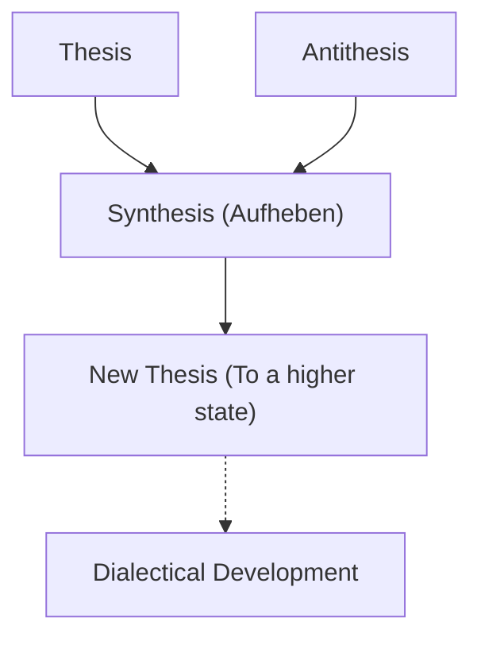
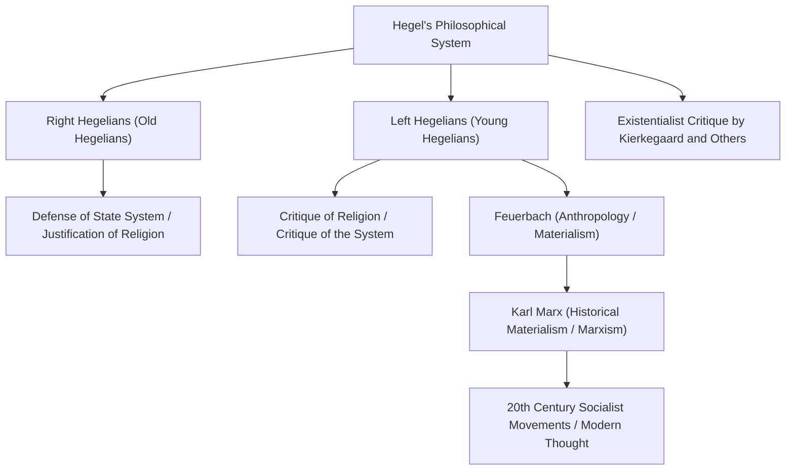

In the history of Western philosophy, the thinker who began with Immanuel Kant and reached the pinnacle of 19th-century German Idealism is Georg Wilhelm Friedrich Hegel (1770–1831). His intricate and grand philosophical system of "dialectics" and the "Absolute Spirit" had an extremely broad influence, not only on his contemporaries but also on Karl Marx, existentialism, and modern political science and history. In this article, we will trace Hegel's life and delve deeply into the core of his philosophy and his influence on later generations.

## From a Seminary Honors Student to a Great Philosopher

Hegel was born on August 27, 1770, in Stuttgart, the capital of the Duchy of Württemberg, to a family of civil servants. Academically gifted from a young age, he entered the seminary (Stift) at the University of Tübingen. Here, he had fateful encounters with talents representing German Romanticism, such as the future great poet Friedrich Hölderlin and the genius philosopher Friedrich Wilhelm Joseph Schelling, spending his youth sharing a room with them. As the enthusiasm of the French Revolution swept across Europe, they too deeply resonated with the ideal of "freedom" and were exposed to radical ideas, such as planting a liberty tree.

After graduation, Hegel worked as a private tutor in Bern and Frankfurt while secretly refining his own ideas. In his early years, he contemplated the role of religion and history, idealizing the harmonious life in the ancient Greek polis, while exploring how modern society could overcome its torn state (alienation). Later, in 1801, invited by Schelling, he became a Privatdozent (private lecturer) at the University of Jena and gradually began to walk the path toward building his own unique system.

In 1806, amidst the chaos of Napoleon's army invading Jena, he completed his first major work, *The Phenomenology of Spirit*. The anecdote of him describing Napoleon at this time as the "world spirit on horseback" is immensely famous. Following this, he served as a gymnasium principal in Nuremberg and a professor at the University of Heidelberg, before taking a position as a professor at the University of Berlin, the capital of the Kingdom of Prussia, in 1818. Here, he reigned over the academic world, establishing his authority as the official philosopher of the Prussian state.

## The Core of Hegel's Philosophy: Dialectics and the March of the Spirit

The most important keyword for understanding Hegel's philosophy is "dialectics" (Dialektik). Dialectics refers to the logic of movement in which things develop into a higher state through opposition and contradiction.

A certain state (thesis) produces an opposing state (antithesis) due to the contradictions within it, and after both go through opposition and struggle, they are integrated at a higher level while preserving the elements of both (synthesis). Hegel believed that this process of "sublation" (Aufheben) was exactly the mechanism by which history, the world, and human cognition develop.

Another pillar of his system is the concept of the "Absolute Spirit." According to Hegel, the world is not a mere collection of matter, but the very process of the rational "spirit" realizing itself. His famous saying, "What is rational is real; and what is real is rational," shows his conviction that the development of history is the inevitable process of reason attaining freedom.

In *The Phenomenology of Spirit*, the grand journey of the spirit is depicted, starting from simple human sensory consciousness, experiencing various contradictions, and finally reaching "Absolute Knowledge." In his subsequent works, such as *Science of Logic*, *Encyclopedia of the Philosophical Sciences*, and *Elements of the Philosophy of Right*, he positioned nature, history, the state, art, and religion all within a single logical system.

## Legacy of Thought: The Split of the Hegelian School and the Influence on Marxism

In 1831, infected by cholera which was raging in Berlin (or possibly a gastrointestinal disease), Hegel died suddenly at the age of 61. However, after his death, his massive philosophical legacy became the subject of fierce debate.

The Hegelian school split into the "Right Hegelians" (Old Hegelians), who interpreted his system conservatively and affirmed the Prussian state, and the "Left Hegelians" (Young Hegelians), who radically interpreted the logic of dialectical development and criticized the existing state and religion.

The influence of the latter, in particular, moved history greatly. After Ludwig Feuerbach's critique of religion, Karl Marx and Friedrich Engels emerged. While Marx criticized Hegel's idealistic dialectics as "standing on its head," he inherited the logic of development itself, reversing and developing it into "historical materialism." In other words, he thought that what drives history is not "spirit," but the contradictions in the material "economic infrastructure" (base).

## Conclusion: Hegel's Philosophy Living in the Modern Age

Hegel's thought is sometimes criticized as being a hotbed for totalitarianism, and at other times re-evaluated as a pioneer of the liberal state model. His writing is particularly difficult even among German-speaking philosophers, and it is not uncommon for a single sentence to span several pages; however, behind this lay the earnest problem of "how to harmonize a torn and conflicted world once again."

In modern society, where diverse values clash and divisions deepen, Hegel's dialectical attitude of thought, which tries to lead conflicts to a higher resolution (Aufheben) rather than ending them in mere exclusion, continues to present important wisdom that we still need to confront today.
