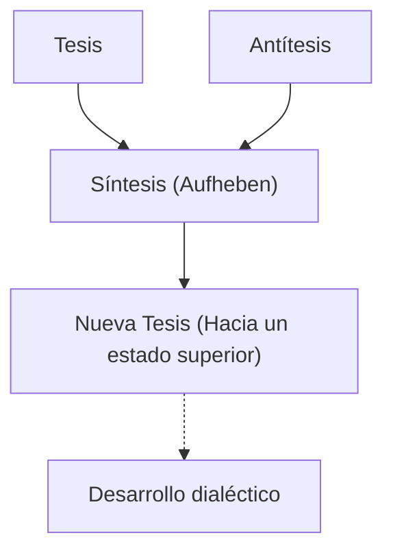
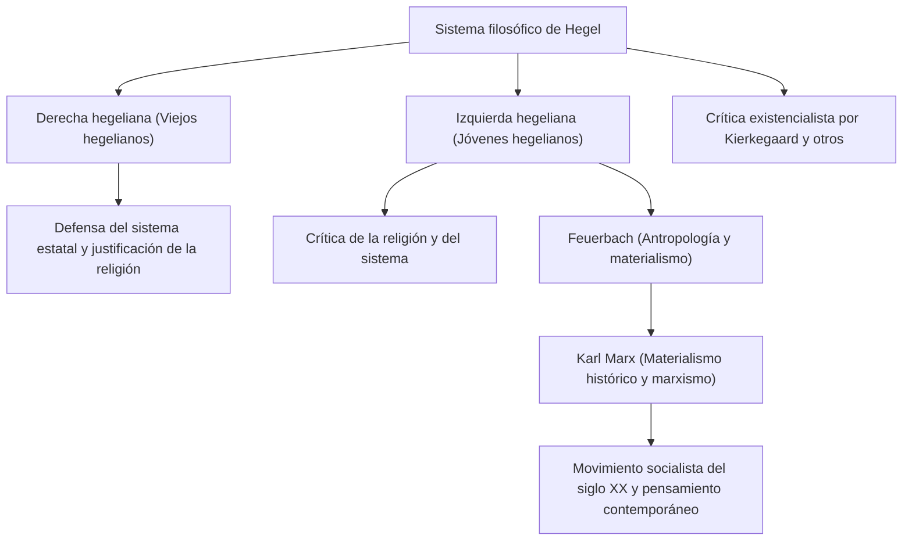

En la historia de la filosofía occidental, el pensador que comenzó con Immanuel Kant y alcanzó el pináculo del idealismo alemán del siglo XIX es Georg Wilhelm Friedrich Hegel (1770–1831). Su vasto y complejo sistema de pensamiento, con conceptos como la "Dialéctica" y el "Espíritu Absoluto", tuvo una influencia sumamente amplia, no solo en su época, sino hasta en Karl Marx, el existencialismo y en la ciencia política e historia contemporáneas. En este artículo, al trazar la vida de Hegel, profundizaremos en el núcleo de su filosofía y su impacto en las generaciones posteriores.

## El camino de estudiante de honor del seminario a gran filósofo

Hegel nació el 27 de agosto de 1770 en Stuttgart, capital del Ducado de Wurtemberg, en una familia de funcionarios. Siendo un estudiante destacado desde temprana edad, ingresó al seminario (Stift) de la Universidad de Tubinga. Aquí tuvo un encuentro predestinado con talentos representativos del romanticismo alemán: Friedrich Hölderlin, quien se convertiría en un gran poeta, y el genio filósofo Friedrich Wilhelm Joseph Schelling, con quienes compartió habitación durante su juventud. Mientras el entusiasmo de la Revolución Francesa barría Europa, ellos también resonaron profundamente con el ideal de "libertad", experimentando con ideas radicales como plantar un árbol de la libertad.

Tras graduarse, Hegel trabajó como tutor privado en Berna y Fráncfort mientras desarrollaba secretamente sus propias ideas. En su primera etapa, reflexionó sobre el papel de la religión y la historia, idealizando la vida armoniosa de la polis griega antigua y buscando cómo la sociedad moderna podía superar su estado de desgarramiento (alienación). Posteriormente, en 1801, por invitación de Schelling, se convirtió en profesor no titular (Privatdozent) en la Universidad de Jena, comenzando gradualmente a construir su propio sistema.

En 1806, en medio del caos por la invasión de las tropas de Napoleón a Jena, terminó de escribir su primera gran obra, la "Fenomenología del Espíritu". Es muy famosa la anécdota de que en ese momento describió a Napoleón como "el espíritu del mundo a caballo". Más tarde, tras ser director del Gymnasium de Núremberg y profesor en la Universidad de Heidelberg, en 1818 asumió el cargo de profesor en la Universidad de Berlín, capital del Reino de Prusia. Allí reinó en el mundo académico, estableciendo una autoridad tal que podría considerarse el filósofo oficial del Estado prusiano.

## El núcleo de la filosofía de Hegel: La dialéctica y el camino del espíritu

La palabra clave más importante para comprender la filosofía de Hegel es la "Dialéctica" (Dialektik). La dialéctica se refiere a la lógica del movimiento mediante el cual las cosas se desarrollan hacia un estado superior a través de la oposición y la contradicción.

Un cierto estado (Tesis) genera su estado opuesto (Antítesis) debido a las contradicciones en su interior, y tras pasar por oposición y conflicto, ambos se integran en un nivel superior preservando elementos de ambos (Síntesis). Hegel pensaba que este proceso de "superación" (Aufheben) era precisamente el mecanismo por el cual se desarrollan la historia, el mundo y el conocimiento humano.

Otro pilar de su sistema es el concepto de "Espíritu Absoluto". Según Hegel, el mundo no es una simple colección de materia, sino el proceso mismo mediante el cual el "espíritu" racional se realiza a sí mismo. Su famosa frase, "Todo lo real es racional y todo lo racional es real", muestra su convicción de que el desarrollo de la historia es el proceso inevitable por el cual la razón adquiere libertad.

En la "Fenomenología del Espíritu", se describe la gran peregrinación del espíritu humano, comenzando desde la percepción ingenua y, tras experimentar diversas contradicciones, alcanzando finalmente el "saber absoluto". En sus obras posteriores, "Ciencia de la Lógica", "Enciclopedia de las Ciencias Filosóficas" y "Elementos de la Filosofía del Derecho", situó la naturaleza, la historia, el Estado, el arte y la religión dentro de un único sistema lógico.

## El legado de su pensamiento: La división de la escuela hegeliana y la influencia en el marxismo

En 1831, Hegel murió repentinamente a los 61 años tras contraer cólera (o quizás una enfermedad gastrointestinal), enfermedad que estaba causando estragos en Berlín. Sin embargo, tras su muerte, su vasto legado filosófico se convirtió en el centro de intensos debates.

La escuela hegeliana se dividió en la "Derecha hegeliana" (viejos hegelianos), que interpretaba su sistema de forma conservadora y apoyaba al Estado prusiano, y la "Izquierda hegeliana" (jóvenes hegelianos), que interpretaba la lógica del desarrollo dialéctico de forma radical y criticaba al Estado y a la religión de su tiempo.

La influencia de esta última movió significativamente la historia. A través de la crítica de la religión de Ludwig Feuerbach, aparecieron Karl Marx y Friedrich Engels. Aunque Marx criticó la dialéctica idealista de Hegel afirmando que estaba "puesta de cabeza", heredó la lógica misma de desarrollo, invirtiéndola y evolucionándola hacia el "Materialismo Histórico". Es decir, consideró que lo que mueve la historia no es el "espíritu", sino las contradicciones de la "infraestructura económica" material.

## Conclusión: La filosofía de Hegel viva en la actualidad

El pensamiento de Hegel a veces es criticado como caldo de cultivo del totalitarismo, mientras que otras veces es reevaluado como pionero del modelo de Estado liberal. Sus escritos son especialmente difíciles incluso entre los filósofos de habla alemana, siendo común encontrar oraciones que se extienden por varias páginas, pero detrás de ellos había una acuciante conciencia del problema: "¿Cómo podemos armonizar de nuevo un mundo que está dividido y en conflicto?"

En la sociedad moderna, donde diversos valores chocan y las divisiones se profundizan, la actitud de pensamiento dialéctico de Hegel —que busca no terminar los conflictos con una simple exclusión, sino guiar hacia una resolución de orden superior (Aufheben)— sigue ofreciendo una sabiduría importante que aún hoy debemos enfrentar.
