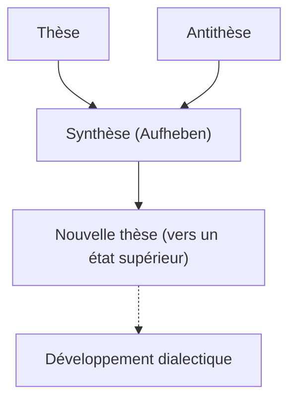
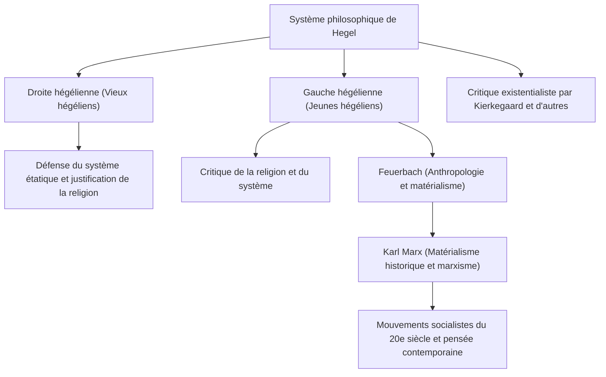

Dans l'histoire de la philosophie occidentale, le penseur qui a commencé avec Emmanuel Kant et atteint le sommet de l'idéalisme allemand au XIXe siècle est Georg Wilhelm Friedrich Hegel (1770-1831). Son système de pensée vaste et complexe, caractérisé par la "dialectique" et l'"Esprit Absolu", a exercé une influence extrêmement large non seulement sur son époque, mais aussi sur Karl Marx, l'existentialisme, et jusqu'aux sciences politiques et historiques contemporaines. Dans cet article, nous retracerons la vie de Hegel tout en approfondissant le cœur de sa philosophie et son influence sur la postérité.

## De l'étudiant brillant du séminaire au grand philosophe

Hegel est né le 27 août 1770 à Stuttgart, capitale du duché de Wurtemberg, dans une famille de fonctionnaires. Élève brillant dès son enfance, il entre au séminaire (Stift) de l'Université de Tübingen. C'est là qu'il fait des rencontres déterminantes avec de futurs grands représentants du romantisme allemand, le grand poète Friedrich Hölderlin et le génial philosophe Friedrich Wilhelm Joseph Schelling, avec qui il partage sa chambre et sa jeunesse. Alors que l'enthousiasme de la Révolution française balaie l'Europe, ils résonnent profondément avec l'idéal de "liberté" et entrent en contact avec des idées radicales, allant jusqu'à planter un arbre de la liberté.

Après l'obtention de son diplôme, Hegel travaille comme précepteur à Berne et à Francfort, tout en élaborant secrètement sa propre pensée. Dans ses premières années, il réfléchit au rôle de la religion et de l'histoire, prenant pour idéal la vie harmonieuse de la polis grecque antique, tout en cherchant comment surmonter l'état de déchirement (aliénation) de la société moderne. Par la suite, invité par Schelling en 1801, il devient Privatdozent (professeur libre) à l'Université d'Iéna et commence progressivement à construire son propre système.

En 1806, au milieu du chaos de l'invasion de l'armée de Napoléon à Iéna, il achève son premier chef-d'œuvre, "La Phénoménologie de l'Esprit". L'anecdote selon laquelle il aurait qualifié Napoléon d'"âme du monde à cheval" à cette occasion est très célèbre. Par la suite, après avoir été directeur du gymnase de Nuremberg et professeur à l'Université de Heidelberg, il est nommé professeur à l'Université de Berlin, capitale du royaume de Prusse, en 1818. Là, il règne sur le monde académique et établit son autorité, devenant presque le philosophe officiel de l'État prussien.

## Le cœur de la philosophie de Hegel : la dialectique et le parcours de l'Esprit

Le mot-clé le plus important pour comprendre la philosophie de Hegel est la "dialectique" (Dialektik). La dialectique désigne la logique du mouvement par lequel les choses se développent vers un état supérieur à travers les oppositions et les contradictions.

Un certain état (thèse) engendre son état opposé (antithèse) en raison de ses contradictions internes, et après avoir traversé une opposition et une lutte, les deux sont intégrés à un niveau supérieur tout en conservant les éléments de chacun (synthèse). Hegel considérait que ce processus de "dépassement" (Aufheben) était le mécanisme même par lequel l'histoire, le monde et la connaissance humaine se développent.

L'autre pilier de son système est le concept d'"Esprit Absolu". Selon Hegel, le monde n'est pas un simple ensemble de matières, mais le processus même par lequel l'"Esprit" rationnel se réalise lui-même. Sa célèbre phrase "Ce qui est rationnel est réel, et ce qui est réel est rationnel" exprime sa conviction que le déroulement de l'histoire est le processus inévitable par lequel la raison acquiert sa liberté.

Dans "La Phénoménologie de l'Esprit", il décrit le parcours grandiose de l'esprit humain, partant de la sensation naïve, expérimentant diverses contradictions, pour finalement atteindre le "Savoir Absolu". Dans "La Science de la Logique", l'"Encyclopédie des sciences philosophiques" et les "Principes de la philosophie du droit", il a positionné la nature, l'histoire, l'État, l'art et la religion au sein d'un seul système logique.

## L'héritage de sa pensée : scission de l'école hégélienne et influence sur le marxisme

En 1831, infecté par le choléra qui faisait rage à Berlin (ou, selon certains, par une maladie gastro-intestinale), Hegel décède subitement à l'âge de 61 ans. Cependant, après sa mort, son immense héritage intellectuel est devenu le sujet de débats passionnés.

L'école hégélienne s'est scindée entre la "droite hégélienne" (les vieux hégéliens), qui interprétait son système de manière conservatrice et affirmait l'État prussien, et la "gauche hégélienne" (les jeunes hégéliens), qui interprétait radicalement la logique du développement dialectique et critiquait l'État et la religion de son époque.

L'influence de ces derniers, en particulier, a considérablement fait bouger l'histoire. Après la critique de la religion par Ludwig Feuerbach, Karl Marx et Friedrich Engels sont apparus. Marx a critiqué la dialectique idéaliste de Hegel comme étant "remise sur la tête", mais en a hérité la logique de développement elle-même, la renversant et la développant en "matérialisme historique". En d'autres termes, il pensait que ce n'était pas l'"Esprit" qui faisait avancer l'histoire, mais les contradictions de la "substructure économique" matérielle.

## Conclusion : La philosophie de Hegel dans le monde contemporain

La pensée de Hegel est parfois critiquée comme étant le terreau du totalitarisme, et d'autres fois réévaluée comme pionnière d'un modèle d'État libéral. Ses écrits sont particulièrement difficiles parmi les philosophes de langue allemande, il n'est pas rare qu'une seule phrase s'étende sur plusieurs pages, mais derrière cela se trouvait une préoccupation cruciale : "comment réconcilier un monde divisé et en conflit".

Dans la société moderne où les valeurs diverses s'affrontent et les divisions s'aggravent, l'attitude de pensée dialectique de Hegel, qui cherche à mener les conflits vers une résolution supérieure (Aufheben) plutôt que de les terminer par une simple exclusion, continue d'offrir une sagesse importante à laquelle nous devons toujours faire face.
