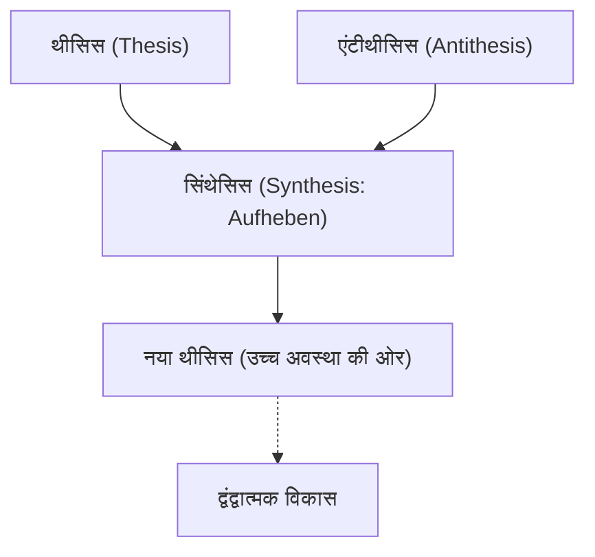
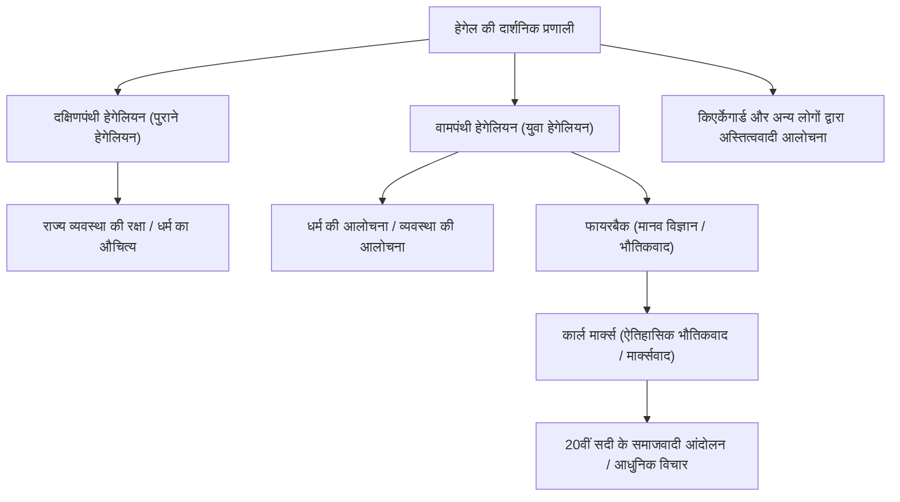

पश्चिमी दर्शन के इतिहास में, इमैनुएल कांट से शुरू होकर और 19वीं सदी के जर्मन आदर्शवाद के शिखर पर पहुँचने वाले विचारक जॉर्ज विल्हेम फ्रेडरिक हेगेल (1770-1831) थे। "द्वंद्ववाद" (Dialectics) और "परम आत्मा" (Absolute Spirit) की उनकी जटिल और भव्य वैचारिक प्रणाली का न केवल उनके समकालीनों पर, बल्कि कार्ल मार्क्स, अस्तित्ववाद और आधुनिक राजनीति विज्ञान और इतिहास पर भी अत्यधिक प्रभाव पड़ा। इस लेख में, हम हेगेल के जीवन का पता लगाएंगे और उनके दर्शन के मूल तथा भावी पीढ़ियों पर इसके प्रभाव के बारे में गहराई से जानेंगे।

## मदरसा के उत्कृष्ट छात्र से महान दार्शनिक बनने तक का सफर

हेगेल का जन्म 27 अगस्त, 1770 को वुर्टेमबर्ग डची की राजधानी स्टटगार्ट में एक सिविल सेवक के परिवार में हुआ था। बचपन से ही अकादमिक रूप से उत्कृष्ट, उन्होंने तुबिंगन विश्वविद्यालय में मदरसा (Stift) में दाखिला लिया। यहाँ उनकी मुलाकात जर्मन रोमांटिसिज्म का प्रतिनिधित्व करने वाली प्रतिभाओं से हुई, जैसे कि फ्रेडरिक होल्डरन, जो बाद में एक महान कवि बने, और फ्रेडरिक विल्हेम जोसेफ शेलिंग, एक प्रतिभाशाली दार्शनिक। उन्होंने एक ही कमरे में अपनी युवावस्था बिताई। जैसे ही फ्रांसीसी क्रांति के उत्साह ने यूरोप को अपनी चपेट में लिया, वे भी "स्वतंत्रता" के विचार से गहराई से प्रभावित हुए, और उन्होंने स्वतंत्रता का वृक्ष लगाने जैसे कट्टरपंथी विचारों का अनुभव किया।

स्नातक होने के बाद, हेगेल ने बर्न और फ्रैंकफर्ट में एक ट्यूटर के रूप में काम किया, जबकि उन्होंने गुप्त रूप से अपने विचारों को परिष्कृत किया। शुरुआती दौर में उन्होंने धर्म और इतिहास की भूमिका पर विचार किया, प्राचीन ग्रीक पोलिस में सामंजस्यपूर्ण जीवन का आदर्शीकरण किया, और यह पता लगाने की कोशिश की कि आधुनिक समाज अपने विखंडित राज्य (अलगाव) को कैसे दूर कर सकता है। बाद में, 1801 में, उन्हें शेलिंग के निमंत्रण पर जेना विश्वविद्यालय में एक निजी व्याख्याता के रूप में नियुक्त किया गया, और उन्होंने धीरे-धीरे अपनी खुद की प्रणाली का निर्माण शुरू किया।

1806 में, जब नेपोलियन की सेना ने जेना पर आक्रमण किया था, उस अराजकता के बीच उन्होंने अपनी पहली प्रमुख कृति, 'द फेनोमेनोलॉजी ऑफ स्पिरिट' (The Phenomenology of Spirit) पूरी की। इस समय, नेपोलियन को "घोड़े पर सवार विश्व आत्मा" के रूप में वर्णित करने वाला प्रसंग बहुत प्रसिद्ध है। नूर्नबर्ग में एक जिमनैजियम के प्रिंसिपल और हीडलबर्ग विश्वविद्यालय में एक प्रोफेसर के रूप में सेवा करने के बाद, उन्हें 1818 में प्रशिया साम्राज्य की राजधानी बर्लिन विश्वविद्यालय में एक प्रोफेसर के रूप में नियुक्त किया गया। यहाँ, उन्होंने अकादमिक दुनिया पर राज किया और खुद को प्रशिया राज्य के आधिकारिक दार्शनिक के रूप में स्थापित किया।

## हेगेलियन दर्शन का मूल: द्वंद्ववाद और आत्मा की प्रगति

हेगेल के दर्शन को समझने के लिए सबसे महत्वपूर्ण शब्द "द्वंद्ववाद" (Dialektik) है। द्वंद्ववाद उस आंदोलन के तर्क को संदर्भित करता है जिसके द्वारा चीजें संघर्ष और अंतर्विरोध के माध्यम से उच्च अवस्था में विकसित होती हैं।

एक निश्चित अवस्था (थीसिस) अपने आंतरिक अंतर्विरोधों के कारण एक विपरीत अवस्था (एंटीथीसिस) उत्पन्न करती है। दोनों के बीच संघर्ष और टकराव के बाद, उन्हें उच्च स्तर पर एकीकृत किया जाता है, जबकि दोनों के तत्वों (सिंथेसिस) को संरक्षित किया जाता है। हेगेल का मानना था कि "Aufheben" (उत्थान) की यह प्रक्रिया वह तंत्र है जिसके द्वारा इतिहास, विश्व और मानव अनुभूति विकसित होती है।

उनकी प्रणाली का एक और स्तंभ "परम आत्मा" की अवधारणा है। हेगेल के अनुसार, दुनिया केवल भौतिक पदार्थों का संग्रह नहीं है, बल्कि एक प्रक्रिया है जिसमें तर्कसंगत "आत्मा" खुद को महसूस करती है। उनका प्रसिद्ध कथन, "जो तर्कसंगत है वह वास्तविक है, और जो वास्तविक है वह तर्कसंगत है," इस दृढ़ विश्वास को दर्शाता है कि ऐतिहासिक विकास एक अपरिहार्य प्रक्रिया है जिसके द्वारा कारण स्वतंत्रता प्राप्त करता है।

'द फेनोमेनोलॉजी ऑफ स्पिरिट' में, मानव चेतना की यात्रा एक भव्य पैमाने पर चित्रित की गई है, जो सरल संवेदनाओं से शुरू होकर, विभिन्न अंतर्विरोधों का अनुभव करते हुए अंततः "परम ज्ञान" तक पहुंचती है। अपने बाद के कार्यों, जैसे 'लॉजिक' (Science of Logic), 'एनसाइक्लोपीडिया', और 'फिलोसोफी ऑफ राइट' में, उन्होंने प्रकृति, इतिहास, राज्य, कला और धर्म को एक तार्किक प्रणाली में रखा।

## वैचारिक विरासत: हेगेलियन स्कूल का विभाजन और मार्क्सवाद पर प्रभाव

1831 में, बर्लिन में हैजा की चपेट में आने से (या आंतों की बीमारी के कारण), हेगेल का 61 वर्ष की आयु में अचानक निधन हो गया। हालांकि, उनकी मृत्यु के बाद, उनकी विशाल वैचारिक विरासत भयंकर बहस का विषय बन गई।

हेगेलियन स्कूल दो गुटों में विभाजित हो गया: "दक्षिणपंथी हेगेलियन" (Right Hegelians), जिन्होंने उनकी प्रणाली की रूढ़िवादी व्याख्या की और प्रशिया राज्य की पुष्टि की, और "वामपंथी हेगेलियन" (Left Hegelians), जिन्होंने उनके द्वंद्वात्मक विकास के तर्क की कट्टरपंथी व्याख्या की और मौजूदा राज्य और धर्म की आलोचना की।

विशेष रूप से, वामपंथियों के प्रभाव ने इतिहास को बहुत बदल दिया। लुडविग फायरबैक (Ludwig Feuerbach) की धर्म की आलोचना के बाद, कार्ल मार्क्स और फ्रेडरिक एंगेल्स उभरे। मार्क्स ने हेगेल के आदर्शवादी द्वंद्ववाद को "उल्टा खड़े होने" के रूप में आलोचना की, लेकिन विकास के तर्क को स्वयं विरासत में मिला और इसे "ऐतिहासिक भौतिकवाद" (Historical Materialism) में बदल दिया। दूसरे शब्दों में, उनका मानना था कि यह "आत्मा" नहीं है जो इतिहास को चलाती है, बल्कि भौतिक "आर्थिक आधार" के अंतर्विरोध हैं।

## निष्कर्ष: आधुनिक दुनिया में हेगेलियन दर्शन

हेगेल के विचार की कभी-कभी अधिनायकवाद के लिए एक प्रजनन आधार होने की आलोचना की जाती है, और अन्य समय में एक उदार राज्य मॉडल के अग्रदूत के रूप में पुनर्मूल्यांकन किया जाता है। उनका लेखन जर्मन भाषी दार्शनिकों में सबसे कठिन है, और एक ही वाक्य का कई पन्नों तक चलना असामान्य नहीं है, लेकिन इसके पीछे एक ज्वलंत समस्या थी: "हम एक विभाजित और परस्पर विरोधी दुनिया में कैसे सामंजस्य स्थापित कर सकते हैं?"

आज के समाज में, जहां विविध मूल्य टकराते हैं और विभाजन गहरा होता है, हेगेल का द्वंद्वात्मक दृष्टिकोण, जो संघर्ष को केवल बहिष्कार में समाप्त नहीं होने देता है, बल्कि इसे एक उच्च समाधान (Aufheben) की ओर ले जाने का प्रयास करता है, महत्वपूर्ण ज्ञान प्रस्तुत करता है जिसका हमें आज भी सामना करना होगा।
