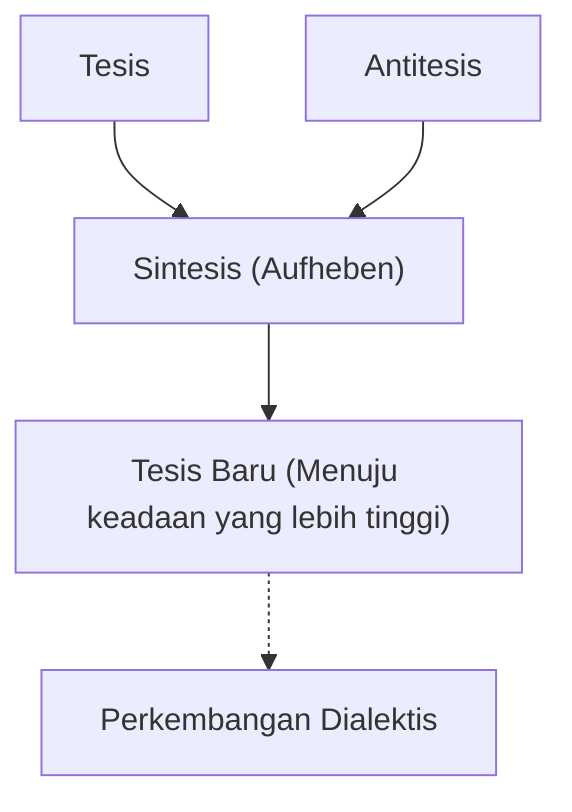
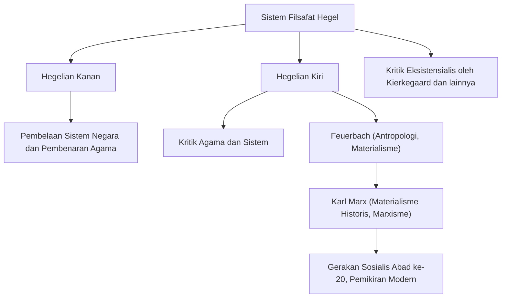

Dalam sejarah filsafat Barat, pemikir yang mencapai puncak idealisme Jerman abad ke-19, dimulai dengan Immanuel Kant, adalah Georg Wilhelm Friedrich Hegel (1770–1831). Sistem pemikirannya yang hebat dan megah, yang berpusat pada "Dialektika" dan "Roh Absolut", memberikan pengaruh yang sangat luas tidak hanya pada zamannya, tetapi juga pada Karl Marx, eksistensialisme, dan bahkan pada ilmu politik dan sejarah modern hingga saat ini. Dalam artikel ini, kita akan menelusuri kehidupan Hegel dan menggali lebih dalam esensi filsafatnya serta dampaknya pada generasi berikutnya.

## Jalan dari Siswa Seminari yang Cemerlang Menjadi Filsuf Besar

Hegel lahir pada 27 Agustus 1770, di ibu kota Kadipaten Württemberg, Stuttgart, dalam keluarga pegawai negeri. Sangat pandai dalam belajar sejak masa kanak-kanak, ia masuk seminari teologi (Stift) di Universitas Tübingen. Di sana ia mengalami pertemuan yang menentukan dengan bakat-bakat perwakilan romantisme Jerman: calon penyair besar Friedrich Hölderlin dan filsuf jenius Friedrich Wilhelm Joseph Schelling, menghabiskan masa mudanya dengan berbagi kamar yang sama. Ketika antusiasme Revolusi Prancis melanda Eropa, mereka juga sangat beresonansi dengan gagasan "kebebasan", bersentuhan dengan pemikiran radikal, seperti menanam Pohon Kebebasan.

Setelah lulus, Hegel bekerja sebagai guru privat di Bern dan Frankfurt sambil diam-diam menyempurnakan pemikirannya sendiri. Pada tahun-tahun awalnya, ia mempertimbangkan peran agama dan sejarah, mengidealkan kehidupan yang harmonis di polis Yunani kuno sambil mencari cara untuk mengatasi keadaan masyarakat modern yang terkoyak (alienasi). Kemudian, pada tahun 1801, atas undangan Schelling, ia menjadi dosen privat di Universitas Jena dan mulai bergerak menuju pembangunan sistemnya sendiri yang unik.

Pada tahun 1806, di tengah kekacauan invasi pasukan Napoleon ke Jena, ia menyelesaikan karya besar pertamanya, "Fenomenologi Roh". Episodenya yang menyebut Napoleon sebagai "roh dunia di atas kuda" pada saat itu sangat terkenal. Setelah menjabat sebagai direktur Gimnasium Nuremberg dan profesor di Universitas Heidelberg, ia menjadi profesor di Universitas Berlin, ibu kota Kerajaan Prusia, pada tahun 1818. Di sana ia memerintah di dunia akademis dan menetapkan otoritasnya sebagai filsuf resmi negara Prusia.

## Esensi Filsafat Hegel: Dialektika dan Perjalanan Roh

Kata kunci terpenting untuk memahami filsafat Hegel adalah "Dialektika" (Dialektik). Dialektika mengacu pada logika pergerakan di mana segala sesuatu berkembang ke keadaan yang lebih tinggi melalui oposisi dan kontradiksi.

Suatu keadaan tertentu (Tesis) menghasilkan keadaan yang berlawanan (Antitesis) melalui kontradiksi internalnya, dan setelah keduanya melalui oposisi dan perjuangan, mereka diintegrasikan ke dalam dimensi yang lebih tinggi (Sintesis) dengan melestarikan elemen dari keduanya. Proses "Aufheben" (Sublasi) ini adalah mekanisme di mana sejarah, dunia, dan kognisi manusia berkembang, menurut Hegel.

Pilar lain dari sistemnya adalah konsep "Roh Absolut". Menurut Hegel, dunia bukanlah sekadar kumpulan materi, melainkan proses itu sendiri di mana "roh" rasional mewujudkan dirinya. Ungkapannya yang terkenal, "Yang rasional itu nyata; dan yang nyata itu rasional," menunjukkan keyakinannya bahwa perkembangan sejarah adalah proses tak terelakkan di mana nalar memperoleh kebebasan.

Dalam "Fenomenologi Roh", digambarkan perjalanan epik roh di mana kesadaran manusia dimulai dari sensasi naif, mengalami berbagai kontradiksi, dan akhirnya mencapai "Pengetahuan Mutlak". Dalam karya-karyanya selanjutnya, "Ilmu Logika", "Ensiklopedia", dan "Filsafat Hukum", ia memposisikan alam, sejarah, negara, seni, dan agama ke dalam satu sistem logis tunggal.

## Warisan Pemikiran: Perpecahan Mazhab Hegelian dan Pengaruh pada Marxisme

Pada tahun 1831, terinfeksi kolera yang merajalela di Berlin (atau mungkin penyakit pencernaan), Hegel meninggal mendadak pada usia 61 tahun. Namun, setelah kematiannya, warisan pemikirannya yang sangat besar menjadi subjek perdebatan sengit.

Mazhab Hegelian terpecah menjadi "Mazhab Hegelian Lama" (Hegelian Kanan) yang secara konservatif menafsirkan sistemnya dan menegaskan negara Prusia, dan "Mazhab Hegelian Muda" (Hegelian Kiri) yang secara radikal menafsirkan logika perkembangan dialektis dan mengkritik negara dan agama saat ini.

Pengaruh dari kelompok terakhir ini, khususnya, sangat menggerakkan sejarah. Melalui kritik agama Ludwig Feuerbach, Karl Marx dan Friedrich Engels muncul. Sambil mengkritik dialektika idealis Hegel yang "berdiri di atas kepalanya", Marx mewarisi logika perkembangannya, membalikkannya dan mengembangkannya menjadi "Materialisme Historis". Dengan kata lain, ia percaya bahwa yang menggerakkan sejarah bukanlah "roh", melainkan kontradiksi dalam "infrastruktur ekonomi" material.

## Kesimpulan: Filsafat Hegel di Dunia Modern

Pemikiran Hegel kadang-kadang dikritik sebagai sarang totaliterisme, sementara di lain waktu dievaluasi kembali sebagai perintis model negara liberal. Tulisannya adalah beberapa yang paling sulit bahkan di antara para filsuf berbahasa Jerman, dengan satu kalimat sering membentang beberapa halaman. Namun, di baliknya ada kesadaran mendalam akan masalah tersebut: "Bagaimana kita bisa mengharmoniskan kembali dunia yang terbelah dan berkonflik?"

Dalam masyarakat modern, di mana beragam nilai bertabrakan dan perpecahan semakin dalam, sikap pemikiran dialektis Hegel, yang mencoba membawa konflik ke resolusi tingkat yang lebih tinggi (Aufheben) daripada mengakhirinya dengan sekadar pengecualian, terus menghadirkan kebijaksanaan penting yang harus kita hadapi saat ini.
