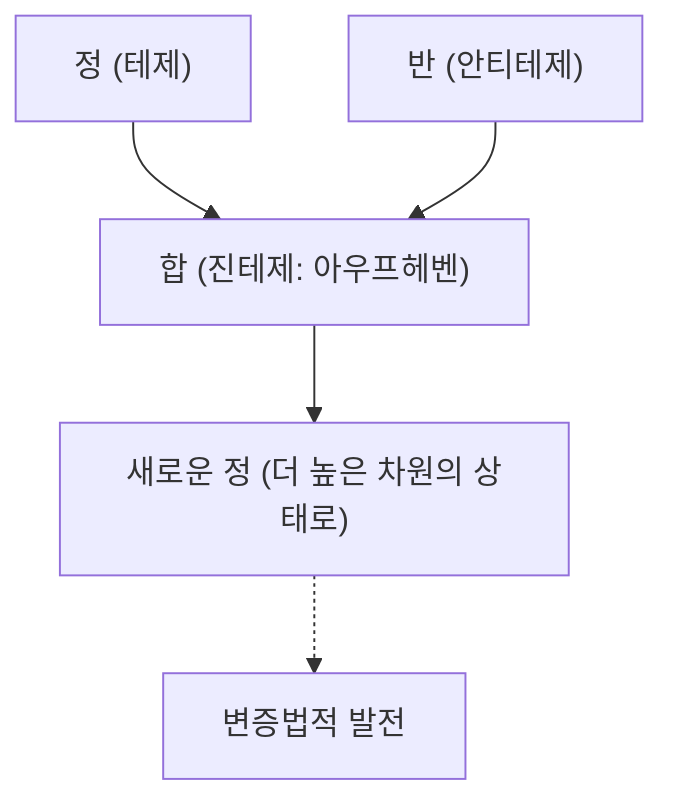
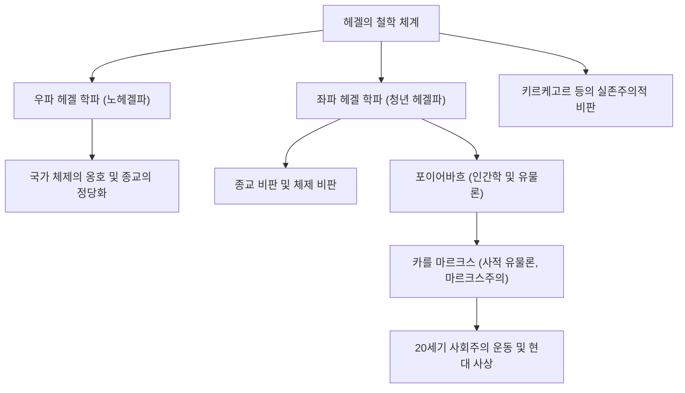

서양 철학사에서 임마누엘 칸트로부터 시작된 19세기 독일 관념론의 정점을 이룬 사상가가 바로 게오르크 빌헬름 프리드리히 헤겔(1770년–1831년)입니다. 그의 '변증법'과 '절대정신'이라는 난해하고 웅대한 사상 체계는 동시대뿐만 아니라 카를 마르크스와 실존주의, 그리고 현대의 정치학과 역사학에 이르기까지 매우 광범위한 영향을 미쳤습니다. 본 기사에서는 헤겔의 생애를 추적하면서 그 철학의 핵심과 후세에 미친 영향에 대해 깊이 파헤쳐 보겠습니다.

## 신학교의 우등생에서 위대한 철학자로의 길

헤겔은 1770년 8월 27일, 뷔르템베르크 공국의 수도 슈투트가르트에서 공무원 가정에 태어났습니다. 어린 시절부터 학업이 우수했던 그는 튀빙겐 대학교의 신학교(슈티프트)에 입학합니다. 여기서 그는 훗날 위대한 시인이 되는 프리드리히 횔덜린과 천재 철학자 프리드리히 빌헬름 요제프 셸링이라는 독일 낭만주의를 대표하는 인재들과 운명적인 만남을 가졌고, 같은 방에서 청춘 시절을 보냈습니다. 프랑스 혁명의 열광이 유럽을 휩쓰는 가운데, 이들 역시 '자유'의 이념에 깊이 공감하며 자유의 나무를 심는 등 급진적인 사상을 접했습니다.

졸업 후 헤겔은 베른과 프랑크푸르트에서 가정교사로 일하면서 남몰래 자신의 사상을 연마해 나갔습니다. 초기 시절 그는 종교와 역사의 역할에 대해 고찰하며 고대 그리스 폴리스의 조화로운 삶을 이상으로 삼는 한편, 근대 사회가 분열된 상태(소외)를 어떻게 극복할 수 있을지를 모색했습니다. 이후 1801년 셸링의 초청으로 예나 대학교의 사강사가 되어 점차 독자적인 체계 구축을 향해 나아가기 시작합니다.

1806년, 나폴레옹 군대가 예나를 침공하는 혼란 속에서 그는 첫 주저인 『정신현상학』을 탈고했습니다. 이때 나폴레옹을 "말을 탄 세계정신"이라고 평한 에피소드는 너무나도 유명합니다. 그 후 뉘른베르크 김나지움 교장과 하이델베르크 대학교 교수를 거쳐 1818년 프로이센 왕국의 수도 베를린 대학교의 교수로 취임했습니다. 이곳에서 그는 학계에 군림하며 프로이센 국가의 공식 철학자라고 할 수 있는 권위를 확립했습니다.

## 헤겔 철학의 핵심: 변증법과 정신의 행보

헤겔의 철학을 이해하는 데 있어 가장 중요한 키워드가 '변증법(Dialektik)'입니다. 변증법이란 사물이 대립과 모순을 통해 더 차원 높은 상태로 발전해 나가는 운동의 논리를 가리킵니다.

어떤 상태(정: 테제)가 그 내부에 있는 모순에 의해 반대의 상태(반: 안티테제)를 낳고, 그 양자가 대립 및 투쟁을 거친 후 어느 쪽의 요소도 보존하면서 더 높은 차원에서 통합됩니다(합: 진테제). 이 '지양(아우프헤벤)'의 과정이야말로 역사나 세계, 그리고 인간의 인식이 발전하는 메커니즘이라고 헤겔은 생각했습니다.

그의 체계의 또 다른 기둥이 '절대정신'의 개념입니다. 헤겔에 따르면 세계란 단순한 물질의 집합이 아니라, 이성적인 '정신'이 스스로를 실현해 나가는 과정 그 자체입니다. "이성적인 것은 현실적이며, 현실적인 것은 이성적이다"라는 그의 유명한 말은 역사의 전개란 이성이 자유를 획득해 나가는 필연적인 과정이라는 확신을 보여줍니다.

『정신현상학』에서는 인간의 의식이 소박한 감각에서 출발하여 다양한 모순을 경험하며 최종적으로 '절대지'에 이르기까지의 장대한 정신의 편력이 그려져 있습니다. 이어지는 『논리학』, 『엔치클로페디』, 『법철학』 등에서 그는 자연, 역사, 국가, 예술, 종교를 모두 하나의 논리적 체계 안에 위치시켰습니다.

## 사상의 유산: 헤겔 학파의 분열과 마르크스주의에 미친 영향

1831년, 베를린에서 맹위를 떨치던 콜레라에 감염되어(또는 위장 질환이라고도 함) 헤겔은 61세의 나이로 급사했습니다. 그러나 그의 사후, 그 방대한 사상적 유산은 격렬한 논쟁의 표적이 되었습니다.

헤겔 학파는 그의 체계를 보수적으로 해석하여 프로이센 국가를 긍정하는 '우파 헤겔 학파(노헤겔파)'와, 변증법적 발전의 논리를 급진적으로 해석하여 현재의 국가나 종교를 비판하는 '좌파 헤겔 학파(청년 헤겔파)'로 분열되었습니다.

특히 후자의 영향은 역사를 크게 움직였습니다. 루트비히 포이어바흐의 종교 비판을 거쳐 카를 마르크스와 프리드리히 엥겔스가 등장합니다. 마르크스는 헤겔의 관념론적 변증법을 "물구나무 서 있다"고 비판하면서도 그 발전의 논리 자체는 계승하여 '유물사관(사적 유물론)'으로 전도하고 발전시켰습니다. 즉, 역사를 움직이는 것은 '정신'이 아니라 물질적인 '경제적 하부 구조'의 모순이라고 생각했던 것입니다.

## 맺음말: 현대에 살아 숨쉬는 헤겔 철학

헤겔의 사상은 전체주의의 온상이 되었다고 비판받기도 하는 반면, 자유주의적 국가 모델의 선구자로서 재평가되기도 합니다. 그의 문장들은 독일어권 철학자 중에서도 유난히 난해하여, 하나의 문장이 몇 페이지에 달하는 일도 드물지 않지만, 그 이면에는 "분열되고 대립하는 세계를 어떻게 다시 조화시킬 것인가"라는 절실한 문제의식이 있었습니다.

다양한 가치관이 충돌하고 분단이 깊어지는 현대 사회에서 대립을 단순한 배제로 끝내지 않고 더 높은 차원의 해결(아우프헤벤)로 이끌고자 하는 헤겔의 변증법적 사고 태도는 오늘날에도 우리가 마주해야 할 중요한 지혜를 계속해서 제시해주고 있습니다.
