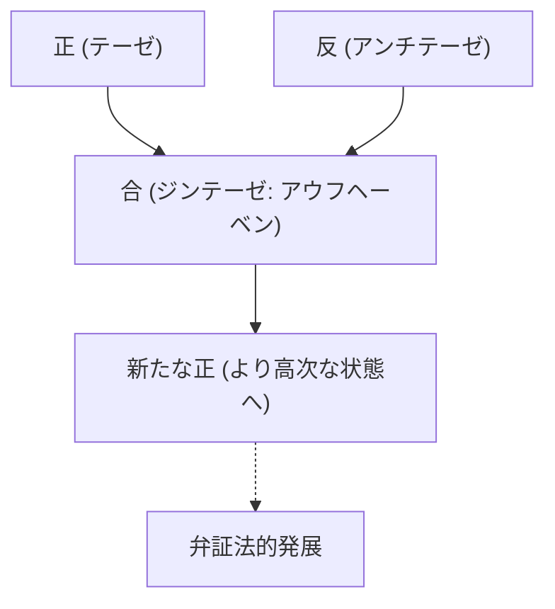
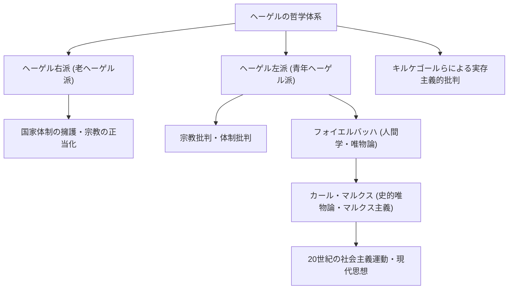

西洋哲学史において、イマヌエル・カントに始まり、19世紀のドイツ観念論の頂点を極めた思想家こそが、ゲオルク・ヴィルヘルム・フリードリヒ・ヘーゲル（1770年–1831年）です。彼の「弁証法」や「絶対精神」という難解にして壮大な思想体系は、同時代のみならず、カール・マルクスや実存主義、そして現代の政治学や歴史学に至るまで、極めて広範な影響を及ぼしました。本記事では、ヘーゲルの生涯をたどりながら、その哲学の核心と後世への影響について深く掘り下げていきます。

## 神学校の優等生から大哲学者への道

ヘーゲルは1770年8月27日、ヴュルテンベルク公国の首都シュトゥットガルトで、公務員の家庭に生まれました。幼少期から学業優秀であった彼は、テュービンゲン大学の神学校（シュティフト）に入学します。ここで彼は、後に大詩人となるフリードリヒ・ヘルダーリンや、天才哲学者フリードリヒ・ヴィルヘルム・ヨーゼフ・シェリングという、ドイツ・ロマン派を代表する才能たちと運命的な出会いを果たし、同部屋で青春時代を過ごしました。フランス革命の熱狂がヨーロッパを席巻する中、彼らもまた「自由」の理念に深く共鳴し、自由の木を植えるなど急進的な思想に触れました。

卒業後、ヘーゲルはベルンやフランクフルトで家庭教師として働きながら、密かに自らの思想を練り上げていきました。初期の彼は宗教や歴史の役割について考察し、古代ギリシャのポリスにおける調和した生活を理想としつつ、いかにして近代社会が引き裂かれた状態（疎外）を克服できるかを模索しました。その後、1801年にシェリングの招きでイェーナ大学の私講師となり、次第に独自の体系構築に向けて歩み始めます。

1806年、ナポレオン軍がイェーナに侵攻する混乱の只中で、彼は最初の主著『精神現象学』を脱稿しました。この時、ナポレオンを「馬上の世界精神」と評したエピソードはあまりにも有名です。その後、ニュルンベルクのギムナジウム校長やハイデルベルク大学教授を経て、1818年にプロイセン王国の首都ベルリン大学の教授に就任。ここで彼は学界に君臨し、プロイセン国家の公式哲学者とも言うべき権威を確立しました。

## ヘーゲル哲学の核心：弁証法と精神の歩み

ヘーゲルの哲学を理解する上で最も重要なキーワードが「弁証法（Dialektik）」です。弁証法とは、物事が対立や矛盾を通じてより高次な状態へと発展していく運動の論理を指します。

ある状態（正：テーゼ）が、その内部にある矛盾によって反対の状態（反：アンチテーゼ）を生み出し、その両者が対立・闘争を経た上で、どちらの要素も保存しつつより高い次元で統合される（合：ジンテーゼ）。この「止揚（アウフヘーベン）」のプロセスこそが、歴史や世界、そして人間の認識が発展するメカニズムであるとヘーゲルは考えました。

彼の体系のもう一つの柱が「絶対精神」の概念です。ヘーゲルによれば、世界とは単なる物質の集まりではなく、理性的な「精神」が自らを実現していくプロセスそのものです。「理性的なものは現実的であり、現実的なものは理性的である」という彼の有名な言葉は、歴史の展開とは理性が自由を獲得していく必然的な過程であるという確信を示しています。

『精神現象学』では、人間の意識が素朴な感覚から出発し、様々な矛盾を経験しながら最終的に「絶対知」に至るまでの壮大な精神の遍歴が描かれています。続く『論理学』、『エンツュクロペディー』、『法の哲学』などで、彼は自然、歴史、国家、芸術、宗教を全て一つの論理的体系の中に位置づけました。

## 思想の遺産：ヘーゲル学派の分裂とマルクス主義への影響

1831年、ベルリンで猛威を振るっていたコレラに感染し（あるいは胃腸疾患とも言われます）、ヘーゲルは61歳で急逝しました。しかし、彼の死後、その膨大な思想的遺産は激しい議論の的となりました。

ヘーゲル学派は、彼の体系を保守的に解釈しプロイセン国家を肯定する「ヘーゲル右派（老ヘーゲル派）」と、弁証法的な発展の論理を急進的に解釈し、現状の国家や宗教を批判する「ヘーゲル左派（青年ヘーゲル派）」へと分裂しました。

特に後者の影響は歴史を大きく動かしました。ルートヴィヒ・フォイエルバッハの宗教批判を経て、カール・マルクスとフリードリヒ・エンゲルスが登場します。マルクスはヘーゲルの観念論的な弁証法を「逆立ちしている」と批判しつつも、その発展の論理そのものは継承し、「唯物史観（史的唯物論）」へと転倒・発展させました。つまり、歴史を動かすのは「精神」ではなく、物質的な「経済的下部構造」の矛盾であると考えたのです。

## 結語：現代に生きるヘーゲル哲学

ヘーゲルの思想は、全体主義の温床になったと批判されることもあれば、自由主義的な国家モデルの先駆として再評価されることもあります。彼の文章はドイツ語圏の哲学者の中でもとりわけ難解で、一つの文が数ページに及ぶことも珍しくありませんが、その背後には「分裂し対立する世界を、いかにして再び調和させるか」という切実な問題意識がありました。

多様な価値観が衝突し、分断が深まる現代社会において、対立を単なる排除で終わらせず、より高次な解決（アウフヘーベン）へと導こうとするヘーゲルの弁証法的な思考態度は、今なお私たちが向き合うべき重要な知恵を提示し続けています。
