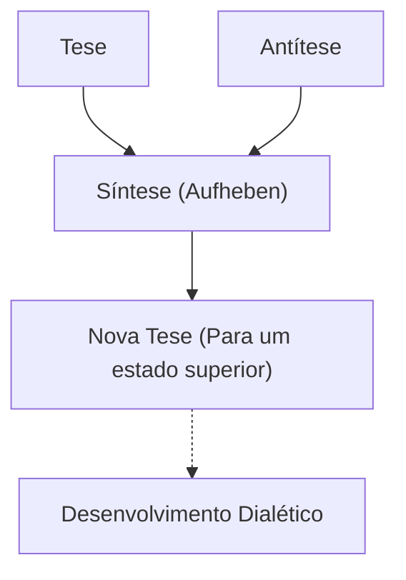
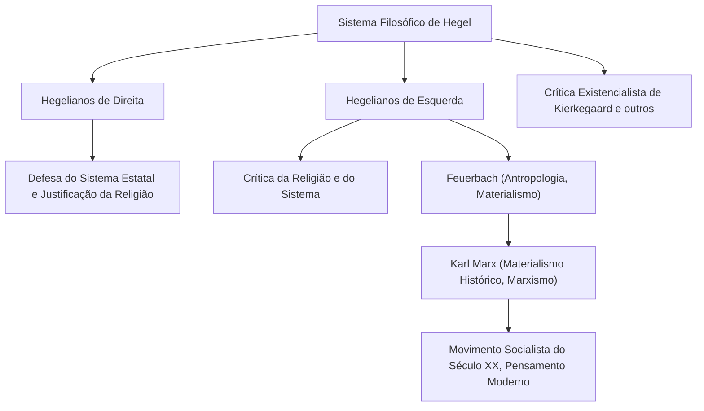

Na história da filosofia ocidental, o pensador que atingiu o ápice do idealismo alemão do século XIX, começando com Immanuel Kant, foi Georg Wilhelm Friedrich Hegel (1770–1831). Seu formidável e grandioso sistema de pensamento, centrado na "Dialética" e no "Espírito Absoluto", exerceu uma influência extremamente ampla não apenas em sua época, mas também em Karl Marx, no existencialismo e, até hoje, na ciência política e na história modernas. Neste artigo, traçaremos a vida de Hegel e aprofundaremos na essência de sua filosofia e em seu impacto nas gerações posteriores.

## O Caminho de Aluno Brilhante do Seminário a Grande Filósofo

Hegel nasceu em 27 de agosto de 1770, na capital do Ducado de Württemberg, Stuttgart, em uma família de funcionários públicos. Excelente nos estudos desde a infância, ele ingressou no seminário teológico (Stift) da Universidade de Tübingen. Lá, ele teve um encontro fatídico com talentos representativos do romantismo alemão: o futuro grande poeta Friedrich Hölderlin e o filósofo genial Friedrich Wilhelm Joseph Schelling, passando sua juventude compartilhando o mesmo quarto. Enquanto o entusiasmo da Revolução Francesa varria a Europa, eles também ressoaram profundamente com o ideal de "liberdade", entrando em contato com ideias radicais, como o plantio da Árvore da Liberdade.

Após a graduação, Hegel trabalhou como tutor em Berna e Frankfurt, enquanto refinava secretamente seu próprio pensamento. Em seus primeiros anos, ele considerou o papel da religião e da história, idealizando a vida harmoniosa na pólis da Grécia antiga, enquanto buscava maneiras de superar o estado dilacerado (alienação) da sociedade moderna. Posteriormente, em 1801, a convite de Schelling, ele se tornou professor privado na Universidade de Jena e começou a caminhar em direção à construção de seu próprio sistema único.

Em 1806, em meio ao caos da invasão de Jena pelas tropas de Napoleão, ele concluiu sua primeira obra principal, "A Fenomenologia do Espírito". O episódio em que ele descreveu Napoleão como o "espírito do mundo a cavalo" neste momento é extremamente famoso. Posteriormente, após servir como diretor do Ginásio de Nuremberg e professor na Universidade de Heidelberg, ele se tornou professor na Universidade de Berlim, capital do Reino da Prússia, em 1818. Lá ele reinou no mundo acadêmico e estabeleceu sua autoridade como o filósofo oficial do estado prussiano.

## A Essência da Filosofia de Hegel: Dialética e a Jornada do Espírito

A palavra-chave mais importante para entender a filosofia de Hegel é "Dialética" (Dialektik). A dialética refere-se à lógica do movimento no qual as coisas se desenvolvem para um estado superior através de oposições e contradições.

Um certo estado (Tese) produz um estado oposto (Antítese) através de suas contradições internas, e depois que os dois passam por oposição e luta, eles são integrados em uma dimensão superior (Síntese), preservando elementos de ambos. Hegel acreditava que esse processo de "Aufheben" (Supersunção) é o mecanismo pelo qual a história, o mundo e a cognição humana se desenvolvem.

Outro pilar de seu sistema é o conceito de "Espírito Absoluto". Segundo Hegel, o mundo não é uma mera coleção de matéria, mas o próprio processo pelo qual o "espírito" racional se realiza. Sua famosa frase "O que é racional é real; e o que é real é racional" demonstra sua convicção de que o desenvolvimento da história é um processo inevitável através do qual a razão adquire liberdade.

Na "Fenomenologia do Espírito", é descrita a grandiosa jornada do espírito, onde a consciência humana parte de sensações ingênuas, experimenta várias contradições e finalmente alcança o "Saber Absoluto". Nas subsequentes "Ciência da Lógica", "Enciclopédia" e "Filosofia do Direito", ele posicionou a natureza, a história, o estado, a arte e a religião dentro de um único sistema lógico.

## O Legado do Pensamento: A Divisão da Escola Hegeliana e a Influência no Marxismo

Em 1831, infectado pela cólera que assolava Berlim (ou possivelmente uma doença gastrointestinal), Hegel faleceu repentinamente aos 61 anos. No entanto, após sua morte, seu vasto legado intelectual tornou-se objeto de intenso debate.

A escola hegeliana dividiu-se na "Velha Escola Hegeliana" (Hegelianos de Direita), que interpretava conservadoramente seu sistema e afirmava o estado prussiano, e na "Jovem Escola Hegeliana" (Hegelianos de Esquerda), que interpretava radicalmente a lógica do desenvolvimento dialético e criticava o estado atual e a religião.

A influência destes últimos, em particular, moveu muito a história. Após a crítica da religião de Ludwig Feuerbach, Karl Marx e Friedrich Engels surgiram. Enquanto criticava a dialética idealista de Hegel como estando "de cabeça para baixo", Marx herdou a própria lógica de desenvolvimento, virando-a e desenvolvendo-a no "Materialismo Histórico". Em outras palavras, ele acreditava que o que move a história não é o "espírito", mas as contradições na "infraestrutura econômica" material.

## Conclusão: A Filosofia de Hegel no Mundo Moderno

O pensamento de Hegel às vezes é criticado como um terreno fértil para o totalitarismo, enquanto outras vezes é reavaliado como o pioneiro do modelo de estado liberal. Seus escritos estão entre os mais difíceis, mesmo entre os filósofos de língua alemã, com uma única frase frequentemente se estendendo por várias páginas. No entanto, por trás disso estava uma aguda consciência do problema: "Como podemos harmonizar um mundo que está dividido e em conflito?"

Na sociedade moderna, onde valores diversos colidem e as divisões se aprofundam, a atitude de pensamento dialético de Hegel, que tenta levar os conflitos a uma resolução de ordem superior (Aufheben) em vez de terminar com a mera exclusão, continua a apresentar uma sabedoria importante com a qual devemos lidar hoje.
