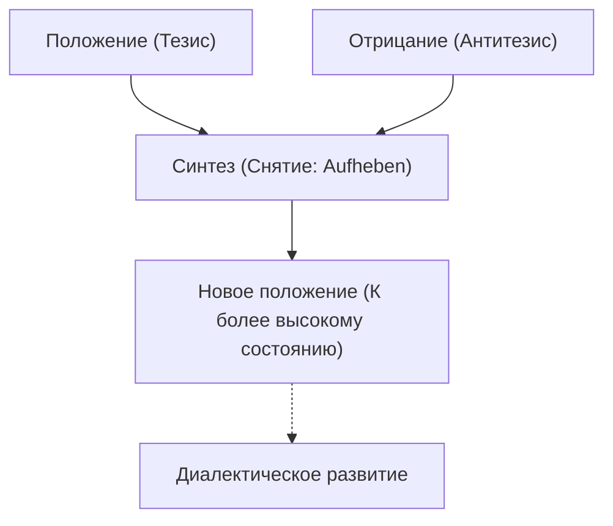
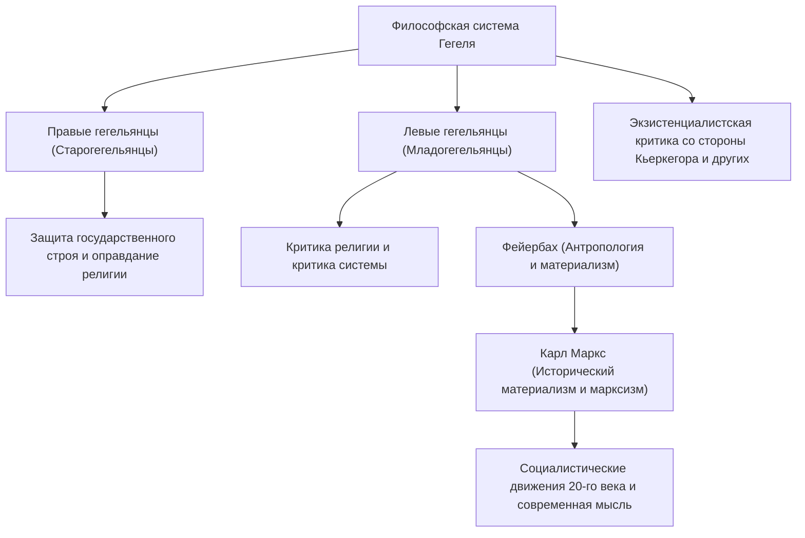

В истории западной философии мыслителем, с которого начался и который достиг вершины немецкого идеализма 19-го века, начатого Иммануилом Кантом, был Георг Вильгельм Фридрих Гегель (1770–1831). Его сложная и грандиозная система мыслей, такая как «диалектика» и «абсолютный дух», оказала чрезвычайно широкое влияние не только на современников, но и на Карла Маркса, экзистенциализм, а также на современные политологию и историю. В этой статье мы проследим за жизнью Гегеля и глубоко погрузимся в суть его философии и ее влияние на будущие поколения.

## Путь от отличника семинарии до великого философа

Гегель родился 27 августа 1770 года в Штутгарте, столице герцогства Вюртемберг, в семье государственного служащего. С ранних лет отличавшийся блестящими успехами в учебе, он поступил в богословскую семинарию (Штифт) при Тюбингенском университете. Здесь он судьбоносно встретился с талантами, которые в будущем стали представителями немецкого романтизма — великим поэтом Фридрихом Гёльдерлином и гениальным философом Фридрихом Вильгельмом Йозефом Шеллингом. С ними он делил комнату и провел свою юность. В то время как энтузиазм Французской революции охватил Европу, они также глубоко резонировали с идеей «свободы», соприкасаясь с радикальными идеями, например, сажая дерево свободы.

После окончания учебы Гегель работал домашним учителем в Берне и Франкфурте, втайне вынашивая свои собственные идеи. В ранние годы он размышлял о роли религии и истории, идеализируя гармоничную жизнь в древнегреческом полисе и ища пути преодоления разорванного состояния (отчуждения) современного общества. Впоследствии, в 1801 году, по приглашению Шеллинга он стал приват-доцентом Йенского университета и постепенно начал двигаться к построению собственной уникальной системы.

В 1806 году, в разгар вторжения армии Наполеона в Йену, он закончил работу над своим первым главным трудом — «Феноменологией духа». Хорошо известен эпизод, когда он назвал Наполеона «мировым духом верхом на коне». Затем, после работы директором гимназии в Нюрнберге и профессором Гейдельбергского университета, в 1818 году он занял должность профессора Берлинского университета — столицы Прусского королевства. Здесь он царил в академических кругах и утвердил свой авторитет, фактически став официальным философом прусского государства.

## Суть философии Гегеля: диалектика и путь духа

Самым важным ключевым словом для понимания философии Гегеля является «диалектика» (Dialektik). Диалектика относится к логике движения, посредством которого вещи развиваются до более высокого состояния через противоположности и противоречия.

Определенное состояние (положение: тезис) из-за присущих ему внутренних противоречий порождает противоположное состояние (отрицание: антитезис), и после того, как они проходят через противостояние и борьбу, они интегрируются на более высоком уровне, сохраняя элементы обоих (синтез). Этот процесс «снятия» (Aufheben), как считал Гегель, и является механизмом развития истории, мира и человеческого познания.

Другим столпом его системы является концепция «абсолютного духа». По Гегелю, мир — это не просто скопление материи, а сам процесс самореализации разумного «духа». Его знаменитое изречение: «Что разумно, то действительно; и что действительно, то разумно» показывает его убежденность в том, что развитие истории — это неизбежный процесс обретения разумом свободы.

В «Феноменологии духа» описывается грандиозное странствие духа, когда человеческое сознание начинает с наивных чувств, проходит через различные противоречия и, наконец, достигает «абсолютного знания». В последующих трудах — «Науке логики», «Энциклопедии философских наук» и «Философии права» — он поместил природу, историю, государство, искусство и религию в единую логическую систему.

## Наследие мысли: раскол гегельянской школы и влияние на марксизм

В 1831 году Гегель внезапно скончался в возрасте 61 года, заразившись холерой, свирепствовавшей в Берлине (или, как некоторые утверждают, от желудочно-кишечного заболевания). Однако после его смерти его огромное интеллектуальное наследие стало предметом ожесточенных споров.

Гегельянская школа раскололась на «правых гегельянцев» (старогегельянцев), которые консервативно интерпретировали его систему и оправдывали прусское государство, и «левых гегельянцев» (младогегельянцев), которые радикально трактовали логику диалектического развития и критиковали современное государство и религию.

Особенно влияние последних сильно изменило историю. Через критику религии Людвига Фейербаха на сцену вышли Карл Маркс и Фридрих Энгельс. Маркс критиковал идеалистическую диалектику Гегеля, утверждая, что она «стоит на голове», но при этом унаследовал саму логику ее развития, перевернув и развив ее в «материалистическое понимание истории» (исторический материализм). То есть, он считал, что историю движет не «дух», а противоречия материального «экономического базиса».

## Заключение: философия Гегеля в современном мире

Идеи Гегеля иногда критикуют как питательную среду для тоталитаризма, а иногда переоценивают как предшественника либеральной модели государства. Его тексты являются одними из самых трудных для понимания среди философов немецкоязычного мира, и нередки случаи, когда одно предложение растягивается на несколько страниц. Однако за этим стояла острая проблема: «как снова гармонизировать расколотый и конфликтующий мир».

В современном обществе, где сталкиваются разнообразные ценности и углубляется разобщенность, диалектический образ мышления Гегеля, стремящийся не просто закончить конфликт исключением, а привести к разрешению на более высоком уровне (Aufheben), продолжает предлагать важную мудрость, с которой мы все еще должны считаться.
