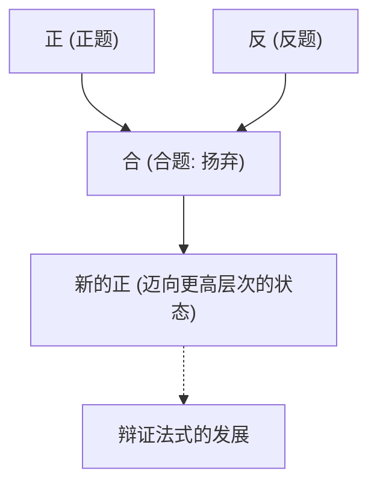
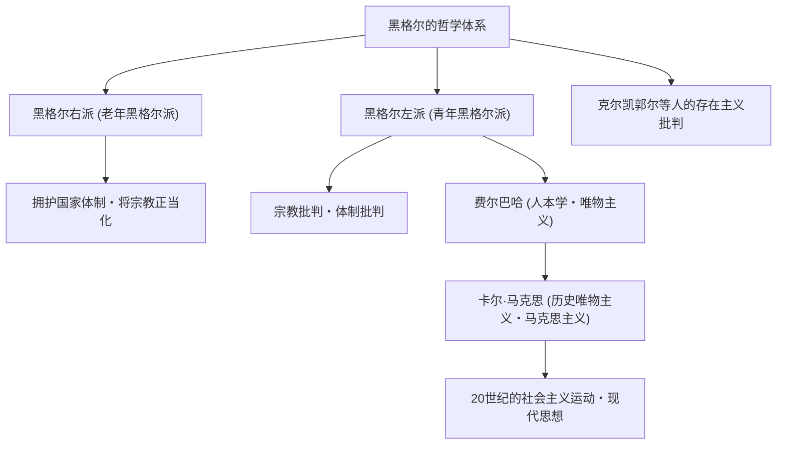

在西方哲学史中，始于伊曼努尔·康德，并在19世纪将德国唯心主义推向顶峰的思想家，正是格奥尔格·威廉·弗里德里希·黑格尔（1770年–1831年）。他那被称为“辩证法”和“绝对精神”的深奥且宏大的思想体系，不仅在同时代，更对卡尔·马克思、存在主义，甚至现代政治学和历史学产生了极其广泛的影响。本文将通过追溯黑格尔的生平，深入探讨其哲学的核心及对后世的影响。

## 从神学院优等生到大哲学家之路

1770年8月27日，黑格尔出生于符腾堡公国首都斯图加特的一个公务员家庭。他自幼学业优异，后进入图宾根大学神学院（Stift）学习。在这里，他命运般地结识了日后成为大诗人的弗里德里希·荷尔德林，以及天才哲学家弗里德里希·威廉·约瑟夫·谢林——这些代表德国浪漫派的天才们，并在同一个寝室度过了青春岁月。在法国大革命的狂热席卷欧洲之际，他们也对“自由”的理念产生了深深的共鸣，并接触了种植自由之树等激进思想。

毕业后，黑格尔在伯尔尼和法兰克福担任家庭教师，同时暗中构思自己的思想。早期的他考察了宗教和历史的作用，以古希腊城邦的和谐生活为理想，探索如何克服近代社会被撕裂的状态（异化）。随后，在1801年，应谢林之邀，他成为耶拿大学的编外讲师，开始逐步迈向建立自己独有的思想体系。

1806年，在拿破仑军队入侵耶拿的混乱之中，他完成了第一部主要著作《精神现象学》的草稿。当时他评价拿破仑为“马背上的世界精神”，这一轶事极为著名。此后，他历任纽伦堡文理中学（Gymnasium）校长和海德堡大学教授，并于1818年就任普鲁士王国首都柏林大学的教授。在那里，他称霸学术界，确立了可以说是普鲁士国家官方哲学家的权威地位。

## 黑格尔哲学的核心：辩证法与精神的发展历程

理解黑格尔哲学最重要的关键词是“辩证法（Dialektik）”。辩证法是指事物通过对立和矛盾，向更高层次状态发展运动的逻辑。

某种状态（正：正题）因其内部的矛盾而产生相反的状态（反：反题），两者经过对立与斗争后，在保留各自要素的同时被整合到更高的维度（合：合题）。黑格尔认为，这个“扬弃（Aufheben）”的过程，正是历史、世界以及人类认知发展的机制。

他思想体系的另一个支柱是“绝对精神”的概念。在黑格尔看来，世界并非仅仅是物质的集合，而是理性的“精神”自我实现的过程本身。他那句名言“凡是合乎理性的东西都是现实的，凡是现实的东西都是合乎理性的”，表明了他确信历史的展开就是理性获得自由的必然过程。

在《精神现象学》中，人类意识从朴素的感觉出发，经历了各种矛盾，最终描绘出通向“绝对知识”的宏大精神历程。在随后的《逻辑学》、《哲学全书》和《法哲学原理》中，他将自然、历史、国家、艺术、宗教全部置于一个逻辑体系之中。

## 思想的遗产：黑格尔学派的分裂与对马克思主义的影响

1831年，黑格尔感染了在柏林肆虐的霍乱（也有说是胃肠疾病），以61岁之龄骤然离世。然而，在他死后，他庞大的思想遗产成为了激烈争论的焦点。

黑格尔学派发生了分裂：保守地解释他的体系、肯定普鲁士国家的被称为“黑格尔右派（老年黑格尔派）”；而激进地解释辩证法的发展逻辑、批判现状的国家和宗教的则被称为“黑格尔左派（青年黑格尔派）”。

特别是后者的影响极大地推动了历史的发展。经过路德维希·费尔巴哈的宗教批判，卡尔·马克思和弗里德里希·恩格斯登上了历史舞台。马克思虽然批评黑格尔的唯心主义辩证法是“头足倒置”的，但他继承了其发展的逻辑本身，并将其颠倒、发展为“唯物史观（历史唯物主义）”。也就是说，他认为推动历史发展的不是“精神”，而是物质的“经济基础（下层建筑）”的矛盾。

## 结语：活在当代的黑格尔哲学

黑格尔的思想有时被批评为极权主义的温床，有时又作为自由主义国家模式的先驱被重新评价。他的文章在德语圈的哲学家中也是出了名的晦涩难懂，一句话长达数页的情况并不罕见；但在其背后，存在着“如何让分裂对立的世界再次和谐”这样深切的问题意识。

在多元价值观碰撞、裂痕加深的现代社会中，不让对立仅仅以排斥告终，而是试图引导其走向更高层次的解决（扬弃）的黑格尔辩证法思维态度，至今仍在向我们不断提供着应该去直面的重要智慧。
