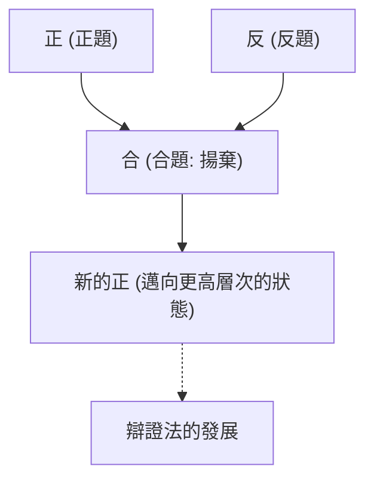
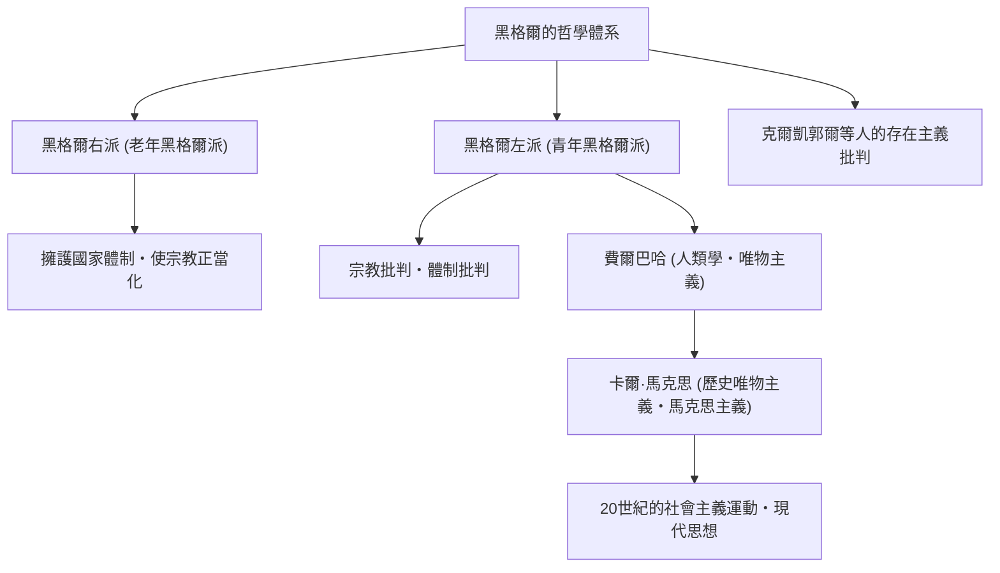

在西方哲學史中，從伊曼努爾·康德開始，將19世紀德國唯心主義推向巔峰的思想家，正是格奧爾格·威廉·弗里德里希·黑格爾（1770年–1831年）。他那艱澀而宏大的「辯證法」與「絕對精神」的思想體系，不僅影響了同時代的人，更對卡爾·馬克思、存在主義，甚至現代的政治學與歷史學產生了極其廣泛的影響。本文將追溯黑格爾的生平，並深入探討其哲學的核心及對後世的影響。

## 從神學院的優等生到大哲學家之路

黑格爾於1770年8月27日出生於符騰堡公國首都斯圖加特的一個公務員家庭。他從小學業優異，進入了圖賓根大學的神學院（Stift）就讀。在這裡，他與後來成為偉大詩人的弗里德里希·荷爾德林，以及天才哲學家弗里德里希·威廉·約瑟夫·謝林這些代表德國浪漫派的天才們命運般地相遇，並在同一個房間裡度過了青春歲月。當法國大革命的狂熱席捲歐洲時，他們也對「自由」的理念產生了深深的共鳴，並接觸了種植自由之樹等激進思想。

畢業後，黑格爾在伯爾尼和法蘭克福擔任家庭教師，同時暗中構築自己的思想。早期的他考察了宗教與歷史的作用，以古希臘城邦中和諧的生活為理想，同時探索如何克服現代社會的撕裂狀態（異化）。隨後，在1801年，應謝林的邀請，他成為耶拿大學的編外講師，並逐漸開始朝著構建獨特體系的方向邁進。

1806年，在拿破崙軍隊入侵耶拿的混亂中，他完成了首部主要著作《精神現象學》。當時他將拿破崙評價為「馬背上的世界精神」，這段軼事極為著名。之後，他歷任紐倫堡的文理中學校長和海德堡大學教授，並於1818年就任普魯士王國首都柏林大學的教授。在這裡，他稱霸學術界，確立了堪稱普魯士國家官方哲學家的權威地位。

## 黑格爾哲學的核心：辯證法與精神的歷程

理解黑格爾哲學最重要的關鍵詞是「辯證法（Dialektik）」。辯證法是指事物透過對立與矛盾，向更高層次狀態發展的運動邏輯。

某種狀態（正：正題）會因為其內部的矛盾而產生相反的狀態（反：反題），這兩者經過對立與鬥爭後，在保留雙方要素的同時被整合到更高的層次（合：合題）。黑格爾認為，這個「揚棄（Aufheben）」的過程正是歷史、世界以及人類認知發展的機制。

他體系的另一個支柱是「絕對精神」的概念。黑格爾認為，世界不僅僅是物質的集合，而是理性的「精神」自我實現的過程本身。「凡是合乎理性的東西都是現實的，凡是現實的東西都是合乎理性的」，他這句名言表明了他的信念：歷史的發展就是理性獲得自由的必然過程。

在《精神現象學》中，他描繪了人類意識從樸素的感覺出發，經歷各種矛盾，最終達到「絕對知識」的宏大精神歷程。在隨後的《邏輯學》、《哲學全書》和《法哲學原理》等著作中，他將自然、歷史、國家、藝術和宗教全部置於一個邏輯體系之中。

## 思想的遺產：黑格爾學派的分裂與對馬克思主義的影響

1831年，在柏林肆虐的霍亂疫情中（也有說是腸胃疾病），黑格爾感染並猝然離世，享年61歲。然而，在他死後，其龐大的思想遺產成為了激烈爭論的焦點。

黑格爾學派分裂為保守地解釋其體系並肯定普魯士國家的「黑格爾右派（老年黑格爾派）」，以及激進地解釋辯證發展邏輯並批判現狀國家與宗教的「黑格爾左派（青年黑格爾派）」。

特別是後者的影響極大地推動了歷史的發展。經過路德維希·費爾巴哈的宗教批判，卡爾·馬克思和弗里德里希·恩格斯登上了歷史舞台。馬克思批評黑格爾的唯心主義辯證法是「頭足倒置的」，但繼承了其發展的邏輯本身，並將其顛倒、發展為「唯物史觀（歷史唯物主義）」。也就是說，他認為推動歷史發展的不是「精神」，而是物質性的「經濟基礎」的矛盾。

## 結語：活在現代的黑格爾哲學

黑格爾的思想有時被批評為極權主義的溫床，有時又作為自由主義國家模式的先驅而被重新評價。他的文章在德語圈的哲學家中也是格外難懂的，一句話長達數頁的情況屢見不鮮，但在這背後，存在著「如何讓分裂與對立的世界再次和諧」的迫切問題意識。

在多種價值觀衝突、分歧加深的現代社會中，黑格爾那種不將對立僅僅停留在排除上，而是試圖引導至更高層次解決（揚棄）的辯證思維態度，至今仍在為我們提供必須面對的重要智慧。
