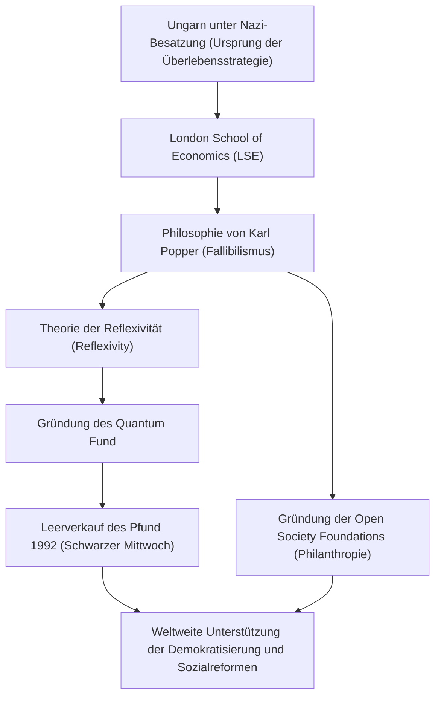

George Soros. Was kommt Ihnen in den Sinn, wenn Sie diesen Namen hören? Der legendäre Investor, bekannt als "der Mann, der die Bank von England ruinierte", oder der gigantische Philanthrop, der die Demokratisierung auf der ganzen Welt unterstützt? Vielleicht ist er sogar die mysteriöse Figur, über die als Ziel von Verschwörungstheorien gesprochen wird.

Der Kern von Soros ist jedoch der eines "philosophierenden Investors". Indem wir sein Leben, seine Anlagephilosophie und die Auswirkungen, die er der Nachwelt hinterlassen hat, entwirren, können wir Hinweise darauf finden, wie wir in unserer zunehmend komplexen modernen Gesellschaft überleben können. Dieser Artikel befasst sich mit dem turbulenten Leben von George Soros und dem Kern seiner Ideen.

## 1. Kindheitserfahrungen und die Obsession zu "überleben"

George Soros (richtiger Name: György Schwartz) wurde 1930 in eine wohlhabende jüdische Familie in Ungarns Hauptstadt Budapest geboren. Doch sein friedliches Leben änderte sich 1944 schlagartig, als Nazi-Deutschland Ungarn besetzte.

Sein Vater Tivadar, ein Anwalt, ging ein extrem gefährliches Risiko ein, indem er die Ausweise von Familie und Freunden fälschte, um als Christen durchzugehen und den Klauen des Holocaust zu entkommen. Diese harte Erfahrung prägte dem jungen Soros die starke Lektion ein: "In extremen Situationen, in denen die Regeln zusammengebrochen sind, hat das Überleben ohne Bindung an den gesunden Menschenverstand höchste Priorität." Dieser Überlebensgeist bildete später den Kern des "Risikomanagements" in seinem Anlagestil.

## 2. Eine schicksalhafte Begegnung: Karl Popper und die "Offene Gesellschaft"

Nach dem Krieg, 1947, entkam Soros dem zunehmend kommunistischen Ungarn und zog nach London, England. Während er als Kellner und Eisenbahnträger arbeitete und an der London School of Economics (LSE) studierte, begegnete er der Philosophie, die sein Leben bestimmen sollte. Es war das Konzept der "Offenen Gesellschaft" (Open Society), das von dem Philosophen Karl Popper vorgeschlagen wurde.

In seinem Buch "Die offene Gesellschaft und ihre Feinde" kritisierte Popper den Totalitarismus (die geschlossene Gesellschaft) und argumentierte, dass eine "offene Gesellschaft", in der Menschen sich frei kritisieren und Fehler unter der Prämisse (Fallibilismus) korrigieren können, dass jeder Mensch Fehler macht, wünschenswert sei.

Soros fühlte eine tiefe Resonanz mit Poppers Fallibilismus – dass "niemand die absolute Wahrheit erfassen kann" – und nutzte ihn als Grundlage für sein Denken. Später wandte er diese Philosophie auf die Marktwirtschaft an und schuf seine eigene "Theorie der Reflexivität" (Reflexivity).

## 3. Erwachen als Investor: Theorie der Reflexivität und die Pfund-Krise

Soros, der 1956 nach Amerika zog, machte sich in der Finanzbranche einen Namen. 1973 gründete er zusammen mit Jim Rogers den späteren "Quantum Fund". Seine Waffe hier war die oben erwähnte "Theorie der Reflexivität".

Die traditionelle Wirtschaftswissenschaft besagt, dass "der Markt immer Recht hat" (Markteffizienzhypothese) und glaubt, dass sich die Preise schließlich in Richtung eines Gleichgewichtspunkts bewegen. Soros argumentierte jedoch, dass es eine Zwei-Wege-Rückkopplungsschleife (Reflexivität) gibt: "Die Wahrnehmung der Marktteilnehmer ist immer verzerrt (Fehlbarkeit), und diese verzerrte Wahrnehmung beeinflusst das tatsächliche Marktumfeld, was wiederum die Wahrnehmung der Teilnehmer weiter verzerrt." Mit anderen Worten, der Markt kann sich irren, und diese Fehler können massive Blasen oder Zusammenbrüche verursachen.

Der historische Erfolg dieser Theorie war die "Pfund-Krise" (Schwarzer Mittwoch) von 1992. Soros durchschaute die "Marktverzerrung", dass das britische Pfund durch das Europäische Währungssystem (EWS) über seinen wahren Wert hinaus überbewertet war. Er startete einen beispiellosen Leerverkauf von Pfund in Höhe von 10 Milliarden Dollar, zwang infolgedessen die Bank von England (die britische Zentralbank) in die Knie und drängte Großbritannien zum Austritt aus dem EWS. In dieser einen Schlacht verdiente Soros über 1 Milliarde Dollar und machte seinen Namen weltweit als "der Mann, der die Bank von England ruinierte" bekannt.

## 4. Rückgabe des Reichtums: Zur Verwirklichung einer "Offenen Gesellschaft"

Soros baute als Investor enormen Reichtum auf, aber für ihn war der Erwerb von Geld kein Ziel, sondern lediglich ein Mittel zur Verwirklichung einer "offenen Gesellschaft". 1979 investierte er sein eigenes Vermögen, um die "Open Society Foundations" zu gründen.

Seine philanthropischen Aktivitäten beschränken sich nicht auf allgemeine medizinische oder pädagogische Unterstützung. Sein Ziel war es, Diktaturen und autoritäre Regime zu stürzen und eine demokratische und vielfältige Gesellschaft aufzubauen. Am Ende des Kalten Krieges leistete er Dissidenten und Intellektuellen in Osteuropa umfangreiche finanzielle Unterstützung und trug maßgeblich zum Zusammenbruch der Sowjetunion und zur Demokratisierung Osteuropas bei. Seine Unterstützungsbereiche sind vielfältig, von der Unterstützung der Anti-Apartheid-Bewegung von Nelson Mandela über den Schutz von Minderheitenrechten in der modernen Zeit bis hin zur Reform der Drogenpolitik.

Aufgrund des Ausmaßes seines politischen Einflusses gibt es jedoch ständige Verschwörungstheorien, die ihn als "Drahtzieher betrachten, der darauf abzielt, Nationen zu stürzen". Er ist das Ziel heftiger Kritik, insbesondere von autoritären Führern wie dem Orbán-Regime in seinem Heimatland Ungarn. Dies ist auch die Kehrseite davon, wie sehr er eine Bedrohung für bestehende Machtstrukturen darstellt und wie außergewöhnlich sein Engagement für eine "offene Gesellschaft" ist.

## 5. Die Botschaft, die George Soros der Gegenwart hinterlässt

Das Leben von George Soros ist von einer starken Skepsis durchdrungen: "Es gibt keine absolute richtige Antwort." Ob auf dem Markt oder in der Politik, Menschen machen unweigerlich Fehler. Deshalb brauchen wir ein flexibles Denken und ein soziales System, das diese Fehler schnell erkennen und korrigieren kann – das ist die Philosophie, die er durch sein eigenes Leben zu beweisen versuchte.

In der heutigen Zeit, in der Fake News allgegenwärtig sind und Autoritarismus weltweit wieder auf dem Vormarsch ist, sind die Ideen von Soros wichtiger denn je. Jeder von uns sollte die Demut besitzen, anzuerkennen, dass "unsere eigene Wahrnehmung falsch sein könnte", und weiterhin eine "offene" Haltung gegenüber anderen Meinungen einnehmen. Das ist wohl das größte Vermächtnis, das "der Mann, der die Bank von England ruinierte" uns hinterlassen hat.
