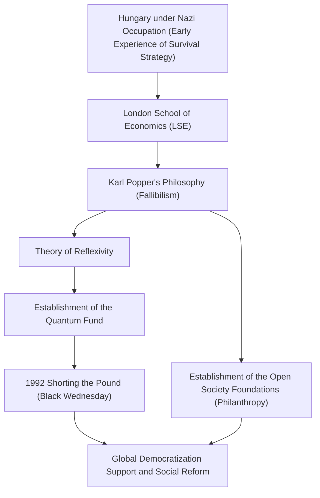

George Soros. What comes to mind when you hear this name? A legendary investor nicknamed "The Man Who Broke the Bank of England", or a massive philanthropist supporting democratization around the world? Or perhaps a mysterious figure often targeted by conspiracy theories.

However, the true essence of Soros is a "philosophizing investor". By unraveling his life, his investment philosophy, and the influence he left on future generations, we can find hints for surviving in our increasingly complex modern society. In this article, we delve into the turbulent life of George Soros and the core of his thoughts.

## 1. Early Childhood Experiences and the Tenacity to "Survive"

George Soros (born György Schwartz) was born in 1930 into a wealthy Jewish family in Budapest, the capital of Hungary. However, his peaceful life was completely upended when Nazi Germany occupied Hungary in 1944.

His father, Tivadar, a lawyer, took an extremely dangerous gamble by forging identity documents for family and friends, posing as Christians to escape the clutches of the Holocaust. This harsh experience instilled a powerful lesson in the young Soros: "In extreme situations where rules have collapsed, surviving without being bound by common sense is the highest priority." This survival spirit would later form the foundation of "risk management" in his investment style.

## 2. A Fateful Encounter: Karl Popper and the "Open Society"

After the war in 1947, Soros escaped from a Hungary that was becoming increasingly communist and moved to London, England. While working as a waiter and railway porter, he studied at the London School of Economics (LSE), where he encountered the philosophy that would determine the course of his life. That was the concept of the "Open Society" advocated by the philosopher Karl Popper.

In his book "The Open Society and Its Enemies," Popper criticized totalitarianism (closed societies) and argued that an "open society," where people can freely criticize each other and correct mistakes under the premise that everyone makes mistakes (fallibilism), is the most desirable.

Soros resonated deeply with Popper's fallibilism—the idea that "no one can grasp absolute truth"—and made it the foundation of his own thinking. He would later apply this philosophy to the market economy, creating his unique "Theory of Reflexivity."

## 3. Awakening as an Investor: The Theory of Reflexivity and the Pound Crisis

Soros, who moved to the United States in 1956, distinguished himself in the financial industry. In 1973, along with Jim Rogers, he founded what would become the "Quantum Fund." His weapon here was the aforementioned "Theory of Reflexivity."

Traditional economics assumes that "the market is always right" (the efficient-market hypothesis), believing that prices ultimately move toward an equilibrium point. However, Soros argued for the existence of a two-way feedback loop (reflexivity): "Market participants' perceptions are always distorted (fallibility), and these distorted perceptions influence the actual market environment, which in turn further distorts the participants' perceptions." In other words, the market can make mistakes, and those mistakes cause massive bubbles and crashes.

This theory achieved historic success during the 1992 "Pound Crisis" (Black Wednesday). Soros saw through a "market distortion"—that the British pound was overvalued beyond its actual strength by the European Exchange Rate Mechanism (ERM). He launched an unprecedented short selling of the pound on the scale of $10 billion, ultimately forcing the Bank of England (the UK's central bank) to surrender and driving the UK to withdraw from the ERM. In this single battle, Soros made a profit of over $1 billion and made his name known worldwide as "The Man Who Broke the Bank of England."

## 4. Returning Wealth: Toward the Realization of an "Open Society"

Although Soros amassed enormous wealth as an investor, acquiring money was never his goal, but merely a means to realize an "open society." In 1979, he used his own assets to establish the "Open Society Foundations."

His philanthropic activities go beyond general medical or educational support. His goal was to break down dictatorships and authoritarian regimes and build democratic and diverse societies. Towards the end of the Cold War, he provided large amounts of financial support to dissidents and intellectuals in Eastern Europe, making a massive contribution to the collapse of the Soviet Union and the democratization of Eastern Europe. His areas of support are diverse, ranging from supporting Nelson Mandela's anti-apartheid movement to defending minority rights in the modern era and reforming drug policies.

However, due to his significant political influence, there is a constant stream of conspiracy theories that view him as a "mastermind plotting the overthrow of nations." In particular, he has become the target of fierce criticism from authoritarian leaders, such as the Orbán administration in his native Hungary. This is also the flip side of how much of a threat he is to existing power structures and how extraordinarily serious he is about the "open society."

## 5. The Message George Soros Leaves for the Modern World

The life of George Soros is permeated by a powerful skepticism that "absolute correct answers do not exist." In both the market and politics, humans always make mistakes. Therefore, a flexible way of thinking and a social system that can quickly acknowledge and correct those mistakes are necessary—this is the very philosophy he tried to prove through his own life.

In the modern era, where fake news is rampant and authoritarianism is once again on the rise across the globe, Soros's ideas are more important than ever. Each of us must have the humility to realize that "my own perception might be wrong" and maintain an "open" attitude toward different opinions. That is arguably the greatest legacy left to us by "The Man Who Broke the Bank of England."
