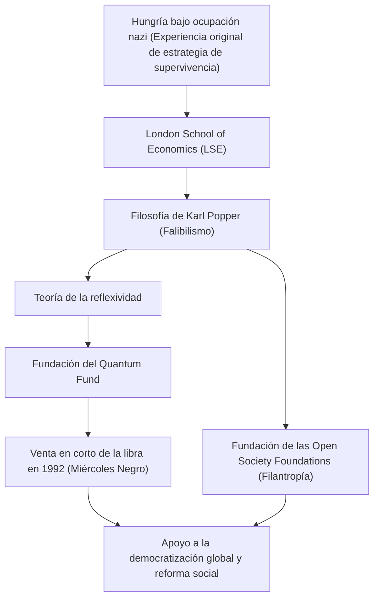

George Soros. ¿Qué le viene a la mente cuando escucha este nombre? ¿Un inversor legendario conocido como "el hombre que quebró al Banco de Inglaterra", o un enorme filántropo que apoya la democratización en todo el mundo? Además, podría ser una figura misteriosa de la que se habla a menudo como objetivo de teorías conspirativas.

Sin embargo, la esencia de Soros es la de un "inversor filósofo". Al desentrañar su vida, su filosofía de inversión y la influencia que ha dejado para la posteridad, podemos encontrar pistas para sobrevivir en nuestra cada vez más compleja sociedad moderna. En este artículo, nos adentraremos en la turbulenta vida de George Soros y en el núcleo de su pensamiento.

## 1. Experiencia original en la infancia y la obsesión por "sobrevivir"

George Soros (nombre real: György Schwartz) nació en 1930 en el seno de una adinerada familia judía en Budapest, la capital de Hungría. Sin embargo, en 1944, cuando la Alemania nazi ocupó Hungría, su apacible vida cambió por completo.

Su padre Tivadar, que era abogado, hizo una apuesta extremadamente peligrosa al falsificar documentos de identidad para su familia y amigos, haciéndose pasar por cristianos para escapar de las garras del Holocausto. Esta dura experiencia grabó en el joven Soros una poderosa lección: "en situaciones extremas donde las reglas se desmoronan, sobrevivir sin ataduras al sentido común es la máxima prioridad". Este espíritu de supervivencia formaría más tarde la base de la "gestión de riesgos" en su estilo de inversión.

## 2. Un encuentro predestinado: Karl Popper y la "sociedad abierta"

Después de la guerra, en 1947, Soros escapó de una Hungría en proceso de comunización y se trasladó a Londres, Inglaterra. Mientras trabajaba como camarero y maletero de ferrocarril y estudiaba en la London School of Economics (LSE), encontró la filosofía que definiría su vida. Se trata del concepto de "sociedad abierta" (Open Society), propuesto por el filósofo Karl Popper.

En su libro "La sociedad abierta y sus enemigos", Popper criticó el totalitarismo (la sociedad cerrada) y argumentó que una "sociedad abierta", donde las personas pueden criticarse libremente y corregir sus errores bajo la premisa de que todo ser humano comete errores (falibilismo), es lo más deseable.

Soros resonó profundamente con el falibilismo de Popper, que sostiene que "nadie puede captar la verdad absoluta", y lo estableció como la base de su propio pensamiento. Más tarde, aplicaría esta filosofía a la economía de mercado para crear su propia "teoría de la reflexividad".

## 3. El despertar como inversor: La teoría de la reflexividad y la crisis de la libra

Soros se trasladó a Estados Unidos en 1956 y comenzó a destacar en la industria financiera. En 1973, cofundó el posterior "Quantum Fund" junto a Jim Rogers. Aquí, su arma fue la mencionada "teoría de la reflexividad".

La economía tradicional asume que "el mercado siempre tiene razón" (hipótesis del mercado eficiente) y considera que los precios tienden finalmente hacia un punto de equilibrio. Sin embargo, Soros argumentó que existe un bucle de retroalimentación bidireccional (reflexividad) en el que "las percepciones de los participantes del mercado siempre están distorsionadas (falibilidad), esa percepción distorsionada afecta al entorno real del mercado, y eso a su vez distorsiona aún más las percepciones de los participantes". En otras palabras, el mercado puede equivocarse, y esos errores pueden causar enormes burbujas y colapsos.

Esta teoría logró un éxito histórico y masivo durante la "crisis de la libra" (Miércoles Negro) en 1992. Soros se dio cuenta de una "distorsión del mercado" por la cual la libra británica estaba sobrevalorada más allá de su fuerza real debido al Mecanismo de Tipos de Cambio Europeo (ERM). Lanzó una venta en corto de libras sin precedentes por valor de 10.000 millones de dólares, lo que finalmente doblegó al Banco de Inglaterra (el banco central del Reino Unido) y obligó al país a salir del ERM. Con esta única batalla, Soros obtuvo más de 1.000 millones de dólares en beneficios y se hizo famoso en todo el mundo como "el hombre que quebró al Banco de Inglaterra".

## 4. Devolución de la riqueza: Hacia la realización de una "sociedad abierta"

Aunque Soros amasó una inmensa riqueza como inversor, para él la adquisición de fondos no era un fin en sí mismo, sino simplemente un medio para hacer realidad una "sociedad abierta". En 1979, invirtió su propio capital para crear las "Open Society Foundations".

Su filantropía no se limitó a la asistencia médica o educativa general. Su objetivo era derrocar a los regímenes dictatoriales y autoritarios para construir sociedades democráticas y diversas. Hacia el final de la Guerra Fría, proporcionó un importante apoyo financiero a disidentes e intelectuales de Europa del Este, contribuyendo enormemente al colapso de la Unión Soviética y a la democratización de la región. Sus áreas de apoyo abarcan desde la asistencia al movimiento anti-apartheid de Nelson Mandela, hasta la defensa de los derechos de las minorías modernas y la reforma de las políticas de drogas.

Sin embargo, debido a su enorme influencia política, abundan las teorías conspirativas que lo consideran un "cerebro que busca derrocar naciones". En particular, ha sido blanco de duras críticas por parte de líderes autoritarios, como el gobierno de Orbán en su Hungría natal. Esto también es un reflejo de cuán gran amenaza representa para las estructuras de poder existentes, y de lo extraordinariamente serio que es su compromiso con la "sociedad abierta".

## 5. El mensaje que George Soros deja a la era moderna

La vida de George Soros está atravesada por un intenso escepticismo de que "no existe una respuesta absolutamente correcta". Tanto en el mercado como en la política, los seres humanos inevitablemente cometen errores. Por ello, se necesita un pensamiento flexible y sistemas sociales que puedan admitir y corregir esos errores rápidamente; esta es precisamente la filosofía que intentó demostrar a lo largo de su vida.

En nuestra era moderna, donde abundan las noticias falsas y el autoritarismo vuelve a surgir en varias partes del mundo, las ideas de Soros son más importantes que nunca. El hecho de que cada uno de nosotros tenga la humildad de aceptar que "mi propia percepción podría estar equivocada" y mantenga una actitud "abierta" hacia opiniones diferentes. Se podría decir que ese es el mayor legado que nos dejó "el hombre que quebró al Banco de Inglaterra".
