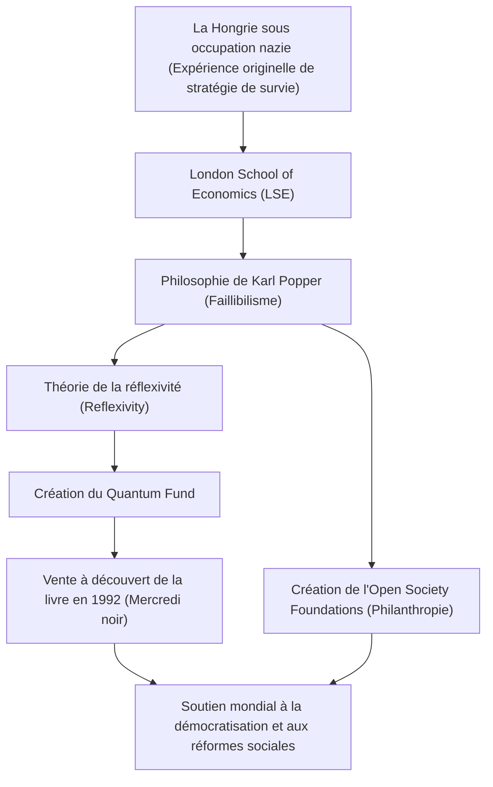

George Soros. Qu'est-ce qui vous vient à l'esprit lorsque vous entendez ce nom ? L'investisseur légendaire surnommé « l'homme qui a fait sauter la Banque d'Angleterre », ou le gigantesque philanthrope qui soutient la démocratisation dans le monde entier ? Ou peut-être encore un personnage mystérieux, cible récurrente des théories du complot.

Cependant, l'essence de Soros est celle d'un « investisseur philosophe ». En explorant sa vie, sa philosophie d'investissement et l'impact qu'il a laissé aux générations futures, nous pouvons découvrir des pistes pour survivre dans notre société moderne de plus en plus complexe. Dans cet article, nous plongerons au cœur de la vie tumultueuse de George Soros et de sa pensée.

## 1. L'expérience originelle de l'enfance et l'obsession de la « survie »

George Soros (de son vrai nom : György Schwartz) est né en 1930 à Budapest, capitale de la Hongrie, dans une famille juive aisée. Cependant, sa vie paisible a été bouleversée en 1944 lorsque l'Allemagne nazie a occupé la Hongrie.

Son père Tivadar, avocat, a falsifié les papiers d'identité de sa famille et de ses amis, prenant le pari extrêmement dangereux de se faire passer pour des chrétiens afin d'échapper aux griffes de l'Holocauste. Cette expérience cruelle a gravé dans l'esprit du jeune Soros une leçon puissante : « dans une situation extrême où les règles se sont effondrées, survivre sans se laisser enfermer dans le bon sens commun est la priorité absolue ». Cet esprit de « survie » formera plus tard le fondement de la « gestion des risques » dans son style d'investissement.

## 2. Une rencontre fatidique : Karl Popper et la « société ouverte »

Après la guerre, en 1947, Soros fuit la Hongrie, qui se communise de plus en plus, pour se rendre à Londres, en Angleterre. Tout en travaillant comme serveur et porteur de chemin de fer, il étudie à la London School of Economics (LSE), où il rencontre la philosophie qui déterminera sa vie. Il s'agit du concept de « société ouverte » (Open Society) proposé par le philosophe Karl Popper.

Dans son livre "La Société ouverte et ses ennemis", Popper critique le totalitarisme (la société close) et affirme que, sous le principe selon lequel tout être humain peut commettre des erreurs (le faillibilisme), la société souhaitable est une « société ouverte » où l'on peut se critiquer librement et corriger ses erreurs.

Soros a profondément résonné avec ce faillibilisme de Popper, selon lequel « personne ne peut saisir la vérité absolue », et en a fait la base de sa propre pensée. Plus tard, il appliquera cette philosophie à l'économie de marché pour créer sa propre « théorie de la réflexivité » (Reflexivity).

## 3. L'éveil de l'investisseur : la théorie de la réflexivité et la crise de la livre sterling

Soros, parti aux États-Unis en 1956, se distingue dans le secteur financier. En 1973, il fonde avec Jim Rogers ce qui deviendra le « Quantum Fund ». Son arme principale ici est la « théorie de la réflexivité » mentionnée précédemment.

L'économie traditionnelle considère que « le marché a toujours raison » (hypothèse de l'efficience des marchés) et que les prix se dirigent finalement vers un point d'équilibre. Cependant, Soros a fait valoir qu'il existe une boucle de rétroaction bidirectionnelle (réflexivité) : « la perception des participants au marché est toujours biaisée (erreur), cette perception biaisée affecte l'environnement réel du marché, ce qui biaise encore plus la perception des participants ». En d'autres termes, les marchés peuvent se tromper, et ces erreurs peuvent provoquer des bulles massives ou des krachs.

C'est lors de la « crise de la livre sterling » (Mercredi noir) de 1992 que cette théorie a connu un succès historique. Soros a décelé une « distorsion du marché », réalisant que la livre sterling britannique était surévaluée par rapport à sa valeur réelle par le mécanisme de taux de change européen (MCE). Il a lancé une vente à découvert sans précédent de la livre sterling, d'une valeur de 10 milliards de dollars. En conséquence, il a fait plier la Banque d'Angleterre (la banque centrale britannique) et a forcé la Grande-Bretagne à se retirer du MCE. Grâce à cette bataille, Soros a réalisé un bénéfice de plus d'un milliard de dollars et s'est fait connaître dans le monde entier comme « l'homme qui a fait sauter la Banque d'Angleterre ».

## 4. La redistribution des richesses : vers la réalisation d'une « société ouverte »

Bien que Soros ait amassé une immense fortune en tant qu'investisseur, l'acquisition de fonds n'était pour lui qu'un moyen de réaliser une « société ouverte », et non une fin en soi. En 1979, il investit ses propres actifs pour créer l'« Open Society Foundations ».

Ses activités philanthropiques ne se limitent pas à un soutien médical ou éducatif ordinaire. Son objectif était de renverser les dictatures et les régimes autoritaires, et de construire des sociétés démocratiques et diversifiées. À la fin de la guerre froide, il a accordé d'importants financements aux dissidents et intellectuels d'Europe de l'Est, contribuant grandement à l'effondrement de l'Union soviétique et à la démocratisation de l'Europe de l'Est. Du soutien au mouvement anti-apartheid de Nelson Mandela à la défense des droits des minorités et à la réforme de la politique sur les drogues de nos jours, ses domaines de soutien sont très variés.

Cependant, en raison de l'ampleur de son influence politique, il est constamment la cible de théories du complot le considérant comme un « cerveau complotant le renversement d'États ». En particulier, il est la cible de vives critiques de la part de dirigeants autoritaires, tels que le gouvernement Orbán dans son pays natal, la Hongrie. C'est aussi la preuve à quel point il est une menace pour les structures de pouvoir existantes et à quel point son engagement envers la « société ouverte » est exceptionnel.

## 5. Le message laissé par George Soros à l'époque moderne

La vie de George Soros est traversée par un puissant scepticisme affirmant qu'« il n'existe pas de réponse absolument correcte ». Que ce soit sur les marchés ou en politique, les êtres humains se trompent inévitablement. C'est précisément pour cette raison qu'une pensée flexible et des systèmes sociaux capables de reconnaître rapidement ces erreurs et de les corriger sont nécessaires — c'est la philosophie qu'il a essayé de prouver tout au long de sa vie.

À notre époque où les fausses informations (fake news) foisonnent et où l'autoritarisme semble resurgir dans diverses régions du monde, la pensée de Soros est plus importante que jamais. Chacun d'entre nous doit avoir l'humilité de se dire que « ma propre perception est peut-être erronée » et maintenir une attitude « ouverte » face aux opinions divergentes. On pourrait dire que c'est le plus grand héritage que nous a confié « l'homme qui a fait sauter la Banque d'Angleterre ».
