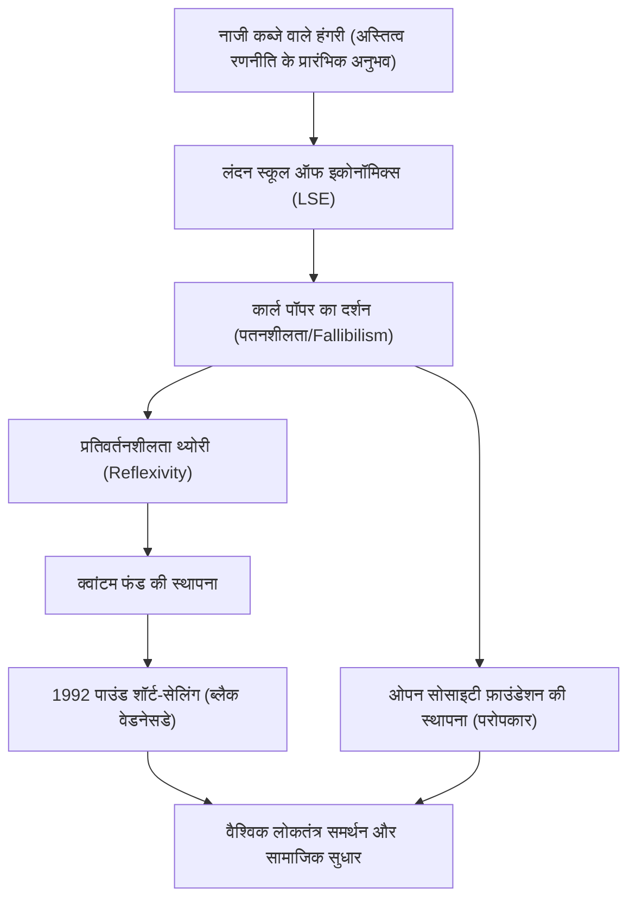

जॉर्ज सोरोस। यह नाम सुनकर आपके मन में क्या आता है? "बैंक ऑफ इंग्लैंड को तबाह करने वाले व्यक्ति" के नाम से मशहूर एक महान निवेशक, या दुनिया भर में लोकतंत्र का समर्थन करने वाले एक महान परोपकारी? या शायद एक रहस्यमयी व्यक्ति जो अक्सर साजिश के सिद्धांतों (conspiracy theories) का निशाना बनता है।

हालाँकि, सोरोस का वास्तविक रूप एक "दार्शनिक निवेशक" का है। उनके जीवन, उनके निवेश दर्शन और आने वाली पीढ़ियों पर उनके द्वारा छोड़े गए प्रभाव को समझने से हमें आज के तेजी से जटिल होते समाज में जीवित रहने के संकेत मिल सकते हैं। इस लेख में, हम जॉर्ज सोरोस के उथल-पुथल भरे जीवन और उनके विचारों के मूल को गहराई से जानेंगे।

## 1. बचपन के प्रारंभिक अनुभव और "जीवित रहने" का जुनून

जॉर्ज सोरोस (असली नाम: ग्योर्गी श्वार्ट्ज) का जन्म 1930 में हंगरी की राजधानी बुडापेस्ट में एक अमीर यहूदी परिवार में हुआ था। हालाँकि, 1944 में जब नाजी जर्मनी ने हंगरी पर कब्जा कर लिया, तो उनका शांतिपूर्ण जीवन पूरी तरह से बदल गया।

उनके पिता तिवादर, जो एक वकील थे, ने एक बहुत ही खतरनाक जोखिम उठाया: उन्होंने अपने परिवार और दोस्तों के पहचान पत्रों को जाली बनाया और प्रलय (Holocaust) से बचने के लिए उन्हें ईसाईयों के रूप में पेश किया। इस क्रूर अनुभव ने युवा सोरोस के दिमाग में एक शक्तिशाली सबक अंकित कर दिया: "उन चरम स्थितियों में जहां नियम टूट जाते हैं, सामान्य ज्ञान से बंधे बिना जीवित रहना सर्वोच्च प्राथमिकता है।" यह "जीवित रहने" की भावना बाद में उनके निवेश शैली में "जोखिम प्रबंधन (Risk Management)" का आधार बन गई।

## 2. भाग्यशाली मुलाकात: कार्ल पॉपर और "खुला समाज" (Open Society)

युद्ध के बाद 1947 में, सोरोस हंगरी से भाग गए, जहाँ साम्यवाद तेजी से बढ़ रहा था, और लंदन, इंग्लैंड चले गए। वेटर और रेलवे कुली के रूप में काम करते हुए लंदन स्कूल ऑफ इकोनॉमिक्स (LSE) में अध्ययन करते हुए, उन्हें एक ऐसे दर्शन का सामना करना पड़ा जो उनके जीवन को परिभाषित करेगा। यह दार्शनिक कार्ल पॉपर द्वारा प्रस्तावित "खुला समाज (Open Society)" की अवधारणा थी।

अपनी पुस्तक "द ओपन सोसाइटी एंड इट्स एनिमीज़" में, पॉपर ने सर्वसत्तावाद (बंद समाज) की आलोचना की और तर्क दिया कि एक "खुला समाज" वांछनीय है जहां लोग स्वतंत्र रूप से एक-दूसरे की आलोचना कर सकें और इस आधार पर गलतियों को सुधार सकें कि मनुष्य गलतियाँ करने के लिए प्रवण हैं (पतनशीलता / Fallibilism)।

सोरोस पॉपर के इस भ्रमवाद (Fallibilism) से गहराई से सहमत थे कि "कोई भी पूर्ण सत्य को नहीं समझ सकता है," और इसे अपनी सोच का आधार बनाया। बाद में उन्होंने इस दर्शन को बाजार अर्थव्यवस्था पर लागू किया और अपनी खुद की "प्रतिवर्तनशीलता थ्योरी (Reflexivity)" बनाई।

## 3. एक निवेशक के रूप में जागरण: प्रतिवर्तनशीलता थ्योरी और पाउंड संकट

1956 में संयुक्त राज्य अमेरिका जाने के बाद, सोरोस ने वित्तीय उद्योग में अपनी पहचान बनाई। 1973 में, उन्होंने जिम रोजर्स के साथ मिलकर "क्वांटम फंड" की स्थापना की। यहाँ उन्होंने जिस हथियार का इस्तेमाल किया, वह ऊपर बताई गई "प्रतिवर्तनशीलता थ्योरी" थी।

पारंपरिक अर्थशास्त्र मानता है कि "बाजार हमेशा सही होता है (कुशल बाजार परिकल्पना)" और कीमतें अंततः एक संतुलन बिंदु की ओर बढ़ती हैं। हालाँकि, सोरोस ने तर्क दिया कि एक दो-तरफा फीडबैक लूप (प्रतिवर्तनशीलता) है जहां "बाजार सहभागियों की धारणाएं हमेशा विकृत (भ्रमित) होती हैं, और वे विकृत धारणाएं वास्तविक बाजार के वातावरण को प्रभावित करती हैं, जो बदले में सहभागियों की धारणाओं को और विकृत करती हैं।" दूसरे शब्दों में, बाजार गलतियाँ कर सकता है, और ये गलतियाँ बड़े बुलबुले (bubbles) या क्रैश का कारण बन सकती हैं।

यह सिद्धांत ऐतिहासिक रूप से तब सफल हुआ जब 1992 का "पाउंड संकट (ब्लैक वेडनेसडे)" हुआ। सोरोस ने एक "बाजार की विकृति" देखी जिसमें ब्रिटिश पाउंड का मूल्यांकन यूरोपीय विनिमय दर तंत्र (ERM) द्वारा उसकी वास्तविक ताकत से अधिक किया जा रहा था। उन्होंने अभूतपूर्व $10 बिलियन के पाउंड को शॉर्ट-सेल (short-sell) किया, जिससे अंततः बैंक ऑफ इंग्लैंड (ब्रिटिश केंद्रीय बैंक) को आत्मसमर्पण करना पड़ा और ब्रिटेन को ERM छोड़ने के लिए मजबूर होना पड़ा। इस एकल व्यापार में, सोरोस ने $1 बिलियन से अधिक का लाभ कमाया और दुनिया भर में "बैंक ऑफ इंग्लैंड को तबाह करने वाले व्यक्ति" के रूप में जाने गए।

## 4. धन की वापसी: "खुले समाज" को साकार करने की दिशा में

हालाँकि सोरोस ने एक निवेशक के रूप में भारी संपत्ति बनाई, लेकिन उनके लिए धन प्राप्त करना लक्ष्य नहीं था, बल्कि "खुले समाज" को साकार करने का एक साधन मात्र था। 1979 में, उन्होंने "ओपन सोसाइटी फ़ाउंडेशन (Open Society Foundations)" स्थापित करने के लिए अपनी खुद की संपत्ति का निवेश किया।

उनके परोपकारी प्रयास सामान्य चिकित्सा या शैक्षिक सहायता तक सीमित नहीं हैं। उनका लक्ष्य तानाशाही और सत्तावादी शासनों को तोड़ना और एक लोकतांत्रिक तथा विविध समाज का निर्माण करना था। शीत युद्ध के अंत में, उन्होंने पूर्वी यूरोप में असंतुष्टों और बुद्धिजीवियों को पर्याप्त वित्तीय सहायता प्रदान की, जिससे सोवियत संघ के पतन और पूर्वी यूरोप के लोकतंत्रीकरण में बहुत बड़ा योगदान मिला। नेल्सन मंडेला के रंगभेद विरोधी आंदोलन का समर्थन करने से लेकर आधुनिक समय में अल्पसंख्यकों के अधिकारों की रक्षा करने और दवा नीति में सुधार करने तक, उनके समर्थन का क्षेत्र विविध है।

हालाँकि, उनके बड़े राजनीतिक प्रभाव के कारण, ऐसे साजिश के सिद्धांत अंतहीन हैं जो उन्हें "राज्य को उखाड़ फेंकने का लक्ष्य रखने वाले मास्टरमाइंड" के रूप में देखते हैं। विशेष रूप से, वह सत्तावादी नेताओं से तीव्र आलोचना का लक्ष्य रहे हैं, जैसे कि उनके गृह देश हंगरी में ओर्बन सरकार। यह इस बात का भी प्रमाण है कि वह मौजूदा सत्ता संरचनाओं के लिए कितना बड़ा खतरा हैं और "खुले समाज" के प्रति उनका समर्पण कितना असाधारण है।

## 5. जॉर्ज सोरोस द्वारा आज के लिए छोड़ा गया संदेश

जॉर्ज सोरोस का जीवन एक गहन संदेहवाद से ओत-प्रोत है कि "पूर्ण सही उत्तर जैसी कोई चीज नहीं है।" चाहे वह बाजार में हो या राजनीति में, इंसान हमेशा गलतियाँ करता है। इसीलिए एक लचीली सोच और सामाजिक व्यवस्था की आवश्यकता है जो उन गलतियों को तुरंत पहचान सके और सुधार सके - यही वह दर्शन है जिसे उन्होंने अपने पूरे जीवन में साबित करने की कोशिश की।

आज के युग में जहाँ फर्जी खबरें (fake news) उड़ रही हैं और दुनिया भर में सत्तावाद फिर से बढ़ रहा है, सोरोस के विचार पहले से कहीं अधिक महत्वपूर्ण हो गए हैं। हममें से प्रत्येक को यह विनम्रता रखनी चाहिए कि "मेरी धारणा गलत हो सकती है" और अलग-अलग राय के प्रति "खुला" रवैया बनाए रखना चाहिए। यही वह सबसे बड़ी विरासत है जो "बैंक ऑफ इंग्लैंड को तबाह करने वाले व्यक्ति" ने हमें सौंपी है।
