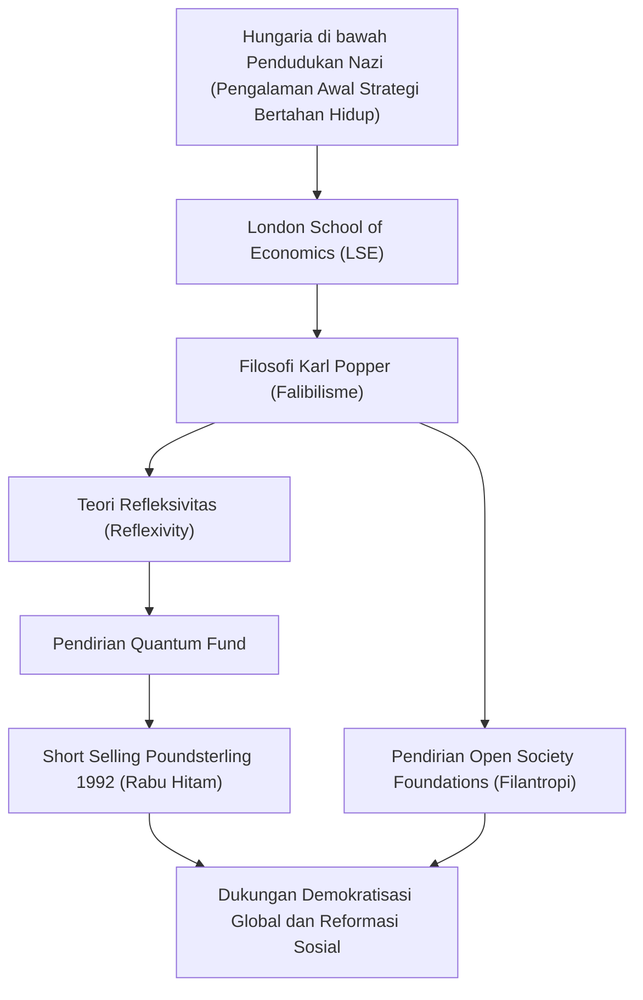

George Soros. Mendengar nama ini, apa yang terlintas dalam pikiran Anda? Apakah ia seorang investor legendaris yang dijuluki "Pria yang Menghancurkan Bank of England", atau seorang filantropis besar yang mendukung demokratisasi di seluruh dunia? Atau mungkin, ia adalah sosok misterius yang sering menjadi sasaran teori konspirasi.

Namun, esensi sejati dari Soros adalah seorang "investor filosofis". Dengan mengungkap kehidupan, filosofi investasinya, serta pengaruh yang ia tinggalkan bagi generasi mendatang, kita dapat menemukan petunjuk untuk bertahan hidup di masyarakat modern yang semakin kompleks. Artikel ini akan menelusuri kehidupan George Soros yang penuh gejolak serta inti dari pemikirannya.

## 1. Pengalaman Masa Kecil dan Tekad Kuat untuk "Bertahan Hidup"

George Soros (nama asli: Schwartz György) lahir pada tahun 1930 di keluarga Yahudi yang kaya di Budapest, ibu kota Hungaria. Namun, pada tahun 1944, kehidupannya yang damai berubah drastis ketika Jerman Nazi menduduki Hungaria.

Ayahnya, Tivadar, yang merupakan seorang pengacara, mengambil pertaruhan yang sangat berbahaya dengan memalsukan kartu identitas keluarga dan teman-temannya serta menyamar sebagai orang Kristen agar bisa lolos dari cengkeraman maut Holocaust. Pengalaman yang keras inilah yang menanamkan pelajaran yang sangat kuat pada Soros muda bahwa "dalam kondisi ekstrem di mana aturan telah runtuh, bertahan hidup tanpa terikat pada akal sehat adalah prioritas utama." Semangat untuk "bertahan hidup" ini kemudian membentuk inti dari "manajemen risiko" dalam gaya investasinya.

## 2. Pertemuan Takdir: Karl Popper dan "Masyarakat Terbuka"

Setelah perang pada tahun 1947, Soros melarikan diri dari Hungaria yang semakin komunis dan pindah ke London, Inggris. Sembari bekerja sebagai pelayan dan kuli angkut kereta api, ia belajar di London School of Economics (LSE), di mana ia menemukan filosofi yang akan menentukan jalan hidupnya. Filosofi tersebut adalah konsep "Masyarakat Terbuka" (Open Society) yang dikemukakan oleh filsuf Karl Popper.

Dalam bukunya "Masyarakat Terbuka dan Musuh-musuhnya", Popper mengkritik totalitarianisme (masyarakat tertutup) dan berpendapat bahwa, di bawah premis bahwa semua manusia bisa melakukan kesalahan (falibilisme), sebuah "masyarakat terbuka" di mana orang-orang bebas untuk saling mengkritik dan memperbaiki kesalahan adalah yang paling ideal.

Soros sangat bersimpati dengan falibilisme (Fallibilism) Popper yang menyatakan bahwa "tidak ada seorang pun yang dapat memahami kebenaran absolut", dan menjadikannya sebagai dasar pemikirannya. Ia kemudian menerapkan filosofi ini pada ekonomi pasar, yang melahirkan "Teori Refleksivitas" (Reflexivity) miliknya yang unik.

## 3. Kebangkitan sebagai Investor: Teori Refleksivitas dan Krisis Pound

Setelah pindah ke Amerika Serikat pada tahun 1956, Soros mulai menonjol di industri keuangan. Pada tahun 1973, bersama dengan Jim Rogers, ia mendirikan apa yang kemudian dikenal sebagai "Quantum Fund". Di sinilah senjata utamanya adalah "Teori Refleksivitas" yang disebutkan sebelumnya.

Ilmu ekonomi tradisional menyatakan bahwa "pasar selalu benar (hipotesis pasar efisien)", dan percaya bahwa harga pada akhirnya akan bergerak menuju titik keseimbangan. Namun, Soros berpendapat bahwa terdapat putaran umpan balik dua arah (refleksivitas) di mana "persepsi pelaku pasar selalu terdistorsi (kesalahan), dan persepsi yang terdistorsi tersebut memengaruhi lingkungan pasar yang sebenarnya, yang selanjutnya akan semakin mendistorsi persepsi para pelaku pasar". Dengan kata lain, pasar bisa saja salah, dan kesalahan itu bisa memicu gelembung atau keruntuhan yang besar.

Teori ini mencapai kesuksesan historis yang besar pada "Krisis Poundsterling (Rabu Hitam)" tahun 1992. Soros melihat adanya "distorsi pasar" di mana mata uang Inggris, Poundsterling, dinilai terlalu tinggi secara tidak wajar oleh Mekanisme Nilai Tukar Eropa (ERM). Ia melakukan aksi jual kosong (short selling) mata uang Pound dalam skala yang belum pernah terjadi sebelumnya sebesar 10 miliar dolar, yang pada akhirnya menundukkan Bank of England (bank sentral Inggris) dan memaksa Inggris untuk keluar dari ERM. Melalui pertempuran ini, Soros meraup keuntungan lebih dari 1 miliar dolar, dan namanya bergema di seluruh dunia sebagai "Pria yang Menghancurkan Bank of England".

## 4. Pengembalian Kekayaan: Menuju Pencapaian "Masyarakat Terbuka"

Meskipun ia mengumpulkan kekayaan yang sangat besar sebagai seorang investor, bagi Soros, memperoleh uang bukanlah tujuan akhir, melainkan hanya sarana untuk mewujudkan "masyarakat terbuka". Pada tahun 1979, ia menginvestasikan kekayaannya sendiri untuk mendirikan "Open Society Foundations".

Kegiatan filantropinya tidak terbatas pada dukungan medis dan pendidikan pada umumnya. Tujuannya adalah untuk menggulingkan rezim diktator dan otoriter, serta membangun masyarakat yang demokratis dan beragam. Pada akhir Perang Dingin, ia memberikan bantuan keuangan dalam jumlah besar kepada kelompok pembangkang dan intelektual di Eropa Timur, yang memberikan kontribusi signifikan terhadap runtuhnya Uni Soviet dan demokratisasi di Eropa Timur. Lingkup dukungannya sangat luas, mulai dari mendukung gerakan anti-apartheid Nelson Mandela hingga membela hak-hak minoritas saat ini, serta reformasi kebijakan narkoba.

Namun, karena besarnya pengaruh politiknya, tak henti-hentinya muncul teori konspirasi yang menganggapnya sebagai "dalang yang ingin menggulingkan negara". Secara khusus, ia telah menjadi sasaran kritik tajam dari para pemimpin otoriter, seperti pemerintahan Orbán di negara asalnya, Hungaria. Hal ini juga merupakan cerminan dari betapa besarnya ancaman yang ia berikan terhadap struktur kekuasaan yang ada, serta betapa luar biasa dedikasinya terhadap sebuah "masyarakat terbuka".

## 5. Pesan yang Ditinggalkan George Soros untuk Era Modern

Kehidupan George Soros diwarnai dengan skeptisisme yang kuat bahwa "tidak ada yang namanya jawaban yang mutlak benar". Baik di pasar maupun dalam politik, manusia pasti membuat kesalahan. Oleh karena itu, diperlukan pemikiran dan sistem sosial yang fleksibel yang dapat segera mengakui dan memperbaiki kesalahan-kesalahan tersebut——inilah filosofi yang coba ia buktikan sepanjang hidupnya.

Di era modern ini, di mana berita palsu (fake news) merajalela dan otoritarianisme kembali bangkit di berbagai belahan dunia, pemikiran Soros menjadi lebih penting dari sebelumnya. Kita masing-masing harus memiliki kerendahan hati untuk mengakui bahwa "pemahaman kita mungkin saja salah", dan terus mempertahankan sikap "terbuka" terhadap berbagai pendapat yang berbeda. Hal itu mungkin dapat dikatakan sebagai warisan terbesar yang dipercayakan kepada kita oleh "Pria yang Menghancurkan Bank of England".
