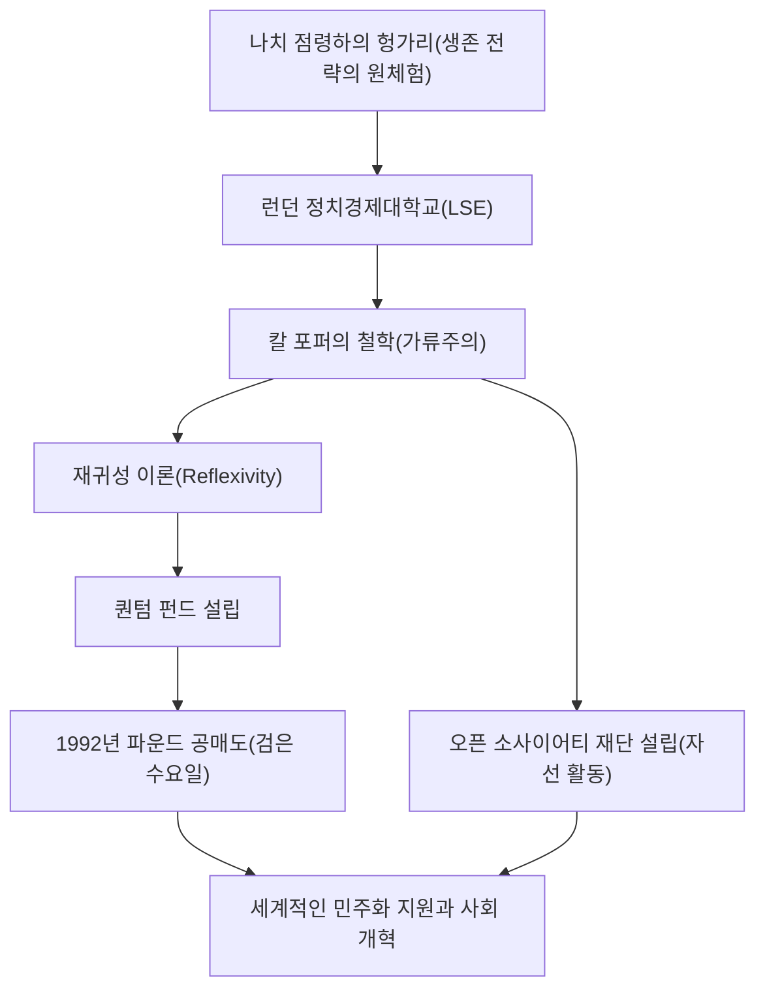

조지 소로스. 이 이름을 들으면 여러분은 무엇을 떠올리시나요? "영란은행을 무너뜨린 사나이"라는 이명을 가진 전설적인 투자자, 혹은 전 세계에서 민주화 지원을 하는 거대한 자선가일까요? 나아가 음모론의 표적으로 이야기되는 수수께끼에 싸인 인물일지도 모릅니다.

하지만 소로스의 본질은 "철학하는 투자자"입니다. 그의 생애와 투자 철학, 그리고 후세에 남긴 영향을 풀어봄으로써 복잡해지는 현대 사회를 살아남기 위한 힌트를 엿볼 수 있습니다. 본 기사에서는 조지 소로스의 파란만장한 생애와 그 사상의 핵심에 다가갑니다.

## 1. 유년기의 원체험과 "살아남는" 것에 대한 집념

조지 소로스(본명: 슈바르츠 죄르지)는 1930년 헝가리의 수도 부다페스트의 유복한 유대인 가정에서 태어났습니다. 하지만 1944년 나치 독일이 헝가리를 점령하면서 그의 평온한 일상은 순식간에 뒤바뀝니다.

변호사였던 아버지 티바다르는 가족과 친구들의 신분증을 위조하여 기독교인으로 위장함으로써 홀로코스트의 마수에서 벗어난다는 극히 위험한 도박을 감행했습니다. 이 가혹한 체험이야말로 젊은 소로스에게 "규칙이 붕괴된 극한 상태에서는 상식에 얽매이지 않고 살아남는 것이야말로 최우선이다"라는 강렬한 교훈을 새겨주었습니다. 이 "살아남는다"는 생존 정신은 이후 그의 투자 스타일에 있어 "리스크 관리"의 근간을 형성하게 됩니다.

## 2. 운명적인 만남: 칼 포퍼와 "열린 사회"

전후 1947년, 소로스는 공산화가 진행되던 헝가리를 탈출해 영국 런던으로 건너갑니다. 웨이터나 철도 짐꾼으로 일하며 런던 정치경제대학교(LSE)에서 배움을 이어나간 그는, 이곳에서 자신의 인생을 결정짓는 철학과 만납니다. 그것이 바로 철학자 칼 포퍼가 주창한 "열린 사회(Open Society)"라는 개념입니다.

포퍼는 저서 『열린 사회와 그 적들』에서 전체주의(닫힌 사회)를 비판하며, 인간은 누구나 오류를 범한다는 전제(가류주의) 아래 자유롭게 서로 비판하고 오류를 수정할 수 있는 "열린 사회"야말로 바람직하다고 역설했습니다.

소로스는 이 "누구도 절대적인 진리를 파악할 수 없다"는 포퍼의 가류주의(Fallibilism)에 깊이 공감하고 이를 자신의 사고의 기반으로 삼았습니다. 그는 훗날 이 철학을 시장 경제에 적용하여 독자적인 "재귀성 이론(Reflexivity)"을 만들어내게 됩니다.

## 3. 투자자로서의 각성: 재귀성 이론과 파운드 위기

1956년 미국으로 건너간 소로스는 금융계에서 두각을 나타냅니다. 1973년에는 짐 로저스와 함께 훗날의 "퀀텀 펀드"를 설립합니다. 여기서 그가 무기로 삼은 것이 앞서 언급한 "재귀성 이론"입니다.

전통적인 경제학은 "시장은 항상 옳다(효율적 시장 가설)"고 보며, 가격은 최종적으로 균형점을 향한다고 생각합니다. 하지만 소로스는 "시장 참여자의 인식은 항상 왜곡되어 있으며(오류), 그 왜곡된 인식이 실제 시장 환경에 영향을 미치고, 그것이 다시 참여자의 인식을 왜곡시킨다"는 쌍방향의 피드백 루프(재귀성)가 존재한다고 주장했습니다. 즉, 시장은 실수할 수 있으며 그 실수가 거대한 버블이나 붕괴를 일으킨다는 것입니다.

이 이론이 역사적인 대성공을 거둔 것이 1992년의 "파운드 위기(검은 수요일)"입니다. 소로스는 영국의 통화인 파운드화가 유럽 환율 메커니즘(ERM)에 의해 실력 이상으로 과대평가되어 있다는 "시장의 왜곡"을 간파했습니다. 그는 100억 달러 규모라는 전대미문의 파운드화 공매도를 걸었고, 결과적으로 영란은행(영국의 중앙은행)을 굴복시키며 영국을 ERM에서 이탈하도록 몰아넣었습니다. 이 한 번의 전투로 소로스는 10억 달러 이상의 이익을 올리며 "영란은행을 무너뜨린 사나이"로서 전 세계에 그 이름을 떨쳤습니다.

## 4. 부의 환원: "열린 사회"의 실현을 향해

투자자로서 막대한 부를 쌓은 소로스이지만, 그에게 자금의 획득은 목적이 아니라 "열린 사회"를 실현하기 위한 수단에 불과했습니다. 1979년, 그는 자신의 자산을 털어 "오픈 소사이어티 재단(Open Society Foundations)"을 설립합니다.

그의 자선 활동은 일반적인 의료 지원이나 교육 지원에 그치지 않습니다. 그의 목적은 독재 정권이나 권위주의적인 체제를 타파하고 민주적이고 다양성 있는 사회를 구축하는 것이었습니다. 냉전 말기에는 동유럽의 반체제 인사나 지식인들에게 막대한 자금을 지원하여 소련의 붕괴와 동유럽의 민주화에 지대한 공헌을 했습니다. 넬슨 만델라의 반아파르트헤이트 운동 지원부터 현대의 소수자 권리 옹호, 마약 정책의 개혁까지 그 지원 영역은 다방면에 걸쳐 있습니다.

하지만 그 정치적인 영향력의 크기로 인해 그를 "국가 전복을 노리는 흑막"으로 간주하는 음모론이 끊이지 않습니다. 특히 모국 헝가리의 오르반 정권 등 권위주의적인 지도자들로부터는 거센 비판의 표적이 되고 있습니다. 이는 그가 기존 권력 구조에 얼마나 위협적인 존재인지, 그리고 "열린 사회"를 향한 진정성이 얼마나 남다른지에 대한 반증이기도 합니다.

## 5. 조지 소로스가 현대에 남기는 메시지

조지 소로스의 생애는 "절대적인 정답 따위는 존재하지 않는다"라는 강렬한 회의주의로 관통되어 있습니다. 시장에서도, 정치에서도 인간은 반드시 실수한다. 그렇기 때문에 그 실수를 신속하게 인정하고 수정할 수 있는 유연한 사고와 사회 시스템이 필요하다——이것이야말로 그가 자신의 인생을 통해 증명하고자 했던 철학입니다.

가짜 뉴스가 난무하고 세계 각지에서 다시 권위주의가 대두되고 있는 현대에, 소로스의 사상은 그 어느 때보다 중요성을 더하고 있습니다. 우리 한 사람 한 사람이 "나의 인식은 틀렸을지도 모른다"는 겸허함을 가지고, 다른 의견에 대해 "열린" 태도를 계속해서 유지하는 것. 그것이야말로 "영란은행을 무너뜨린 사나이"가 우리에게 맡긴 최대의 유산이라 할 수 있을 것입니다.
