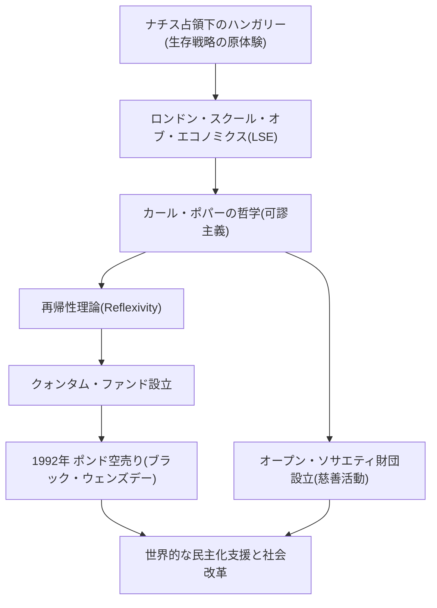

ジョージ・ソロス。この名前を聞いて、皆さんは何を思い浮かべるでしょうか。「イングランド銀行を潰した男」という異名を持つ伝説的な投資家か、あるいは世界中で民主化支援を行う巨大な慈善家か。さらには、陰謀論の標的として語られる謎多き人物かもしれません。

しかし、ソロスの本質は「哲学する投資家」です。彼の生涯や投資哲学、そして後世に遺した影響を紐解くことで、複雑化する現代社会を生き抜くためのヒントが見えてきます。本記事では、ジョージ・ソロスの波乱に満ちた生涯とその思想の核心に迫ります。

## 1. 幼少期の原体験と「生き残る」ことへの執念

ジョージ・ソロス（本名：シュヴァルツ・ジェルジ）は1930年、ハンガリーの首都ブダペストの裕福なユダヤ人家庭に生まれました。しかし、1944年にナチス・ドイツがハンガリーを占領したことで、彼の平穏な生活は一変します。

弁護士であった父ティヴァダルは、家族や友人たちの身分証明書を偽造し、キリスト教徒を装うことでホロコーストの魔の手から逃れるという極めて危険な賭けに出ました。この過酷な体験こそが、若きソロスに「ルールの崩壊した極限状態では、常識に囚われず生き残ることこそが最優先である」という強烈な教訓を刻み込みました。この「生き残る」というサバイバル精神は、後の彼の投資スタイルにおける「リスク管理」の根幹を形成することになります。

## 2. 運命の出会い：カール・ポパーと「開かれた社会」

戦後の1947年、ソロスは共産主義化が進むハンガリーを脱出し、イギリスのロンドンへと渡ります。ウェイターや鉄道のポーターとして働きながらロンドン・スクール・オブ・エコノミクス（LSE）で学んだ彼は、ここで自らの人生を決定づける哲学と出会います。それが、哲学者カール・ポパーの提唱した「開かれた社会（Open Society）」という概念です。

ポパーは著書『開かれた社会とその敵』の中で、全体主義（閉ざされた社会）を批判し、人間は誰しも誤りを犯すという前提（可謬主義）の下、自由に批判し合い、間違いを修正できる「開かれた社会」こそが望ましいと説きました。

ソロスはこの「誰も絶対的な真理を把握することはできない」というポパーの可謬主義（Fallibilism）に深く共鳴し、これを自身の思考のベースに据えました。彼は後に、この哲学を市場経済に適用し、独自の「再帰性理論（Reflexivity）」を生み出すことになります。

## 3. 投資家としての覚醒：再帰性理論とポンド危機

1956年にアメリカへ渡ったソロスは、金融業界で頭角を現します。1973年にはジム・ロジャーズと共に後の「クォンタム・ファンド」を設立。ここで彼が武器としたのが、前述の「再帰性理論」です。

伝統的な経済学は「市場は常に正しい（効率的市場仮説）」とし、価格は最終的に均衡点に向かうと考えます。しかしソロスは、「市場参加者の認識は常に歪んでおり（誤謬）、その歪んだ認識が実際の市場環境に影響を与え、それがさらに参加者の認識を歪ませる」という双方向のフィードバックループ（再帰性）が存在すると主張しました。つまり、市場は間違えることがあり、その間違いが巨大なバブルや崩壊を引き起こすというのです。

この理論が歴史的な大成功を収めたのが、1992年の「ポンド危機（ブラック・ウェンズデー）」です。ソロスは、イギリスの通貨ポンドがヨーロッパの通貨制度（ERM）によって実力以上に過大評価されているという「市場の歪み」を見抜きました。彼は100億ドル規模という前代未聞のポンドの空売りを仕掛け、結果としてイングランド銀行（英国の中央銀行）を屈服させ、イギリスをERMから離脱に追い込みました。この一戦でソロスは10億ドル以上の利益を上げ、「イングランド銀行を潰した男」として世界にその名を轟かせました。

## 4. 富の還元：「開かれた社会」の実現に向けて

投資家として莫大な富を築いたソロスですが、彼にとって資金の獲得は目的ではなく、「開かれた社会」を実現するための手段に過ぎませんでした。1979年、彼は自身の資産を投じて「オープン・ソサエティ財団（Open Society Foundations）」を設立します。

彼の慈善活動は、一般的な医療支援や教育支援にとどまりません。彼の目的は、独裁政権や権威主義的な体制を打破し、民主的で多様性のある社会を構築することでした。冷戦末期には、東欧の反体制派や知識人に多額の資金援助を行い、ソ連の崩壊や東欧の民主化に多大な貢献を果たしました。ネルソン・マンデラの反アパルトヘイト運動の支援から、現代におけるマイノリティの権利擁護、麻薬政策の改革まで、その支援領域は多岐にわたります。

しかし、その政治的な影響力の大きさから、彼を「国家の転覆を狙う黒幕」と見なす陰謀論が絶えません。特に、母国ハンガリーのオルバーン政権など、権威主義的な指導者たちからは激しい批判の的となっています。これは、彼がいかに既存の権力構造にとって脅威であり、「開かれた社会」への本気度が並外れているかの裏返しでもあります。

## 5. ジョージ・ソロスが現代に残すメッセージ

ジョージ・ソロスの生涯は、「絶対的な正解など存在しない」という強烈な懐疑主義に貫かれています。市場においても、政治においても、人間は必ず間違える。だからこそ、その間違いを速やかに認め、修正できる柔軟な思考と社会システムが必要である——これこそが、彼が自らの人生を通じて証明しようとした哲学です。

フェイクニュースが飛び交い、世界各地で再び権威主義が台頭しつつある現代において、ソロスの思想はかつてなく重要性を増しています。私たち一人一人が「自分の認識は間違っているかもしれない」という謙虚さを持ち、異なる意見に対して「開かれた」態度を維持し続けること。それこそが、「イングランド銀行を潰した男」が私たちに託した最大の遺産と言えるでしょう。
