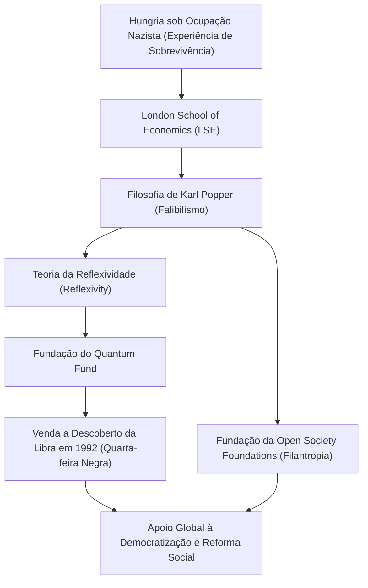

George Soros. O que vem à sua mente quando ouve esse nome? O lendário investidor conhecido como "O Homem que Quebrou o Banco da Inglaterra", ou talvez o gigante filantropo que apoia a democratização ao redor do mundo. Ou ainda, ele pode ser a figura misteriosa frequentemente visada por teorias da conspiração.

No entanto, a verdadeira essência de Soros é a de um "investidor filosófico". Ao desvendar sua vida, sua filosofia de investimento e o impacto que ele deixou para as gerações futuras, podemos encontrar dicas para sobreviver na sociedade moderna e cada vez mais complexa. Neste artigo, exploraremos a vida turbulenta de George Soros e o cerne de seus pensamentos.

## 1. Experiência de Infância e a Obsessão por "Sobreviver"

George Soros (nascido György Schwartz) nasceu em 1930 em uma família judia rica em Budapeste, a capital da Hungria. No entanto, sua vida pacífica mudou drasticamente em 1944, quando a Alemanha nazista ocupou a Hungria.

Seu pai, Tivadar, que era advogado, assumiu o risco extremo de falsificar documentos de identidade para a família e amigos, fingindo que eram cristãos para escapar das garras do Holocausto. Essa experiência dura gravou uma lição poderosa no jovem Soros: "Em condições extremas onde as regras desmoronam, sobreviver pensando fora da caixa é a prioridade máxima." Esse espírito de sobrevivência formaria mais tarde a base da "gestão de risco" em seu estilo de investimento.

## 2. O Encontro Predestinado: Karl Popper e a "Sociedade Aberta"

Em 1947, após a guerra, Soros fugiu da Hungria, que estava se tornando cada vez mais comunista, e mudou-se para Londres, Inglaterra. Enquanto trabalhava como garçom e carregador de trem e estudava na London School of Economics (LSE), ele encontrou a filosofia que definiria sua vida. Esse foi o conceito de "Sociedade Aberta" (Open Society) proposto pelo filósofo Karl Popper.

Em seu livro "A Sociedade Aberta e Seus Inimigos", Popper criticou o totalitarismo (sociedade fechada) e argumentou que, sob a premissa de que todo ser humano comete erros (falibilismo), uma "sociedade aberta" onde as pessoas podem criticar livremente umas às outras e corrigir erros é o ideal.

Soros ressoou profundamente com o falibilismo (Fallibilism) de Popper de que "ninguém pode compreender a verdade absoluta", e o colocou como a base de seu próprio pensamento. Mais tarde, ele aplicou essa filosofia à economia de mercado, criando sua própria "Teoria da Reflexividade" (Reflexivity).

## 3. Despertar como Investidor: Teoria da Reflexividade e a Crise da Libra

Soros, que se mudou para os Estados Unidos em 1956, ganhou destaque no setor financeiro. Em 1973, ele e Jim Rogers fundaram o que mais tarde se tornaria o "Quantum Fund". A arma que ele usou aqui foi a já mencionada "Teoria da Reflexividade".

A economia tradicional assume que "o mercado está sempre certo (Hipótese de Mercado Eficiente)" e que os preços eventualmente convergem para um ponto de equilíbrio. No entanto, Soros argumentou que existe um ciclo de feedback bidirecional (reflexividade): "As percepções dos participantes do mercado estão sempre distorcidas (falácia), e essas percepções distorcidas afetam o ambiente real do mercado, o que, por sua vez, distorce ainda mais as percepções dos participantes." Em outras palavras, o mercado pode cometer erros, e esses erros podem causar bolhas maciças e quedas.

A teoria alcançou um enorme sucesso histórico na "Crise da Libra (Quarta-feira Negra)" em 1992. Soros percebeu uma "distorção de mercado" onde a libra esterlina estava supervalorizada além de seu valor real devido ao Mecanismo de Taxas de Câmbio Europeu (ERM). Ele executou uma venda a descoberto sem precedentes da libra de 10 bilhões de dólares, forçando o Banco da Inglaterra (o banco central do Reino Unido) a se render e forçando o Reino Unido a se retirar do ERM. Com essa batalha, Soros obteve um lucro de mais de 1 bilhão de dólares e tornou-se mundialmente famoso como "O Homem que Quebrou o Banco da Inglaterra".

## 4. Retorno da Riqueza: Rumo à Realização de uma "Sociedade Aberta"

Embora Soros tenha acumulado uma enorme riqueza como investidor, adquirir fundos não era seu objetivo, mas sim apenas um meio de realizar uma "sociedade aberta". Em 1979, ele usou sua própria riqueza para fundar a "Open Society Foundations".

Suas atividades filantrópicas vão muito além do apoio geral médico e educacional. Seu objetivo era derrubar ditaduras e regimes autoritários e construir uma sociedade democrática e diversificada. No final da Guerra Fria, ele forneceu financiamento substancial a dissidentes e intelectuais na Europa Oriental, contribuindo enormemente para o colapso da União Soviética e a democratização da Europa Oriental. Desde o apoio ao movimento anti-apartheid de Nelson Mandela até a defesa dos direitos das minorias modernas e a reforma da política de drogas, suas áreas de apoio são vastas e diversas.

No entanto, devido ao tamanho de sua influência política, as teorias da conspiração frequentemente o veem como "a mente por trás das tentativas de derrubar o estado". Em particular, ele tem sido alvo de críticas ferozes de líderes autoritários, como o governo de Orbán em sua terra natal, a Hungria. Este é também o outro lado de como ele é uma ameaça às estruturas de poder existentes e o quão extraordinário é o seu compromisso com uma "sociedade aberta".

## 5. A Mensagem que George Soros Deixa para a Atualidade

A vida de George Soros é permeada por um forte ceticismo de que "não existe uma resposta absolutamente correta". Seja no mercado ou na política, os humanos inevitavelmente cometerão erros. É por isso que é necessário um sistema social e de pensamento flexível que possa reconhecer e corrigir prontamente esses erros - essa é a filosofia que ele tentou provar ao longo de sua vida.

Em nossa era moderna, onde as notícias falsas são desenfreadas e o autoritarismo está aumentando novamente em todo o mundo, as ideias de Soros são mais importantes do que nunca. É essencial que cada um de nós mantenha a humildade de que "minha percepção pode estar errada" e continue a manter uma atitude "aberta" a diferentes opiniões. Esse pode ser o maior legado deixado para nós por "O Homem que Quebrou o Banco da Inglaterra".
