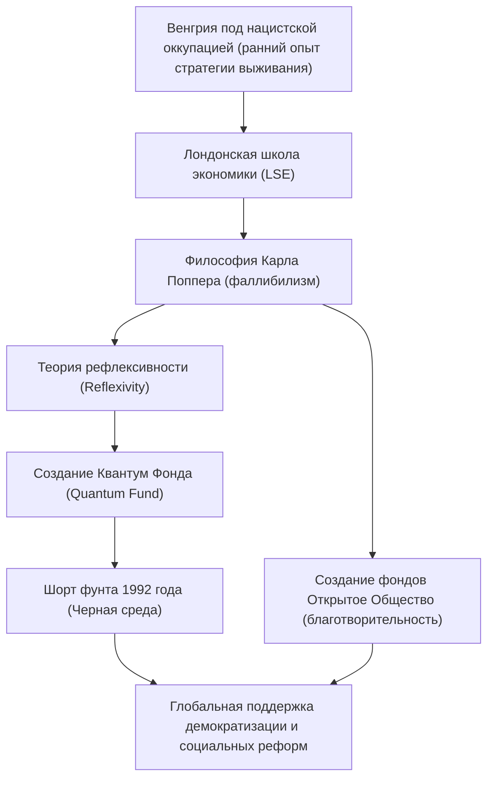

Джордж Сорос. Что приходит вам на ум, когда вы слышите это имя? Легендарный инвестор, прозванный «человеком, сломавшим Банк Англии», или гигантский филантроп, поддерживающий демократизацию по всему миру? А может быть, это загадочная фигура, о которой говорят как о мишени теорий заговора.

Однако суть Сороса — это «философствующий инвестор». Изучение его жизни, инвестиционной философии и влияния, которое он оставил будущим поколениям, дает подсказки о том, как выжить в нашем все более сложном современном обществе. В этой статье мы раскроем суть бурной жизни Джорджа Сороса и его идей.

## 1. Ранний опыт и одержимость «выживанием»

Джордж Сорос (настоящее имя: Дьёрдь Шварц) родился в 1930 году в богатой еврейской семье в столице Венгрии Будапеште. Однако его мирная жизнь резко изменилась, когда нацистская Германия оккупировала Венгрию в 1944 году.

Его отец Тивадар, адвокат, пошел на крайне опасную авантюру: он подделал документы для своей семьи и друзей, чтобы они могли выдать себя за христиан и спастись от лап Холокоста. Именно этот суровый опыт запечатлел в молодом Соросе сильный урок: «В экстремальных ситуациях, когда правила рушатся, выживание любыми средствами, не ограничиваясь здравым смыслом, является главным приоритетом». Этот дух выживания позже сформирует основу «управления рисками» в его инвестиционном стиле.

## 2. Судьбоносная встреча: Карл Поппер и «Открытое общество»

В 1947 году, после войны, Сорос покинул Венгрию, которая становилась все более коммунистической, и переехал в Лондон, Великобритания. Работая официантом и железнодорожным носильщиком, он учился в Лондонской школе экономики (LSE), где познакомился с философией, которая определила всю его жизнь. Это была концепция «Открытого общества» (Open Society), предложенная философом Карлом Поппером.

В своей книге «Открытое общество и его враги» Поппер критиковал тоталитаризм (закрытое общество) и утверждал, что «открытое общество», где люди могут свободно критиковать друг друга и исправлять ошибки, является предпочтительным, исходя из того, что все люди могут ошибаться (фаллибилизм).

Сорос глубоко резонировал с попперовским фаллибилизмом — идеей о том, что «никто не может постичь абсолютную истину» — и сделал это основой своего мышления. Позже он применил эту философию к рыночной экономике, создав свою собственную «Теорию рефлексивности» (Reflexivity).

## 3. Пробуждение инвестора: Теория рефлексивности и кризис фунта

Переехав в Америку в 1956 году, Сорос приобрел известность в финансовой индустрии. В 1973 году вместе с Джимом Роджерсом он основал то, что впоследствии стало «Квантум Фондом» (Quantum Fund). Здесь его главным оружием стала вышеупомянутая «Теория рефлексивности».

Традиционная экономика утверждает, что «рынок всегда прав» (гипотеза эффективного рынка), и считает, что цены в конечном итоге стремятся к точке равновесия. Однако Сорос утверждал, что существует двусторонняя петля обратной связи (рефлексивность): «восприятие участников рынка всегда искажено (ошибочно), и это искаженное восприятие влияет на реальную рыночную среду, что еще больше искажает восприятие участников». Другими словами, рынки могут ошибаться, и эти ошибки вызывают гигантские пузыри или крахи.

Историческим и грандиозным успехом этой теории стал «кризис фунта стерлингов» (Черная среда) 1992 года. Сорос разглядел «искажение рынка»: британский фунт был сильно переоценен европейской валютной системой (ERM). Он открыл беспрецедентную короткую позицию по фунту на сумму 10 миллиардов долларов, в результате чего Банк Англии (центральный банк Великобритании) сдался и заставил Британию выйти из ERM. В этой битве Сорос заработал более 1 миллиарда долларов и прославился на весь мир как «человек, сломавший Банк Англии».

## 4. Возврат богатства: На пути к реализации «Открытого общества»

Хотя Сорос накопил огромное состояние как инвестор, приобретение средств было для него не целью, а лишь средством для реализации «Открытого общества». В 1979 году он вложил собственные средства в создание «Фондов Открытое Общество» (Open Society Foundations).

Его благотворительная деятельность выходит за рамки обычной медицинской и образовательной поддержки. Его цель состояла в том, чтобы разрушить диктатуры и авторитарные режимы и построить демократические и разнообразные общества. В конце холодной войны он оказывал значительную финансовую поддержку диссидентам и интеллектуалам в Восточной Европе, внеся огромный вклад в распад Советского Союза и демократизацию Восточной Европы. Сферы его поддержки разнообразны: от поддержки движения Нельсона Манделы против апартеида до защиты прав меньшинств в современном мире и реформирования политики в отношении наркотиков.

Однако из-за его огромного политического влияния не прекращаются теории заговора, которые считают его «теневым кукловодом, стремящимся к свержению государств». Он стал мишенью ожесточенной критики со стороны авторитарных лидеров, в частности режима Орбана в его родной Венгрии. Это также является оборотной стороной того, насколько велика его угроза для существующих структур власти и насколько экстраординарна его приверженность «Открытому обществу».

## 5. Послание Джорджа Сороса современности

Вся жизнь Джорджа Сороса пронизана сильным скептицизмом: «абсолютно правильного ответа не существует». Люди неизбежно совершают ошибки, как на рынке, так и в политике. Именно поэтому нам необходимо гибкое мышление и социальная система, которая может быстро признавать и исправлять эти ошибки — это и есть та философия, которую он пытался доказать всей своей жизнью.

В наше время, когда распространяются фейковые новости и по всему миру вновь поднимает голову авторитаризм, идеи Сороса важны как никогда. Каждый из нас должен иметь скромность признать, что «мое собственное восприятие может быть ошибочным», и сохранять «открытое» отношение к отличным мнениям. Можно сказать, что это величайшее наследие, которое оставил нам «человек, сломавший Банк Англии».
