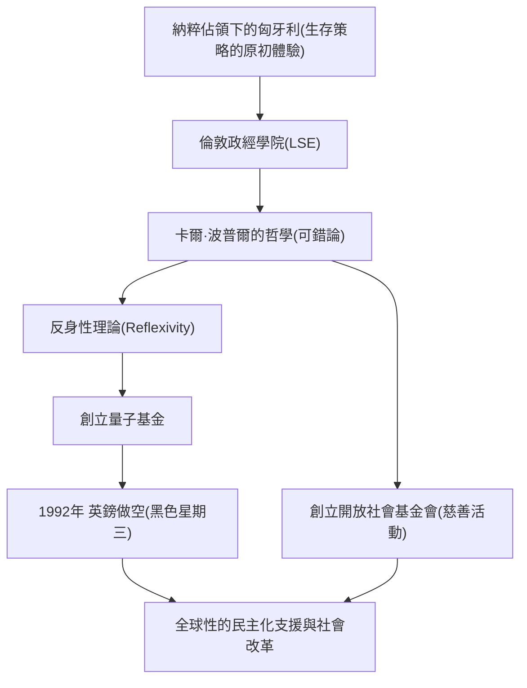

喬治·索羅斯。聽到這個名字，大家會想到什麼？是有著「擊垮英格蘭銀行的男人」異名的傳奇投資家，還是在世界各地支援民主化的巨大慈善家？又或許，他是陰謀論中常被提及的神祕人物。

然而，索羅斯的本質是一位「哲學投資家」。透過剖析他的一生、投資哲學以及留給後世的影響，我們能找到在日益複雜的現代社會中生存的啟示。本文將帶您深入了解喬治·索羅斯波瀾壯闊的一生與其思想的核心。

## 1. 童年時期的原初體驗與對「生存」的執著

喬治·索羅斯（本名：施瓦茨·捷爾吉）於1930年出生在匈牙利首都布達佩斯的一個富裕猶太家庭。然而，1944年納粹德國佔領匈牙利，使他平靜的生活發生了劇變。

他的父親提瓦達爾是一名律師，為了躲避大屠殺的魔爪，他進行了一場極其危險的賭博：偽造家人與朋友的身份證件，讓他們偽裝成基督徒。這段嚴酷的經歷，在年輕的索羅斯心中刻下了強烈的教訓：「在規則崩潰的極限狀態下，不拘泥於常識、優先求生才是最重要的。」這種「活下去」的生存精神，成為了他日後投資風格中「風險管理」的根基。

## 2. 命運的相遇：卡爾·波普爾與「開放社會」

戰後的1947年，索羅斯逃離了日益共產主義化的匈牙利，前往英國倫敦。他一邊擔任服務生和鐵路搬運工，一邊在倫敦政經學院（LSE）求學，並在這裡遇到了決定他一生的哲學。那就是哲學家卡爾·波普爾所提倡的「開放社會（Open Society）」概念。

波普爾在其著作《開放社會及其敵人》中批判極權主義（封閉社會），並主張在「人類都會犯錯（可錯論）」的前提下，能夠自由互相批判、修正錯誤的「開放社會」才是理想的。

索羅斯對波普爾這套「無人能掌握絕對真理」的可錯論（Fallibilism）產生了深深的共鳴，並將其作為自己思考的基礎。後來，他將這套哲學應用於市場經濟，創立了獨特的「反身性理論（Reflexivity）」。

## 3. 作為投資家的覺醒：反身性理論與英鎊危機

1956年移居美國的索羅斯，在金融界嶄露頭角。1973年，他與吉姆·羅傑斯共同創立了後來的「量子基金」。他在這裡所使用的武器，正是前述的「反身性理論」。

傳統經濟學認為「市場總是正確的（效率市場假說）」，價格最終會趨向均衡點。但索羅斯主張，存在著一種雙向的回饋循環（反身性）：「市場參與者的認知總是扭曲的（謬誤），這種扭曲的認知會影響實際的市場環境，進而進一步扭曲參與者的認知。」換言之，市場是會犯錯的，而這種錯誤會引發巨大的泡沫與崩盤。

這個理論在1992年的「英鎊危機（黑色星期三）」中取得了歷史性的巨大成功。索羅斯看穿了英國貨幣英鎊因為歐洲匯率機制（ERM）而被高估的「市場扭曲」。他發動了規模高達100億美元、史無前例的英鎊做空，最終迫使英格蘭銀行（英國中央銀行）屈服，並使英國被迫退出ERM。索羅斯在此役中獲利超過10億美元，並以「擊垮英格蘭銀行的男人」之名震驚世界。

## 4. 財富的回饋：邁向「開放社會」的實現

身為投資家累積了龐大財富的索羅斯，對他而言，獲取資金並不是目的，而只是實現「開放社會」的手段。1979年，他投入自己的資產，創立了「開放社會基金會（Open Society Foundations）」。

他的慈善活動不僅限於一般的醫療或教育支援。他的目的是打破獨裁政權與威權主義體制，建立一個民主且多元的社會。在冷戰末期，他向東歐的異議人士與知識分子提供了大量資金援助，對蘇聯的解體與東歐的民主化做出了巨大貢獻。從支持納爾遜·曼德拉的反種族隔離運動，到現代少數族群的權利捍衛、毒品政策的改革，其支援領域極為廣泛。

然而，由於其巨大的政治影響力，將他視為「企圖顛覆國家的幕後黑手」的陰謀論從未間斷。特別是來自他的祖國匈牙利的奧班政權等威權主義領導人的猛烈抨擊。這也從側面反映出，他對既有權力結構構成了多大的威脅，以及他追求「開放社會」的決心是多麼非凡。

## 5. 喬治·索羅斯留給現代的訊息

喬治·索羅斯的一生，貫徹了「絕對的正確答案並不存在」這種強烈的懷疑主義。無論是在市場還是政治中，人類都必然會犯錯。正因為如此，我們需要一個能迅速承認並修正錯誤的彈性思考與社會系統——這正是他試圖用自己的一生來證明的哲學。

在假新聞滿天飛、威權主義在世界各地再次抬頭的現代，索羅斯的思想變得前所未有地重要。我們每個人都應該抱持著「自己的認知可能是錯的」的謙卑，對不同的意見保持「開放」的態度。這或許就是這位「擊垮英格蘭銀行的男人」託付給我們的最大遺產。
