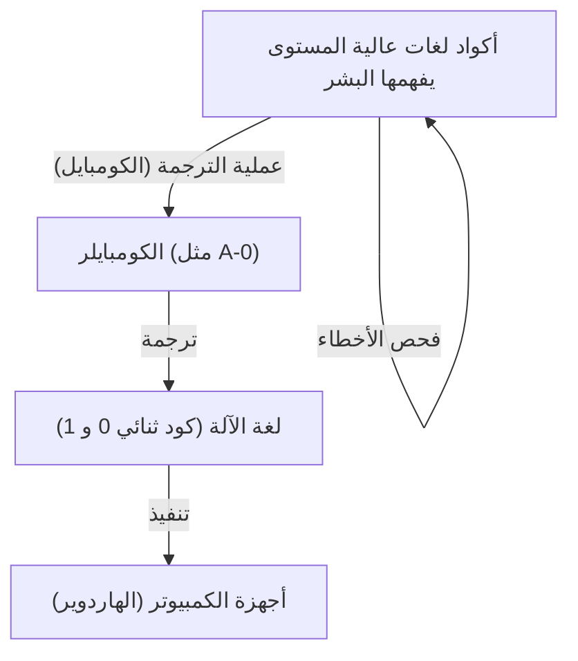
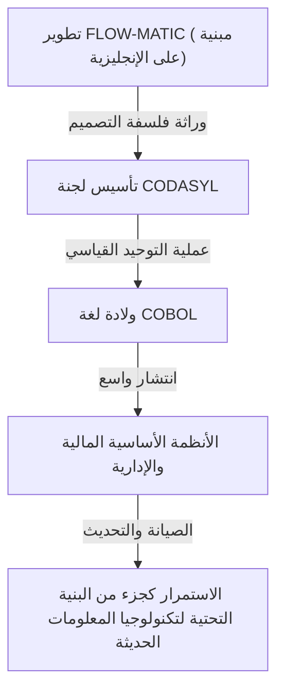

# رائدة مهدت لمستقبل البرمجة: حياة وإرث جريس هوبر (أم كوبول)

يعتمد مجتمع تكنولوجيا المعلومات الحديث على عدد لا يحصى من البرامج والتطبيقات. من الهواتف الذكية التي نستخدمها يوميًا، إلى الأنظمة المصرفية، وأنظمة التحكم في الطائرات، وحتى الذكاء الاصطناعي، كل شيء مبني على أساس "لغات البرمجة". ولكن، للوصول إلى النقطة التي يمكن فيها للبشر إعطاء أوامر لأجهزة الكمبيوتر بلغة سهلة الفهم، كانت هناك رحلة طويلة من المحاولات والخطأ والاختراقات الهائلة.

من بين أهم الشخصيات التي لعبت دورًا حاسمًا في نقطة التحول التاريخية هذه، نجد جريس موراي هوبر (Grace Murray Hopper). كانت تُعرف بألقاب مثل "أم كوبول (Mother of COBOL)" و "جريس المذهلة (Amazing Grace)"، وكانت أدميرالًا في البحرية الأمريكية، وفي الوقت نفسه عالمة رياضيات عبقرية، وعالمة حاسوب ذات بصيرة ثاقبة.

في هذا المقال، سنتتبع حياة جريس هوبر، ونستكشف بعمق في عدة آلاف من الكلمات كيف شاركت في تطوير أجهزة الكمبيوتر الأولى، وساهمت في تطور لغات البرمجة، بالإضافة إلى إنجازاتها وإرثها الذي لا يُقدر بثمن.

## الفصل الأول: الطفولة والتعليم —— من فتاة فضولية إلى عالمة رياضيات

ولدت جريس بروستر موراي في 9 ديسمبر 1906 في مدينة نيويورك. نشأت في أسرة تحترم الفضول الفكري، ومنذ صغرها، أظهرت جريس اهتمامًا استثنائيًا بالآلات والرياضيات. من القصص الشهيرة عنها أنها عندما كانت في السابعة من عمرها، قامت بتفكيك سبعة منبهات في منزلها واحدًا تلو الآخر في محاولة لفهم كيفية عملها. وبدلًا من توبيخها، اعترفت والدتها بفضولها الاستكشافي وسمحت لها بتفكيك ساعة واحدة فقط. هذه البيئة كانت التربة الخصبة التي رعت العالمة العظيمة في المستقبل.

في عام 1924، التحقت بجامعة فاسار المرموقة، حيث تخصصت في الرياضيات والفيزياء. بعد تخرجها بامتياز في عام 1928، انتقلت إلى كلية الدراسات العليا بجامعة ييل، وحصلت على درجة الماجستير في عام 1930. في نفس العام، تزوجت من فينسنت فوستر هوبر، وأصبح اسمها "جريس هوبر". في عام 1934، حصلت على درجة الدكتوراه (Ph.D.) في الرياضيات من جامعة ييل. في ذلك الوقت، كان من النادر جدًا أن تحصل امرأة على درجة الدكتوراه في الرياضيات، مما يدل على قدراتها الفكرية الفذة وجهدها الاستثنائي.

بعد التخرج، درست جريس الرياضيات في جامعتها الأم، فاسار، وكانت تسير بخطى ثابتة في مسيرتها الأكاديمية. ومع ذلك، فإن دخول الولايات المتحدة في الحرب العالمية الثانية بعد الهجوم على بيرل هاربر في عام 1941 قد غيّر مصيرها بشكل كبير.

## الفصل الثاني: الانضمام إلى البحرية واللقاء مع "Harvard Mark I"

مع اشتداد الحرب، شعرت جريس برغبة قوية في خدمة بلادها، وتطوعت للانضمام إلى احتياطي النساء في البحرية الأمريكية (WAVES). في البداية، تم رفض طلبها لأنها لم تستوف المعايير من حيث العمر (كانت تبلغ من العمر 34 عامًا) والوزن، ولكن سُمح لها بالانضمام كاستثناء.

انضمت أخيرًا في عام 1943، وفي عام 1944 تم تكليفها برتبة ملازم ثان وتم تعيينها في مشروع حوسبة مكتب السفن في جامعة هارفارد (Bureau of Ships Computation Project). هناك، التقت بأول جهاز كمبيوتر رقمي آلي كبير في أمريكا، وهو "Harvard Mark I" (هارفارد مارك وان).

كان Mark I آلة ضخمة يبلغ طولها حوالي 15 مترًا ووزنها حوالي 5 أطنان، وتتكون من مئات الآلاف من الأجزاء ومئات الكيلومترات من الأسلاك. تولى هذا الكمبيوتر عمليات حسابية بالغة الأهمية عسكريًا، مثل حساب مسارات نيران المدفعية البحرية، والعمليات الحسابية للعدسات المتفجرة في تطوير القنبلة الذرية (مشروع مانهاتن).

تم تعيين هوبر كمبرمجة لجهاز Mark I. لم تكن البرمجة في ذلك الوقت تشمل كتابة الأكواد من لوحة المفاتيح كما هو الحال اليوم، بل كانت عملية فيزيائية معقدة تتضمن ثقب أشرطة ورقية لتسجيل الأوامر ومن ثم إدخالها في الآلة. تحت إشراف هوارد أيكن (مصمم Mark I)، أتقنت هوبر هيكل وطريقة تشغيل Mark I في وقت قصير، وأصبحت عضوًا أساسيًا في المشروع، حتى أنها كتبت دليل المستخدم للبرمجة.

## الفصل الثالث: ولادة الأسطورة —— اكتشاف أول "حشرة كمبيوتر" (Bug)

في عالم الكمبيوتر، يُطلق على الأعطال أو الأخطاء في البرامج اسم "Bug" (حشرة)، وتسمى عملية إصلاحها "Debugging" (إزالة الحشرات). من جعل هذه المصطلحات شائعة في صناعة الكمبيوتر لم يكن سوى جريس هوبر وفريقها.

في 9 سبتمبر 1947، كانت هوبر وفريقها يقومون بتشغيل كمبيوتر Mark II في جامعة هارفارد، عندما حدث خطأ غير معروف السبب في النظام. بعد فحص دقيق للآلة الضخمة من الداخل، وجد الفريق "عثة" (Moth) عالقة في ملامسات المُرحّل (Relay). كانت هذه العثة تسد الملامسات ماديًا، مما منع الآلة من العمل بشكل صحيح.

قام فريق هوبر بإزالة العثة بعناية باستخدام ملقط، ولصقوها بشريط لاصق في سجل العمل (Logbook). وبجانبها، كتبوا الملاحظة التاريخية التالية:

> "First actual case of bug being found." (أول حالة فعلية يتم فيها العثور على حشرة/علة)

على الرغم من أن كلمة "Bug" كانت تُستخدم في السياق التقني منذ عصر توماس إديسون، إلا أن هذا الحدث كان السبب في انتشارها ككلمة تشير إلى أخطاء البرامج أو أعطال أنظمة الكمبيوتر. يتم الاحتفاظ بسجل العمل هذا حاليًا في متحف سميثسونيان، ويعتبر قطعة أثرية مهمة في تاريخ تكنولوجيا المعلومات.

## الفصل الرابع: اختراع المترجم (الكومبايلر) —— من لغة الآلة إلى لغة البشر

بعد انتهاء الحرب، استمرت هوبر في العمل كباحثة في البحرية، لكنها انتقلت لاحقًا إلى شركة إيكيرت-ماوكلي للكمبيوتر (Eckert-Mauchly Computer Corporation) الخاصة (التي استحوذت عليها لاحقًا شركة ريمنجتون راند)، وشاركت في تطوير أول كمبيوتر تجاري "UNIVAC I".

هنا، توصلت إلى فكرة ثورية من شأنها تغيير تاريخ البرمجة إلى الأبد. في ذلك الوقت، كانت البرمجة تتم بلغة الآلة (سلسلة من الأصفار والآحاد) أو لغة التجميع (Assembly)، وهي لغات قريبة جدًا من بنية الآلة. لم تكن هذه اللغات صعبة القراءة وعرضة للأخطاء فحسب، بل كانت حكرًا على عدد قليل من الفنيين المدربين تدريباً خاصاً.

فكرت هوبر: "بدلًا من ذلك، لماذا لا نعطي أوامر للكمبيوتر بلغة يسهل على البشر فهمها (مثل اللغة الإنجليزية)، ثم يقوم الكمبيوتر نفسه بترجمتها إلى لغة الآلة؟". هذا البرنامج المترجم هو ما نعرفه باسم "الكومبايلر" (Compiler).

في عام 1952، طورت نظام "A-0 System"، والذي يُطلق عليه أول مترجم في العالم. سخر العديد من علماء الرياضيات والمهندسين في ذلك الوقت من فكرتها، قائلين: "أجهزة الكمبيوتر هي مجرد آلات حاسبة، ومن المستحيل أن تترجم البرامج". ومع ذلك، لم تستسلم وأثبتت جدواها العملية. بفضل هذا الاختراق العظيم، تحررت البرمجة من أيدي قلة من الخبراء، وتم إرساء الأساس لمشاركة المزيد من الأشخاص في تطوير البرمجيات.

## الفصل الخامس: من FLOW-MATIC إلى COBOL —— اللغة التي أحدثت ثورة في عالم الأعمال

بينما كان نظام A-0 مخصصًا بشكل أساسي للحسابات الرياضية والعلمية، كانت رؤية هوبر أوسع من ذلك بكثير. كانت مقتنعة بأن الوقت سيأتي عندما تُستخدم أجهزة الكمبيوتر على نطاق واسع في عالم الأعمال، ورأت أن هناك حاجة إلى لغة برمجة مناسبة لمعالجة بيانات الأعمال.

لذلك، قام فريقها بتطوير "FLOW-MATIC (B-0)". كانت FLOW-MATIC أول لغة برمجة تسمح بوصف معالجة البيانات باستخدام كلمات إنجليزية. على سبيل المثال، يمكن كتابة برامج بقواعد نحوية قريبة من اللغة الإنجليزية مثل "MULTIPLY PRICE BY QUANTITY GIVING TOTAL" (اضرب السعر في الكمية لإعطاء الإجمالي).

في عام 1959، وبدعوة من وزارة الدفاع الأمريكية، تم تشكيل مؤتمر (CODASYL: مؤتمر لغات أنظمة البيانات) لتطوير لغة برمجة قياسية للأعمال يمكن استخدامها بشكل مشترك من قبل الوكالات الحكومية والشركات الخاصة. في هذا المؤتمر، تم دمج مفاهيم FLOW-MATIC الخاصة بهوبر بشكل كبير، ونتج عن ذلك ولادة لغة "COBOL" (COmmon Business Oriented Language).

على الرغم من أن هوبر نفسها لم تكتب مواصفات COBOL بشكل مباشر، إلا أن فلسفتها القائمة على "بنية لغة قابلة للقراءة تعتمد على اللغة الإنجليزية"، والتي أثبتتها في FLOW-MATIC، شكلت جوهر تصميم COBOL. لذلك، تُدعى باحترام "أم كوبول".

انتشرت COBOL بسرعة وتم تبنيها في جميع الأنظمة الأساسية حول العالم، بما في ذلك الأنظمة المالية للبنوك، وإدارة عقود التأمين، والأنظمة الإدارية الحكومية. والمثير للدهشة أنه حتى اليوم، بعد أكثر من 60 عامًا من إنشائها، لا تزال COBOL تعمل في العديد من الأنظمة القديمة حول العالم، وتدعم البنية التحتية لمجتمعنا في الخفاء.

## الفصل السادس: وجهها كمعلمة وتصور "النانوثانية"

لم تكن جريس هوبر مهندسة بارعة فحسب، بل كانت أيضًا معلمة موهوبة للغاية. كانت شغوفة دائمًا بنقل المعرفة إلى الأجيال الشابة.

من القصص الشهيرة التي تبرز جانبها كمعلمة هي "سلك النانوثانية" (Nanosecond wire). مع زيادة سرعة معالجة أجهزة الكمبيوتر، بدأ المهندسون يهتمون بتأخير الدوائر بوحدة "النانوثانية (جزء من مليار من الثانية)". ومع ذلك، من الصعب فهم الوقت القصير جدًا مثل النانوثانية بشكل بديهي.

لذلك، قامت هوبر بحساب المسافة التي يقطعها الضوء (أو الإشارات الكهربائية) في الفراغ (أو السلك النحاسي) خلال نانوثانية واحدة. كانت حوالي 11.8 بوصة (حوالي 30 سم). قامت بقطع كمية كبيرة من الأسلاك بهذا الطول، ووزعتها على الناس خلال المحاضرات والمؤتمرات قائلة: "هذه هي النانوثانية".

"لماذا يحدث تأخير في الاتصال؟ لماذا يجب أن نجعل أجهزة الكمبيوتر أصغر؟ ستفهم ذلك بمجرد النظر إلى سلك 'النانوثانية' هذا. لأن الإشارة تحتاج إلى وقت للسفر لمسافة مادية."

بهذه الطريقة، كانت عبقرية في تحويل المفاهيم المعقدة والمجردة إلى استعارات مادية يمكن لأي شخص فهمها. هذا النهج المليء بالفكاهة والبصيرة ألهم العديد من المهندسين الشباب والطلاب.

## الفصل السابع: العودة إلى البحرية وتعزيز التوحيد القياسي

في عام 1966، تقاعدت هوبر من البحرية بسبب وصولها إلى السن القانوني، ولكن بعد 7 أشهر فقط، تم استدعاؤها مرة أخرى. فقد أصبح التنوع الكبير في لغات البرمجة والأنظمة المستخدمة داخل البحرية غير متوافق، مما تسبب في مشاكل خطيرة.

بعد عودتها إلى الخدمة الفعلية، قادت عملية توحيد COBOL داخل البحرية وتطوير برامج التحقق (Validation routines) للمترجمات. وقد ضمن ذلك أن برنامج COBOL نفسه سيعمل بشكل صحيح حتى على أجهزة كمبيوتر من جهات تصنيع مختلفة. لعبت هذه المساهمة في التوحيد القياسي دورًا بالغ الأهمية في تطور صناعة البرمجيات بأكملها لاحقًا.

استمرت في الترقية، وفي عام 1983، تمت ترقيتها إلى رتبة عميد بمرسوم خاص من الرئيس رونالد ريغان. في النهاية، عندما تقاعدت من البحرية في عام 1986 عن عمر يناهز 79 عامًا، تمت ترقيتها إلى رتبة لواء بحري (Rear Admiral). في وقت تقاعدها، كانت أكبر ضابط في الخدمة الفعلية في القوات المسلحة الأمريكية بأكملها.

## الفصل الثامن: السنوات الأخيرة، التكريم، والإرث المتبقي

حتى بعد تقاعدها من البحرية، لم يتضاءل شغفها. تم تعيينها ككبيرة مستشارين في شركة DEC (Digital Equipment Corporation)، وظلت نشطة في إلقاء المحاضرات وتوجيه المهندسين الشباب حتى فترة وجيزة قبل وفاتها.

في 1 يناير 1992، توفيت جريس هوبر عن عمر يناهز 85 عامًا. تم دفن جثمانها بأعلى درجات التكريم العسكري في مقبرة أرلينغتون الوطنية.

تكريماً لإنجازاتها، في عام 1997، تم إطلاق اسم "هوبر (USS Hopper, DDG-70)" على مدمرة صواريخ موجهة من فئة إيجيس تابعة للبحرية الأمريكية. من النادر جدًا أن يتم تسمية سفينة بحرية باسم امرأة. وفي عام 2016، منحها الرئيس باراك أوباما بعد وفاتها "ميدالية الحرية الرئاسية"، وهي أعلى وسام مدني في الولايات المتحدة.

## خاتمة: ماذا نتعلم من جريس المذهلة

كانت حياة جريس هوبر تاريخًا من التحدي المستمر للأطر والتقاليد القائمة.

"لأننا فعلنا ذلك دائمًا بهذه الطريقة (We've always done it that way)"

كانت تكره هذه العبارة بشدة وتعتبرها "أخطر عبارة في اللغة الإنجليزية". موقفها في عدم الرضا عن الوضع الراهن والبحث المستمر عن طرق أفضل وأكثر كفاءة وأسهل في الاستخدام هو ما أدى إلى اختراع المترجم (الكومبايلر)، وإنشاء لغة COBOL، وإرساء أسس مجتمع تكنولوجيا المعلومات اليوم.

أصبحت البرمجة أداة يمكن لأي شخص استخدامها، وليست حكرًا على العباقرة فقط، لأنها كانت تمتلك رؤية "ترجمة لغة الآلة إلى لغة البشر" وجعلت ذلك حقيقة واقعة. إذا كنا اليوم قادرين على استخدام أجهزة الكمبيوتر براحة وتطوير برامج متقدمة، فذلك لأننا نقف على الطريق الذي مهدته "أم كوبول" جريس هوبر.

لا يقتصر إرثها على الأكواد والأنظمة فحسب، بل لا تزال فلسفتها القائلة بأن "التكنولوجيا يجب أن تكون قريبة من الإنسان" حية في مجال تطوير البرمجيات حتى اليوم.

(النهاية)
