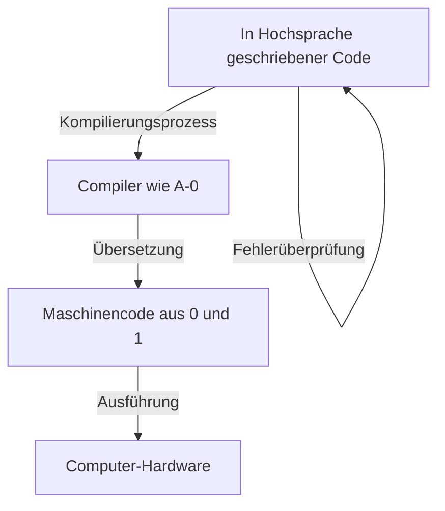
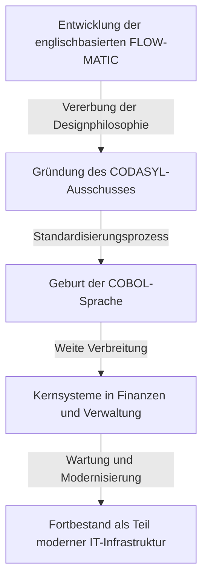

# Pionierin, die die Zukunft der Programmierung bahnte: Leben und Vermächtnis von Grace Hopper (Mutter von COBOL)

Die moderne IT-Gesellschaft wird von zahllosen Softwares und Programmen getragen. Die Smartphones, die wir täglich nutzen, Bankensysteme, Flugzeugsteuerungen und sogar KI basieren alle auf der Grundlage von "Programmiersprachen". Doch bis Menschen dem Computer in einer leicht verständlichen Sprache Anweisungen geben konnten, brauchte es enormes Ausprobieren und Durchbrüche.

Eine der wichtigsten und entscheidendsten Personen an diesem historischen Wendepunkt war Grace Murray Hopper. Sie, die liebevoll "Mutter von COBOL" (Mother of COBOL) und "Amazing Grace" genannt wurde, war ein Konteradmiral der US-Marine, zugleich eine geniale Mathematikerin und eine visionäre Informatikerin.

In diesem Artikel werden wir das Leben von Grace Hopper nachzeichnen und detailliert erforschen, wie sie an der frühen Computerentwicklung beteiligt war, zur Evolution der Programmiersprachen beitrug und welch unermessliche Errungenschaften und Vermächtnisse sie in Tausenden von Wörtern hinterlassen hat.

## Kapitel 1: Kindheit und Ausbildung —— Vom neugierigen Mädchen zur Mathematikerin

Grace Brewster Murray wurde am 9. Dezember 1906 in New York City geboren. Ihre Familie legte großen Wert auf intellektuelle Neugier, und Grace zeigte schon in jungen Jahren ein außergewöhnliches Interesse an Maschinen und Mathematik. Eine berühmte Episode erzählt, dass sie im Alter von sieben Jahren nacheinander sieben Wecker im Haus zerlegte, um deren Mechanismus zu verstehen. Anstatt sie zu schimpfen, erkannte ihre Mutter ihren Forscherdrang an und erlaubte ihr, nur noch einen Wecker zu zerlegen. Diese Umgebung bildete den Nährboden für die spätere große Wissenschaftlerin.

1924 trat sie in das renommierte Vassar College ein und studierte Mathematik und Physik. Nach ihrem hervorragenden Abschluss 1928 wechselte sie an die Yale University Graduate School und erwarb 1930 ihren Master-Abschluss. Im selben Jahr heiratete sie Vincent Foster Hopper und nahm den Namen "Grace Hopper" an. 1934 promovierte sie in Yale in Mathematik (Ph.D.). Damals war es sehr selten, dass Frauen in Mathematik promovierten, was von ihrer außergewöhnlichen intellektuellen Fähigkeit und ihrem Einsatz zeugt.

Nach ihrem Abschluss lehrte Grace Mathematik an ihrer Alma Mater, dem Vassar College, und schlug erfolgreich eine akademische Laufbahn ein. Doch der Eintritt Amerikas in den Zweiten Weltkrieg nach dem Angriff auf Pearl Harbor 1941 veränderte ihr Schicksal drastisch.

## Kapitel 2: Eintritt in die Marine und die Begegnung mit "Harvard Mark I"

Während der Krieg eskalierte, hegte Grace den starken Wunsch, ihrem Land zu dienen, und meldete sich freiwillig für die Frauen-Reserve der US-Marine (WAVES: Women Accepted for Volunteer Emergency Service). Da sie die Anforderungen in Bezug auf Alter (damals 34) und Gewicht nicht erfüllte, wurde ihr Eintritt zunächst abgelehnt, aber durch eine Ausnahmegenehmigung schließlich gestattet.

Nachdem sie 1943 eingetreten war, wurde sie 1944 als Leutnant vereidigt und dem Bureau of Ships Computation Project an der Harvard University zugewiesen. Dort begegnete sie "Harvard Mark I", dem ersten großen automatischen digitalen Computer Amerikas.

Mark I war eine riesige Maschine von etwa 15 Metern Länge und 5 Tonnen Gewicht, die aus Hunderttausenden von Teilen und Hunderten von Kilometern an Verkabelung bestand. Dieser Computer führte militärisch äußerst wichtige Berechnungen durch, wie ballistische Berechnungen für den Schiffsgeschützbeschuss und Berechnungen für die Implosionslinsen in der Atombombenentwicklung (Manhattan-Projekt).

Hopper wurde als Programmiererin für diese Mark I eingesetzt. Die damalige Programmierung war keine Eingabe von Code über eine Tastatur wie heute, sondern eine physische und mühsame Aufgabe, bei der Befehle durch Löcher in Papierstreifen gestanzt und von der Maschine gelesen wurden. Unter der Anleitung von Howard Aiken (dem Konstrukteur von Mark I) meisterte sie in kürzester Zeit die Struktur und Bedienung von Mark I, erstellte ein Programmierhandbuch und spielte eine zentrale Rolle in dem Projekt.

## Kapitel 3: Die Geburt einer Legende —— Die Entdeckung des ersten "Computer-Bugs"

In der Computerwelt werden Fehler oder Defekte in Programmen als "Bug" (Käfer) bezeichnet und deren Behebung als "Debug". Es waren Grace Hopper und ihr Team, die diesen Begriff in der Computerindustrie etablierten.

Am 9. September 1947 betrieben Hopper und ihr Team den Mark II Computer an der Harvard University, als ein Fehler unbekannter Ursache im System auftrat. Als das Team das Innere der riesigen Anlage gründlich untersuchte, fanden sie eine "Motte" (Moth), die in den Kontakten eines Relais eingeklemmt war. Diese Motte blockierte physisch die Kontakte, sodass die Maschine nicht richtig funktionierte.

Hopper und ihr Team entfernten die Motte vorsichtig mit einer Pinzette, klebten sie mit Klebeband in ihr Logbuch (Arbeitstagebuch) und hinterließen daneben die folgende historische Notiz:

> "First actual case of bug being found." (Erster tatsächlicher Fall, in dem ein Bug gefunden wurde.)

Obwohl das Wort "Bug" im technischen Kontext bereits seit der Zeit von Thomas Edison verwendet wurde, war dies das Ereignis, das dazu führte, dass es als Bezeichnung für Computerprogramme und Systemfehler weithin anerkannt wurde. Dieses Logbuch befindet sich heute in der Smithsonian Institution und ist ein wichtiges Artefakt in der IT-Geschichte.

## Kapitel 4: Die Erfindung des Compilers —— Von der Maschinensprache zur menschlichen Sprache

Auch nach dem Krieg blieb Hopper bei der Marine und setzte ihre Forschung fort, wechselte jedoch später zur zivilen Eckert-Mauchly Computer Corporation (die später von Remington Rand übernommen wurde) und war an der Entwicklung des kommerziellen Computers "UNIVAC I" beteiligt.

Hier kam ihr eine bahnbrechende Idee, die die Geschichte der Programmierung für immer verändern sollte. Die damalige Programmierung erfolgte in Maschinensprache (einer Abfolge von 0 und 1) oder in Assemblersprache, die der Maschinenstruktur sehr nahe war. Dies war für Menschen sehr schwer zu lesen, fehleranfällig und konnte nur von sehr wenigen speziell ausgebildeten Technikern gehandhabt werden.

Hopper dachte: "Warum sollte man dem Computer nicht Befehle in einer für den Menschen leicht verständlichen Sprache (wie Englisch) geben, die der Computer dann selbst in Maschinensprache übersetzt?" Dieses Übersetzungsprogramm ist genau das, was wir als "Compiler" kennen.

1952 entwickelte sie das sogenannte "A-0 System", das oft als der erste Compiler der Welt bezeichnet wird. Viele damalige Mathematiker und Ingenieure spotteten über ihre Idee und sagten: "Ein Computer ist eine Rechenmaschine, es ist unmöglich, dass er ein Programm übersetzt." Doch sie gab nicht auf und bewies dessen Praktikabilität. Durch diesen Durchbruch wurde das Programmieren aus den Händen einiger weniger Experten befreit und bildete die Grundlage dafür, dass sich viel mehr Menschen an der Softwareentwicklung beteiligen konnten.

## Kapitel 5: Von FLOW-MATIC zu COBOL —— Die Sprache, die die Geschäftswelt revolutionierte

Obwohl das A-0-System hauptsächlich für mathematische und wissenschaftliche Berechnungen gedacht war, Hoppers Vision war viel breiter. Sie war überzeugt, dass eine Zeit kommen würde, in der Computer auch in der Geschäftswelt weithin genutzt würden, und hielt eine für die geschäftliche Datenverarbeitung geeignete Programmiersprache für notwendig.

Daher entwickelte ihr Team "FLOW-MATIC (B-0)". FLOW-MATIC war die erste Programmiersprache, die englische Wörter zur Beschreibung der Datenverarbeitung verwendete. Zum Beispiel konnte man ein Programm in einer Form schreiben, die der englischen Grammatik ähnelte, wie "MULTIPLY PRICE BY QUANTITY GIVING TOTAL" (Multipliziere Preis mit Menge und gib das Total aus).

1959 wurde auf Aufruf des US-Verteidigungsministeriums ein Ausschuss (CODASYL: Conference on Data Systems Languages) gegründet, um eine standardisierte geschäftsorientierte Programmiersprache zu entwickeln, die von Regierungsbehörden und privaten Unternehmen gemeinsam genutzt werden konnte. In dieser Konferenz wurden die Konzepte von Hoppers FLOW-MATIC stark integriert, woraus "COBOL (COmmon Business Oriented Language)" entstand.

Obwohl Hopper die Spezifikationen bei der Formulierung von COBOL nicht direkt selbst schrieb, bildete ihre durch FLOW-MATIC bewiesene Philosophie einer "englischbasierten, hochgradig lesbaren Sprachstruktur" das Fundament des COBOL-Designs. Aus diesem Grund wird sie respektvoll "Mutter von COBOL" genannt.

COBOL verbreitete sich schnell und wurde in allen wichtigen Systemen weltweit eingeführt, darunter Finanzsysteme von Banken, Vertragsverwaltung von Versicherungen und Verwaltungssysteme von Regierungen. Erstaunlicherweise läuft COBOL auch heute noch, über 60 Jahre nach seiner Entstehung, in vielen Legacy-Systemen auf der ganzen Welt und unterstützt im Hintergrund unsere soziale Infrastruktur.

## Kapitel 6: Das Gesicht als Pädagogin und die Visualisierung von "Nanosekunden"

Grace Hopper war nicht nur eine herausragende Technikerin, sondern auch eine äußerst talentierte Pädagogin. Sie war stets leidenschaftlich daran interessiert, ihr Wissen an die jüngere Generation weiterzugeben.

Eine berühmte Episode, die ihre Seite als Pädagogin symbolisiert, ist der "Nanosekunden-Draht". Als die Verarbeitungsgeschwindigkeit von Computern zunahm, begannen Ingenieure, sich über Schaltungsverzögerungen im Bereich von "Nanosekunden (Milliardstel Sekunden)" Gedanken zu machen. Es ist jedoch schwer, eine extrem kurze Zeit wie eine Nanosekunde intuitiv zu erfassen.

Daher berechnete Hopper die Distanz, die Licht (oder elektrische Signale) in einem Vakuum (oder Kupferdraht) innerhalb einer Nanosekunde zurücklegt. Das waren etwa 11,8 Zoll (ca. 30 Zentimeter). Sie schnitt eine große Menge an Draht dieser Länge zurecht und verteilte ihn bei Vorträgen und Konferenzen an die Leute mit den Worten: "Dies ist eine Nanosekunde."

"Warum kommt es zu Kommunikationsverzögerungen? Warum müssen wir Computer noch kleiner machen? Ein Blick auf diesen 'Nanosekunden'-Draht sollte das offensichtlich machen. Denn es braucht Zeit, um die physische Distanz zurückzulegen, damit das Signal ankommt."

So war sie ein Genie darin, komplexe und abstrakte Konzepte in physische Metaphern zu übersetzen, die jeder verstehen konnte. Dieser humorvolle und aufschlussreiche Ansatz inspirierte viele junge Ingenieure und Studenten.

## Kapitel 7: Rückkehr zur Marine und Förderung der Standardisierung

1966 trat Hopper aus der Marine in den Ruhestand, wurde aber nur sieben Monate später von der Marine zurückgerufen. Die große Vielfalt an Programmiersprachen und Systemen, die innerhalb der Marine verwendet wurden, hatte an Kompatibilität verloren und verursachte ernsthafte Probleme.

Nach ihrer Rückkehr in den aktiven Dienst leitete sie die Standardisierung von COBOL in der Marine und die Entwicklung von Validierungsroutinen (Compiler-Prüfprogrammen). Dies stellte sicher, dass dasselbe COBOL-Programm unabhängig vom Computerhersteller korrekt funktionierte. Dieser Beitrag zur Standardisierung spielte eine entscheidende Rolle in der späteren Entwicklung der gesamten Softwareindustrie.

Sie stieg danach weiter auf und wurde 1983 durch ein spezielles Dekret von Präsident Ronald Reagan zum Commodore (später Rear Admiral, Lower Half) befördert. Schließlich wurde sie bei ihrem Ausscheiden aus der Marine 1986 im Alter von 79 Jahren zum Konteradmiral (Rear Admiral) befördert. Zum Zeitpunkt ihrer Pensionierung war sie der älteste aktive Offizier in den gesamten US-Streitkräften.

## Kapitel 8: Späte Jahre, Ehrungen und das hinterlassene Vermächtnis

Auch nach ihrem Ausscheiden aus der Marine ließ ihre Leidenschaft nicht nach. Sie wurde als Senior Consultant bei DEC (Digital Equipment Corporation) eingestellt und reiste bis kurz vor ihrem Tod umher, hielt Vorträge und bildete junge Ingenieure aus.

Am 1. Januar 1992 verstarb Grace Hopper im Alter von 85 Jahren. Sie wurde mit den höchsten militärischen Ehren auf dem Nationalfriedhof Arlington beigesetzt.

Zu Ehren ihrer Verdienste wurde 1997 ein Aegis-Zerstörer der US Navy auf den Namen "USS Hopper (DDG-70)" getauft. Es ist äußerst selten, dass ein Marineschiff nach einer Frau benannt wird. Darüber hinaus wurde ihr 2016 von Präsident Barack Obama posthum die "Presidential Medal of Freedom" verliehen, die höchste zivile Auszeichnung der Vereinigten Staaten.

## Fazit: Was wir von Amazing Grace lernen können

Das Leben von Grace Hopper war eine Geschichte ständigen Herausforderns bestehender Rahmenbedingungen und des gesunden Menschenverstands.

"Wir haben das schon immer so gemacht (We've always done it that way)."

Sie hasste diesen Satz zutiefst und bezeichnete ihn als "die gefährlichste Phrase der englischen Sprache". Ihre Einstellung, sich nicht mit dem Status quo zufrieden zu geben, sondern stets nach besseren, effizienteren und weithin nutzbaren Methoden zu suchen, brachte den Compiler und COBOL hervor und legte den Grundstein für die heutige IT-Gesellschaft.

Dass Programmierung nicht mehr nur für wenige Genies zugänglich ist, sondern zu einem Werkzeug wurde, das jeder nutzen kann, liegt daran, dass sie die Vision hatte, "die Maschinensprache in menschliche Sprache zu übersetzen" und dies verwirklichte. Die Tatsache, dass wir heute Computer bequem nutzen und fortschrittliche Software entwickeln können, liegt daran, dass wir auf dem Weg stehen, den Grace Hopper, die "Mutter von COBOL", gebahnt hat.

Ihr Vermächtnis geht über bloßen Code und Systeme hinaus; es lebt heute in der Softwareentwicklung als die Philosophie weiter, dass "Technologie den Menschen nahe sein sollte".

(Ende)
