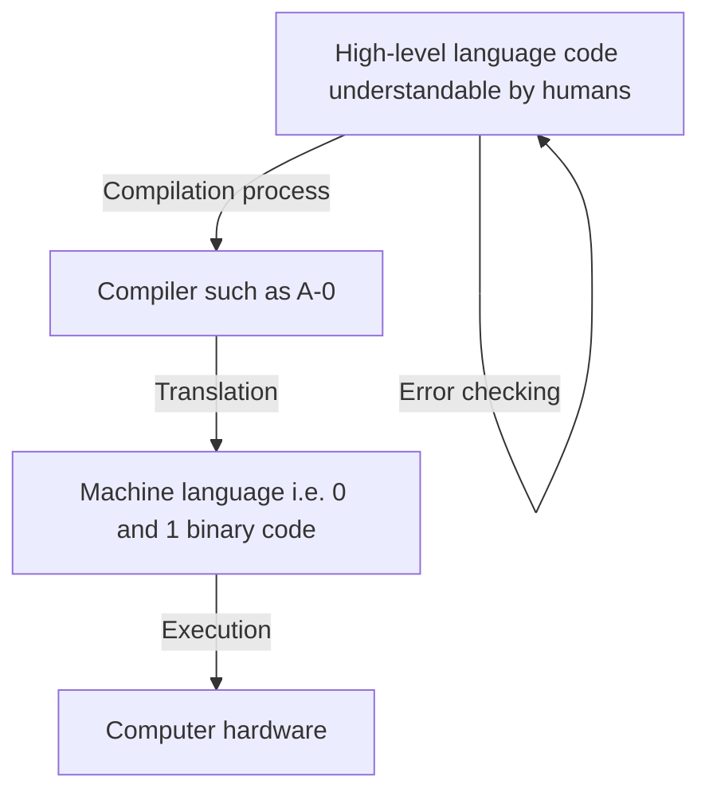
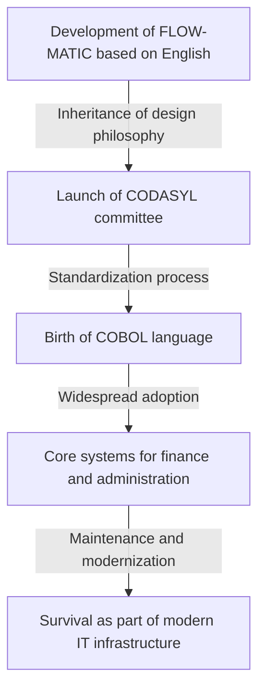

# A Pioneer Who Opened the Future of Programming: The Life and Legacy of Grace Hopper, the Mother of COBOL

Modern IT society is supported by countless software and programs. Everything from the smartphones we use every day, bank systems, and aircraft control, to AI, is built on the foundation of "programming languages." However, before we were able to give instructions to computers in language that humans could easily understand, there was tremendous trial and error and breakthroughs.

One of the people who played the most important and decisive role at that historical turning point was Grace Murray Hopper. Affectionately known by nicknames such as the "Mother of COBOL" and "Amazing Grace," she was a Rear Admiral in the United States Navy, as well as a genius mathematician and a visionary computer scientist.

In this article, following the life of Grace Hopper, we will deeply explore her immeasurable achievements and legacy over thousands of words, detailing how she became involved in early computer development and contributed to the evolution of programming languages.

## Chapter 1: Childhood and Education —— From a Curious Girl to a Mathematician

Grace Brewster Murray was born in New York City on December 9, 1906. Her family environment respected intellectual curiosity, and Grace herself showed an extraordinary interest in machines and mathematics from a young age. In a famous anecdote, when she was seven years old, she dismantled seven alarm clocks in her home one after another, trying to understand how they worked. Instead of scolding her, her mother recognized her inquiring mind and allowed her to dismantle just one clock. This environment became the soil that nurtured the great scientist she would later become.

In 1924, she entered the prestigious Vassar College, majoring in mathematics and physics. After graduating with honors in 1928, she went on to graduate school at Yale University, where she earned her master's degree in 1930. In the same year, she married Vincent Foster Hopper and became "Grace Hopper." In 1934, she earned a Ph.D. in mathematics from Yale University. At that time, it was extremely rare for a woman to obtain a Ph.D. in mathematics, which shows her extraordinary intellectual ability and effort.

After graduation, Grace taught mathematics at her alma mater, Vassar College, and was smoothly walking the path of a scholar. However, the United States' entry into World War II following the attack on Pearl Harbor in 1941 would greatly change her destiny.

## Chapter 2: Enlistment in the Navy and the Encounter with "Harvard Mark I"

As the war intensified, Grace strongly desired to contribute to her country and volunteered for the U.S. Navy's WAVES (Women Accepted for Volunteer Emergency Service). Initially, she was rejected because she did not meet the standards for age (she was 34 at the time) and weight, but she was eventually granted an exemption and allowed to enlist.

Enlisting in 1943, she was commissioned as a junior grade lieutenant in 1944 and assigned to the Bureau of Ships Computation Project at Harvard University. There she encountered the "Harvard Mark I," America's first large-scale automatic digital computer.

The Mark I was a massive machine, about 15 meters long and weighing about 5 tons, consisting of hundreds of thousands of components and hundreds of kilometers of wiring. This computer handled militarily crucial calculations, such as ballistic calculations for naval gunfire and implosion lens calculations for the atomic bomb development (Manhattan Project).

Hopper was assigned as a programmer for this Mark I. Programming at the time was not about typing code from a keyboard as it is today, but rather a physical and cumbersome task of punching holes in paper tape to record instructions and having the machine read them. Under the guidance of Howard Aiken (the designer of Mark I), she quickly mastered the structure and operation of Mark I, creating a programming manual and playing a central role in the project.

## Chapter 3: The Birth of a Legend —— Discovery of the First "Computer Bug"

In the computer world, a program malfunction or error is called a "bug," and the process of fixing it is called "debugging." It was none other than Grace Hopper and her team who established this term in the computer industry.

On September 9, 1947, Hopper and her team were operating the Mark II computer at Harvard University when a system error of unknown cause occurred. When the team thoroughly investigated the inside of the massive device, they found a "moth" trapped in a relay contact. The machine was not operating properly because this moth was physically blocking the contact.

Hopper and her team carefully removed the moth with tweezers and taped it to their logbook. Next to it, they left the following historical note:

> "First actual case of bug being found."

Although the word "bug" itself had been used in a technical context since the time of Thomas Edison, this incident was the catalyst for it becoming widely recognized as a term referring to computer programs and system errors. This logbook is currently housed in the Smithsonian Institution and is an important artifact in IT history.

## Chapter 4: The Invention of the Compiler —— From Machine Language to Human Language

Hopper remained in the Navy after the war to continue her research, but eventually moved to a private company, the Eckert-Mauchly Computer Corporation (later acquired by Remington Rand), where she was involved in the development of the commercial computer "UNIVAC I."

Here she came up with a breakthrough idea that would change the history of programming forever. Programming at the time was done in languages extremely close to the machine's structure, such as machine language (a sequence of 0s and 1s) and assembly language. This was very difficult for humans to read and prone to errors, and it could only be handled by a very small number of specially trained technicians.

Hopper thought, "Shouldn't we be able to give instructions to computers in a language that humans can easily understand, like English, and have the computer itself translate it into machine language?" This translation program is precisely the "compiler."

In 1952, she developed what is called the world's first compiler, the "A-0 System." Many mathematicians and engineers at the time mocked her idea, saying, "Computers are calculators; it is impossible for them to translate programs." However, she did not give up and proved its practicality. This breakthrough freed programming from the hands of a few experts and laid the foundation for more people to participate in software development.

## Chapter 5: From FLOW-MATIC to COBOL —— The Language That Revolutionized the Business World

Although the A-0 system was primarily aimed at mathematical and scientific calculations, Hopper's vision extended further. She was convinced that the time would come when computers would be widely used in the business world, and believed that a programming language suitable for data processing for business was necessary.

Therefore, her team developed "FLOW-MATIC" (B-0). FLOW-MATIC was the first programming language that could describe data processing using English words. For example, one could write a program in a form close to English grammar, such as "MULTIPLY PRICE BY QUANTITY GIVING TOTAL".

In 1959, at the call of the U.S. Department of Defense, a conference (CODASYL: Conference on Data Systems Languages) was established to develop a standard business programming language that could be used commonly by government agencies and private companies. In this conference, the concepts of Hopper's FLOW-MATIC were heavily incorporated, resulting in the birth of "COBOL" (COmmon Business Oriented Language).

Hopper did not write the specifications directly herself during the formulation of COBOL, but the philosophy of an "English-based, highly readable language structure" that she demonstrated with FLOW-MATIC forms the core of COBOL's design. For this reason, she is respectfully called the "Mother of COBOL."

COBOL spread rapidly and was adopted in all kinds of mission-critical systems around the world, including banking financial systems, insurance contract management, and government administrative systems. Surprisingly, even now, more than 60 years after its birth, COBOL continues to run on many of the world's legacy systems, supporting our social infrastructure behind the scenes.

## Chapter 6: Her Face as an Educator and the Visualization of a "Nanosecond"

Grace Hopper was an outstanding engineer and, at the same time, an extremely talented educator. She was always passionate about passing on knowledge to the younger generation.

A famous anecdote that symbolizes her aspect as an educator is the "nanosecond wire." As computer processing speeds improved, engineers began to worry about circuit delays in units of "nanoseconds" (one billionth of a second). However, it is difficult to intuitively understand an extremely short time like a nanosecond.

So Hopper calculated the distance that light (or an electrical signal) travels in a vacuum (or copper wire) in one nanosecond. It was about 11.8 inches (about 30 centimeters). She cut out large quantities of wire of this length and distributed them to people during lectures and conferences, saying, "This is a nanosecond."

"Why do communication delays occur? Why do we have to make computers even smaller? If you look at this 'nanosecond' wire, it should be obvious. It's because signals require time to travel a physical distance to arrive."

In this way, she was a genius at converting complex and abstract concepts into physical metaphors that anyone could understand. This approach, full of humor and insight, inspired many young engineers and students.

## Chapter 7: Return to the Navy and the Promotion of Standardization

In 1966, Hopper retired from the Navy at the mandatory retirement age, but just seven months later, she was recalled by the Navy. The wide variety of programming languages and systems used within the Navy had become incompatible, causing serious problems.

Returning to active duty, she led the standardization of COBOL in the Navy and the development of compiler validation routines. This ensured that the same COBOL program would run correctly even on computers from different manufacturers. This contribution to standardization played an extremely important role in the development of the entire software industry later on.

She continued to be promoted thereafter, and in 1983, she was promoted to commodore by a special presidential appointment from Ronald Reagan. Ultimately, when she retired from the Navy in 1986 at the age of 79, she had been promoted to Rear Admiral. At the time of her retirement, she was the oldest active-duty commissioned officer in the entire United States armed forces.

## Chapter 8: Later Years, Honors, and the Legacy Left Behind

Even after retiring from the Navy, her passion did not wane. She was welcomed as a senior consultant at DEC (Digital Equipment Corporation), and until just before her death, she was busy giving lectures and nurturing young engineers.

On January 1, 1992, Grace Hopper passed away at the age of 85. Her body was interred with full military honors at Arlington National Cemetery.

In honor of her achievements, in 1997, a U.S. Navy Aegis destroyer was named the "USS Hopper (DDG-70)". It is extremely rare for a Navy ship to be named after a woman. Furthermore, in 2016, she was posthumously awarded the "Presidential Medal of Freedom," the highest civilian award in the United States, by President Barack Obama.

## Conclusion: What We Can Learn from Amazing Grace

Grace Hopper's life was a history of continuously challenging existing frameworks and common sense.

"We've always done it that way."

She strongly hated this phrase as "the most dangerous phrase in the English language." Her attitude of never being satisfied with the status quo and always searching for better methods, more efficient methods, and methods that more people could use is exactly what gave birth to the compiler, gave birth to COBOL, and laid the foundation of today's IT society.

Programming became a tool that anyone can use, not just a few geniuses, because she had the vision of "translating machine language into human language" and made it a reality. The reason we are able to comfortably use computers and develop advanced software today is none other than because we stand on the path paved by Grace Hopper, the "Mother of COBOL."

Her legacy is not limited to mere code or systems, but continues to live on in the field of software development today as the philosophy that "technology should be close to humans."

(End)
