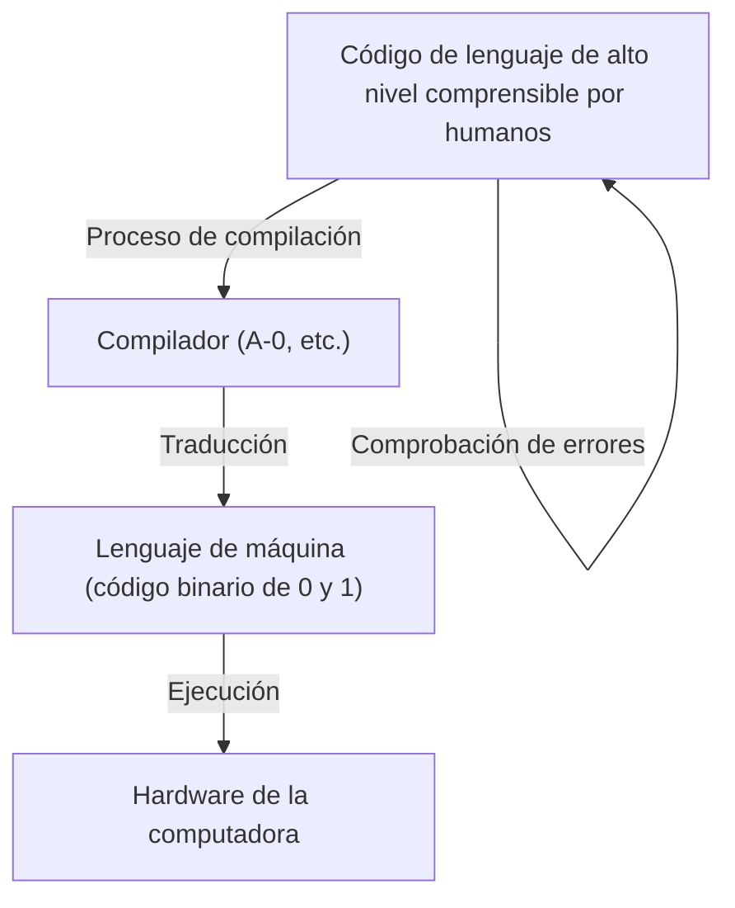
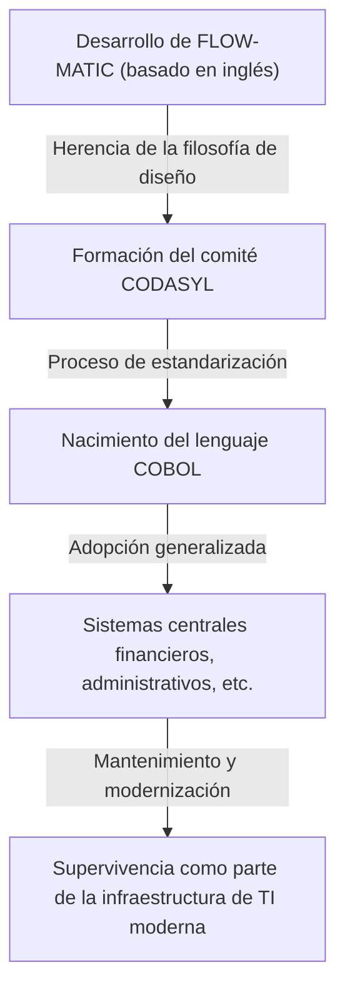

# La pionera que abrió el camino al futuro de la programación: Vida y legado de Grace Hopper (Madre de COBOL)

La sociedad de TI moderna está sustentada por innumerables software y programas. Todo, desde los teléfonos inteligentes que usamos a diario, los sistemas bancarios, el control de aeronaves e incluso la IA, se basa en los "lenguajes de programación". Sin embargo, hubo una tremenda cantidad de prueba y error y avances antes de que los humanos pudieran dar instrucciones a las computadoras en un lenguaje fácil de entender.

Una de las personas que desempeñó el papel más importante y decisivo en este punto de inflexión histórico fue Grace Murray Hopper. Conocida cariñosamente como la "Madre de COBOL" (Mother of COBOL) y "Amazing Grace", fue Contraalmirante en la Marina de los Estados Unidos, a la vez que una matemática genial y una científica informática visionaria.

En este artículo, seguiremos la vida de Grace Hopper, cómo se involucró en el desarrollo inicial de las computadoras y contribuyó a la evolución de los lenguajes de programación. Profundizaremos exhaustivamente en sus inmensurables logros y legado a lo largo de miles de palabras.

## Capítulo 1: Infancia y educación —— De una niña curiosa a matemática

Grace Brewster Murray nació en la ciudad de Nueva York el 9 de diciembre de 1906. Su familia fomentaba la curiosidad intelectual, y la propia Grace mostró un interés extraordinario por las máquinas y las matemáticas desde temprana edad. Una anécdota famosa es que cuando tenía 7 años, desarmó siete despertadores en su casa uno tras otro para tratar de entender cómo funcionaban. Su madre, en lugar de regañarla, reconoció su espíritu inquisitivo y le permitió desarmar solo un reloj. Este entorno se convirtió en el suelo que nutrió a la gran científica en la que se convertiría más tarde.

En 1924, ingresó en el prestigioso Vassar College, donde se especializó en matemáticas y física. Después de graduarse con honores en 1928, ingresó a la escuela de posgrado de la Universidad de Yale y obtuvo su maestría en 1930. Ese mismo año, se casó con Vincent Foster Hopper, adoptando el nombre de "Grace Hopper". En 1934, obtuvo su doctorado (Ph.D.) en matemáticas en la Universidad de Yale. En esa época, era extremadamente raro que una mujer obtuviera un doctorado en matemáticas, lo que demuestra su extraordinaria capacidad intelectual y su esfuerzo.

Después de graduarse, Grace enseñó matemáticas en su alma mater, Vassar College, y avanzaba constantemente en su camino como académica. Sin embargo, la entrada de Estados Unidos en la Segunda Guerra Mundial tras el ataque a Pearl Harbor en 1941 cambiaría enormemente su destino.

## Capítulo 2: Alistamiento en la Marina y el encuentro con "Harvard Mark I"

A medida que la guerra se intensificaba, Grace sintió un fuerte deseo de contribuir a su país y se ofreció como voluntaria para unirse a la Reserva de Mujeres de la Marina de los Estados Unidos (WAVES: Women Accepted for Volunteer Emergency Service). Inicialmente fue rechazada porque no cumplía con los requisitos de edad (tenía 34 años en ese momento) y peso, pero finalmente fue aceptada como una excepción.

Al alistarse en 1943, fue comisionada como teniente (grado junior) en 1944 y asignada al Proyecto de Computación de la Oficina de Barcos (Bureau of Ships Computation Project) en la Universidad de Harvard. Allí se encontró con "Harvard Mark I", la primera gran computadora digital automática de Estados Unidos.

Mark I era una máquina enorme, de unos 15 metros de largo y unas 5 toneladas de peso, compuesta por cientos de miles de piezas y cientos de kilómetros de cableado. Esta computadora fue responsable de cálculos militarmente cruciales, como el cálculo de la trayectoria del fuego de artillería naval y los cálculos de las lentes de implosión en el desarrollo de la bomba atómica (Proyecto Manhattan).

Hopper fue asignada como programadora de este Mark I. La programación en ese entonces no consistía en ingresar código a través de un teclado como se hace hoy, sino que era una tarea física y tediosa de perforar agujeros en cinta de papel para registrar instrucciones y luego hacer que la máquina las leyera. Bajo la guía de Howard Aiken (el diseñador del Mark I), dominó rápidamente la estructura y el funcionamiento del Mark I y desempeñó un papel central en el proyecto, elaborando el manual de programación.

## Capítulo 3: El nacimiento de una leyenda —— El descubrimiento del primer "bug" (error) informático

En el mundo de las computadoras, a los defectos y errores de un programa se les llama "bug" (bicho), y al proceso de corregirlos se le llama "debug" (depurar). Fueron nada menos que Grace Hopper y su equipo quienes popularizaron este término en la industria informática.

El 9 de septiembre de 1947, Hopper y su equipo estaban operando la computadora Mark II en la Universidad de Harvard, cuando el sistema experimentó un error por una causa desconocida. Cuando el equipo investigó a fondo el interior de la enorme máquina, descubrieron una "polilla" (moth) atrapada en los contactos de un relé. Esta polilla estaba bloqueando físicamente el contacto, impidiendo que la máquina funcionara correctamente.

Hopper y su equipo retiraron cuidadosamente la polilla con unas pinzas y la pegaron con cinta adhesiva en su libro de registro (logbook). Junto a ella, dejaron la siguiente nota histórica:

> "First actual case of bug being found." (El primer caso real de descubrimiento de un bicho/error).

Aunque la palabra "bug" en un contexto técnico se había utilizado desde la época de Thomas Edison, este incidente fue el catalizador para que el término fuera ampliamente reconocido para referirse a programas informáticos o errores del sistema. Este libro de registro se encuentra actualmente en el Museo Smithsoniano y es una reliquia importante en la historia de la TI.

## Capítulo 4: La invención del compilador —— Del lenguaje de las máquinas al lenguaje humano

Después del final de la guerra, Hopper permaneció en la Marina y continuó su investigación, pero finalmente se trasladó a una empresa privada, la Corporación de Computadoras Eckert-Mauchly (más tarde adquirida por Remington Rand), donde participó en el desarrollo de la computadora comercial "UNIVAC I".

Aquí, se le ocurrió una idea innovadora que cambiaría la historia de la programación para siempre. La programación en ese momento se realizaba en un lenguaje extremadamente cercano a la estructura de la máquina, como el lenguaje de máquina (una serie de 0s y 1s) y el lenguaje ensamblador. Esto era muy difícil de leer para los humanos, propenso a errores y solo podía ser manejado por un pequeño número de técnicos especialmente capacitados.

Hopper pensó: "¿No sería mejor dar instrucciones a la computadora en un lenguaje fácil de entender para los humanos (como palabras en inglés), y que la computadora misma lo tradujera al lenguaje de máquina?". Este programa de traducción es exactamente lo que es un "compilador" (Compiler).

En 1952, desarrolló lo que se llama el primer compilador del mundo, el "Sistema A-0" (A-0 System). Muchos matemáticos e ingenieros de la época se burlaron de su idea, diciendo: "Las computadoras son calculadoras; es imposible que traduzcan programas". Sin embargo, ella no se rindió y demostró su practicidad. Este avance liberó a la programación de las manos de unos pocos expertos y sentó las bases para que más personas pudieran participar en el desarrollo de software.

## Capítulo 5: De FLOW-MATIC a COBOL —— El lenguaje que revolucionó el mundo de los negocios

Aunque el sistema A-0 estaba destinado principalmente a cálculos matemáticos y científicos, la visión de Hopper era aún más amplia. Estaba convencida de que llegaría un momento en que las computadoras se utilizarían ampliamente en el mundo de los negocios y creía que se necesitaba un lenguaje de programación adecuado para el procesamiento de datos empresariales.

Entonces su equipo desarrolló "FLOW-MATIC" (B-0). FLOW-MATIC fue el primer lenguaje de programación que permitía describir el procesamiento de datos utilizando palabras en inglés. Por ejemplo, se podía escribir un programa en una forma cercana a la gramática inglesa, como "MULTIPLY PRICE BY QUANTITY GIVING TOTAL" (Multiplicar el precio por la cantidad para dar el total).

En 1959, a instancias del Departamento de Defensa de los Estados Unidos, se formó un comité (CODASYL: Conference on Data Systems Languages) para desarrollar un lenguaje de programación estándar para negocios que pudiera ser utilizado comúnmente por agencias gubernamentales y empresas privadas. En esta conferencia, los conceptos de FLOW-MATIC de Hopper fueron adoptados en gran medida y nació "COBOL" (COmmon Business Oriented Language).

Aunque la propia Hopper no escribió directamente las especificaciones en el desarrollo de COBOL, la filosofía de "una estructura de lenguaje basada en el inglés y altamente legible", que ella había demostrado con FLOW-MATIC, formó la base del diseño de COBOL. Por ello, se la llama respetuosamente la "Madre de COBOL".

COBOL se popularizó rápidamente y fue adoptado en todo tipo de sistemas centrales alrededor del mundo, incluyendo sistemas financieros de bancos, gestión de contratos de seguros y sistemas administrativos gubernamentales. Sorprendentemente, incluso ahora, más de 60 años después de su nacimiento, COBOL sigue funcionando en muchos de los sistemas heredados del mundo, apoyando nuestra infraestructura social detrás de escena.

## Capítulo 6: Su faceta como educadora y la visualización del "nanosegundo"

Grace Hopper no solo fue una ingeniera sobresaliente, sino también una educadora extremadamente talentosa. Siempre fue una apasionada de transmitir sus conocimientos a las generaciones más jóvenes.

Una famosa anécdota que simboliza su faceta como educadora es el "cable de un nanosegundo" (Nanosecond). A medida que mejoraba la velocidad de procesamiento de las computadoras, los ingenieros comenzaron a preocuparse por los retrasos en los circuitos en unidades de "nanosegundos" (milmillonésimas de segundo). Sin embargo, es difícil comprender intuitivamente un período de tiempo tan extremadamente corto.

Entonces, Hopper calculó la distancia que viaja la luz (o una señal eléctrica) en el vacío (o en un cable de cobre) durante un nanosegundo. Eran aproximadamente 11,8 pulgadas (unos 30 centímetros). Cortó una gran cantidad de cable de esta longitud y lo distribuyó a la gente durante conferencias y reuniones, diciendo: "Esto es un nanosegundo".

"¿Por qué se produce un retraso en la comunicación? ¿Por qué las computadoras tienen que ser aún más pequeñas? Si observan este cable de 'nanosegundo', es obvio. Es porque una señal necesita tiempo para viajar una distancia física".

De esta manera, ella era un genio para transformar conceptos complejos y abstractos en metáforas físicas que cualquiera pudiera entender. Este enfoque, lleno de humor y perspicacia, inspiró a muchos jóvenes ingenieros y estudiantes.

## Capítulo 7: Regreso a la Marina y promoción de la estandarización

En 1966, Hopper se retiró de la Marina al alcanzar la edad de jubilación, pero fue llamada de regreso solo siete meses después. La amplia variedad de lenguajes de programación y sistemas utilizados dentro de la Marina se había vuelto incompatible, causando serios problemas.

Al regresar al servicio activo, lideró la estandarización de COBOL en la Marina y el desarrollo de un programa de verificación de compiladores (rutina de validación). Esto garantizó que el mismo programa COBOL se ejecutara correctamente incluso en computadoras de diferentes fabricantes. Esta contribución a la estandarización desempeñó un papel vital en el posterior desarrollo de toda la industria del software.

Continuó ascendiendo de rango y, en 1983, fue ascendida a comodoro (ahora contraalmirante de rango inferior) por nombramiento especial del presidente Ronald Reagan. Finalmente, cuando se retiró de la Marina en 1986 a la edad de 79 años, había sido ascendida a Contraalmirante (Rear Admiral). En el momento de su retiro, era la oficial en servicio activo de mayor edad en todas las fuerzas armadas de los Estados Unidos.

## Capítulo 8: Sus últimos años, honores y el legado que dejó

Incluso después de retirarse de la Marina, su pasión no disminuyó. Fue contratada como consultora sénior para DEC (Digital Equipment Corporation) y hasta poco antes de su muerte se dedicó a dar conferencias y asesorar a jóvenes ingenieros.

El 1 de enero de 1992, Grace Hopper falleció a la edad de 85 años. Sus restos fueron enterrados en el Cementerio Nacional de Arlington con los más altos honores militares.

En honor a sus logros, un destructor Aegis de la Marina de los EE. UU. fue nombrado "Hopper (USS Hopper, DDG-70)" en 1997. Es extremadamente raro que un barco de la Marina lleve el nombre de una mujer. Además, en 2016, el presidente Barack Obama le otorgó póstumamente la Medalla Presidencial de la Libertad, el más alto honor civil de los Estados Unidos.

## Conclusión: Lo que aprendemos de Amazing Grace

La vida de Grace Hopper fue una historia de constante desafío a los marcos y el sentido común existentes.

"Siempre lo hemos hecho así" (We've always done it that way).

Odiaba profundamente estas palabras, refiriéndose a ellas como "la frase más peligrosa del idioma inglés". Su actitud de nunca conformarse con el statu quo y buscar siempre métodos mejores, más eficientes y accesibles para más personas, fue lo que dio origen al compilador, a COBOL y sentó las bases de la sociedad de TI actual.

La programación se ha convertido en una herramienta que todos pueden usar, no solo un puñado de genios, porque ella tuvo la visión de "traducir el lenguaje de las máquinas al lenguaje humano" y lo hizo realidad. El hecho de que hoy podamos usar computadoras cómodamente y desarrollar software avanzado se debe nada menos que a que estamos sobre el camino forjado por Grace Hopper, la "Madre de COBOL".

El legado que dejó va más allá del simple código y los sistemas; su filosofía de que "la tecnología debe estar cerca de los seres humanos" todavía vive en la primera línea del desarrollo de software hoy en día.

(Fin)
