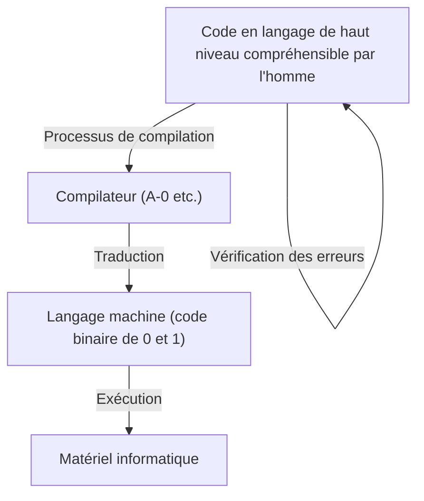
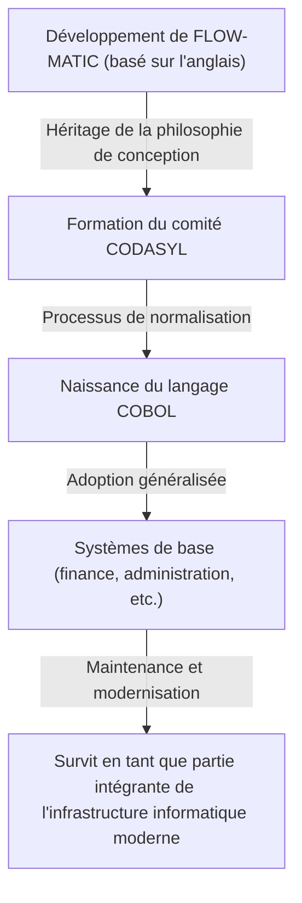

# Pionnière de l'avenir de la programmation : Vie et héritage de Grace Hopper (Mère de COBOL)

La société informatique moderne est soutenue par d'innombrables logiciels et programmes. Des smartphones que nous utilisons tous les jours aux systèmes bancaires, en passant par le contrôle des avions et même l'IA, tout est basé sur les "langages de programmation". Cependant, avant que les humains ne puissent donner des instructions aux ordinateurs dans une langue facile à comprendre, il a fallu d'énormes essais et erreurs et des percées.

À ce tournant historique, l'une des personnes qui a joué le rôle le plus important et le plus décisif fut Grace Murray Hopper. Affectueusement surnommée "Mother of COBOL" (Mère de COBOL) ou "Amazing Grace", elle était contre-amirale dans la marine américaine, mais aussi une mathématicienne de génie et une informaticienne visionnaire.

Dans cet article, nous retracerons la vie de Grace Hopper, comment elle s'est impliquée dans les premiers développements informatiques et a contribué à l'évolution des langages de programmation, et nous explorerons en profondeur ses réalisations incommensurables et son héritage à travers plusieurs milliers de mots.

## Chapitre 1 : Enfance et éducation —— D'une fille curieuse à une mathématicienne

Grace Brewster Murray est née à New York le 9 décembre 1906. Sa famille respectait la curiosité intellectuelle, et Grace elle-même a montré un intérêt extraordinaire pour les machines et les mathématiques dès son plus jeune âge. Une anecdote célèbre raconte qu'à l'âge de 7 ans, elle a démonté successivement sept réveils chez elle pour essayer de comprendre leur fonctionnement. Au lieu de la gronder, sa mère a reconnu son esprit curieux et lui a permis de démonter un seul réveil. Cet environnement est devenu le terreau qui a nourri la grande scientifique qu'elle allait devenir.

En 1924, elle entre au prestigieux Vassar College, où elle se spécialise en mathématiques et en physique. Après avoir obtenu son diplôme avec mention en 1928, elle poursuit ses études à l'école supérieure de l'Université de Yale, obtenant une maîtrise en 1930. La même année, elle épouse Vincent Foster Hopper, devenantainsi "Grace Hopper". En 1934, elle obtient un doctorat (Ph.D.) en mathématiques à l'Université de Yale. À l'époque, il était extrêmement rare qu'une femme obtienne un doctorat en mathématiques, ce qui témoigne de son intelligence et de ses efforts exceptionnels.

Après l'obtention de son diplôme, Grace enseigne les mathématiques dans son alma mater, le Vassar College, et poursuit avec succès une carrière académique. Cependant, l'entrée en guerre des États-Unis dans la Seconde Guerre mondiale suite à l'attaque de Pearl Harbor en 1941 allait changer radicalement son destin.

## Chapitre 2 : Enrôlement dans la Marine et rencontre avec le "Harvard Mark I"

Alors que la guerre s'intensifiait, Grace désirait ardemment servir son pays et se porta volontaire pour rejoindre la réserve féminine de la marine américaine (WAVES : Women Accepted for Volunteer Emergency Service). Au départ, elle a été rejetée car elle ne répondait pas aux critères d'âge (elle avait 34 ans à l'époque) et de poids, mais elle a finalement été admise à titre exceptionnel.

Enrôlée en 1943, elle a été nommée sous-lieutenant en 1944 et affectée au Bureau of Ships Computation Project à l'Université Harvard. C'est là qu'elle a rencontré le "Harvard Mark I", le premier grand ordinateur numérique automatique américain.

Le Mark I était une machine gigantesque, d'environ 15 mètres de long et pesant environ 5 tonnes, composée de centaines de milliers de pièces et de centaines de kilomètres de câblage. Cet ordinateur était responsable de calculs d'une importance militaire capitale, tels que les calculs balistiques pour les tirs navals et les calculs pour les lentilles implosives dans le développement de la bombe atomique (Projet Manhattan).

Hopper a été affectée comme programmeuse pour ce Mark I. À l'époque, la programmation ne consistait pas à taper du code sur un clavier comme aujourd'hui, mais c'était une tâche physique et fastidieuse qui consistait à perforer des bandes de papier pour enregistrer des instructions et à les faire lire par la machine. Sous la direction de Howard Aiken (le concepteur du Mark I), elle a rapidement maîtrisé la structure et le fonctionnement du Mark I, et a joué un rôle central dans le projet, rédigeant notamment le manuel de programmation.

## Chapitre 3 : La naissance d'une légende —— Découverte du premier "Bug" informatique

Dans le monde de l'informatique, les défauts et les erreurs de programme sont appelés "bugs" (insectes), et le processus de leur correction est appelé "debug" (débogage). C'est Grace Hopper et son équipe qui ont popularisé ces termes dans l'industrie informatique.

Le 9 septembre 1947, alors que Hopper et son équipe exploitaient l'ordinateur Mark II à l'Université Harvard, une erreur inexpliquée s'est produite dans le système. Lorsque l'équipe a mené une enquête approfondie à l'intérieur de l'énorme machine, elle a découvert qu'une "mite" (Moth) s'était coincée dans les contacts d'un relais. Cette mite bloquait physiquement le contact, empêchant la machine de fonctionner correctement.

Hopper et son équipe ont soigneusement retiré la mite avec des pincettes et l'ont collée avec du ruban adhésif dans leur journal de bord (logbook). À côté, ils ont laissé la note historique suivante :

> "First actual case of bug being found." (Premier cas réel de découverte d'un bug.)

Bien que le mot "bug" ait été utilisé dans un contexte technique depuis l'époque de Thomas Edison, cet événement a marqué le début de sa large reconnaissance en tant que terme désignant des erreurs de programme ou de système informatique. Ce journal de bord est aujourd'hui conservé au Smithsonian Institution, en tant que relique importante de l'histoire de l'informatique.

## Chapitre 4 : L'invention du compilateur —— Du langage machine au langage humain

Après la guerre, Hopper est restée dans la Marine pour poursuivre ses recherches, mais elle a ensuite rejoint une entreprise privée, Eckert-Mauchly Computer Corporation (qui sera plus tard acquise par Remington Rand), et a participé au développement de l'ordinateur commercial "UNIVAC I".

C'est là qu'elle a eu une idée révolutionnaire qui allait changer à jamais l'histoire de la programmation. À l'époque, la programmation s'effectuait en langage machine (des suites de 0 et de 1) ou en langage assembleur, qui étaient extrêmement proches de la structure de la machine. Cela était non seulement très difficile à lire pour les humains et propice aux erreurs, mais ne pouvait être manipulé que par une poignée de techniciens spécialement formés.

Hopper s'est dit : "Pourquoi ne pas donner des instructions à l'ordinateur dans une langue facile à comprendre pour les humains (comme l'anglais), et laisser l'ordinateur lui-même la traduire en langage machine ?" Ce programme de traduction n'est autre que le "compilateur" (Compiler).

En 1952, elle a développé ce qui est considéré comme le premier compilateur au monde, le "A-0 System". Beaucoup de mathématiciens et d'ingénieurs de l'époque se sont moqués de son idée, affirmant qu'"un ordinateur est une calculatrice, il est impossible qu'il traduise un programme". Cependant, elle n'a pas abandonné et a prouvé son utilité. Grâce à cette percée, la programmation a été libérée des mains de quelques experts, jetant les bases pour qu'un plus grand nombre de personnes puissent participer au développement de logiciels.

## Chapitre 5 : De FLOW-MATIC à COBOL —— Le langage qui a révolutionné le monde des affaires

Bien que le système A-0 ait été principalement destiné aux calculs mathématiques et scientifiques, la vision de Hopper était encore plus large. Elle était convaincue qu'une époque viendrait où les ordinateurs seraient largement utilisés dans le monde des affaires, et elle a estimé qu'un langage de programmation adapté au traitement des données pour les entreprises était nécessaire.

Son équipe a donc développé "FLOW-MATIC" (B-0). FLOW-MATIC fut le premier langage de programmation permettant de décrire le traitement des données en utilisant des mots anglais. Par exemple, il était possible d'écrire des programmes dans une forme proche de la grammaire anglaise, comme "MULTIPLY PRICE BY QUANTITY GIVING TOTAL" (Multiplier le prix par la quantité donnant le total).

En 1959, à l'appel du Département de la Défense des États-Unis, un comité (CODASYL : Conference on Data Systems Languages) a été formé pour développer un langage de programmation standard pour les affaires, pouvant être utilisé de manière commune par les agences gouvernementales et les entreprises privées. Lors de cette conférence, les concepts du FLOW-MATIC de Hopper ont été largement adoptés, ce qui a donné naissance à "COBOL" (COmmon Business Oriented Language).

Bien que Hopper elle-même n'ait pas rédigé directement les spécifications lors de la formulation de COBOL, la philosophie d'une "structure de langage très lisible basée sur l'anglais" qu'elle avait démontrée avec FLOW-MATIC forme le cœur de la conception de COBOL. C'est pourquoi elle est respectueusement appelée la "Mère de COBOL".

COBOL s'est répandu en un clin d'œil et a été adopté dans tous les systèmes de base du monde entier, tels que les systèmes financiers des banques, la gestion des contrats d'assurance et les systèmes administratifs gouvernementaux. Étonnamment, plus de 60 ans après sa création, COBOL continue de fonctionner sur de nombreux systèmes existants (legacy) dans le monde aujourd'hui, soutenant en coulisses notre infrastructure sociale.

## Chapitre 6 : Son visage d'éducatrice et la visualisation des "nanosecondes"

Grace Hopper était non seulement une ingénieure exceptionnelle, mais aussi une éducatrice extrêmement talentueuse. Elle a toujours été passionnée par la transmission de ses connaissances aux jeunes générations.

Une anecdote célèbre qui symbolise son côté éducateur est celle des "fils de nanosecondes". À mesure que la vitesse de traitement des ordinateurs augmentait, les ingénieurs ont commencé à se préoccuper des retards de circuit en termes de "nanosecondes" (un milliardième de seconde). Cependant, il est difficile de comprendre intuitivement un laps de temps aussi extrêmement court.

Hopper a donc calculé la distance parcourue par la lumière (ou un signal électrique) dans le vide (ou un fil de cuivre) pendant une nanoseconde. C'était environ 11,8 pouces (environ 30 centimètres). Elle a découpé de grandes quantités de fil de cette longueur et les a distribuées aux gens lors de conférences et de réunions en disant : "Voici une nanoseconde."

"Pourquoi les retards de communication se produisent-ils ? Pourquoi devons-nous rendre les ordinateurs encore plus petits ? Il suffit de regarder ce fil d'une 'nanoseconde' pour le comprendre. Il faut du temps pour qu'un signal parcoure une distance physique."

Ainsi, elle avait le génie de transformer des concepts complexes et abstraits en métaphores physiques que tout le monde pouvait comprendre. Cette approche pleine d'humour et de perspicacité a inspiré de nombreux jeunes ingénieurs et étudiants.

## Chapitre 7 : Retour dans la Marine et promotion de la normalisation

En 1966, Hopper a pris sa retraite de la Marine, mais à peine sept mois plus tard, elle a été rappelée. La multitude de langages de programmation et de systèmes utilisés au sein de la Marine avaient perdu leur compatibilité, ce qui causait de graves problèmes.

De retour au service actif, elle a dirigé la normalisation de COBOL dans la Marine et le développement de programmes de vérification des compilateurs (routines de validation). Cela a permis de garantir que les mêmes programmes COBOL fonctionneraient correctement, même sur des ordinateurs de différents fabricants. Cette contribution à la normalisation a joué un rôle extrêmement important dans le développement ultérieur de l'ensemble de l'industrie du logiciel.

Elle a continué à être promue, et en 1983, sur ordre spécial du président Ronald Reagan, elle a été promue au rang de commodore. Finalement, en 1986, lorsqu'elle a pris sa retraite de la Marine à l'âge de 79 ans, elle avait été promue contre-amirale (Rear Admiral). Au moment de sa retraite, elle était l'officier d'active le plus âgé de l'ensemble des forces armées américaines.

## Chapitre 8 : Dernières années, honneurs et héritage laissé

Même après sa retraite de la Marine, sa passion ne s'est pas démentie. Elle a été engagée comme consultante principale chez DEC (Digital Equipment Corporation), et jusqu'à peu de temps avant sa mort, elle est restée très active en donnant des conférences et en encadrant de jeunes ingénieurs.

Le 1er janvier 1992, Grace Hopper est décédée à l'âge de 85 ans. Sa dépouille a été inhumée au cimetière national d'Arlington avec les plus grands honneurs militaires.

En reconnaissance de ses réalisations, le destroyer lance-missiles de classe Arleigh Burke de la marine américaine a été nommé "Hopper" (USS Hopper, DDG-70) en 1997. Il est extrêmement rare qu'un navire de la Marine porte le nom d'une femme. En outre, en 2016, le président Barack Obama lui a décerné à titre posthume la "Médaille présidentielle de la Liberté", la plus haute distinction civile aux États-Unis.

## Conclusion : Ce que nous apprend Amazing Grace

La vie de Grace Hopper a été une histoire de défis constants lancés aux cadres et au bon sens établis.

"C'est parce que nous avons toujours fait comme ça" (We've always done it that way)

Elle détestait profondément cette phrase, qu'elle considérait comme "la phrase la plus dangereuse de la langue anglaise". Ne se satisfaisant pas du statu quo, son attitude consistant à toujours chercher de meilleures méthodes, des méthodes plus efficaces, des méthodes utilisables par un plus grand nombre de personnes, est ce qui a donné naissance au compilateur, a donné naissance à COBOL, et a jeté les bases de la société informatique d'aujourd'hui.

Si la programmation n'est plus réservée à quelques génies, mais est devenue un outil que tout le monde peut utiliser, c'est parce qu'elle a eu la vision de "traduire le langage de la machine en langage humain" et l'a réalisée. Le fait que nous puissions aujourd'hui utiliser confortablement les ordinateurs et développer des logiciels sophistiqués n'est rien d'autre que parce que nous nous tenons sur la voie ouverte par la "Mère de COBOL", Grace Hopper.

L'héritage qu'elle a laissé ne se limite pas à de simples codes ou systèmes, mais continue de vivre dans le domaine du développement logiciel en tant que philosophie selon laquelle "la technologie devrait être proche des humains".

(Fin)
