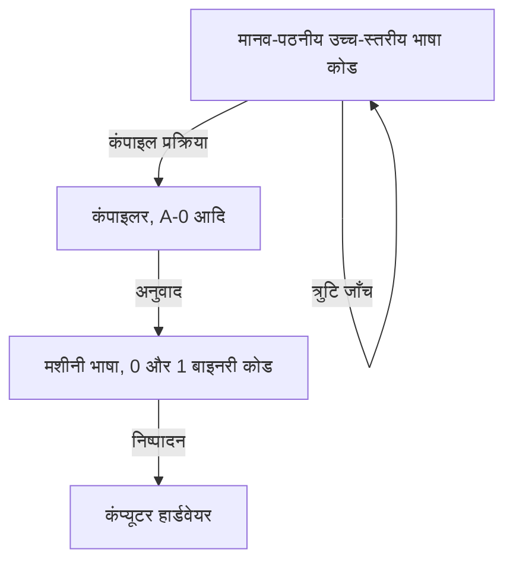
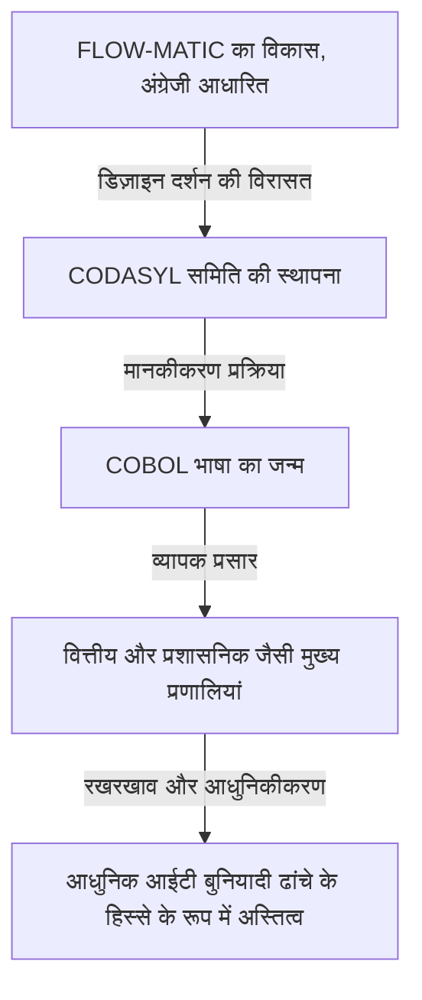

# प्रोग्रामिंग के भविष्य का मार्ग प्रशस्त करने वाली अग्रणी: ग्रेस हॉपर (कोबोल की जननी) का जीवन और विरासत

आधुनिक आईटी समाज अनगिनत सॉफ्टवेयर और प्रोग्रामों द्वारा समर्थित है। स्मार्टफोन, बैंकिंग सिस्टम, विमान नियंत्रण और यहां तक कि एआई जो हम हर दिन उपयोग करते हैं, सभी "प्रोग्रामिंग भाषाओं" की नींव पर बने हैं। हालांकि, इंसानों के आसानी से समझ में आने वाले शब्दों में कंप्यूटर को निर्देश देने में सक्षम होने से पहले, जबरदस्त परीक्षण, त्रुटि और सफलताएं थीं।

इस ऐतिहासिक मोड़ में सबसे महत्वपूर्ण और निर्णायक भूमिका निभाने वाले लोगों में से एक ग्रेस मरे हॉपर (Grace Murray Hopper) थीं। "कोबोल की जननी (Mother of COBOL)" और "अमेजिंग ग्रेस (Amazing Grace)" जैसे उपनामों से जानी जाने वाली, वह अमेरिकी नौसेना की रियर एडमिरल होने के साथ-साथ एक प्रतिभाशाली गणितज्ञ और दूरदर्शी कंप्यूटर वैज्ञानिक थीं।

इस लेख में, हम ग्रेस हॉपर के जीवन का पता लगाएंगे, यह जांच करेंगे कि कैसे वह प्रारंभिक कंप्यूटर विकास में शामिल हुईं और प्रोग्रामिंग भाषाओं के विकास में योगदान दिया, और उनकी अथाह उपलब्धियों और विरासत में गहराई से गोता लगाएँगे।

## अध्याय 1: बचपन और शिक्षा —— एक जिज्ञासु लड़की से गणितज्ञ तक

ग्रेस ब्रूस्टर मरे का जन्म 9 दिसंबर, 1906 को न्यूयॉर्क शहर में हुआ था। उनका परिवार एक ऐसा माहौल प्रदान करता था जो बौद्धिक जिज्ञासा का सम्मान करता था, और ग्रेस ने खुद बचपन से ही मशीनों और गणित में असाधारण रुचि दिखाई थी। एक प्रसिद्ध किस्सा है कि जब वह 7 साल की थीं, तो उन्होंने अपने घर की सात अलार्म घड़ियों को एक-एक करके खोल दिया ताकि यह समझ सकें कि वे कैसे काम करती हैं। उन्हें डांटने के बजाय, उनकी माँ ने उनकी खोजी प्रकृति को पहचाना और उन्हें केवल एक घड़ी को अलग करने की अनुमति दी। इस माहौल ने उस मिट्टी का काम किया जिसने बाद में इस महान वैज्ञानिक का पोषण किया।

1924 में, उन्होंने प्रतिष्ठित वासर कॉलेज में प्रवेश लिया, जहाँ उन्होंने गणित और भौतिकी में पढ़ाई की। 1928 में उत्कृष्ट ग्रेड के साथ स्नातक होने के बाद, वह येल विश्वविद्यालय के स्नातक विद्यालय में गईं, जहाँ उन्होंने 1930 में अपनी मास्टर डिग्री प्राप्त की। उसी वर्ष, उन्होंने विन्सेंट फोस्टर हॉपर से शादी की और "ग्रेस हॉपर" बन गईं। 1934 में, उन्होंने येल विश्वविद्यालय से गणित में अपनी डॉक्टरेट (Ph.D.) प्राप्त की। उस समय, एक महिला के लिए गणित में पीएचडी प्राप्त करना बहुत दुर्लभ था, जो उनकी असाधारण बौद्धिक क्षमता और प्रयास को दर्शाता है।

स्नातक होने के बाद, ग्रेस ने अपनी मातृ संस्था वासर कॉलेज में गणित पढ़ाया और एक विद्वान के रूप में आगे बढ़ रही थीं। हालाँकि, 1941 में पर्ल हार्बर पर हुए हमले के बाद द्वितीय विश्व युद्ध में अमेरिका के प्रवेश ने उनके भाग्य को काफी बदल दिया।

## अध्याय 2: नौसेना में भर्ती और "Harvard Mark I" से मुठभेड़

जैसे-जैसे युद्ध तेज हुआ, ग्रेस ने अपने देश के लिए योगदान देने की तीव्र इच्छा महसूस की और अमेरिकी नौसेना की महिला रिजर्व (WAVES: Women Accepted for Volunteer Emergency Service) में शामिल होने के लिए स्वेच्छा से आवेदन किया। शुरू में उनकी उम्र (उस समय 34 वर्ष) और वजन के कारण उन्हें अस्वीकार कर दिया गया था, लेकिन उन्हें एक विशेष अपवाद के रूप में शामिल होने की अनुमति दी गई।

1943 में भर्ती होने के बाद, उन्हें 1944 में लेफ्टिनेंट के रूप में नियुक्त किया गया और हार्वर्ड विश्वविद्यालय में ब्यूरो ऑफ शिप्स कंप्यूटेशन प्रोजेक्ट में नियुक्त किया गया। वहां उनका सामना अमेरिका के पहले बड़े पैमाने के स्वचालित डिजिटल कंप्यूटर, "Harvard Mark I" से हुआ।

मार्क I लगभग 15 मीटर लंबी और 5 टन वजनी एक विशाल मशीन थी, जिसमें सैकड़ों हजारों हिस्से और सैकड़ों किलोमीटर के तार थे। यह कंप्यूटर सैन्य रूप से महत्वपूर्ण गणनाओं के लिए जिम्मेदार था, जैसे कि नौसेना की बंदूकों के लिए बैलिस्टिक गणना और परमाणु बम (मैनहट्टन प्रोजेक्ट) के विकास में प्रयुक्त इम्प्लोशन लेंस के लिए गणना।

हॉपर को इस मार्क I के लिए प्रोग्रामर के रूप में नियुक्त किया गया था। उस समय की प्रोग्रामिंग आज की तरह कीबोर्ड से कोड टाइप करने जैसी नहीं थी, बल्कि निर्देशों को रिकॉर्ड करने के लिए पेपर टेप में छेद करने और मशीन को उन्हें पढ़ने देने का एक भौतिक और बोझिल काम था। हावर्ड ऐकेन (मार्क I के डिजाइनर) के मार्गदर्शन में, उन्होंने जल्दी ही मार्क I की संरचना और संचालन में महारत हासिल कर ली, प्रोग्रामिंग मैनुअल बनाए और प्रोजेक्ट के मूल के रूप में काम किया।

## अध्याय 3: एक किंवदंती का जन्म —— पहले "कंप्यूटर बग" की खोज

कंप्यूटर की दुनिया में, किसी प्रोग्राम में आने वाली खराबी या त्रुटि को "बग (Bug = कीड़ा)" कहा जाता है, और इसे ठीक करने की प्रक्रिया को "डीबगिंग (Debug)" कहा जाता है। वह कोई और नहीं बल्कि ग्रेस हॉपर और उनकी टीम थी जिसने कंप्यूटर उद्योग में इस शब्द को लोकप्रिय बनाया।

9 सितंबर, 1947 को, हॉपर और उनकी टीम हार्वर्ड विश्वविद्यालय में मार्क II कंप्यूटर चला रही थी, लेकिन सिस्टम ने एक अस्पष्ट त्रुटि का अनुभव किया। जब टीम ने विशाल उपकरण के अंदरूनी हिस्से की पूरी जांच की, तो उन्होंने पाया कि एक "पतंगा (Moth)" रिले संपर्कों में फंस गया था। यह पतंगा शारीरिक रूप से संपर्क को अवरुद्ध कर रहा था, जिससे मशीन ठीक से काम नहीं कर रही थी।

हॉपर की टीम ने चिमटी से पतंगे को सावधानीपूर्वक हटा दिया और इसे अपनी लॉगबुक में टेप से चिपका दिया। और उसके बगल में, उन्होंने निम्नलिखित ऐतिहासिक नोट लिखा:

> "First actual case of bug being found." (बग पाए जाने का पहला वास्तविक मामला।)

तकनीकी संदर्भ में "बग" शब्द का प्रयोग थॉमस एडिसन के समय से किया जा रहा है, लेकिन इस घटना के बाद यह कंप्यूटर प्रोग्राम और सिस्टम त्रुटियों के संदर्भ में व्यापक रूप से पहचाना जाने लगा। यह लॉगबुक वर्तमान में स्मिथसोनियन इंस्टीट्यूशन में रखी गई है और आईटी इतिहास में एक महत्वपूर्ण अवशेष बन गई है।

## अध्याय 4: कंपाइलर का आविष्कार —— मशीन की भाषा से मानव की भाषा तक

युद्ध के बाद भी, हॉपर नौसेना में रहीं और अपना शोध जारी रखा, लेकिन अंततः वह एक निजी कंपनी, एकर्ट-मॉकली कंप्यूटर कॉर्पोरेशन (जिसे बाद में रेमिंगटन रैंड द्वारा अधिग्रहित कर लिया गया) में चली गईं, जहाँ उन्होंने वाणिज्यिक कंप्यूटर "UNIVAC I" के विकास पर काम किया।

यहाँ, उन्हें एक अभूतपूर्व विचार आया जो प्रोग्रामिंग के इतिहास को हमेशा के लिए बदल देगा। उस समय, प्रोग्रामिंग मशीनी भाषा (0 और 1 की एक स्ट्रिंग) और असेंबली भाषा में की जाती थी, जो मशीन की संरचना के बहुत करीब थीं। यह मनुष्यों के लिए पढ़ना बहुत कठिन था, इसमें त्रुटियां होने का खतरा था, और इसका उपयोग केवल मुट्ठी भर विशेष रूप से प्रशिक्षित तकनीशियनों द्वारा ही किया जा सकता था।

हॉपर ने सोचा, "कंप्यूटर को मनुष्यों द्वारा आसानी से समझी जाने वाली भाषा (जैसे अंग्रेजी) में निर्देश क्यों नहीं दिए जा सकते, और कंप्यूटर खुद उन्हें मशीनी भाषा में अनुवाद कर दे?" यह अनुवाद प्रोग्राम ही "कंपाइलर (Compiler)" है।

1952 में, उन्होंने "A-0 System" विकसित किया, जिसे दुनिया का पहला कंपाइलर माना जाता है। उस समय कई गणितज्ञों और इंजीनियरों ने उनके विचार का मज़ाक उड़ाया और कहा, "कंप्यूटर सिर्फ कैलकुलेटर हैं, वे प्रोग्राम का अनुवाद नहीं कर सकते।" हालाँकि, उन्होंने हार नहीं मानी और इसकी व्यावहारिकता साबित की। इस सफलता ने प्रोग्रामिंग को कुछ विशेषज्ञों के हाथों से मुक्त कर दिया और एक ऐसी नींव रखी जिसने अधिक लोगों को सॉफ्टवेयर विकास में भाग लेने की अनुमति दी।

## अध्याय 5: FLOW-MATIC से COBOL तक —— एक भाषा जिसने व्यापारिक दुनिया में क्रांति ला दी

हालाँकि A-0 सिस्टम मुख्य रूप से गणितीय और वैज्ञानिक गणनाओं के लिए था, हॉपर की दृष्टि व्यापक थी। उन्हें यकीन था कि वह समय आएगा जब व्यापारिक दुनिया में कंप्यूटर का व्यापक रूप से उपयोग किया जाएगा, और उन्होंने महसूस किया कि व्यावसायिक डेटा प्रसंस्करण के अनुकूल एक प्रोग्रामिंग भाषा की आवश्यकता है।

इसलिए, उनकी टीम ने "FLOW-MATIC (B-0)" विकसित किया। FLOW-MATIC पहली प्रोग्रामिंग भाषा थी जिसने अंग्रेजी शब्दों का उपयोग करके डेटा प्रोसेसिंग का वर्णन करना संभव बनाया। उदाहरण के लिए, "MULTIPLY PRICE BY QUANTITY GIVING TOTAL" (मूल्य को मात्रा से गुणा करके कुल दें) जैसे अंग्रेजी व्याकरण के करीब के रूप में प्रोग्राम लिखना संभव था।

1959 में, अमेरिकी रक्षा विभाग के आह्वान पर, सरकारी एजेंसियों और निजी कंपनियों द्वारा सामान्य रूप से उपयोग की जा सकने वाली व्यावसायिक उपयोग के लिए एक मानक प्रोग्रामिंग भाषा विकसित करने के लिए एक सम्मेलन (CODASYL: डेटा सिस्टम लैंग्वेज पर सम्मेलन) स्थापित किया गया था। इस सम्मेलन में, हॉपर के FLOW-MATIC की अवधारणा को काफी हद तक अपनाया गया और "COBOL (COmmon Business Oriented Language)" का जन्म हुआ।

हालाँकि हॉपर ने खुद COBOL को विकसित करने में सीधे तौर पर विनिर्देश नहीं लिखे थे, लेकिन FLOW-MATIC के साथ उन्होंने "अंग्रेजी-आधारित और अत्यधिक पठनीय भाषा संरचना" का जो दर्शन प्रदर्शित किया, वह COBOL के डिजाइन का मूल है। इसलिए, उन्हें सम्मानपूर्वक "कोबोल की जननी" कहा जाता है।

COBOL तेजी से फैल गया और दुनिया भर में बैंकिंग वित्तीय प्रणालियों, बीमा अनुबंध प्रबंधन और सरकारी प्रशासनिक प्रणालियों जैसे सभी प्रकार के मुख्य प्रणालियों में अपनाया गया। आश्चर्यजनक रूप से, इसके जन्म के 60 से अधिक वर्षों के बाद भी, COBOL दुनिया भर में कई विरासत प्रणालियों में काम करना जारी रखता है, और पर्दे के पीछे हमारे सामाजिक बुनियादी ढांचे का समर्थन करता है।

## अध्याय 6: एक शिक्षक के रूप में और "नैनोसेकंड" का दृश्यीकरण

ग्रेस हॉपर न केवल एक उत्कृष्ट इंजीनियर थीं, बल्कि एक बहुत ही प्रतिभाशाली शिक्षक भी थीं। वह हमेशा युवा पीढ़ी को ज्ञान देने के प्रति जुनूनी थीं।

एक शिक्षक के रूप में उनके एक प्रसिद्ध किस्से में "नैनोसेकंड (Nanosecond) का तार" शामिल है। जैसे-जैसे कंप्यूटर की प्रोसेसिंग स्पीड बढ़ती गई, इंजीनियर "नैनोसेकंड (एक सेकंड का एक अरबवाँ हिस्सा)" की इकाइयों में सर्किट की देरी को लेकर चिंतित होने लगे। हालाँकि, नैनोसेकंड जितने छोटे समय को सहजता से समझना मुश्किल है।

इसलिए हॉपर ने उस दूरी की गणना की जो प्रकाश (या एक विद्युत संकेत) 1 नैनोसेकंड में निर्वात (या तांबे के तार) में यात्रा करता है। यह लगभग 11.8 इंच (लगभग 30 सेंटीमीटर) था। उन्होंने इस लंबाई के तारों के एक बड़े बैच को काट दिया और उन्हें व्याख्यान और सम्मेलनों में लोगों को यह कहते हुए बांट दिया, "यह 1 नैनोसेकंड है।"

"संचार में देरी क्यों होती है? हमें कंप्यूटर को और छोटा क्यों करना पड़ता है? यदि आप इस 'नैनोसेकंड' तार को देखें, तो यह स्पष्ट हो जाएगा। संकेतों को भौतिक दूरी तय करने में समय लगता है।"

इस तरह, वह जटिल और अमूर्त अवधारणाओं को भौतिक रूपकों में बदलने में माहिर थीं जिन्हें कोई भी समझ सके। हास्य और अंतर्दृष्टि से भरे इस दृष्टिकोण ने कई युवा इंजीनियरों और छात्रों को प्रेरित किया।

## अध्याय 7: नौसेना में वापसी और मानकीकरण को बढ़ावा देना

1966 में, हॉपर नौसेना से सेवानिवृत्त हो गईं, लेकिन केवल सात महीने बाद उन्हें नौसेना द्वारा वापस बुला लिया गया। ऐसा इसलिए था क्योंकि नौसेना के भीतर उपयोग की जाने वाली विभिन्न प्रकार की प्रोग्रामिंग भाषाओं और प्रणालियों ने संगतता खो दी थी, जिससे गंभीर समस्याएं पैदा हो रही थीं।

सक्रिय ड्यूटी पर लौटकर, उन्होंने नौसेना में COBOL के मानकीकरण और कंपाइलर के लिए सत्यापन कार्यक्रमों (सत्यापन दिनचर्या) के विकास का नेतृत्व किया। इसने यह सुनिश्चित किया कि एक ही COBOL प्रोग्राम अलग-अलग निर्माताओं के कंप्यूटरों पर भी सही ढंग से काम करेगा। मानकीकरण में इस योगदान ने बाद में पूरे सॉफ्टवेयर उद्योग के विकास में महत्वपूर्ण भूमिका निभाई।

इसके बाद भी उनका पदोन्नति जारी रहा और 1983 में राष्ट्रपति रोनाल्ड रीगन की विशेष नियुक्ति द्वारा उन्हें कमोडोर के रूप में पदोन्नत किया गया। अंततः, 1986 में 79 वर्ष की आयु में नौसेना से सेवानिवृत्त होने पर उन्हें रियर एडमिरल (Rear Admiral) के रूप में पदोन्नत किया गया था। सेवानिवृत्ति के समय, वह पूरी अमेरिकी सेना में सबसे उम्रदराज सक्रिय ड्यूटी अधिकारी थीं।

## अध्याय 8: बाद के वर्ष और सम्मान, और छोड़ी गई विरासत

नौसेना से सेवानिवृत्त होने के बाद भी उनका जुनून कम नहीं हुआ। उन्हें डीईसी (डिजिटल इक्विपमेंट कॉर्पोरेशन) के वरिष्ठ सलाहकार के रूप में नियुक्त किया गया था और अपनी मृत्यु से ठीक पहले तक वह व्याख्यान देने और युवा इंजीनियरों को प्रशिक्षित करने में व्यस्त रहीं।

1 जनवरी, 1992 को ग्रेस हॉपर का 85 वर्ष की आयु में निधन हो गया। उनके शरीर को अर्लिंग्टन राष्ट्रीय कब्रिस्तान में सर्वोच्च सैन्य सम्मान के साथ दफनाया गया था।

उनकी उपलब्धियों के सम्मान में, 1997 में अमेरिकी नौसेना के एजिस विध्वंसक का नाम "हॉपर (USS Hopper, DDG-70)" रखा गया था। नौसेना के किसी जहाज का नाम किसी महिला के नाम पर रखा जाना बहुत दुर्लभ है। इसके अलावा, 2016 में, राष्ट्रपति बराक ओबामा द्वारा उन्हें मरणोपरांत अमेरिका में सर्वोच्च नागरिक सम्मान "प्रेसिडेंशियल मेडल ऑफ फ्रीडम" से सम्मानित किया गया था।

## निष्कर्ष: अमेजिंग ग्रेस से सीखना

ग्रेस हॉपर का जीवन मौजूदा ढांचे और सामान्य ज्ञान को चुनौती देने का इतिहास था।

"हमने इसे हमेशा इसी तरह से किया है (We've always done it that way)"

वह इस वाक्यांश को "अंग्रेजी में सबसे खतरनाक वाक्यांश" मानकर इससे नफरत करती थीं। यथास्थिति से संतुष्ट न होकर हमेशा बेहतर तरीके, अधिक कुशल तरीके और ऐसे तरीके खोजने का उनका दृष्टिकोण, जिसे अधिक लोग उपयोग कर सकें, इसी ने कंपाइलर को जन्म दिया, COBOL को जन्म दिया, और आज के आईटी समाज की नींव रखी।

प्रोग्रामिंग केवल कुछ प्रतिभाओं के लिए एक उपकरण नहीं रह गई है, बल्कि एक ऐसा उपकरण बन गई है जिसका उपयोग कोई भी कर सकता है, क्योंकि उनके पास "मशीनों की भाषा को मनुष्यों की भाषा में अनुवाद करने" का दृष्टिकोण था और इसे साकार किया। आज हम आसानी से कंप्यूटर का उपयोग कर सकते हैं और उन्नत सॉफ्टवेयर विकसित कर सकते हैं, इसका एकमात्र कारण यह है कि हम उस रास्ते पर खड़े हैं जिसे "कोबोल की जननी" ग्रेस हॉपर ने बनाया था।

उनके द्वारा छोड़ी गई विरासत केवल कोड और सिस्टम तक ही सीमित नहीं है, बल्कि आज भी सॉफ्टवेयर विकास के क्षेत्र में इस दर्शन के रूप में जीवित है कि "प्रौद्योगिकी को मनुष्यों के करीब होना चाहिए।"

(समाप्त)
