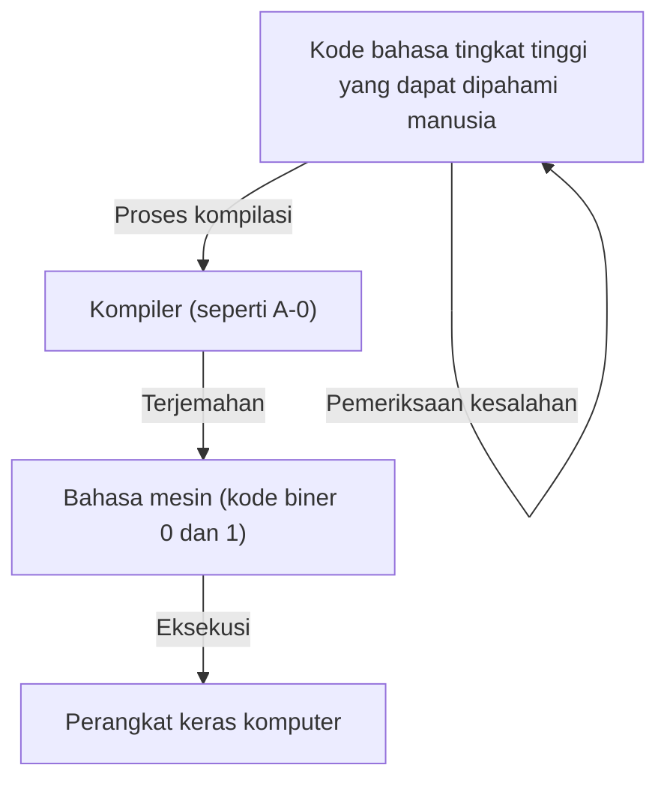
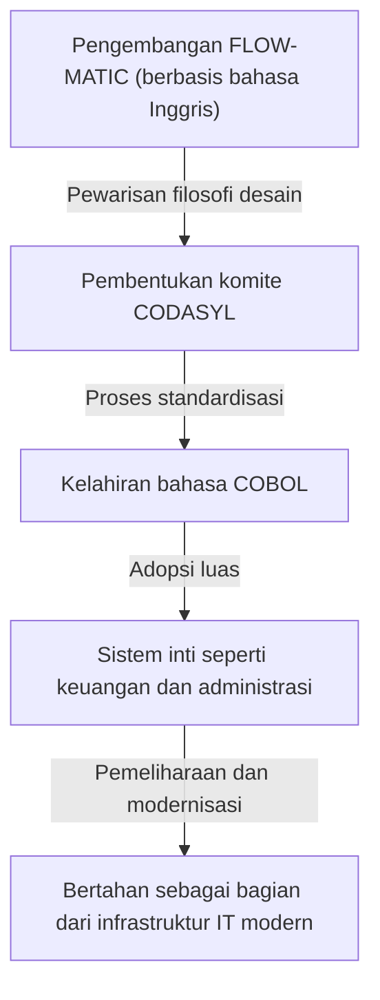

# Pelopor yang Membuka Masa Depan Pemrograman: Kehidupan dan Warisan Grace Hopper (Ibu COBOL)

Masyarakat IT modern didukung oleh perangkat lunak dan program yang tak terhitung jumlahnya. Mulai dari ponsel pintar yang kita gunakan setiap hari, sistem perbankan, kontrol penerbangan, hingga AI, semuanya dibangun di atas fondasi "bahasa pemrograman". Namun, sebelum manusia dapat memberikan instruksi kepada komputer dalam bahasa yang mudah dipahami, ada banyak percobaan dan terobosan yang luar biasa.

Salah satu tokoh paling penting dan menentukan dalam titik balik sejarah ini adalah Grace Murray Hopper. Dikenal dengan julukan seperti "Mother of COBOL" (Ibu COBOL) dan "Amazing Grace", ia adalah seorang laksamana muda di Angkatan Laut AS, sekaligus matematikawan jenius dan ilmuwan komputer yang visioner.

Artikel ini akan menelusuri kehidupan Grace Hopper, mendalami bagaimana ia terlibat dalam pengembangan komputer awal, kontribusinya terhadap evolusi bahasa pemrograman, serta pencapaian dan warisannya yang tak ternilai, melalui ribuan kata.

## Bab 1: Masa Kecil dan Pendidikan —— Dari Gadis Penuh Rasa Ingin Tahu Menjadi Matematikawan

Grace Brewster Murray lahir di New York City pada 9 Desember 1906. Keluarganya menghargai rasa ingin tahu intelektual, dan Grace sendiri menunjukkan minat yang luar biasa pada mesin dan matematika sejak usia dini. Sebuah cerita terkenal menyebutkan bahwa pada usia 7 tahun, ia membongkar tujuh jam alarm di rumahnya satu per satu untuk memahami cara kerjanya. Alih-alih memarahinya, ibunya justru mengakui keingintahuannya dan mengizinkannya untuk membongkar satu jam saja. Lingkungan seperti inilah yang menjadi lahan subur bagi ilmuwan besar di masa depan.

Pada tahun 1924, ia masuk ke Vassar College yang bergengsi, mengambil jurusan matematika dan fisika. Setelah lulus dengan nilai memuaskan pada tahun 1928, ia melanjutkan ke sekolah pascasarjana di Universitas Yale, dan meraih gelar master pada tahun 1930. Pada tahun yang sama, ia menikah dengan Vincent Foster Hopper dan mengambil nama "Grace Hopper". Pada tahun 1934, ia meraih gelar doktor (Ph.D.) dalam bidang matematika dari Universitas Yale. Pada masa itu, sangat jarang bagi seorang wanita untuk meraih gelar doktor di bidang matematika, yang menunjukkan kemampuan intelektual dan usahanya yang luar biasa.

Setelah lulus, Grace mengajar matematika di almamaternya, Vassar College, dan dengan lancar meniti karier sebagai akademisi. Namun, serangan ke Pearl Harbor pada tahun 1941 yang membawa Amerika Serikat ke dalam Perang Dunia II, mengubah nasibnya secara drastis.

## Bab 2: Mendaftar di Angkatan Laut dan Pertemuan dengan "Harvard Mark I"

Di tengah perang yang semakin memanas, Grace sangat ingin berkontribusi pada negaranya dan mendaftar secara sukarela untuk bergabung dengan WAVES (Women Accepted for Volunteer Emergency Service) Angkatan Laut AS. Awalnya ia ditolak karena tidak memenuhi kriteria usia (saat itu 34 tahun) dan berat badan, tetapi kemudian diterima sebagai pengecualian.

Mendaftar pada tahun 1943, ia ditugaskan sebagai letnan muda pada tahun 1944 dan ditempatkan di Bureau of Ships Computation Project di Universitas Harvard. Di sanalah ia bertemu dengan "Harvard Mark I", komputer digital otomatis berskala besar pertama di Amerika.

Mark I adalah mesin raksasa dengan panjang sekitar 15 meter dan berat sekitar 5 ton, terdiri dari ratusan ribu suku cadang dan ratusan kilometer kabel. Komputer ini menangani perhitungan yang sangat penting secara militer, seperti perhitungan lintasan tembakan meriam angkatan laut dan perhitungan lensa ledak dalam pengembangan bom atom (Proyek Manhattan).

Hopper ditugaskan sebagai programmer untuk Mark I. Pemrograman pada masa itu bukan tentang mengetik kode dari keyboard seperti sekarang, melainkan proses fisik yang rumit dengan melubangi pita kertas untuk merekam instruksi dan memasukkannya ke dalam mesin. Di bawah bimbingan Howard Aiken (perancang Mark I), ia dengan cepat menguasai struktur dan pengoperasian Mark I, membuat manual pemrograman, dan berperan sebagai tokoh sentral dalam proyek tersebut.

## Bab 3: Lahirnya Legenda —— Penemuan "Bug Komputer" Pertama

Dalam dunia komputer, cacat atau kesalahan dalam suatu program disebut "bug" (serangga), dan proses untuk memperbaikinya disebut "debug". Grace Hopper dan timnyalah yang mempopulerkan istilah ini di industri komputer.

Pada tanggal 9 September 1947, Hopper dan timnya sedang mengoperasikan komputer Mark II di Universitas Harvard ketika sistem mengalami kesalahan yang tidak diketahui penyebabnya. Ketika tim memeriksa bagian dalam mesin raksasa itu secara menyeluruh, mereka menemukan seekor ngengat (Moth) terjepit di antara kontak relai. Ngengat inilah yang secara fisik menyumbat kontak, sehingga mesin tidak berfungsi dengan baik.

Hopper dan rekan-rekannya mengambil ngengat itu dengan hati-hati menggunakan pinset dan menempelkannya dengan selotip di buku catatan harian (logbook). Di sebelahnya, mereka menuliskan catatan bersejarah berikut:

> "First actual case of bug being found." (Kasus pertama bug yang sebenarnya ditemukan.)

Meskipun istilah "bug" itu sendiri telah digunakan dalam konteks teknis sejak zaman Thomas Edison, kejadian inilah yang memicu penggunaannya secara luas untuk merujuk pada program komputer dan kesalahan sistem. Logbook ini sekarang disimpan di Institusi Smithsonian, menjadi peninggalan penting dalam sejarah IT.

## Bab 4: Penemuan Kompiler —— Dari Bahasa Mesin ke Bahasa Manusia

Setelah perang berakhir, Hopper tetap di Angkatan Laut untuk melanjutkan penelitiannya, tetapi kemudian pindah ke perusahaan swasta Eckert-Mauchly Computer Corporation (yang kemudian diakuisisi oleh Remington Rand), di mana ia terlibat dalam pengembangan komputer komersial "UNIVAC I".

Di sinilah ia mendapatkan ide revolusioner yang akan mengubah sejarah pemrograman selamanya. Pemrograman pada masa itu dilakukan dalam bahasa yang sangat dekat dengan struktur mesin, seperti bahasa mesin (deretan angka 0 dan 1) atau bahasa rakitan. Ini sangat sulit dibaca oleh manusia, rentan terhadap kesalahan, dan hanya dapat ditangani oleh segelintir teknisi yang terlatih khusus.

Hopper berpikir, "Bukankah lebih baik jika kita bisa memberikan instruksi kepada komputer dalam bahasa yang mudah dipahami manusia (seperti bahasa Inggris), dan membiarkan komputer itu sendiri yang menerjemahkannya ke dalam bahasa mesin?" Program penerjemah inilah yang disebut "Compiler" (Kompiler).

Pada tahun 1952, ia mengembangkan kompiler pertama di dunia yang disebut "A-0 System". Pada saat itu, banyak matematikawan dan insinyur mencemooh idenya dengan mengatakan bahwa "komputer hanyalah mesin hitung, dan tidak mungkin menerjemahkan program". Namun, ia tidak menyerah dan membuktikan kepraktisannya. Melalui terobosan ini, pemrograman dibebaskan dari segelintir ahli dan meletakkan dasar bagi lebih banyak orang untuk berpartisipasi dalam pengembangan perangkat lunak.

## Bab 5: Dari FLOW-MATIC ke COBOL —— Bahasa yang Merevolusi Dunia Bisnis

Sistem A-0 ditujukan terutama untuk perhitungan matematis dan ilmiah, tetapi visi Hopper lebih luas dari itu. Ia yakin bahwa akan tiba saatnya ketika komputer digunakan secara luas di dunia bisnis, dan ia berpikir bahwa bahasa pemrograman yang cocok untuk pemrosesan data bisnis sangat diperlukan.

Oleh karena itu, timnya mengembangkan "FLOW-MATIC (B-0)". FLOW-MATIC adalah bahasa pemrograman pertama yang memungkinkan pemrosesan data ditulis menggunakan kata-kata bahasa Inggris. Misalnya, program dapat ditulis dengan cara yang menyerupai tata bahasa Inggris, seperti "MULTIPLY PRICE BY QUANTITY GIVING TOTAL" (Kalikan harga dengan kuantitas untuk menghasilkan total).

Pada tahun 1959, atas seruan dari Departemen Pertahanan AS, sebuah komite dibentuk (CODASYL: Conference on Data Systems Languages) untuk mengembangkan bahasa pemrograman standar berorientasi bisnis yang dapat digunakan bersama oleh lembaga pemerintah dan perusahaan swasta. Dalam komite ini, konsep FLOW-MATIC Hopper banyak diadopsi, dan lahirlah "COBOL (COmmon Business Oriented Language)".

Meskipun Hopper tidak menulis spesifikasi langsung saat COBOL dirumuskan, filosofinya tentang "struktur bahasa berbasis bahasa Inggris dengan keterbacaan tinggi" yang ia buktikan melalui FLOW-MATIC merupakan dasar dari desain COBOL. Oleh karena itu, ia dengan hormat disebut sebagai "Ibu COBOL".

COBOL menyebar dengan cepat dan diadopsi dalam berbagai sistem inti di seluruh dunia, termasuk sistem keuangan bank, manajemen kontrak asuransi, dan sistem administrasi pemerintah. Hebatnya, bahkan lebih dari 60 tahun setelah kemunculannya, COBOL masih terus beroperasi di banyak sistem lama (legacy system) di seluruh dunia, secara diam-diam mendukung infrastruktur sosial kita.

## Bab 6: Peran sebagai Pendidik dan Visualisasi "Nanodetik"

Grace Hopper bukan hanya seorang insinyur yang luar biasa, tetapi juga seorang pendidik yang sangat berbakat. Ia selalu menaruh semangat untuk mewariskan pengetahuannya kepada generasi muda.

Sebuah cerita terkenal yang melambangkan sisinya sebagai pendidik adalah "kawat nanodetik" (Nanosecond). Seiring dengan peningkatan kecepatan pemrosesan komputer, para insinyur mulai memperhatikan keterlambatan sirkuit dalam satuan "nanodetik (sepersemiliar detik)". Namun, sangat sulit untuk memahami secara intuitif waktu yang begitu singkat seperti nanodetik.

Oleh karena itu, Hopper menghitung jarak yang ditempuh cahaya (atau sinyal listrik) dalam ruang hampa (atau kabel tembaga) dalam waktu satu nanodetik. Jaraknya sekitar 11,8 inci (sekitar 30 sentimeter). Ia memotong sejumlah besar kabel dengan panjang tersebut dan membagikannya kepada orang-orang di berbagai kuliah dan konferensi, dengan mengatakan, "Inilah satu nanodetik".

"Mengapa penundaan komunikasi terjadi? Mengapa kita harus membuat komputer lebih kecil lagi? Cukup lihat kawat 'nanodetik' ini dan semuanya akan menjadi jelas. Dibutuhkan waktu bagi sebuah sinyal untuk menempuh jarak fisik."

Dengan cara ini, ia adalah seorang jenius dalam mengubah konsep yang kompleks dan abstrak menjadi metafora fisik yang dapat dipahami semua orang. Pendekatan yang penuh humor dan wawasan ini menginspirasi banyak insinyur dan mahasiswa muda.

## Bab 7: Kembali ke Angkatan Laut dan Mempromosikan Standardisasi

Pada tahun 1966, Hopper pensiun dari Angkatan Laut, tetapi hanya tujuh bulan kemudian, ia dipanggil kembali. Hal ini karena berbagai bahasa pemrograman dan sistem yang digunakan di dalam Angkatan Laut menjadi tidak kompatibel, menyebabkan masalah serius.

Setelah kembali bertugas, ia memimpin standardisasi COBOL di Angkatan Laut dan pengembangan program validasi kompiler (rutin validasi). Hal ini memastikan bahwa program COBOL yang sama akan berjalan dengan benar bahkan pada komputer dari pabrikan yang berbeda. Kontribusinya pada standardisasi ini memainkan peran yang sangat penting dalam pengembangan seluruh industri perangkat lunak di kemudian hari.

Ia terus naik pangkat, dan pada tahun 1983 dipromosikan menjadi laksamana pertama (Commodore) melalui penunjukan khusus dari Presiden Ronald Reagan. Akhirnya, ketika ia pensiun dari Angkatan Laut pada tahun 1986 pada usia 79 tahun, ia telah dipromosikan menjadi laksamana muda (Rear Admiral). Pada saat pensiunnya, ia adalah perwira aktif tertua di seluruh militer AS.

## Bab 8: Tahun-Tahun Terakhir, Kehormatan, dan Warisan yang Ditinggalkan

Bahkan setelah pensiun dari Angkatan Laut, semangatnya tidak pernah pudar. Ia disambut sebagai konsultan senior di DEC (Digital Equipment Corporation), dan hingga sesaat sebelum kematiannya, ia sibuk memberikan kuliah dan melatih insinyur muda.

Pada tanggal 1 Januari 1992, Grace Hopper meninggal dunia pada usia 85 tahun. Jenazahnya dimakamkan di Pemakaman Nasional Arlington dengan penghormatan militer tertinggi.

Untuk menghormati prestasinya, pada tahun 1997, sebuah kapal perusak Aegis Angkatan Laut AS dinamai "Hopper (USS Hopper, DDG-70)". Sangat jarang sebuah kapal Angkatan Laut dinamai dengan nama seorang wanita. Selain itu, pada tahun 2016, Presiden Barack Obama secara anumerta menganugerahinya "Presidential Medal of Freedom", penghargaan sipil tertinggi di Amerika Serikat.

## Penutup: Belajar dari Amazing Grace

Kehidupan Grace Hopper adalah sejarah tentang terus menantang kerangka kerja dan akal sehat yang ada.

"Karena kita selalu melakukannya dengan cara seperti itu (We've always done it that way)."

Ia sangat membenci kata-kata ini sebagai "frasa paling berbahaya dalam bahasa Inggris". Sikapnya yang tidak pernah puas dengan status quo, terus mencari cara yang lebih baik, lebih efisien, dan cara yang dapat digunakan oleh lebih banyak orang, adalah apa yang melahirkan kompiler, melahirkan COBOL, dan membangun fondasi masyarakat IT saat ini.

Pemrograman telah menjadi alat yang dapat digunakan oleh siapa saja, bukan hanya milik segelintir orang jenius, karena ia memiliki visi "menerjemahkan bahasa mesin ke dalam bahasa manusia" dan mewujudkannya. Fakta bahwa hari ini kita dapat menggunakan komputer dengan nyaman dan mengembangkan perangkat lunak tingkat lanjut tidak lain karena kita berdiri di jalan yang telah dirintis oleh "Ibu COBOL", Grace Hopper.

Warisan yang ia tinggalkan tidak hanya terbatas pada kode dan sistem semata, tetapi juga sebagai filosofi bahwa "teknologi harus dekat dengan manusia", yang masih terus hidup di garis depan pengembangan perangkat lunak hingga hari ini.

(Selesai)
