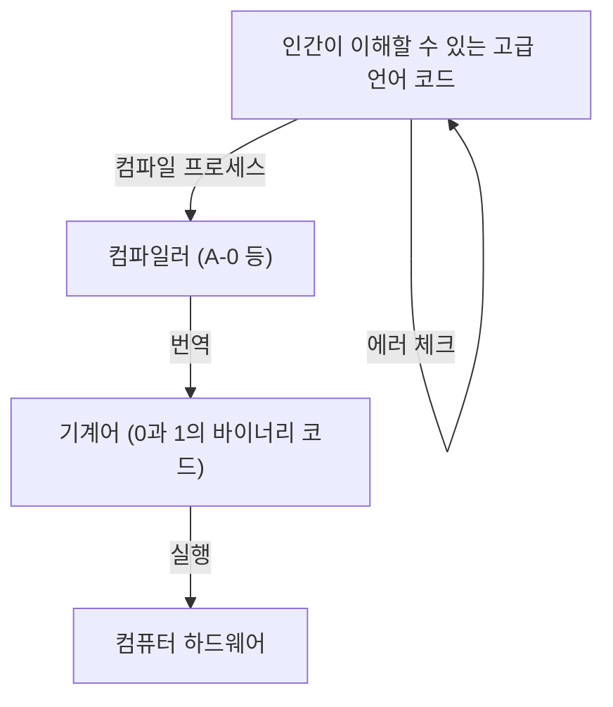
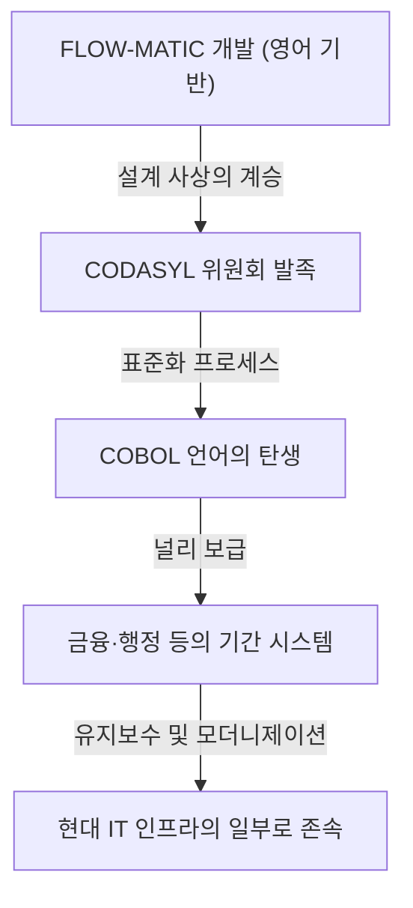

# 프로그래밍의 미래를 개척한 선구자: 그레이스 호퍼(COBOL의 어머니)의 생애와 유산

현대 IT 사회는 셀 수 없이 많은 소프트웨어와 프로그램에 의해 지탱되고 있습니다. 우리가 매일 사용하는 스마트폰, 은행 시스템, 항공기 제어, 심지어 AI에 이르기까지 모든 것은 '프로그래밍 언어'라는 기반 위에 성립되어 있습니다. 하지만 인간이 이해하기 쉬운 언어로 컴퓨터에 지시를 내릴 수 있게 되기까지는 엄청난 시행착오와 돌파구가 있었습니다.

그 역사적 전환점에서 가장 중요하고 결정적인 역할을 한 인물 중 하나가 그레이스 머리 호퍼(Grace Murray Hopper)입니다. "COBOL의 어머니(Mother of COBOL)", "어메이징 그레이스(Amazing Grace)" 등의 애칭으로 불렸던 그녀는 미국 해군 소장이자 동시에 천재적인 수학자, 그리고 선견지명을 가진 컴퓨터 과학자였습니다.

본 기사에서는 그레이스 호퍼의 생애를 되짚어보며 그녀가 어떻게 초기 컴퓨터 개발에 관여하고 프로그래밍 언어의 진화에 기여했는지, 그 헤아릴 수 없는 업적과 유산에 대해 수천 자에 걸쳐 철저히 깊이 파헤쳐 보겠습니다.

## 제1장: 유년기와 교육 —— 호기심 많은 소녀에서 수학자로

그레이스 브루스터 머리는 1906년 12월 9일 뉴욕시에서 태어났습니다. 그녀의 가정은 지적 호기심을 존중하는 환경이었으며, 그레이스 자신도 어릴 적부터 기계와 수학에 남다른 흥미를 보였습니다. 유명한 일화로, 그녀가 7살 때 집에 있는 7개의 알람 시계를 차례로 분해하여 그 작동 원리를 이해하려고 했던 일이 있습니다. 어머니는 그녀를 꾸짖기는커녕 그 탐구심을 인정하고 1개의 시계만 분해하도록 허락했습니다. 이러한 환경이 훗날 위대한 과학자를 키우는 토양이 된 것입니다.

1924년, 그녀는 명문 바사 대학(Vassar College)에 진학하여 수학과 물리학을 전공했습니다. 1928년에 우수한 성적으로 졸업한 후 예일 대학교 대학원에 진학하여 1930년에 석사 학위를 취득했습니다. 같은 해 빈센트 포스터 호퍼(Vincent Foster Hopper)와 결혼하여 "그레이스 호퍼"라는 이름을 갖게 됩니다. 1934년에는 예일 대학교에서 수학 박사 학위(Ph.D.)를 취득했습니다. 당시 여성이 수학 박사 학위를 취득하는 것은 매우 드문 일이었으며, 그녀의 탁월한 지적 능력과 노력을 엿볼 수 있습니다.

졸업 후 그레이스는 모교인 바사 대학에서 수학을 가르치며 순조롭게 학자의 길을 걷고 있었습니다. 그러나 1941년 진주만 공격으로 인해 미국이 제2차 세계 대전에 참전하게 되면서 그녀의 운명은 크게 바뀌게 됩니다.

## 제2장: 해군 입대와 "Harvard Mark I"과의 만남

전쟁이 격화되는 가운데, 그레이스는 국가를 위해 헌신하고 싶다는 강한 열망으로 미국 해군 여성 예비역(WAVES: Women Accepted for Volunteer Emergency Service)에 입대를 자원했습니다. 그녀는 나이(당시 34세)와 체중 면에서 기준을 충족하지 못해 처음에는 입대를 거부당했지만, 특례로 입대가 허가되었습니다.

1943년 입대에 성공한 그녀는 1944년 소위로 임관하여 하버드 대학교의 선박국 계산 프로젝트(Bureau of Ships Computation Project)에 배치되었습니다. 그곳에서 그녀가 만난 것이 미국 최초의 대형 자동 디지털 컴퓨터인 "Harvard Mark I(하버드 마크 원)"이었습니다.

Mark I은 길이 약 15미터, 무게 약 5톤에 달하는 거대한 기계로, 수십만 개의 부품과 수백 킬로미터에 이르는 배선으로 구성되어 있었습니다. 이 컴퓨터는 함포 사격의 탄도 계산이나 원자폭탄 개발(맨해튼 프로젝트)에 필요한 내폭 렌즈 계산 등 군사적으로 극히 중요한 계산을 담당했습니다.

호퍼는 이 Mark I의 프로그래머로 배치되었습니다. 당시의 프로그래밍은 현재처럼 키보드로 코드를 입력하는 것이 아니라, 종이 테이프에 구멍을 뚫어 명령을 기록하고 이를 기계에 읽히게 하는 물리적이고 번거로운 작업이었습니다. 그녀는 하워드 에이컨(하워드 에이컨, Mark I의 설계자)의 지도 아래 순식간에 Mark I의 구조와 조작법을 마스터하고 프로그래밍 매뉴얼을 작성하는 등 프로젝트의 핵심 인력으로 활약했습니다.

## 제3장: 전설의 탄생 —— 최초의 "컴퓨터 버그" 발견

컴퓨터 세계에서는 프로그램의 결함이나 오류를 "버그(Bug = 벌레)"라고 부르며, 이를 수정하는 작업을 "디버그(Debug)"라고 부릅니다. 이 단어를 컴퓨터 업계에 정착시킨 사람이 다름 아닌 그레이스 호퍼와 그녀의 팀입니다.

1947년 9월 9일, 호퍼와 팀원들은 하버드 대학교에서 Mark II 컴퓨터를 운영하고 있었는데 시스템에 원인을 알 수 없는 오류가 발생했습니다. 팀이 거대한 장치의 내부를 철저히 조사한 결과, 릴레이(계전기) 접점에 한 마리의 "나방(Moth)"이 끼어 있는 것을 발견했습니다. 이 나방이 물리적으로 접점을 막고 있어서 기계가 정상적으로 작동하지 않았던 것입니다.

호퍼와 팀원들은 핀셋으로 그 나방을 조심스럽게 제거하여 작업 일지(로그북)에 테이프로 붙였습니다. 그리고 그 옆에 다음과 같은 역사적인 메모를 남겼습니다.

> "First actual case of bug being found." (실제로 버그가 발견된 첫 번째 사례)

기술적인 맥락에서 "버그"라는 단어 자체는 토머스 에디슨 시대부터 사용되었지만, 컴퓨터의 프로그램이나 시스템 오류를 가리키는 단어로 널리 인식되기 시작한 것은 이 사건이 계기였습니다. 이 로그북은 현재 스미스소니언 박물관에 소장되어 있으며, IT 역사에서 중요한 유물로 여겨지고 있습니다.

## 제4장: 컴파일러의 발명 —— 기계의 언어에서 인간의 언어로

종전 후에도 호퍼는 해군에 남아 연구를 계속했지만, 이내 민간 기업인 에커트-모클리 컴퓨터 코퍼레이션(나중에 레밍턴 랜드 사에 인수됨)으로 이직하여 상용 컴퓨터 "UNIVAC I"의 개발에 참여했습니다.

이곳에서 그녀는 프로그래밍의 역사를 영원히 바꿀 획기적인 아이디어를 떠올립니다. 당시의 프로그래밍은 기계어(0과 1의 나열)나 어셈블리어와 같은 기계의 구조에 극히 가까운 언어로 이루어졌습니다. 이는 인간에게 매우 읽기 어렵고 오류가 발생하기 쉬울 뿐만 아니라 전문적인 훈련을 받은 극소수의 기술자만이 다룰 수 있는 것이었습니다.

호퍼는 "컴퓨터에게 인간이 이해하기 쉬운 언어(영어와 같은 말)로 명령을 내리고, 이를 컴퓨터 스스로 기계어로 번역하면 되지 않을까"라고 생각했습니다. 이 번역 프로그램이 바로 "컴파일러(Compiler)"입니다.

1952년, 그녀는 세계 최초의 컴파일러라 불리는 "A-0 System"을 개발했습니다. 당시 대부분의 수학자와 엔지니어들은 "컴퓨터는 계산기일 뿐, 프로그램을 번역하는 것은 불가능하다"며 그녀의 아이디어를 조롱했습니다. 하지만 그녀는 포기하지 않고 그 실용성을 증명했습니다. 이 돌파구 덕분에 프로그래밍은 소수 전문가들의 손에서 벗어나 더 많은 사람들이 소프트웨어 개발에 참여할 수 있는 기반이 마련된 것입니다.

## 제5장: FLOW-MATIC에서 COBOL로 —— 비즈니스계에 혁명을 가져온 언어

A-0 시스템은 주로 수학적이고 과학적인 계산을 목적으로 했지만, 호퍼의 시야는 더 넓어졌습니다. 그녀는 컴퓨터가 비즈니스 세계에서도 널리 활용될 시대가 올 것이라고 확신했으며, 비즈니스용 데이터 처리에 적합한 프로그래밍 언어가 필요하다고 생각했습니다.

그래서 그녀의 팀이 개발한 것이 "FLOW-MATIC(B-0)"입니다. FLOW-MATIC은 영어 단어를 사용하여 데이터 처리를 기술할 수 있는 최초의 프로그래밍 언어였습니다. 예를 들어, "MULTIPLY PRICE BY QUANTITY GIVING TOTAL" (가격과 수량을 곱해 총합을 산출하라)과 같이 영어 문법에 가까운 형태로 프로그램을 작성할 수 있었습니다.

1959년, 미국 국방부의 요청에 따라 정부 기관과 민간 기업에서 공통으로 사용할 수 있는 비즈니스용 표준 프로그래밍 언어를 개발하기 위한 위원회(CODASYL: 데이터 시스템 언어 협의회)가 발족했습니다. 이 회의에서 호퍼의 FLOW-MATIC 개념이 크게 도입되어 탄생한 것이 "COBOL(COmmon Business Oriented Language)"입니다.

COBOL 제정 과정에서 호퍼 자신이 직접 사양을 작성한 것은 아니지만, 그녀가 FLOW-MATIC에서 실증했던 '영어 기반으로 가독성이 높은 언어 구조'라는 철학이 COBOL 설계의 근간을 이루고 있습니다. 그렇기 때문에 그녀는 존경을 담아 "COBOL의 어머니"라 불립니다.

COBOL은 순식간에 보급되어 은행의 금융 시스템, 보험의 계약 관리, 정부의 행정 시스템 등 전 세계 거의 모든 기간 시스템에 도입되었습니다. 놀랍게도 탄생한 지 60년 이상이 지난 현재까지도 전 세계 수많은 레거시 시스템에서 COBOL이 계속 가동되며 우리 사회의 인프라를 뒤에서 지탱하고 있습니다.

## 제6장: 교육자로서의 면모와 "나노초"의 시각화

그레이스 호퍼는 뛰어난 기술자였을 뿐만 아니라 매우 재능 있는 교육자이기도 했습니다. 그녀는 항상 젊은 세대에게 지식을 전달하는 일에 열정을 쏟았습니다.

그녀의 교육자적 측면을 상징하는 유명한 일화로 "나노초(Nanosecond)의 전선"이 있습니다. 컴퓨터의 처리 속도가 향상됨에 따라 엔지니어들은 "나노초(10억 분의 1초)"라는 단위로 회로의 지연을 걱정하기 시작했습니다. 그러나 나노초라는 극도로 짧은 시간을 직관적으로 이해하기란 어렵습니다.

이에 호퍼는 빛(혹은 전기 신호)이 진공(또는 구리선) 속을 1나노초 동안 이동하는 거리를 계산했습니다. 그것은 약 11.8인치(약 30센티미터)였습니다. 그녀는 이 길이의 전선을 대량으로 잘라 강연이나 회의 때 사람들에게 나누어주며 "이것이 1나노초입니다"라고 말했습니다.

"통신 지연이 왜 발생할까요? 왜 컴퓨터를 이보다 더 작게 만들어야 할까요? 이 '나노초'의 전선을 보면 한눈에 알 수 있을 것입니다. 신호가 도달하려면 물리적인 거리를 이동할 시간이 필요하기 때문입니다."

이처럼 그녀는 복잡하고 추상적인 개념을 누구나 이해할 수 있는 물리적인 은유로 변환하는 천재였습니다. 이 유머와 통찰력이 넘치는 접근법은 수많은 젊은 엔지니어와 학생들에게 영감을 주었습니다.

## 제7장: 해군 복귀와 표준화 추진

1966년 호퍼는 한 차례 해군에서 정년 퇴역했지만, 불과 7개월 후 해군의 부름을 받고 복귀하게 됩니다. 해군 내부에서 사용 중인 다양하고 복잡한 프로그래밍 언어와 시스템들의 호환성이 무너져 심각한 문제를 야기하고 있었기 때문입니다.

현역에 복귀한 그녀는 해군 내 COBOL 표준화와 컴파일러 검증 프로그램(Validation Routine) 개발을 주도했습니다. 이를 통해 서로 다른 제조업체의 컴퓨터에서도 동일한 COBOL 프로그램이 올바르게 동작하도록 보장할 수 있게 되었습니다. 이러한 표준화에 대한 공헌은 훗날 소프트웨어 산업 전체의 발전에 매우 중요한 역할을 했습니다.

그녀는 이후로도 승진을 거듭하여 1983년 로널드 레이건 대통령의 특별 임명을 통해 준장으로 진급했습니다. 결국 1986년, 79세의 나이로 해군에서 퇴역할 당시 그녀는 소장(Rear Admiral)으로 진급해 있었습니다. 퇴역 당시 그녀는 미군 전체에서 최고령 현역 장교였습니다.

## 제8장: 말년과 영예, 그리고 남겨진 유산

해군을 퇴역한 후에도 그녀의 열정은 식지 않았습니다. DEC(디지털 이큅먼트 코퍼레이션)의 시니어 컨설턴트로 영입되어 세상을 떠나기 직전까지 강연 활동과 젊은 기술자 육성에 힘썼습니다.

1992년 1월 1일, 그레이스 호퍼는 85세를 일기로 세상을 떠났습니다. 그녀의 유해는 군 최고의 예우 속에 알링턴 국립묘지에 안장되었습니다.

그녀의 공로를 기려 1997년에는 미국 해군의 이지스 구축함에 "호퍼(USS Hopper, DDG-70)"라는 이름이 붙여졌습니다. 해군 함정에 여성의 이름이 명명되는 것은 지극히 드문 일입니다. 또한 2016년에는 버락 오바마 대통령으로부터 미국 내 민간인 대상 최고 훈장인 "대통령 자유 훈장"이 추서되었습니다.

## 맺음말: 어메이징 그레이스에게 배우는 것

그레이스 호퍼의 생애는 기존의 틀과 상식에 끊임없이 도전해 온 역사였습니다.

"그것은 지금까지 항상 그렇게 해왔기 때문이다 (We've always done it that way)"

그녀는 이 문장을 "영어에서 가장 위험한 구절"로서 몹시 싫어했습니다. 현재에 안주하지 않고, 항상 더 나은 방법, 더 효율적인 방법, 더 많은 사람이 사용할 수 있는 방법을 모색했던 그녀의 자세야말로 컴파일러를 탄생시키고 COBOL을 만들어 내며 오늘날 IT 사회의 초석을 다진 것입니다.

프로그래밍이 일부 천재들의 전유물이 아니라 누구나 활용할 수 있는 도구가 된 것은 그녀가 "기계의 언어를 인간의 언어로 번역한다"는 비전을 가지고 이를 실현시켰기 때문입니다. 우리가 오늘날 편안하게 컴퓨터를 다루고 고도화된 소프트웨어를 개발할 수 있는 것은 "COBOL의 어머니" 그레이스 호퍼가 개척한 길 위에 서 있기 때문임이 틀림없습니다.

그녀가 남긴 유산은 단순한 코드나 시스템에 그치지 않고, "기술은 인간과 가까워야 한다"는 철학으로서 지금도 여전히 소프트웨어 개발 현장에 살아 숨쉬고 있습니다.

(끝)
