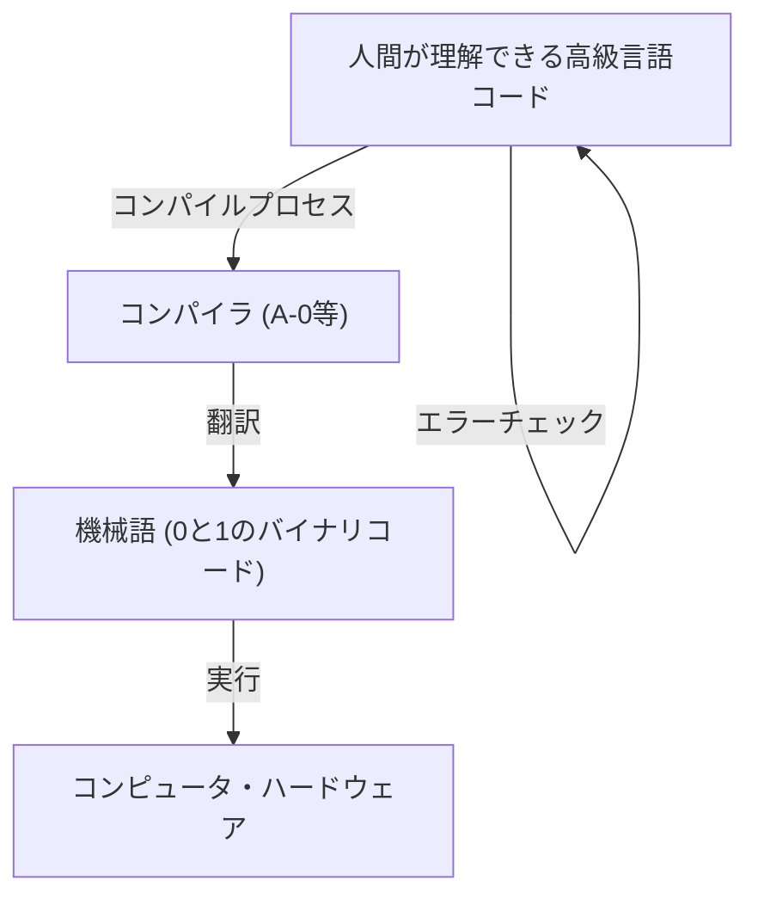
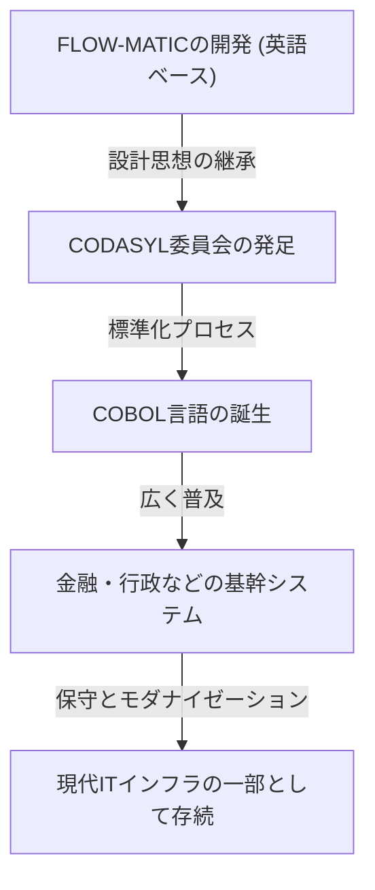

# プログラミングの未来を切り拓いた先駆者：グレース・ホッパー（COBOLの母）の生涯と遺産

現代のIT社会は、数え切れないほどのソフトウェアとプログラムによって支えられています。私たちが日々使用するスマートフォン、銀行のシステム、航空機の制御、さらにはAIに至るまで、すべては「プログラミング言語」という基盤の上に成り立っています。しかし、人間が理解しやすい言葉でコンピュータに指示を出せるようになるまでには、途方もない試行錯誤とブレイクスルーがありました。

その歴史的転換点において、最も重要で決定的な役割を果たした人物の一人が、グレース・マレー・ホッパー（Grace Murray Hopper）です。「COBOLの母（Mother of COBOL）」「アメージング・グレース（Amazing Grace）」などの愛称で親しまれた彼女は、アメリカ海軍の少将であり、同時に天才的な数学者、そして先見の明を持ったコンピュータ科学者でした。

本記事では、グレース・ホッパーの生涯をたどりながら、彼女がどのようにして初期のコンピュータ開発に関わり、プログラミング言語の進化に貢献したのか、その計り知れない業績と遺産について、数千文字にわたって徹底的に深掘りしていきます。

## 第1章：幼少期と教育 —— 好奇心旺盛な少女から数学者へ

グレース・ブリュースター・マレーは、1906年12月9日にニューヨーク市で生まれました。彼女の家庭は知的好奇心を尊重する環境であり、グレース自身も幼い頃から機械や数学に対する並々ならぬ興味を示していました。有名なエピソードとして、彼女が7歳の時に自宅にある7つの目覚まし時計を次々と分解し、その仕組みを理解しようとしたというものがあります。母親は彼女を叱るどころか、その探求心を認め、1つの時計だけを分解することを許しました。こうした環境が、後の偉大な科学者を育む土壌となったのです。

1924年、彼女は名門ヴァッサー大学に進学し、数学と物理学を専攻しました。1928年に優秀な成績で卒業した後、イェール大学大学院に進学し、1930年に修士号を取得。同年、ヴィンセント・フォスター・ホッパーと結婚し、「グレース・ホッパー」という名前になります。1934年にはイェール大学で数学の博士号（Ph.D.）を取得しました。当時、女性が数学の博士号を取得することは非常に稀であり、彼女の類まれな知的能力と努力がうかがえます。

卒業後、グレースは母校であるヴァッサー大学で数学の教鞭を執り、順調に学者の道を歩んでいました。しかし、1941年の真珠湾攻撃によってアメリカが第二次世界大戦に参戦したことが、彼女の運命を大きく変えることになります。

## 第2章：海軍への入隊と「Harvard Mark I」との出会い

戦争が激化する中、グレースは国のために貢献したいと強く願い、アメリカ海軍の婦人予備役（WAVES: Women Accepted for Volunteer Emergency Service）への入隊を志願しました。彼女は年齢（当時34歳）や体重の面で基準を満たしていなかったため、最初は入隊を拒否されましたが、特例として入隊を認められました。

1943年に入隊を果たした彼女は、1944年に少尉として任官し、ハーバード大学の計算船渠局（Bureau of Ships Computation Project）に配属されました。そこで彼女が出会ったのが、アメリカ初の大型自動デジタルコンピュータである「Harvard Mark I（ハーバード・マーク・ワン）」でした。

Mark Iは全長約15メートル、重量約5トンという巨大な機械で、何十万もの部品と数百キロメートルに及ぶ配線で構成されていました。このコンピュータは、艦砲射撃の弾道計算や、原爆開発（マンハッタン計画）における爆縮レンズの計算など、軍事的に極めて重要な計算を担っていました。

ホッパーはこのMark Iのプログラマとして配属されました。当時のプログラミングは、現在のようにキーボードからコードを入力するものではなく、紙テープに穴を開けて命令を記録し、それを機械に読み込ませるという物理的で煩雑な作業でした。彼女はハワード・エイケン（Mark Iの設計者）の指導のもと、瞬く間にMark Iの構造と操作方法をマスターし、プログラミングのマニュアルを作成するなど、プロジェクトの中核として活躍しました。

## 第3章：伝説の誕生 —— 最初の「コンピュータ・バグ」の発見

コンピュータの世界では、プログラムの不具合やエラーのことを「バグ（Bug＝虫）」と呼び、それを修正する作業を「デバッグ（Debug）」と呼びます。この言葉をコンピュータ業界に定着させたのが、他ならぬグレース・ホッパーとそのチームです。

1947年9月9日、ホッパーたちはハーバード大学でMark IIコンピュータの運用を行っていましたが、システムに原因不明のエラーが発生しました。チームが巨大な装置の内部を徹底的に調査したところ、リレー（継電器）の接点に一匹の「蛾（Moth）」が挟まっているのを発見しました。この蛾が物理的に接点を塞いでいたため、機械が正常に動作していなかったのです。

ホッパーたちはピンセットでその蛾を丁寧に取り除き、作業日誌（ログブック）にテープで貼り付けました。そして、その横に次のような歴史的なメモを書き残しました。

> "First actual case of bug being found."（実際にバグが発見された最初の例）

技術的な文脈で「バグ」という言葉自体はトーマス・エジソンの時代から使われていましたが、コンピュータのプログラムやシステムエラーを指す言葉として広く認知されるようになったのは、この出来事がきっかけです。このログブックは現在、スミソニアン博物館に所蔵されており、IT史における重要な遺物となっています。

## 第4章：コンパイラの発明 —— 機械の言葉から人間の言葉へ

終戦後もホッパーは海軍に留まり研究を続けていましたが、やがて民間企業であるエッカート・モークリー・コンピュータ・コーポレーション（後にレミントン・ランド社に買収される）に移籍し、商用コンピュータ「UNIVAC I」の開発に携わりました。

ここで彼女は、プログラミングの歴史を永遠に変える画期的なアイデアを思いつきます。当時のプログラミングは、機械語（0と1の羅列）やアセンブリ言語といった、機械の構造に極めて近い言語で行われていました。これは人間にとって非常に読みにくく、エラーが発生しやすいだけでなく、専門の訓練を受けたごく一部の技術者にしか扱えないものでした。

ホッパーは「コンピュータには、人間が理解しやすい言語（英語のような言葉）で命令を出し、それをコンピュータ自身が機械語に翻訳すればよいのではないか」と考えました。この翻訳プログラムこそが「コンパイラ（Compiler）」です。

1952年、彼女は世界初のコンパイラと呼ばれる「A-0 System」を開発しました。当時の数学者やエンジニアの多くは「コンピュータは計算機であって、プログラムを翻訳するなど不可能だ」と彼女のアイデアを嘲笑しました。しかし彼女は諦めず、その実用性を証明しました。このブレイクスルーにより、プログラミングは一部の専門家の手から解放され、より多くの人々がソフトウェア開発に参加できる基盤が築かれたのです。

## 第5章：FLOW-MATICからCOBOLへ —— ビジネス界に革命をもたらした言語

A-0システムは主に数学的・科学的な計算を目的としていましたが、ホッパーの視野はさらに広がっていました。彼女は、コンピュータがビジネスの世界でも広く活用される時代が来ると確信しており、ビジネス向けのデータ処理に適したプログラミング言語が必要だと考えました。

そこで彼女のチームが開発したのが「FLOW-MATIC（B-0）」です。FLOW-MATICは、英語の単語を用いてデータ処理を記述できる最初のプログラミング言語でした。例えば、"MULTIPLY PRICE BY QUANTITY GIVING TOTAL"（価格と数量を掛けて合計を出せ）といったように、英語の文法に近い形でプログラムを書くことができました。

1959年、アメリカ国防総省の呼びかけにより、政府機関や民間企業で共通して使用できるビジネス向け標準プログラミング言語を開発するための会議（CODASYL：データシステムズ言語協議会）が発足しました。この会議において、ホッパーのFLOW-MATICの概念が大きく取り入れられ、誕生したのが「COBOL（COmmon Business Oriented Language）」です。

COBOLの策定において、ホッパー自身が直接仕様を書いたわけではありませんが、彼女がFLOW-MATICで実証した「英語ベースで可読性の高い言語構造」という哲学が、COBOLの設計の根幹を成しています。そのため、彼女は尊敬を込めて「COBOLの母」と呼ばれています。

COBOLは瞬く間に普及し、銀行の金融システム、保険の契約管理、政府の行政システムなど、世界中のあらゆる基幹システムで採用されました。驚くべきことに、誕生から60年以上が経過した現在でも、世界中のレガシーシステムの多くでCOBOLが稼働し続けており、私たちの社会インフラを裏で支えています。

## 第6章：教育者としての顔と「ナノ秒」の視覚化

グレース・ホッパーは優れた技術者であったと同時に、極めて才能豊かな教育者でもありました。彼女は常に若い世代に知識を伝えることに情熱を注いでいました。

彼女の教育者としての側面を象徴する有名なエピソードに、「ナノ秒（Nanosecond）のワイヤー」があります。コンピュータの処理速度が向上するにつれて、エンジニアたちは「ナノ秒（10億分の1秒）」という単位で回路の遅延を気にするようになりました。しかし、ナノ秒という極端に短い時間を直感的に理解するのは困難です。

そこでホッパーは、光（あるいは電気信号）が真空（または銅線）中を1ナノ秒の間に進む距離を計算しました。それは約11.8インチ（約30センチメートル）でした。彼女はこの長さの電線を大量に切り出し、講演や会議の際に「これが1ナノ秒です」と言って人々に配りました。

「通信遅延がなぜ起きるのか？なぜコンピュータをこれ以上小さくしなければならないのか？この『ナノ秒』のワイヤーを見れば一目瞭然でしょう。信号が届くには物理的な距離を移動する時間が必要なのですから」

このように、彼女は複雑で抽象的な概念を、誰もが理解できる物理的なメタファーに変換する天才でした。このユーモアと洞察力に満ちたアプローチは、多くの若きエンジニアや学生にインスピレーションを与えました。

## 第7章：海軍への復帰と標準化の推進

1966年、ホッパーは一度海軍を定年退役しましたが、そのわずか7ヶ月後、海軍から呼び戻されます。海軍内部で使用されている多種多様なプログラミング言語とシステムの互換性がなくなり、深刻な問題を引き起こしていたからです。

現役復帰した彼女は、海軍におけるCOBOLの標準化と、コンパイラの検証プログラム（バリデーション・ルーチン）の開発を主導しました。これにより、異なるメーカーのコンピュータであっても、同じCOBOLプログラムが正しく動作することが保証されるようになりました。この標準化への貢献は、後のソフトウェア産業全体の発展において極めて重要な役割を果たしました。

彼女はその後も昇進を重ね、1983年にロナルド・レーガン大統領の特別辞令によって准将に昇進。最終的に1986年、79歳で海軍を退役する際には少将（Rear Admiral）に昇進していました。退役当時、彼女はアメリカ軍全体の中で最高齢の現役士官でした。

## 第8章：晩年と栄誉、そして残された遺産

海軍を退役した後も、彼女の情熱が衰えることはありませんでした。DEC（デジタル・イクイップメント・コーポレーション）のシニアコンサルタントとして迎えられ、亡くなる直前まで講演活動や若手技術者の育成に奔走しました。

1992年1月1日、グレース・ホッパーは85歳でこの世を去りました。彼女の遺体は、軍最高の栄誉をもってアーリントン国立墓地に埋葬されました。

彼女の功績を称え、1997年にはアメリカ海軍のイージス駆逐艦に「ホッパー（USS Hopper, DDG-70）」という名前が付けられました。海軍の艦船に女性の名前が付けられるのは極めて稀なことです。また、2016年にはバラク・オバマ大統領から、アメリカにおける文民向けの最高勲章である「大統領自由勲章」が死後追贈されました。

## 結び：アメージング・グレースから学ぶこと

グレース・ホッパーの生涯は、既存の枠組みや常識に挑み続けた歴史でした。

「それは今までずっとそうやってきたからだ（We've always done it that way）」

彼女はこの言葉を「英語で最も危険なフレーズ」として強く憎んでいました。現状に満足せず、常により良い方法、より効率的な方法、より多くの人が使える方法を模索し続けた彼女の姿勢こそが、コンパイラを生み、COBOLを生み、今日のIT社会の礎を築いたのです。

プログラミングが一部の天才だけのものではなく、誰もが活用できるツールとなったのは、彼女が「機械の言葉を人間の言葉に翻訳する」というビジョンを持ち、それを実現させたからです。私たちが今日、快適にコンピュータを使いこなし、高度なソフトウェアを開発できるのは、「COBOLの母」グレース・ホッパーが切り拓いた道の上に立っているからに他なりません。

彼女の残した遺産は、単なるコードやシステムにとどまらず、「テクノロジーは人間に寄り添うべきである」という哲学として、今もなおソフトウェア開発の現場に息づいています。

（了）
