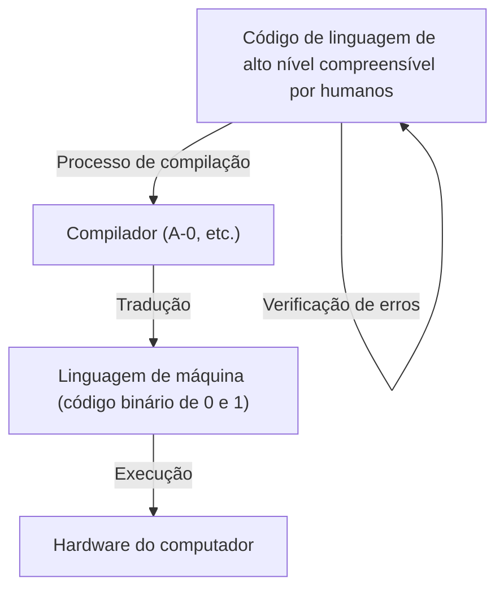
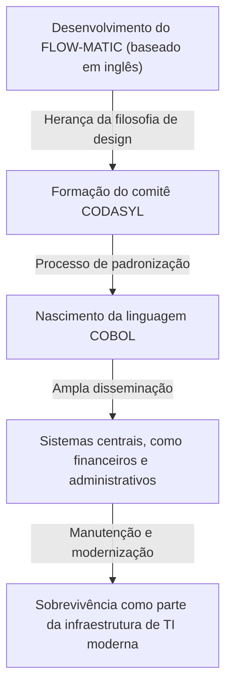

# A Pioneira que Abriu o Caminho para o Futuro da Programação: A Vida e o Legado de Grace Hopper (A Mãe do COBOL)

A moderna sociedade de TI é sustentada por inúmeros softwares e programas. Os smartphones que usamos todos os dias, os sistemas bancários, o controle de aeronaves e até a IA, tudo é construído sobre a base da "linguagem de programação". No entanto, antes que os humanos pudessem dar instruções aos computadores em uma linguagem fácil de entender, houve inúmeras tentativas, erros e avanços.

Uma das figuras mais importantes e decisivas nessa virada histórica foi Grace Murray Hopper. Conhecida carinhosamente como a "Mãe do COBOL" e "Amazing Grace", ela foi uma contra-almirante da Marinha dos EUA, além de uma matemática genial e uma cientista da computação visionária.

Neste artigo, traçamos a vida de Grace Hopper, aprofundando detalhadamente em milhares de palavras em suas imensas conquistas e legados, de como ela se envolveu no desenvolvimento inicial de computadores e contribuiu para a evolução das linguagens de programação.

## Capítulo 1: Infância e Educação —— De uma Menina Curiosa a uma Matemática

Grace Brewster Murray nasceu na cidade de Nova York em 9 de dezembro de 1906. A sua família respeitava a curiosidade intelectual e a própria Grace mostrou um interesse incomum por máquinas e matemática desde cedo. Um episódio famoso é que, aos 7 anos, ela desmontou sucessivamente sete despertadores em sua casa para entender como funcionavam. Longe de repreendê-la, sua mãe reconheceu esse espírito inquisitivo e permitiu que ela desmontasse apenas um relógio. Esse ambiente forneceu o solo para nutrir a futura grande cientista.

Em 1924, ela ingressou no prestigiado Vassar College, com especialização em matemática e física. Depois de se formar com honras em 1928, ela foi para a pós-graduação da Universidade de Yale e obteve seu mestrado em 1930. No mesmo ano, casou-se com Vincent Foster Hopper e tornou-se "Grace Hopper". Em 1934, obteve um doutorado (Ph.D.) em matemática pela Universidade de Yale. Na época, era extremamente raro uma mulher obter um doutorado em matemática, o que mostra sua excepcional capacidade intelectual e esforço.

Após a formatura, Grace lecionou matemática em sua alma mater, Vassar College, e estava num caminho tranquilo como acadêmica. No entanto, a entrada dos Estados Unidos na Segunda Guerra Mundial, desencadeada pelo ataque a Pearl Harbor em 1941, mudou drasticamente o seu destino.

## Capítulo 2: Alistamento na Marinha e o Encontro com o "Harvard Mark I"

À medida que a guerra se intensificava, Grace sentiu um forte desejo de servir seu país e se ofereceu para o WAVES (Women Accepted for Volunteer Emergency Service - Mulheres Aceitas para o Serviço Voluntário de Emergência) da Marinha dos Estados Unidos. Como ela não atendia aos requisitos de idade (34 na época) e peso, inicialmente foi rejeitada, mas acabou sendo aceita como uma exceção.

Alistada em 1943, ela foi comissionada como tenente em 1944 e designada para o Bureau of Ships Computation Project na Universidade de Harvard. Lá ela encontrou o "Harvard Mark I", o primeiro grande computador digital automático dos Estados Unidos.

O Mark I era uma máquina enorme, com cerca de 15 metros de comprimento e pesando cerca de 5 toneladas, composta por centenas de milhares de peças e centenas de quilômetros de fiação. O computador foi encarregado de cálculos militares cruciais, como os cálculos de trajetória para o fogo naval e os cálculos das lentes explosivas no desenvolvimento da bomba atômica (Projeto Manhattan).

Hopper foi designada como programadora para o Mark I. A programação na época não envolvia digitar códigos em um teclado como hoje, mas uma tarefa física e tediosa de fazer furos em fita de papel para registrar instruções e inseri-las na máquina. Sob a orientação de Howard Aiken (o designer do Mark I), ela dominou rapidamente a estrutura e a operação do Mark I, desempenhando um papel central no projeto, incluindo a redação do manual de programação.

## Capítulo 3: O Nascimento de uma Lenda —— A Descoberta do Primeiro "Bug" de Computador

No mundo dos computadores, defeitos ou erros de programa são chamados de "bugs" (insetos), e o processo de corrigi-los é chamado de "debug" (depuração). Grace Hopper e sua equipe foram as pessoas que popularizaram esses termos na indústria de computadores.

Em 9 de setembro de 1947, enquanto Hopper e sua equipe operavam o computador Mark II na Universidade de Harvard, ocorreu um erro inexplicável no sistema. Quando a equipe investigou minuciosamente o interior da enorme máquina, descobriram uma traça ("moth") presa nos contatos de um relé. O inseto estava fisicamente bloqueando os contatos, impedindo a máquina de funcionar corretamente.

Hopper e a sua equipa removeram cuidadosamente a traça com pinças e prenderam-na com fita adesiva no diário de bordo. Ao lado dela, escreveram a seguinte nota histórica:

> "First actual case of bug being found." (O primeiro caso real de um bug a ser descoberto.)

Embora a palavra "bug" no contexto técnico estivesse em uso desde a época de Thomas Edison, foi este incidente que a tornou amplamente reconhecida como um termo para erros de sistema ou de programa de computador. Este diário de bordo está agora guardado na Instituição Smithsonian e é uma relíquia importante na história da TI.

## Capítulo 4: A Invenção do Compilador —— Da Linguagem de Máquina para a Linguagem Humana

Após o fim da guerra, Hopper permaneceu na Marinha para continuar sua pesquisa, mas acabou mudando-se para uma empresa privada, a Eckert-Mauchly Computer Corporation (mais tarde adquirida pela Remington Rand), onde trabalhou no desenvolvimento do "UNIVAC I", um computador comercial.

Aqui ela teve uma ideia revolucionária que mudaria a história da programação para sempre. Naquela época, a programação era feita numa linguagem extremamente próxima à estrutura da máquina, como a linguagem de máquina (sequências de 0 e 1) ou linguagem assembly. Isto era extremamente difícil para os humanos lerem e propenso a erros, e só podia ser manuseado por um número muito pequeno de técnicos especialmente treinados.

Hopper pensou: "Não seria melhor se pudéssemos dar instruções ao computador numa linguagem fácil para os humanos entenderem (como o inglês), e o próprio computador as traduzisse em linguagem de máquina?". Este programa de tradução é o "Compilador".

Em 1952, ela desenvolveu o "A-0 System", considerado o primeiro compilador do mundo. Muitos matemáticos e engenheiros da época zombaram da sua ideia, dizendo que "Os computadores são calculadoras, é impossível para eles traduzirem programas". No entanto, ela não desistiu e provou sua viabilidade. Esta inovação libertou a programação das mãos de alguns especialistas e lançou as bases para que muito mais pessoas pudessem participar no desenvolvimento de software.

## Capítulo 5: Do FLOW-MATIC ao COBOL —— A Linguagem que Revolucionou o Mundo dos Negócios

Embora o sistema A-0 tenha sido planeado principalmente para cálculos matemáticos e científicos, a visão de Hopper ia além disso. Ela estava convencida de que chegaria o momento em que os computadores seriam amplamente utilizados no mundo dos negócios e acreditava que uma linguagem de programação adequada para o processamento de dados de negócios seria necessária.

Por isso, a sua equipa desenvolveu o "FLOW-MATIC (B-0)". O FLOW-MATIC foi a primeira linguagem de programação que permitiu que o processamento de dados fosse escrito usando palavras em inglês. Por exemplo, era possível escrever programas numa forma próxima à gramática do inglês, como "MULTIPLY PRICE BY QUANTITY GIVING TOTAL" (Multiplique o preço pela quantidade dando o total).

Em 1959, a pedido do Departamento de Defesa dos EUA, foi estabelecida uma conferência (CODASYL: Conference on Data Systems Languages) para desenvolver uma linguagem de programação padrão para negócios que pudesse ser usada em comum por agências governamentais e empresas privadas. Nesta conferência, o conceito FLOW-MATIC de Hopper foi fortemente incorporado e o "COBOL (COmmon Business Oriented Language)" nasceu.

Embora a própria Hopper não tenha escrito diretamente as especificações no desenvolvimento do COBOL, a sua filosofia de uma "estrutura de linguagem baseada no inglês, altamente legível", demonstrada no FLOW-MATIC, constitui a base do design do COBOL. É por isso que ela é respeitosamente chamada de "A Mãe do COBOL".

O COBOL espalhou-se rapidamente e foi adotado em quase todos os sistemas centrais do mundo, incluindo sistemas financeiros bancários, gestão de contratos de seguros e sistemas administrativos governamentais. Surpreendentemente, mesmo agora, mais de 60 anos após o seu nascimento, o COBOL continua a ser executado em muitos sistemas legados em todo o mundo, apoiando a nossa infraestrutura social nos bastidores.

## Capítulo 6: O Lado de Educadora e a Visualização do "Nanossegundo"

Além de ser uma engenheira notável, Grace Hopper também foi uma educadora extremamente talentosa. Ela sempre foi apaixonada por transmitir conhecimento para a geração mais jovem.

Um episódio famoso que simboliza seu lado de educadora é o "fio de nanossegundo (Nanosecond)". À medida que a velocidade de processamento dos computadores melhorava, os engenheiros começaram a preocupar-se com os atrasos nos circuitos na escala de "nanossegundos (um bilionésimo de segundo)". No entanto, é difícil compreender intuitivamente um tempo tão curto como um nanossegundo.

Então Hopper calculou a distância que a luz (ou um sinal elétrico) percorreria no vácuo (ou num fio de cobre) durante 1 nanossegundo. Era cerca de 11,8 polegadas (cerca de 30 centímetros). Ela cortou um grande número de fios desse comprimento e distribuiu-os para as pessoas em palestras e conferências, dizendo: "Aqui está um nanossegundo".

"Por que ocorrem atrasos na comunicação? Por que devemos tornar os computadores ainda menores? Este fio de 'nanossegundo' deixa tudo óbvio. Os sinais precisam de tempo para viajar distâncias físicas."

Dessa forma, ela era um génio em converter converter conceitos complexos e abstratos em metáforas físicas que qualquer pessoa pudesse entender. Essa abordagem, cheia de humor e perspicácia, inspirou muitos jovens engenheiros e estudantes.

## Capítulo 7: Regresso à Marinha e Promoção da Padronização

Em 1966, Hopper aposentou-se da Marinha aos 60 anos, mas foi chamada de volta apenas 7 meses depois. A grande variedade de linguagens de programação e sistemas usados dentro da Marinha estava a perder compatibilidade e causando problemas sérios.

Após regressar ao serviço ativo, ela liderou a padronização do COBOL na Marinha e o desenvolvimento de programas de verificação de compiladores (rotinas de validação). Isto garantiu que o mesmo programa COBOL operaria corretamente mesmo em computadores de fabricantes diferentes. Essa contribuição para a padronização desempenhou um papel vital no desenvolvimento subsequente de toda a indústria de software.

Ela continuou a ser promovida e, em 1983, foi promovida a comodoro por nomeação especial do presidente Ronald Reagan. Finalmente, quando se aposentou da Marinha em 1986, aos 79 anos, foi promovida a contra-almirante (Rear Admiral). Na época de sua aposentadoria, ela era a oficial da ativa mais velha em todas as forças armadas dos EUA.

## Capítulo 8: Anos Finais, Honras e o Legado Deixado

Mesmo depois de se aposentar da Marinha, a sua paixão não diminuiu. Ela foi recebida como consultora sênior da DEC (Digital Equipment Corporation) e, até pouco antes de sua morte, esteve ocupada com palestras e desenvolvimento de jovens engenheiros.

Em 1º de janeiro de 1992, Grace Hopper faleceu aos 85 anos. O seu corpo foi sepultado no Cemitério Nacional de Arlington com as maiores honras militares.

Em reconhecimento às suas conquistas, um contratorpedeiro Aegis da Marinha dos EUA foi nomeado "Hopper (USS Hopper, DDG-70)" em 1997. É extremamente raro que navios da Marinha recebam nomes de mulheres. Além disso, em 2016, o presidente Barack Obama concedeu-lhe postumamente a Medalha Presidencial da Liberdade, a maior honraria civil dos Estados Unidos.

## Conclusão: O Que Aprender com Amazing Grace

A vida de Grace Hopper foi uma história de desafiar continuamente as estruturas e o senso comum existentes.

"Sempre fizemos dessa forma (We've always done it that way)"

Ela odiava intensamente essas palavras, chamando-as de "a frase mais perigosa da língua inglesa". Não se contentando com o status quo, a sua atitude de buscar sempre formas melhores, mais eficientes e mais acessíveis foi o que gerou o compilador, o COBOL e lançou as bases para a sociedade de TI atual.

O facto de a programação não ser mais reservada a alguns génios, mas se ter tornado uma ferramenta que qualquer pessoa pode usar, deve-se a ela ter tido e concretizado a visão de "traduzir a linguagem das máquinas para a linguagem humana". O facto de hoje podermos usar confortavelmente os computadores e desenvolver software avançado não é outra coisa senão por estarmos no caminho aberto por Grace Hopper, a "Mãe do COBOL".

O legado que ela deixou não se limita a apenas códigos ou sistemas, mas continua vivo no campo do desenvolvimento de software hoje, como a filosofia de que "a tecnologia deve permanecer perto da humanidade".

(Fim)
