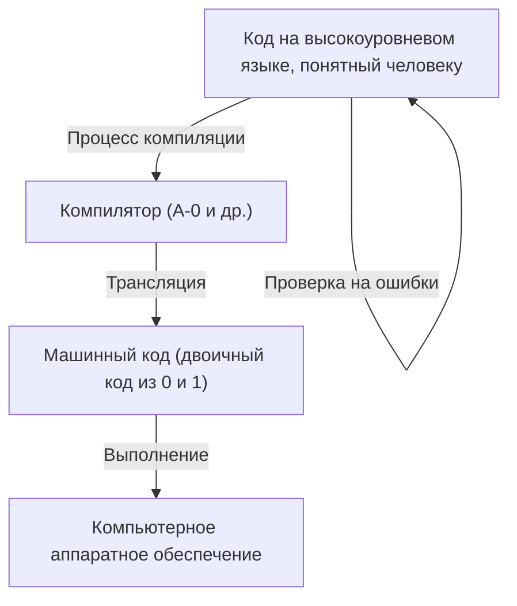
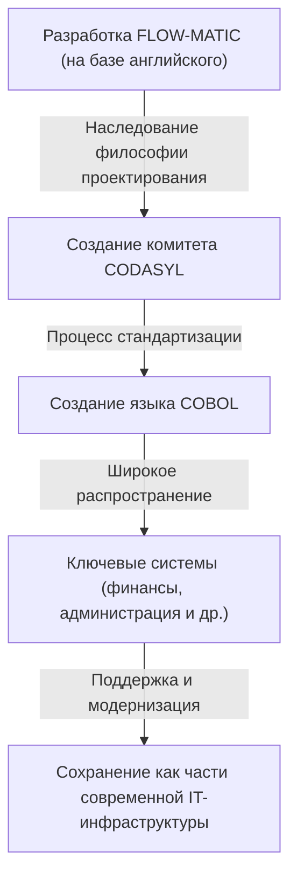

# Пионер, открывшая будущее программирования: Жизнь и наследие Грейс Хоппер (Матери COBOL)

Современное IT-общество держится на бесчисленном множестве программ и программного обеспечения. Все, что мы используем каждый день, от смартфонов, банковских систем, управления самолетами до ИИ, построено на фундаменте «языков программирования». Однако, прежде чем люди смогли давать команды компьютерам на понятном им языке, потребовалось пройти через невообразимое количество проб и ошибок, а также совершить множество прорывов.

В этот исторический поворотный момент одну из самых важных и решающих ролей сыграла Грейс Мюррей Хоппер (Grace Murray Hopper). Известная под прозвищами «Мать COBOL» и «Удивительная Грейс» (Amazing Grace), она была контр-адмиралом ВМС США, а также гениальным математиком и дальновидным компьютерным ученым.

В этой статье мы проследим жизненный путь Грейс Хоппер, узнаем, как она участвовала в ранних разработках компьютеров и внесла вклад в эволюцию языков программирования, и подробно рассмотрим ее неизмеримые достижения и наследие.

## Глава 1: Детство и образование —— От любознательной девочки к математику

Грейс Брюстер Мюррей родилась 9 декабря 1906 года в Нью-Йорке. В ее семье ценили интеллектуальное любопытство, и сама Грейс с ранних лет проявляла необычайный интерес к механизмам и математике. Известен случай, когда в возрасте семи лет она один за другим разобрала семь будильников в доме, чтобы понять, как они работают. Мать не только не отругала ее, но и, оценив ее стремление к знаниям, разрешила разобрать один будильник. Такая среда стала почвой, на которой вырос будущий великий ученый.

В 1924 году она поступила в престижный колледж Вассар, где изучала математику и физику. В 1928 году, окончив его с отличием, она поступила в аспирантуру Йельского университета, где в 1930 году получила степень магистра. В том же году она вышла замуж за Винсента Фостера Хоппера и взяла имя «Грейс Хоппер». В 1934 году она получила степень доктора математики (Ph.D.) в Йельском университете. В то время получение женщиной докторской степени по математике было большой редкостью, что свидетельствует о ее выдающихся интеллектуальных способностях и трудолюбии.

После окончания учебы Грейс преподавала математику в своей альма-матер, колледже Вассар, и успешно продвигалась по академической стезе. Однако вступление США во Вторую мировую войну после нападения на Перл-Харбор в 1941 году кардинально изменило ее судьбу.

## Глава 2: Вступление в ВМС и знакомство с «Harvard Mark I»

В разгар войны Грейс остро захотела послужить своей стране и подала заявку на вступление в Женский резерв ВМС США (WAVES: Women Accepted for Volunteer Emergency Service). Сначала ей отказали, так как она не соответствовала требованиям по возрасту (тогда ей было 34 года) и весу, но в итоге приняли в порядке исключения.

Поступив на службу в 1943 году, в 1944 году она получила звание младшего лейтенанта и была направлена в Вычислительный проект Бюро кораблей при Гарвардском университете (Bureau of Ships Computation Project). Там она познакомилась с первым американским крупным автоматическим цифровым компьютером «Harvard Mark I».

Mark I был гигантской машиной длиной около 15 метров и весом около 5 тонн, состоявшей из сотен тысяч деталей и сотен километров проводов. Этот компьютер выполнял критически важные военные вычисления, такие как баллистические расчеты для корабельной артиллерии и расчеты имплозивных линз для разработки атомной бомбы (Манхэттенский проект).

Хоппер была назначена программистом для этого Mark I. В то время программирование не было вводом кода с клавиатуры, как сейчас. Это был физический и трудоемкий процесс пробивания отверстий на бумажной ленте для записи команд и последующего их считывания машиной. Под руководством Говарда Эйкена (создателя Mark I) она в мгновение ока освоила устройство и методы работы с Mark I, написала руководство по программированию и стала ключевой фигурой проекта.

## Глава 3: Рождение легенды —— Обнаружение первого «компьютерного бага»

В мире компьютеров сбои и ошибки в программах называют «багами» (Bug = жук), а процесс их исправления — «отладкой» (Debug). Именно Грейс Хоппер и ее команда закрепили эти термины в компьютерной индустрии.

9 сентября 1947 года Хоппер и ее коллеги работали с компьютером Mark II в Гарвардском университете, когда в системе произошла необъяснимая ошибка. Тщательно осмотрев внутренности гигантской машины, команда обнаружила «мотылька» (Moth), застрявшего в контактах реле. Этот мотылек физически блокировал контакт, из-за чего машина не работала должным образом.

Хоппер и ее коллеги аккуратно извлекли мотылька пинцетом и приклеили его скотчем в журнал учета работы. Рядом они оставили историческую запись:

> "First actual case of bug being found." (Первый реальный случай обнаружения бага)

Сам термин «баг» в техническом контексте использовался еще со времен Томаса Эдисона, но именно после этого инцидента он стал широко известен как обозначение программной ошибки или системного сбоя компьютера. Этот журнал в настоящее время хранится в Смитсоновском институте и является важной реликвией в истории IT.

## Глава 4: Изобретение компилятора —— От машинного языка к человеческому

После окончания войны Хоппер осталась в ВМС и продолжила свои исследования, но вскоре перешла в частную компанию Eckert-Mauchly Computer Corporation (позднее приобретенную Remington Rand), где приняла участие в разработке коммерческого компьютера «UNIVAC I».

Здесь ей пришла в голову революционная идея, навсегда изменившая историю программирования. В то время программирование осуществлялось на машинном языке (последовательность нулей и единиц) или на языке ассемблера, который был очень близок к структуре машины. Такой код был крайне труден для чтения человеком, подвержен ошибкам и доступен лишь горстке специально обученных техников.

Хоппер подумала: «А что, если давать команды компьютеру на понятном человеку языке (например, на английском), а компьютер сам будет переводить их на машинный язык?». Эта программа-переводчик и есть «компилятор» (Compiler).

В 1952 году она разработала систему «A-0», которую называют первым в мире компилятором. Многие математики и инженеры того времени насмехались над ее идеей: «Компьютер — это вычислительная машина, он не может переводить программы». Но она не сдалась и доказала практическую ценность своего изобретения. Благодаря этому прорыву программирование перестало быть уделом узких специалистов и заложило основу для вовлечения в разработку ПО большего числа людей.

## Глава 5: От FLOW-MATIC к COBOL —— Язык, совершивший революцию в деловом мире

Хотя система A-0 предназначалась в основном для математических и научных расчетов, видение Хоппер простиралось гораздо дальше. Она была уверена, что настанет время, когда компьютеры будут широко использоваться в бизнесе, и считала, что необходим язык программирования, подходящий для обработки бизнес-данных.

Поэтому ее команда разработала «FLOW-MATIC» (B-0). FLOW-MATIC стал первым языком программирования, который позволял описывать обработку данных с использованием английских слов. Например, можно было написать "MULTIPLY PRICE BY QUANTITY GIVING TOTAL" (умножить цену на количество, получив сумму) — программа писалась в форме, близкой к английской грамматике.

В 1959 году по инициативе Министерства обороны США был созван комитет (CODASYL: Комитет по языкам систем обработки данных) для разработки стандартного языка программирования для бизнеса, который мог бы использоваться правительственными учреждениями и частными компаниями. На этой конференции концепции FLOW-MATIC Хоппер были широко восприняты, в результате чего родился «COBOL» (COmmon Business Oriented Language).

Хотя сама Хоппер не писала напрямую спецификации COBOL, ее философия «читаемой структуры языка на основе английского», которую она доказала во FLOW-MATIC, стала основой для проектирования COBOL. Именно поэтому ее с уважением называют «Матерью COBOL».

COBOL быстро приобрел популярность и стал использоваться во всех ключевых системах по всему миру, таких как финансовые системы банков, управление договорами страхования и государственные административные системы. Удивительно, но даже спустя более 60 лет после своего создания COBOL продолжает работать во многих унаследованных системах (legacy systems) по всему миру, негласно поддерживая нашу социальную инфраструктуру.

## Глава 6: Роль преподавателя и визуализация «наносекунды»

Грейс Хоппер была не только выдающимся инженером, но и чрезвычайно талантливым преподавателем. Она всегда с энтузиазмом передавала свои знания молодому поколению.

Знаменитый эпизод, символизирующий ее педагогический талант, связан с «наносекундным проводом». По мере роста скорости обработки данных компьютеров инженеры стали учитывать задержки в цепях, измеряемые в «наносекундах» (миллиардных долях секунды). Однако интуитивно понять столь малый промежуток времени было сложно.

Тогда Хоппер рассчитала расстояние, которое свет (или электрический сигнал) проходит в вакууме (или в медном проводе) за одну наносекунду. Оно составило около 11,8 дюйма (около 30 сантиметров). Она нарезала огромное количество проводов такой длины и на своих лекциях и конференциях раздавала их людям со словами: «Вот это — одна наносекунда».

«Почему возникает задержка связи? Почему мы должны делать компьютеры еще меньше? Посмотрите на этот "наносекундный" провод, и все станет ясно. Сигналу требуется время, чтобы преодолеть физическое расстояние».

Таким образом, она была гением в превращении сложных абстрактных концепций в физические метафоры, понятные каждому. Ее подход, полный юмора и проницательности, вдохновлял многих молодых инженеров и студентов.

## Глава 7: Возвращение в ВМС и продвижение стандартизации

В 1966 году Хоппер вышла в отставку из ВМС по достижении пенсионного возраста, но всего через семь месяцев флот призвал ее обратно. Это произошло из-за того, что многочисленные языки программирования и системы, используемые в ВМС, стали несовместимыми, что привело к серьезным проблемам.

Вернувшись на службу, она возглавила работу по стандартизации COBOL в ВМС и разработке программ проверки компиляторов (программ валидации). Это гарантировало, что одна и та же программа на COBOL будет корректно работать на компьютерах разных производителей. Этот вклад в стандартизацию сыграл жизненно важную роль в развитии всей программной индустрии в будущем.

Затем она продолжила свое продвижение по службе, получив звание коммодора в 1983 году по специальному указу президента Рональда Рейгана. В конечном итоге в 1986 году, уволившись из ВМС в возрасте 79 лет, она получила звание контр-адмирала (Rear Admiral). На момент отставки она была старейшим действующим офицером в Вооруженных силах США.

## Глава 8: Последние годы, почести и оставленное наследие

После выхода в отставку из ВМС ее энтузиазм не угас. Она стала старшим консультантом в корпорации DEC (Digital Equipment Corporation) и до самой смерти активно читала лекции и занималась обучением молодых инженеров.

1 января 1992 года Грейс Хоппер скончалась в возрасте 85 лет. Ее похоронили на Арлингтонском национальном кладбище с высшими воинскими почестями.

В знак признания ее заслуг в 1997 году эсминец ВМС США, оснащенный системой «Иджис», был назван «Хоппер» (USS Hopper, DDG-70). Назвать корабль ВМС в честь женщины — крайне редкое событие. Кроме того, в 2016 году президент Барак Обама посмертно наградил ее «Президентской медалью Свободы» — высшей гражданской наградой США.

## Заключение: Уроки Удивительной Грейс

Жизнь Грейс Хоппер — это история постоянного вызова существующим рамкам и здравому смыслу.

«Потому что мы всегда так делали» (We've always done it that way).

Она искренне ненавидела эту фразу, называя ее «самой опасной фразой в английском языке». Ее нежелание довольствоваться текущим положением дел и постоянный поиск лучших, более эффективных и доступных способов — вот то отношение, которое породило компиляторы, COBOL и заложило основу для сегодняшнего IT-общества.

Программирование стало инструментом, доступным каждому, а не только горстке гениев, потому что у нее было видение «перевода машинного языка на язык людей», и она воплотила его в жизнь. Тот факт, что сегодня мы можем комфортно использовать компьютеры и разрабатывать сложное программное обеспечение, обусловлен тем, что мы идем по пути, проложенному «Матерью COBOL» Грейс Хоппер.

Оставленное ею наследие не ограничивается просто кодом и системами. Ее философия «технологии должны служить людям» продолжает жить в сфере разработки программного обеспечения и по сей день.

(Конец)
