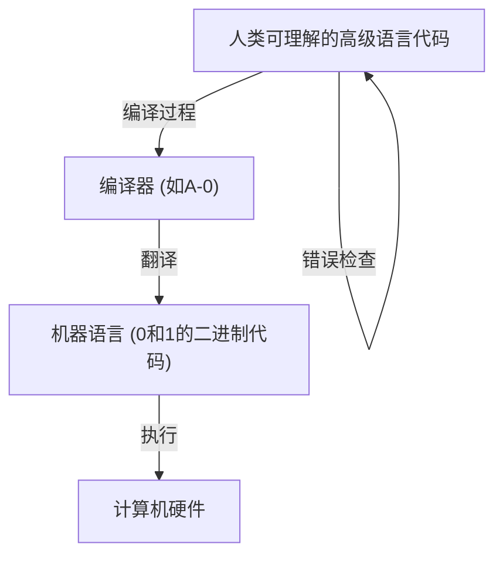
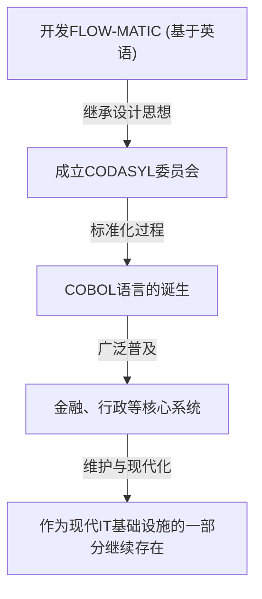

# 开创编程未来的先驱者：格蕾丝·霍珀（COBOL之母）的一生与遗产

现代的IT社会由无数的软件和程序支撑着。从我们每天使用的智能手机、银行系统、飞机控制，甚至到AI，所有一切都建立在“编程语言”这一基础之上。然而，在人类能够用易于理解的语言向计算机下达指令之前，经历了无数的试错与突破。

在这一历史性转折点上，发挥了最重要且决定性作用的人物之一，就是格蕾丝·默里·霍珀（Grace Murray Hopper）。她被人们亲切地称为“COBOL之母（Mother of COBOL）”、“奇异恩典（Amazing Grace）”，她是美国海军少将，同时也是一位天才数学家和具有远见卓识的计算机科学家。

本文将回顾格蕾丝·霍珀的一生，探讨她如何参与早期计算机开发，并为编程语言的演进做出贡献。我们将用数千字的篇幅，深入剖析她无可估量的成就与遗产。

## 第一章：童年与教育 —— 从好奇少女到数学家

格蕾丝·布鲁斯特·默里于1906年12月9日出生在纽约市。她的家庭非常尊重求知欲，格蕾丝自己从小也对机械和数学表现出了非同寻常的兴趣。一个著名的插曲是，在她7岁的时候，她接连拆解了家里的7个闹钟，试图弄明白它们的原理。她的母亲非但没有责骂她，反而认可了她的探索精神，只允许她拆解其中一个闹钟。这样的环境成为了培育这位日后伟大科学家的土壤。

1924年，她进入名校瓦萨学院，主修数学和物理学。1928年以优异成绩毕业后，她进入耶鲁大学研究生院，并于1930年获得硕士学位。同年，她与文森特·福斯特·霍珀结婚，改名为“格蕾丝·霍珀”。1934年，她在耶鲁大学获得了数学博士学位（Ph.D.）。在当时，女性获得数学博士学位是非常罕见的，这足以证明她卓越的智力与不懈的努力。

毕业后，格蕾丝回到母校瓦萨学院教授数学，顺利地走在学者的道路上。然而，1941年的珍珠港事件导致美国卷入第二次世界大战，这也极大地改变了她的命运。

## 第二章：参军与结识“Harvard Mark I”

随着战争的升级，格蕾丝强烈渴望为国家做贡献，于是申请加入美国海军妇女预备役（WAVES: Women Accepted for Volunteer Emergency Service）。起初，她因为年龄（当时34岁）和体重未达到标准而被拒绝入伍，但最终作为特例被获准加入。

她在1943年成功入伍，并于1944年被任命为少尉，分配到哈佛大学的舰船局计算项目（Bureau of Ships Computation Project）。在那里，她遇到了美国第一台大型自动数字计算机——“Harvard Mark I”。

Mark I 是一台全长约15米、重约5吨的庞然大物，由数十万个零件和长达数百公里的线路组成。这台计算机承担了极其重要的军事计算任务，例如舰炮射击的弹道计算，以及曼哈顿计划中内爆透镜的计算。

霍珀作为这台 Mark I 的程序员被分配到该项目。当时的编程并非像现在这样通过键盘输入代码，而是在纸带上打孔来记录指令，再让机器读取，这是一项物理且繁琐的工作。在哈华德·艾肯（Mark I 的设计者）的指导下，她转瞬之间就掌握了 Mark I 的结构和操作方法，编写了编程手册，并作为项目的核心成员大显身手。

## 第三章：传奇的诞生 —— 发现第一个“计算机Bug”

在计算机世界里，程序的故障或错误被称为“Bug（虫子）”，而修复错误的过程被称为“Debug（除虫）”。将这个词语在计算机行业中固定下来的人，正是格蕾丝·霍珀及其团队。

1947年9月9日，霍珀等人在哈佛大学操作 Mark II 计算机时，系统发生了不明原因的错误。团队对这个巨大装置的内部进行了彻底的检查，结果发现继电器的触点之间夹着一只“飞蛾（Moth）”。正是这只飞蛾在物理上堵塞了触点，导致机器无法正常工作。

霍珀等人用镊子小心翼翼地取出那只飞蛾，并用胶带将它贴在了工作日志（日志本）上。然后，在它旁边写下了下面这句历史性的备注：

> "First actual case of bug being found."（实际上发现Bug的第一个案例）

在技术语境中，“Bug”这个词本身从托马斯·爱迪生时代就已经开始使用了，但是它作为指代计算机程序或系统错误的词汇被广泛认知，正是以这件事为契机。这本工作日志目前保存在史密森尼博物馆，成为了IT历史上的重要文物。

## 第四章：发明编译器 —— 从机器语言到人类语言

二战结束后，霍珀仍留在海军继续研究，但后来转投了私营企业埃克特-莫克利计算机公司（后被雷明顿兰德公司收购），参与了商用计算机“UNIVAC I”的开发。

在这里，她想出了一个将永远改变编程历史的突破性想法。当时的编程使用的是极其接近机器结构的语言，如机器语言（0和1的排列）或汇编语言。这不仅对人类来说非常难以阅读、容易出错，而且只有受过专业训练的极少部分技术人员才能掌握。

霍珀设想：“我们难道不能用人类易于理解的语言（比如英语）向计算机下达指令，然后由计算机自己将其翻译成机器语言吗？”这个翻译程序，就是“编译器（Compiler）”。

1952年，她开发了被称为世界上第一个编译器的“A-0 System”。当时许多数学家和工程师都嘲笑她的想法，认为“计算机只是个计算器，不可能翻译程序”。但是她没有放弃，并证明了它的实用性。通过这项突破，编程从少数专家的手中解放出来，为更多人参与软件开发奠定了基础。

## 第五章：从FLOW-MATIC到COBOL —— 为商业界带来革命的语言

A-0系统主要用于数学和科学计算，但霍珀的视野更加宽广。她坚信计算机在商业世界被广泛应用的时代即将来临，因此认为需要一种适合商业数据处理的编程语言。

于是，她的团队开发了“FLOW-MATIC（B-0）”。FLOW-MATIC 是第一种可以使用英语单词来描述数据处理的编程语言。例如，你可以写出 "MULTIPLY PRICE BY QUANTITY GIVING TOTAL"（将价格和数量相乘得出总数）这样接近英语语法的程序。

1959年，在美国国防部的号召下，为了开发一种能在政府机构和私营企业中通用的商业标准编程语言，成立了 CODASYL（数据系统语言委员会）。在这次会议上，霍珀的 FLOW-MATIC 概念被大量采纳，由此诞生了“COBOL（COmmon Business Oriented Language）”。

在 COBOL 的制定过程中，虽然霍珀本人并没有直接编写规范，但她在 FLOW-MATIC 中证实的“基于英语、高可读性的语言结构”这一理念，构成了 COBOL 设计的根基。因此，人们充满敬意地称她为“COBOL之母”。

COBOL 迅速普及，并被应用在全球的各种核心系统中，如银行的金融系统、保险的合同管理、政府的行政系统等。令人惊叹的是，在诞生60多年后的今天，COBOL 仍在全球许多遗留系统中继续运行，在幕后支撑着我们的社会基础设施。

## 第六章：教育者的面貌与“纳秒”的可视化

格蕾丝·霍珀不仅是一位杰出的技术人员，也是一位极具天赋的教育家。她始终热衷于向年轻一代传授知识。

象征她教育家身份的一个著名轶事，是关于“纳秒（Nanosecond）导线”的故事。随着计算机处理速度的提高，工程师们开始以“纳秒（十亿分之一秒）”为单位关注电路的延迟。然而，要直观地理解纳秒这样极其短暂的时间是很困难的。

于是，霍珀计算了光（或电信号）在真空（或铜线）中1纳秒内传播的距离。大约是11.8英寸（约30厘米）。她剪下大量这种长度的电线，在演讲和会议时发给大家，并说：“这就是1纳秒。”

“为什么会产生通信延迟？为什么计算机必须要做得更小？看看这根‘纳秒’导线就一目了然了吧。信号的到达是需要时间在物理距离上移动的。”

就这样，她是一位天才，能够将复杂抽象的概念转化为任何人都能理解的物理隐喻。这种充满幽默感和洞察力的方法，启发了许多年轻的工程师和学生。

## 第七章：重返海军与推动标准化

1966年，霍珀曾一度从海军光荣退役，但仅仅7个月后，她又被海军召回。因为海军内部使用的各种编程语言和系统失去了兼容性，引发了严重的问题。

恢复现役的她主导了海军内部 COBOL 的标准化，以及编译器验证程序（Validation Routine）的开发。这确保了即便是不同制造商的计算机，也能正确运行相同的 COBOL 程序。这种对标准化的贡献，在后来整个软件产业的发展中发挥了至关重要的作用。

此后她不断获得晋升，1983年通过罗纳德·里根总统的特别任命晋升为准将。最终在1986年，79岁从海军退役时，她已晋升为少将（Rear Admiral）。在退役时，她是全美国军队中最高龄的现役军官。

## 第八章：晚年、荣誉以及留下的遗产

从海军退役后，她的热情并未减退。她受聘担任 DEC（数字设备公司）的高级顾问，直到去世前都在奔波于演讲活动和培养年轻技术人员。

1992年1月1日，格蕾丝·霍珀与世长辞，享年85岁。她的遗体以军队最高荣誉被安葬在阿灵顿国家公墓。

为了表彰她的功绩，1997年，一艘美国海军宙斯盾驱逐舰被命名为“霍珀号（USS Hopper, DDG-70）”。在海军舰艇上以女性名字命名是极其罕见的。此外，在2016年，巴拉克·奥巴马总统追授她美国平民最高荣誉——“总统自由勋章”。

## 结语：从奇异恩典中学到的东西

格蕾丝·霍珀的一生，就是不断挑战现有框架和常识的历史。

“因为我们一直都是这么做的（We've always done it that way）”

她极为厌恶这句话，称其为“英语中最危险的短语”。不满足于现状，永远不断探索更好、更高效、能让更多人使用的方法，正是她的这种态度，催生了编译器，催生了 COBOL，并奠定了今天 IT 社会的基础。

编程不再只是少数天才的专利，而成为了人人都能利用的工具，正是因为她拥有“将机器语言翻译成人类语言”的愿景并将其变为了现实。今天，我们能够舒适地使用计算机，开发高级软件，正是因为我们站在了“COBOL之母”格蕾丝·霍珀开辟的道路上。

她留下的遗产不仅仅局限于代码和系统，而是作为“技术应当贴近人类”的哲学，至今仍活跃在软件开发的现场。

（完）
