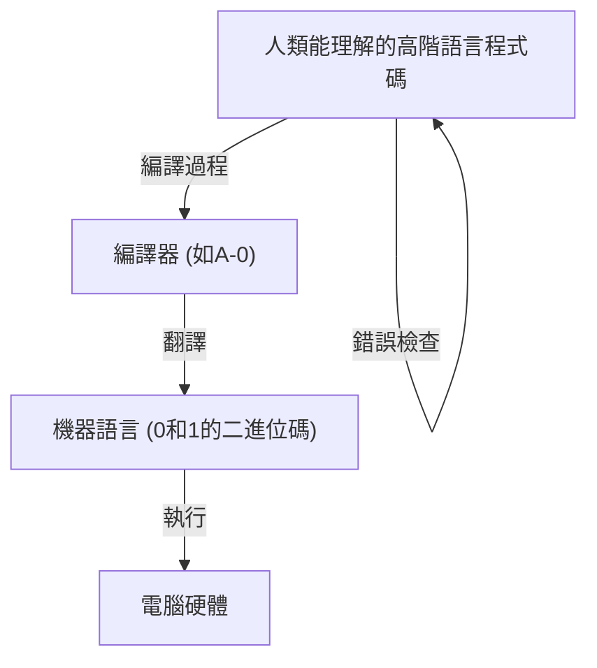
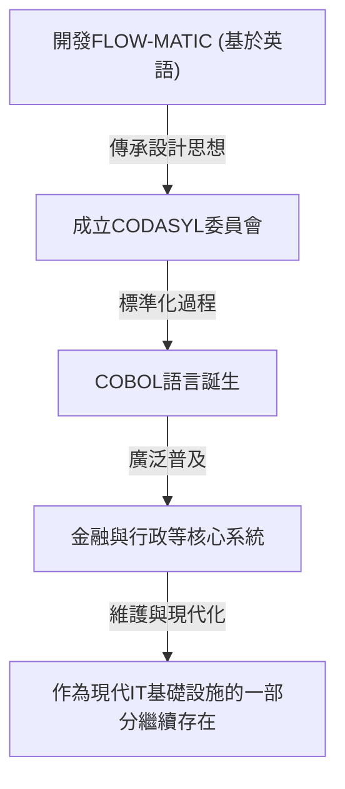

# 開創程式設計未來的先驅：葛麗絲·霍普（COBOL之母）的生平與遺產

現代IT社會由無數的軟體與程式支撐。我們日常使用的智慧型手機、銀行系統、航空器控制，甚至AI，全都建立在「程式語言」的基礎之上。然而，在人類能夠使用容易理解的語言對電腦下達指令之前，經歷了難以想像的反覆試錯與突破。

在這個歷史性轉折點上，扮演著最重要且決定性角色的其中一人，就是葛麗絲·穆雷·霍普（Grace Murray Hopper）。她被親切地稱為「COBOL之母（Mother of COBOL）」「奇異恩典（Amazing Grace）」，是美國海軍少將，同時也是天才數學家，以及具備先見之明的電腦科學家。

本文將回顧葛麗絲·霍普的一生，探討她如何參與早期電腦開發，並對程式語言的演進做出貢獻，用數千字深入解析她無可估量的業績與遺產。

## 第1章：童年與教育 —— 從充滿好奇心的少女到數學家

葛麗絲·布魯斯特·穆雷於1906年12月9日出生在紐約市。她的家庭環境尊重求知慾，葛麗絲自己也從小對機械和數學表現出非比尋常的興趣。一個著名的故事是，她在7歲時接連拆解了家裡的7個鬧鐘，試圖理解它們的運作原理。她的母親非但沒有責罵她，反而認可了她的探索精神，只允許她拆解一個鬧鐘。這樣的環境成為了孕育日後偉大科學家的土壤。

1924年，她進入名校瓦薩學院（Vassar College）就讀，主修數學與物理學。1928年以優異成績畢業後，進入耶魯大學研究所，於1930年取得碩士學位。同年，她與文森特·福斯特·霍普（Vincent Foster Hopper）結婚，改名為「葛麗絲·霍普」。1934年，她在耶魯大學取得數學博士學位（Ph.D.）。當時女性取得數學博士學位極為罕見，由此可見她非凡的智力與努力。

畢業後，葛麗絲回到母校瓦薩學院教授數學，順利地走在學者的道路上。然而，1941年的珍珠港事件導致美國捲入第二次世界大戰，這大大改變了她的命運。

## 第2章：加入海軍與遇見「Harvard Mark I」

隨著戰爭白熱化，葛麗絲強烈希望能為國家做出貢獻，自願加入美國海軍婦女預備役（WAVES: Women Accepted for Volunteer Emergency Service）。起初，她因為年齡（當時34歲）和體重的因素未達標準而被拒絕入伍，但後來作為特例獲准加入。

她在1943年順利入伍，1944年被任命為少尉，並被分配到哈佛大學的艦船局計算計畫（Bureau of Ships Computation Project）。在那裡，她遇見了美國第一台大型自動數位電腦「Harvard Mark I」。

Mark I是一台長約15公尺、重約5噸的巨大機器，由數十萬個零件和長達數百公里的線路組成。這台電腦負責處理軍事上極其重要的計算，如艦砲射擊的彈道計算，以及原子彈開發（曼哈頓計劃）中內爆透鏡的計算。

霍普被指派為這台Mark I的程式設計師。當時的程式設計並不像現在這樣透過鍵盤輸入程式碼，而是將指令打孔記錄在紙帶上，再讓機器讀取，是一項物理上相當繁雜的工作。在霍華德·艾肯（Howard Aiken，Mark I的設計者）的指導下，她瞬間掌握了Mark I的結構與操作方法，並編寫了程式設計手冊，成為計畫的核心人物。

## 第3章：傳奇的誕生 —— 發現第一個「電腦Bug」

在電腦領域中，程式的故障或錯誤被稱為「Bug（蟲）」，修正它的過程稱為「Debug（除錯）」。將這個詞彙深植於電腦業界的，正是葛麗絲·霍普與她的團隊。

1947年9月9日，霍普等人在哈佛大學操作Mark II電腦時，系統發生了原因不明的錯誤。團隊徹底檢查了巨大裝置的內部，發現一隻「飛蛾（Moth）」卡在繼電器（Relay）的接點上。這隻飛蛾物理上阻擋了接點，導致機器無法正常運作。

霍普等人用鑷子小心翼翼地取出那隻飛蛾，並用膠帶將其貼在工作日誌（Logbook）上。然後，在旁邊寫下了以下歷史性的筆記：

> "First actual case of bug being found."（第一個實際發現bug的案例）

雖然在技術背景下，「Bug」這個詞早在托馬斯·愛迪生時代就已開始使用，但將其廣泛認知為電腦程式或系統錯誤的契機，正是這個事件。這本工作日誌目前收藏於史密森尼博物館，成為IT歷史上的重要文物。

## 第4章：發明編譯器 —— 從機器語言到人類語言

二戰結束後，霍普仍留在海軍繼續研究，但不久便轉職到民間企業艾克特-莫克萊電腦公司（Eckert-Mauchly Computer Corporation，後來被雷明頓蘭德公司收購），參與商用電腦「UNIVAC I」的開發。

在這裡，她想出了一個將永遠改變程式設計歷史的突破性點子。當時的程式設計是使用機器語言（由0和1組成）或組合語言等極其接近機器結構的語言來進行。這對人類來說非常難以閱讀，不僅容易出錯，也只有受過專業訓練的極少數工程師才能操作。

霍普認為：「難道不能用人類容易理解的語言（如英語）對電腦下達指令，再由電腦自己將其翻譯成機器語言嗎？」這個翻譯程式就是「編譯器（Compiler）」。

1952年，她開發出了被稱為世界第一個編譯器的「A-0 System」。當時許多數學家和工程師嘲笑她的想法，認為「電腦只是一台計算機，不可能翻譯程式」。但她沒有放棄，並證明了它的實用性。透過這項突破，程式設計從少數專家的手中解放出來，為更多人參與軟體開發奠定了基礎。

## 第5章：從FLOW-MATIC到COBOL —— 為商業圈帶來革命的語言

雖然A-0系統主要用於數學和科學計算，但霍普的視野更加寬廣。她確信電腦在商業領域被廣泛應用的時代即將到來，並認為需要一種適合商業資料處理的程式語言。

因此，她的團隊開發了「FLOW-MATIC（B-0）」。FLOW-MATIC是第一個可以使用英語單字來描述資料處理的程式語言。例如，你可以寫出類似 "MULTIPLY PRICE BY QUANTITY GIVING TOTAL"（將價格乘上數量得到總和）這樣接近英語文法的程式碼。

1959年，在美國國防部的號召下，成立了旨在開發政府機構和民間企業均可共通使用的商業標準程式語言會議（CODASYL：資料系統語言協議會）。在這個會議中，霍普的FLOW-MATIC概念被大量採納，進而誕生了「COBOL（COmmon Business Oriented Language）」。

在制定COBOL時，雖然霍普本人並沒有直接撰寫規範，但她在FLOW-MATIC中證實的「基於英語且具備高可讀性的語言結構」哲學，構成了COBOL設計的基礎。因此，她被尊稱為「COBOL之母」。

COBOL迅速普及，被全球各大銀行金融系統、保險合約管理、政府行政系統等核心系統所採用。令人驚訝的是，經過60多年後的今天，世界上仍有許多舊有系統（Legacy System）持續運行著COBOL，默默支撐著我們的社會基礎設施。

## 第6章：作為教育家的一面與「奈秒」的視覺化

葛麗絲·霍普不僅是一位傑出的技術專家，也是一位極具天賦的教育家。她總是熱衷於將知識傳授給年輕一代。

象徵她作為教育家的一面的著名故事是「奈秒（Nanosecond）電線」。隨著電腦處理速度的提升，工程師們開始關注「奈秒（十億分之一秒）」級別的電路延遲。然而，直觀地理解奈秒這樣極短的時間是非常困難的。

於是，霍普計算了光（或電訊號）在真空中（或銅線內）一奈秒內行進的距離，大約是11.8英吋（約30公分）。她剪下了大量這個長度的電線，在演講或會議上發給人們，並說：「這就是一奈秒。」

「為什麼會發生通訊延遲？為什麼我們必須把電腦做得更小？看看這根『奈秒』電線就一目了然了吧。因為訊號到達是需要時間來移動物理距離的。」

就這樣，她是個將複雜且抽象的概念轉換為任何人都能理解的物理隱喻的天才。這種充滿幽默感與洞察力的方法，啟發了無數年輕的工程師和學生。

## 第7章：重返海軍與推動標準化

1966年，霍普曾一度從海軍屆齡退役，但僅僅7個月後，她又被海軍召回。因為海軍內部使用的各種程式語言和系統失去了相容性，引發了嚴重的問題。

重返現役後，她主導了海軍內部COBOL的標準化，以及編譯器驗證程式（Validation Routine）的開發。這確保了即使是不同製造商的電腦，相同的COBOL程式也能正確運行。這項對標準化的貢獻，對後來整個軟體產業的發展起到了極其重要的作用。

她之後屢獲晉升，1983年透過羅納德·雷根總統的特別任命晉升為准將。最終在1986年，她以79歲高齡從海軍退役時，已晉升為少將（Rear Admiral）。在退役時，她是全美軍中最年長的現役軍官。

## 第8章：晚年、榮譽與留下的遺產

即使從海軍退役後，她的熱情也從未衰退。她受邀擔任DEC（數位設備公司）的高級顧問，直到去世前都奔波於演講活動和培育年輕技術人員。

1992年1月1日，葛麗絲·霍普以85歲高齡辭世。她的遺體以軍方最高榮譽安葬於阿靈頓國家公墓。

為了紀念她的功績，1997年美國海軍將一艘神盾驅逐艦命名為「霍普號（USS Hopper, DDG-70）」。以女性名字來命名海軍艦艇是非常罕見的。此外，2016年巴拉克·歐巴馬總統追贈了她美國平民最高榮譽——「總統自由勳章」。

## 結語：從奇異恩典中學到的事

葛麗絲·霍普的一生，是一部不斷挑戰既有框架與常識的歷史。

「因為我們一直以來都是這樣做的（We've always done it that way）」

她將這句話視為「英語中最危險的一句話」而深惡痛絕。不滿足於現狀，總是尋求更好的方法、更有效率的方法、能讓更多人使用的方法，正是她這種態度催生了編譯器、誕生了COBOL，並奠定了今日IT社會的基礎。

程式設計之所以不再只是少數天才的專利，而成為人人都能使用的工具，是因為她抱持著「將機器語言翻譯成人類語言」的願景，並將其付諸實現。我們今天之所以能舒適地運用電腦、開發先進的軟體，無非是因為我們站在了「COBOL之母」葛麗絲·霍普所開闢的道路上。

她留下的遺產不僅僅是程式碼或系統，更作為「科技應該貼近人類」的哲學，至今仍活躍於軟體開發的第一線。

（完）
