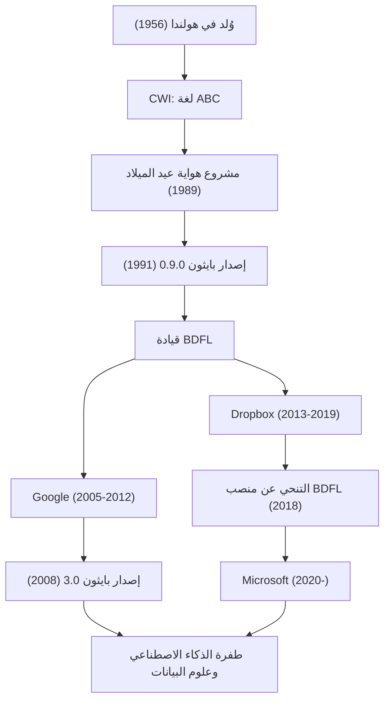

"بايثون" هي واحدة من أشهر لغات البرمجة في العالم. ويُعرف مبتكرها، المبرمج الهولندي جايدو فان روسم (Guido van Rossum). أصبحت اللغة التي ابتكرها لا غنى عنها في كافة المجالات حاليًا مثل الذكاء الاصطناعي، وعلوم البيانات، وتطوير الويب. في هذا المقال، سنتعمق في تفاصيل حياته، والفلسفة التي صمم بايثون بناءً عليها، ومدى تأثيره على التكنولوجيا للأجيال القادمة.

## حياته وولادة بايثون

وُلد جايدو فان روسم في مدينة هارلم بهولندا عام 1956. بعد حصوله على درجة الماجستير في الرياضيات وعلوم الحاسوب من جامعة أمستردام، بدأ العمل في المعهد الوطني لأبحاث الرياضيات وعلوم الحاسوب في هولندا (CWI). هناك، شارك في تطوير لغة برمجة تُدعى "ABC". كانت لغة ABC تعليمية وسهلة الاستخدام للغاية، لكنها كانت تعاني من بعض القيود العملية.

خلال عطلة عيد الميلاد عام 1989. بدأ جايدو كمشروع هواية، في تطوير لغة برمجة نصية جديدة يمكنها التغلب على عيوب لغة ABC مع توفير إمكانية الوصول إلى الميزات القوية للغة C ونظام Unix. تم إطلاق اسم "Python" (بايثون) على هذه اللغة، تيمنًا بالبرنامج الكوميدي البريطاني "سيرك مونتي بايثون الطائر" (Monty Python's Flying Circus) الذي كان من معجبيه.

في عام 1991، تم نشر أول كود للغة بايثون. بعد ذلك، شكلت بايثون تدريجيًا مجتمعًا حولها، وانتشرت في جميع أنحاء العالم كمشروع مفتوح المصدر في أواخر التسعينيات والعقد الأول من القرن الحادي والعشرين. وبصفته "ديكتاتورًا خيريًا مدى الحياة" (BDFL: Benevolent Dictator For Life)، احتفظ بسلطة القرار النهائي في تصميم بايثون لسنوات عديدة وقاد المجتمع (تنحى عن منصب BDFL في عام 2018). بعد ذلك، واصل العمل كمهندس في الخطوط الأمامية، وعمل في كبرى شركات التكنولوجيا العالمية مثل Google و Dropbox و Microsoft.

## فلسفة البرمجة: "كود يمكن لأي شخص قراءته"

إن أعظم إنجازات جايدو فان روسم، أكثر من ميزات لغة بايثون نفسها، هو إرساء "الفلسفة" الكامنة وراءها. تتبلور فلسفة تصميم بايثون في "زن بايثون" (The Zen of Python) التي صاغها تيم بيترز، لكن روحها هي أفكار جايدو نفسها.

ما ركز عليه بشكل خاص هو حقيقة أن "الكود يُقرأ أكثر مما يُكتب" (Readability counts). في وقت كانت فيه العديد من لغات البرمجة تركز على كفاءة المعالجة للآلة وتقليل كمية الكتابة للمبرمج، كان جايدو يهدف إلى "لغة للبشر". يُعد استخدام قاعدة التسلل (off-side rule) التي تستخدم المسافات البادئة (indentation) لتمثيل الكتل البرمجية، أبرز مثال على ذلك. بغض النظر عمن يكتبه، سيكون الهيكل مشابهًا، ويمكن فهم الأكواد التي كتبها الآخرون بسهولة. أدت هذه "القابلية للقراءة" في النهاية إلى زيادة إنتاجية التطوير بشكل كبير، وخلقت بيئة صديقة لتطوير البرمجيات واسعة النطاق وللمبتدئين في البرمجة.

## التأثير على الأجيال القادمة وعالم التكنولوجيا

أحدثت بايثون التي ابتكرها جايدو فان روسم، والفلسفة التي تقف وراءها، تأثيرًا لا يُقاس على عالم تطوير البرمجيات.

أولاً، مكانتها كمعيار بحكم الواقع في مجالات الحوسبة العلمية وعلوم البيانات. فقد لقيت قواعد بناء الجملة (syntax) البديهية وسهلة القراءة في بايثون قبولاً واسعاً من قِبل علماء الرياضيات والإحصاء والفيزياء الذين ليسوا خبراء في علوم الحاسوب. تم تطوير مكتبات قوية مثل NumPy و SciPy و Pandas بقيادة المجتمع، والتي شكلت أساساً قوياً لطفرة الذكاء الاصطناعي وتعلم الآلة الحالية (ازدهار أطر العمل مثل TensorFlow و PyTorch). ليس من المبالغة القول إنه لولا وجود بايثون كـ "لغة ذات حاجز كتابة منخفض وقوة تعبيرية عالية"، لكان تطور الذكاء الاصطناعي الحالي قد تأخر لعدة سنوات.

ثانيًا، أصبح نموذجًا يحتذى به في إدارة مجتمعات المصادر المفتوحة. بصفته BDFL، ورغم كونه ديكتاتورياً، استمع جايدو دائمًا إلى صوت المجتمع وطوّر اللغة مع الحفاظ على التناغم. عملت عملية الاقتراح التي قدمها "PEP (Python Enhancement Proposal)" كآلية لمناقشة إضافة الميزات أو التغييرات في اللغة عبر المجتمع بأكمله، واتخاذ القرارات بشفافية. قدمت قيادته إجابة مثالية على سؤال كيف ينبغي لمشروع مفتوح المصدر ضخم أن يتطور بشكل مستدام.

علاوة على ذلك، يجب ألا ننسى مساهمته في تعليم البرمجة. ترتبط مبادرة "برمجة الحاسوب للجميع" (Computer Programming for Everybody - CP4E)، التي تهدف إلى جعل البرمجة متاحة للجميع، ارتباطًا وثيقًا بالسبب الذي يجعل بايثون تُختار حاليًا كأول لغة برمجة، بدءًا من الفصول الدراسية في المدارس الابتدائية والإعدادية وصولاً إلى مقررات التعليم العام في الجامعات.

قصة جايدو فان روسم هي معجزة في تاريخ التكنولوجيا، حيث تحولت "هواية في عطلة" لمبرمج واحد إلى بنية تحتية غيرت العالم. إن ثقافة الكود "سهل القراءة، البسيط، والجميل" التي تركها ستظل تنتقل من جيل إلى جيل بين المبرمجين.

## الإنجازات ومسار المهنة

يوضح المخطط التالي العلاقة بين مسيرة جايدو فان روسم المهنية وتطور بايثون.

