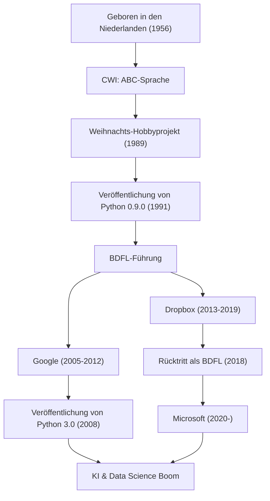

"Python" ist eine der beliebtesten Programmiersprachen der Welt. Als ihr Schöpfer ist der niederländische Programmierer Guido van Rossum bekannt. Die von ihm geschaffene Sprache ist heute in Bereichen wie KI, Data Science und Webentwicklung unverzichtbar geworden. Dieser Artikel geht der Frage nach, welches Leben er führte, unter welcher Philosophie er Python entwarf und welch großen Einfluss er auf die Technologie nachfolgender Generationen ausübte.

## Leben und die Entstehung von Python

Guido van Rossum wurde 1956 in Haarlem, Niederlande, geboren. Nach seinem Masterabschluss in Mathematik und Informatik an der Universität Amsterdam begann er am Centrum Wiskunde & Informatica (CWI) in den Niederlanden zu arbeiten. Dort war er an der Entwicklung einer Programmiersprache namens "ABC" beteiligt. Die ABC-Sprache war sehr lehrreich und einfach zu bedienen, wies jedoch einige praktische Einschränkungen auf.

Weihnachtsferien 1989. Als Hobbyprojekt begann Guido mit der Entwicklung einer neuen Skriptsprache, welche die Schwächen der ABC-Sprache überwinden und gleichzeitig auf die leistungsstarken Funktionen von C und Unix zugreifen konnte. Die Sprache wurde "Python" genannt, nach der britischen Comedy-Show "Monty Python’s Flying Circus", deren Fan er war.

1991 wurde der erste Code von Python veröffentlicht. Danach bildete Python nach und nach eine Community und verbreitete sich von den späten 1990er bis in die 2000er Jahre als Open-Source-Projekt auf der ganzen Welt. Als "Wohlwollender Diktator auf Lebenszeit" (BDFL: Benevolent Dictator For Life) besaß er über viele Jahre hinweg die endgültige Entscheidungsgewalt über das Design von Python und leitete die Community (2018 trat er als BDFL zurück). Danach arbeitete er bei weltweit führenden Technologieunternehmen wie Google, Dropbox und Microsoft und ist weiterhin als Ingenieur an vorderster Front aktiv.

## Programmierphilosophie: "Code, den jeder lesen kann"

Guido van Rossums größte Errungenschaft bestand darin, die "Philosophie", die Python zugrunde liegt, zu etablieren, noch mehr als die Funktionen der Sprache selbst. Die Designphilosophie von Python ist in "The Zen of Python", verfasst von Tim Peters, zusammengefasst, aber ihr Geist entspricht genau Guidos Denken.

Besonderen Wert legte er auf die Tatsache, dass "Code häufiger gelesen als geschrieben wird" (Readability counts). In einer Zeit, in der viele Programmiersprachen auf die Verarbeitungseffizienz für Maschinen oder die Verringerung des Tippaufwands für die Entwickler fokussiert waren, strebte Guido nach einer "Sprache für Menschen". Die Übernahme der Off-Side-Regel, bei der Blöcke durch Einrückung dargestellt werden, ist ein Paradebeispiel dafür. Egal wer ihn schreibt, es entsteht eine ähnliche Struktur, und selbst von anderen geschriebener Code kann leicht verstanden werden. Diese "Lesbarkeit" führte zu einer dramatischen Steigerung der Entwicklungsproduktivität und schuf eine Umgebung, die sowohl für groß angelegte Softwareentwicklung als auch für Programmieranfänger freundlich ist.

## Einfluss auf die Nachwelt und die Technologie-Welt

Das von Guido van Rossum geschaffene Python und die dahinterstehende Philosophie hatten einen unermesslichen Einfluss auf die Welt der Softwareentwicklung.

Erstens seine Stellung als De-facto-Standard in den Bereichen des wissenschaftlichen Rechnens und der Data Science. Pythons lesbare und intuitive Syntax fand breite Akzeptanz bei Mathematikern, Statistikern und Physikern, die keine Informatikexperten waren. Leistungsstarke Bibliotheken wie NumPy, SciPy und Pandas wurden von der Community vorangetrieben und bilden ein starkes Fundament für den aktuellen KI- und Machine-Learning-Boom (den Aufstieg von Frameworks wie TensorFlow und PyTorch). Es ist keine Übertreibung zu sagen, dass sich die aktuelle Entwicklung der künstlichen Intelligenz vielleicht um einige Jahre verzögert hätte, wenn Python als "eine ausdrucksstarke Sprache mit niedriger Einstiegshürde" nicht existiert hätte.

Zweitens wurde es zu einem Vorzeigemodell für das Management von Open-Source-Communities. Als BDFL war Guido zwar diktatorisch, hörte aber stets auf die Stimmen der Community und entwickelte die Sprache weiter, während er die Harmonie aufrechterhielt. Der von ihm eingeführte Vorschlagsprozess "PEP (Python Enhancement Proposal)" funktionierte als Mechanismus, um neue Funktionen und Änderungen der Sprache mit der gesamten Community zu diskutieren und transparent zu entscheiden. Seine Führung bot eine ideale Antwort auf die Frage, wie sich riesige Open-Source-Projekte nachhaltig entwickeln sollten.

Darüber hinaus darf auch der Beitrag zur Programmierausbildung nicht vergessen werden. Die Vision von "Computer Programming for Everybody (CP4E)", das Programmieren für jedermann zugänglich zu machen, ist eng damit verbunden, warum Python heutzutage vom Grund- und Mittelschulunterricht bis hin zu allgemeinen Universitätskursen als erste Programmiersprache gewählt wird.

Die Geschichte von Guido van Rossum ist ein Wunder in der Technologiegeschichte, bei dem das "Urlaubshobby" eines einzigen Programmierers zu einer Infrastruktur heranwuchs, die die Welt verändert. Die Kultur des "lesbaren, einfachen und schönen" Codes, die er hinterlassen hat, wird sicherlich über Generationen hinweg an Programmierer weitergegeben werden.

## Errungenschaften und Karriereverlauf

Die folgende Abbildung zeigt die Zusammenhänge zwischen Guido van Rossums Karriere und der Evolution von Python.

