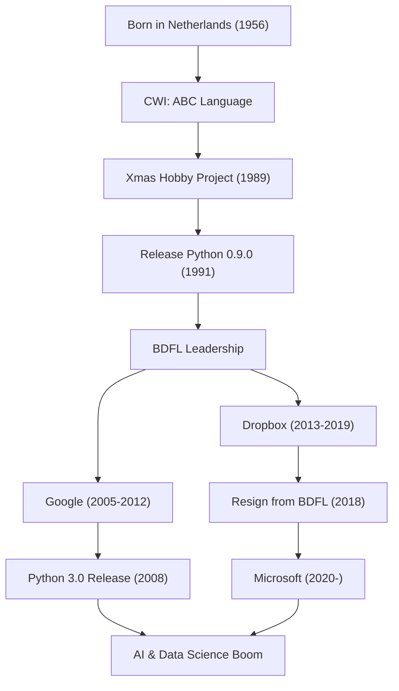

"Python" is one of the most popular programming languages in the world. Its creator is the Dutch programmer Guido van Rossum. The language he built is now indispensable in every field, including AI, data science, and web development. In this article, we delve deep into the life he led, the philosophy behind his design of Python, and the profound impact he has had on subsequent technology.

## Early Life and the Birth of Python

Guido van Rossum was born in 1956 in Haarlem, the Netherlands. After receiving a master's degree in mathematics and computer science from the University of Amsterdam, he began working at the Centrum Wiskunde & Informatica (CWI) in the Netherlands. There, he was involved in the development of a programming language called "ABC." While ABC was a highly educational and easy-to-use language, it had several practical limitations.

During the Christmas holidays in 1989, Guido embarked on a hobby project to develop a new scripting language that would overcome the shortcomings of ABC while providing access to the powerful features of C and Unix. He named the language "Python," inspired by the British comedy show "Monty Python's Flying Circus," of which he was a fan.

In 1991, the first Python code was released. Python gradually formed a community and, from the late 1990s through the 2000s, spread around the world as an open-source project. As the "Benevolent Dictator For Life (BDFL)," he held the ultimate decision-making power over Python's design for many years and guided the community (he stepped down as BDFL in 2018). Since then, he has continued to be active as a frontline engineer at world-class technology companies such as Google, Dropbox, and Microsoft.

## Programming Philosophy: "Code Anyone Can Read"

Guido van Rossum's greatest achievement, even more than the features of the Python language itself, is the establishment of its underlying "philosophy." Python's design philosophy is encapsulated in "The Zen of Python," drafted by Tim Peters, but its spirit is exactly that of Guido's thoughts.

He placed particular emphasis on the fact that "code is read much more often than it is written (Readability counts)." In an era when many programming languages prioritized processing efficiency for machines or reducing the amount of typing for the writer, Guido aimed for a "language for humans." The adoption of the off-side rule, which expresses blocks through indentation, is the prime example of this. No matter who writes it, the structure ends up looking similar, making even code written by others easy to understand. This "readability" ultimately dramatically increased development productivity and created an environment friendly to large-scale software development and programming beginners alike.

## Impact on Future Generations and the Tech World

The Python language Guido van Rossum created and the philosophy behind it have had an immeasurable impact on the world of software development.

First is its status as the de facto standard in the fields of scientific computing and data science. Python's readable and intuitive syntax has been widely embraced by mathematicians, statisticians, and physicists who are not computer science experts. Powerful libraries such as NumPy, SciPy, and Pandas were developed by the community, serving as a strong foundation for the current AI and machine learning boom (and the rise of frameworks like TensorFlow and PyTorch). It is no exaggeration to say that without Python, a language with a "low barrier to entry yet high expressiveness," the current development of artificial intelligence might have been delayed by several years.

Second, it became a model case for managing open-source communities. As BDFL, Guido, while dictatorial, always listened to the voices of the community and grew the language while maintaining harmony. The "PEP (Python Enhancement Proposal)" process he introduced functioned as a mechanism for the entire community to discuss and transparently decide on adding or changing language features. His leadership provided an ideal answer to the question of how huge open-source projects should sustainably develop.

Furthermore, his contribution to programming education cannot be forgotten. The concept of "Computer Programming for Everybody (CP4E)" is deeply connected to why Python is chosen as a first programming language today, from elementary and junior high schools to university liberal arts courses.

Guido van Rossum's story is a miracle in the history of technology, where a single programmer's "holiday hobby" grew into an infrastructure that changes the world. The culture of "readable, simple, and beautiful" code that he left behind will continue to be passed down to programmers across generations.

## Career Flow and Achievements

The following diagram shows the correlation between Guido van Rossum's career and the evolution of Python.

