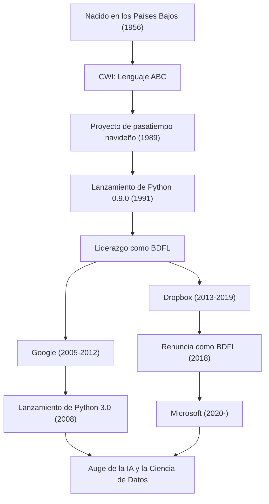

"Python" es uno de los lenguajes de programación más populares del mundo. Su creador es el programador de origen neerlandés Guido van Rossum. El lenguaje que él creó es hoy en día una presencia indispensable en todos los campos, como la inteligencia artificial (IA), la ciencia de datos y el desarrollo web. En este artículo, profundizaremos en qué tipo de vida ha llevado, bajo qué filosofía diseñó Python y cuánta influencia ha tenido en la tecnología para las futuras generaciones.

## La vida y el nacimiento de Python

Guido van Rossum nació en 1956 en Haarlem, Países Bajos. Después de obtener una maestría en matemáticas y ciencias de la computación en la Universidad de Ámsterdam, comenzó a trabajar en el Centrum Wiskunde & Informatica (CWI - Instituto Nacional de Matemáticas e Informática de los Países Bajos). Allí participó en el desarrollo de un lenguaje de programación llamado "ABC". El lenguaje ABC era muy educativo y fácil de usar, pero tenía algunas limitaciones prácticas.

En las vacaciones de Navidad de 1989, Guido comenzó a desarrollar, como un proyecto de pasatiempo, un nuevo lenguaje de scripting que superara los defectos del lenguaje ABC, y que a la vez pudiera acceder a las potentes características de C y Unix. El nombre de este lenguaje, "Python", fue inspirado en el programa de comedia británico "Monty Python's Flying Circus", del cual él era un gran admirador.

En 1991, se publicó el primer código de Python. A partir de entonces, Python formó gradualmente una comunidad y, desde finales de la década de 1990 hasta la década de 2000, se expandió por todo el mundo como un proyecto de código abierto. Él, como "Dictador Benevolente Vitalicio" (BDFL: Benevolent Dictator For Life), mantuvo la autoridad final sobre las decisiones de diseño de Python durante muchos años y guió a la comunidad (renunció a ser BDFL en 2018). Después de eso, ha formado parte de algunas de las empresas de tecnología más grandes del mundo, como Google, Dropbox y Microsoft, y continúa activo como ingeniero de primer nivel.

## Filosofía de programación: "Código legible por cualquiera"

El mayor logro de Guido van Rossum, más que las características del lenguaje Python en sí, es haber establecido la "filosofía" que yace en su base. La filosofía de diseño de Python está resumida en "El Zen de Python" (The Zen of Python), redactado por Tim Peters, pero ese espíritu refleja los propios pensamientos de Guido.

Un punto al que le dio especial importancia es el hecho de que "el código se lee más a menudo de lo que se escribe" (Readability counts). En una época en la que muchos lenguajes de programación priorizaban la eficiencia de procesamiento para las máquinas o reducir la cantidad de escritura del programador, Guido apuntó a "un lenguaje para humanos". La adopción de la regla del fuera de lado (off-side rule), que utiliza la indentación para representar bloques, es el mejor ejemplo de esto. Sin importar quién lo escriba, la estructura es similar, por lo que es fácil de entender incluso si el código lo escribió otra persona. Esta "legibilidad", como resultado, aumentó drásticamente la productividad del desarrollo y creó un entorno amigable tanto para el desarrollo de software a gran escala como para los principiantes en la programación.

## Influencia en el futuro y en el mundo de la tecnología

Python, creado por Guido van Rossum, y la filosofía que lo respalda, han tenido un impacto incalculable en el mundo del desarrollo de software.

En primer lugar, su posición como estándar de facto en los campos del cálculo científico y la ciencia de datos. La gramática intuitiva y legible de Python también fue ampliamente aceptada por matemáticos, estadísticos y físicos que no eran expertos en ciencias de la computación. Potentes bibliotecas como NumPy, SciPy y Pandas fueron desarrolladas impulsadas por la comunidad, lo que se ha convertido en una base sólida para el actual auge de la IA y el aprendizaje automático (el surgimiento de frameworks como TensorFlow y PyTorch). No es exagerado decir que si no hubiera existido Python, "un lenguaje con una barrera de escritura baja y un alto poder expresivo", el desarrollo de la inteligencia artificial actual podría haberse retrasado varios años.

En segundo lugar, se convirtió en un caso modelo para la gestión de comunidades de código abierto. Como BDFL, aunque tenía un poder dictatorial, Guido siempre escuchó la voz de la comunidad y desarrolló el lenguaje manteniendo la armonía. El proceso de propuestas que introdujo, llamado "PEP" (Python Enhancement Proposal), funcionó como un mecanismo para discutir adiciones de características y cambios en el lenguaje con toda la comunidad, decidiendo con transparencia. Su liderazgo ha demostrado una respuesta ideal a la pregunta de cómo debería desarrollarse de manera sostenible un proyecto gigantesco de código abierto.

Además, no debemos olvidar su contribución a la educación en programación. Su visión de "Programación de Computadoras para Todos" (CP4E: Computer Programming for Everybody) está profundamente conectada con la razón por la que Python es elegido hoy en día como el primer lenguaje de programación, desde las escuelas primarias y secundarias hasta los cursos de educación general en las universidades.

La historia de Guido van Rossum es un milagro en la historia de la tecnología en el que el "pasatiempo de vacaciones" de un programador se convirtió en una infraestructura que cambió el mundo. La cultura del código "legible, simple y hermoso" que dejó atrás seguirá siendo heredada por programadores de generación en generación.

## Flujo de logros y carrera profesional

El siguiente diagrama ilustra la correlación entre la carrera de Guido van Rossum y la evolución de Python.

