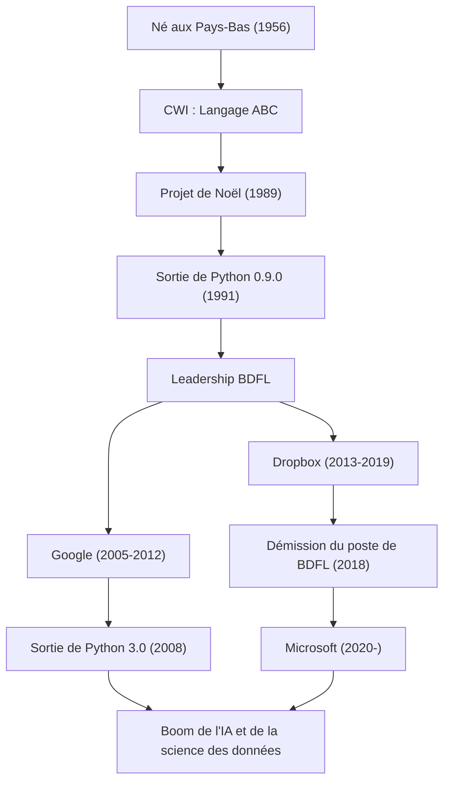

"Python" est l'un des langages de programmation les plus populaires au monde. Son créateur est le programmeur néerlandais Guido van Rossum. Le langage qu'il a créé est désormais indispensable dans tous les domaines, tels que l'IA, la science des données et le développement Web. Dans cet article, nous explorerons en profondeur sa vie, la philosophie derrière la conception de Python et l'impact considérable qu'il a eu sur les technologies des générations futures.

## La vie et la naissance de Python

Guido van Rossum est né à Haarlem, aux Pays-Bas, en 1956. Après avoir obtenu une maîtrise en mathématiques et en informatique à l'Université d'Amsterdam, il a commencé à travailler au Centrum Wiskunde & Informatica (CWI). Là-bas, il a participé au développement d'un langage de programmation appelé "ABC". Le langage ABC était très éducatif et facile à utiliser, mais il présentait plusieurs limitations pratiques.

Pendant les vacances de Noël de 1989, Guido a commencé à développer un nouveau langage de script en tant que projet personnel, visant à surmonter les défauts du langage ABC tout en permettant d'accéder aux puissantes fonctionnalités du langage C et d'Unix. Le nom du langage, "Python", a été choisi en hommage à l'émission humoristique britannique "Monty Python's Flying Circus", dont il était fan.

En 1991, le premier code de Python a été publié. Par la suite, Python a progressivement formé une communauté et s'est répandu dans le monde entier en tant que projet open source de la fin des années 1990 aux années 2000. En tant que "Dictateur Bienveillant à Vie" (BDFL : Benevolent Dictator For Life), il a conservé le pouvoir de décision final sur la conception de Python et a guidé la communauté pendant de nombreuses années (il a démissionné de son poste de BDFL en 2018). Par la suite, il a continué à travailler comme ingénieur de premier plan dans des entreprises technologiques de renommée mondiale telles que Google, Dropbox et Microsoft.

## Philosophie de programmation : "Du code lisible par tous"

La plus grande réalisation de Guido van Rossum, bien plus que les fonctionnalités du langage Python en elles-mêmes, est d'avoir établi la "philosophie" qui les sous-tend. La philosophie de conception de Python est résumée dans "The Zen of Python" rédigé par Tim Peters, mais son esprit est l'idéologie même de Guido.

Ce qu'il a particulièrement souligné, c'est le fait que "le code est lu beaucoup plus souvent qu'il n'est écrit (Readability counts)". À une époque où de nombreux langages de programmation privilégiaient l'efficacité du traitement pour les machines ou la réduction de la quantité de frappe pour l'auteur, Guido visait un "langage pour les humains". L'adoption de la règle de hors-jeu (off-side rule), où les blocs sont représentés par l'indentation, en est le meilleur exemple. Peu importe qui l'écrit, la structure sera similaire et le code écrit par d'autres peut être facilement compris. Cette "lisibilité" a considérablement augmenté la productivité du développement, créant un environnement convivial pour le développement de logiciels à grande échelle ainsi que pour les débutants en programmation.

## Impact sur la postérité et le monde technologique

Python, créé par Guido van Rossum, et la philosophie qui l'accompagne, ont eu un impact incommensurable sur le monde du développement logiciel.

Premièrement, son statut de norme de facto dans les domaines du calcul scientifique et de la science des données. La syntaxe intuitive et lisible de Python a été largement adoptée par des mathématiciens, des statisticiens et des physiciens qui ne sont pas des experts en informatique. De puissantes bibliothèques telles que NumPy, SciPy et Pandas ont été développées par la communauté, constituant la base solide du boom actuel de l'IA et de l'apprentissage automatique (l'essor de frameworks tels que TensorFlow et PyTorch). Il n'est pas exagéré de dire que si Python, "un langage avec une faible barrière à l'écriture et une grande expressivité", n'avait pas existé, le développement actuel de l'intelligence artificielle aurait pu être retardé de plusieurs années.

Deuxièmement, il est devenu un modèle pour la gestion de communautés open source. En tant que BDFL, bien que dictatorial, Guido écoutait toujours la voix de la communauté et faisait grandir le langage tout en maintenant l'harmonie. Le processus de proposition "PEP (Python Enhancement Proposal)" qu'il a introduit a fonctionné comme un mécanisme permettant de discuter de l'ajout ou de la modification de fonctionnalités du langage au sein de la communauté dans son ensemble, et de prendre des décisions en toute transparence. Son leadership a fourni une réponse idéale à la question de savoir comment un immense projet open source devrait se développer durablement.

De plus, nous ne devons pas oublier sa contribution à l'enseignement de la programmation. L'initiative "Computer Programming for Everybody (CP4E)", dont le but est de "rendre la programmation accessible à tous", est aujourd'hui profondément liée à la raison pour laquelle Python est choisi comme premier langage de programmation, de l'enseignement primaire et secondaire aux cours d'enseignement général universitaires.

L'histoire de Guido van Rossum est un miracle dans l'histoire de la technologie, où le "projet du dimanche" d'un seul programmeur est devenu une infrastructure qui change le monde. La culture d'un code "lisible, simple et beau" qu'il a laissée continuera d'être transmise aux programmeurs à travers les générations.

## Flux des réalisations et de la carrière

Le diagramme ci-dessous montre la corrélation entre la carrière de Guido van Rossum et l'évolution de Python.

