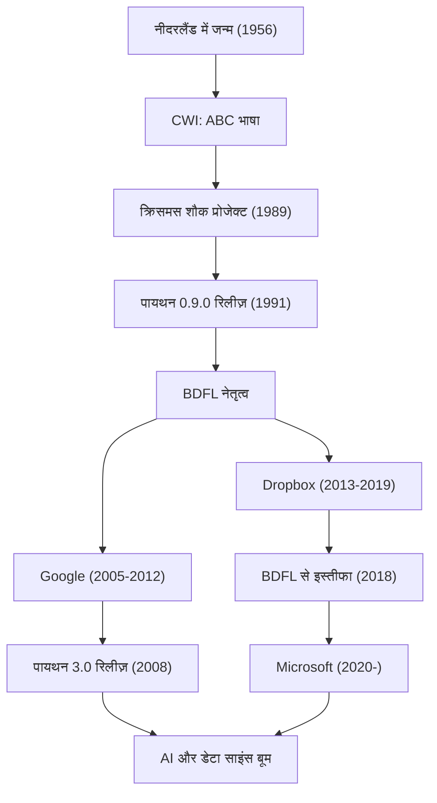

पायथन दुनिया की सबसे लोकप्रिय प्रोग्रामिंग भाषाओं में से एक है। इसके निर्माता के रूप में नीदरलैंड के प्रोग्रामर ग्विडो वैन रोसम (Guido van Rossum) को जाना जाता है। उनके द्वारा बनाई गई यह भाषा आज एआई (AI), डेटा साइंस और वेब डेवलपमेंट जैसे हर क्षेत्र में अपरिहार्य बन गई है। इस लेख में, हम गहराई से जानेंगे कि उनका जीवन कैसा रहा, उन्होंने किस दर्शन के तहत पायथन को डिज़ाइन किया, और उन्होंने भविष्य की तकनीक पर कितना प्रभाव डाला।

## जीवन और पायथन का जन्म

ग्विडो वैन रोसम का जन्म 1956 में नीदरलैंड के हार्लेम में हुआ था। एम्स्टर्डम विश्वविद्यालय से गणित और कंप्यूटर विज्ञान में मास्टर डिग्री प्राप्त करने के बाद, उन्होंने नीदरलैंड के राष्ट्रीय गणित और कंप्यूटर विज्ञान अनुसंधान संस्थान (CWI) में काम करना शुरू किया। वहां वे "ABC" नामक एक प्रोग्रामिंग भाषा के विकास में शामिल थे। ABC भाषा बहुत ही शैक्षिक और उपयोग में आसान भाषा थी, लेकिन इसमें कुछ व्यावहारिक सीमाएं थीं।

1989 की क्रिसमस की छुट्टियों में, ग्विडो ने अपने शौक के प्रोजेक्ट के रूप में एक नई स्क्रिप्टिंग भाषा विकसित करना शुरू किया, जो ABC भाषा की कमियों को दूर कर सके और C भाषा व Unix की शक्तिशाली सुविधाओं तक पहुंच प्रदान कर सके। इस भाषा का नाम उनके पसंदीदा ब्रिटिश कॉमेडी शो "मोंटी पायथन्स फ्लाइंग सर्कस (Monty Python's Flying Circus)" के नाम पर "पायथन" रखा गया।

1991 में, पायथन का पहला कोड जारी किया गया था। इसके बाद, पायथन ने धीरे-धीरे एक समुदाय का निर्माण किया और 1990 के दशक के अंत से 2000 के दशक तक एक ओपन-सोर्स प्रोजेक्ट के रूप में दुनिया भर में फैल गया। उन्होंने कई वर्षों तक "परोपकारी आजीवन तानाशाह (BDFL: Benevolent Dictator For Life)" के रूप में पायथन के डिज़ाइन पर अंतिम निर्णय लेने का अधिकार बनाए रखा और समुदाय का मार्गदर्शन किया (2018 में उन्होंने BDFL पद से इस्तीफा दे दिया)। उसके बाद भी वे Google, Dropbox और Microsoft जैसी दुनिया की शीर्ष प्रौद्योगिकी कंपनियों में काम करते हुए एक अग्रणी इंजीनियर के रूप में सक्रिय रहे हैं।

## प्रोग्रामिंग दर्शन: "सभी के पढ़ने योग्य कोड"

ग्विडो वैन रोसम की सबसे बड़ी उपलब्धि पायथन भाषा की विशेषताओं से कहीं अधिक इसके मूल "दर्शन" को स्थापित करना है। पायथन का डिज़ाइन दर्शन टिम पीटर्स द्वारा लिखे गए "द ज़ेन ऑफ़ पायथन (The Zen of Python)" में संक्षेप में प्रस्तुत किया गया है, लेकिन इसकी भावना ग्विडो के विचारों का ही प्रतिबिंब है।

उन्होंने इस तथ्य पर विशेष जोर दिया कि "कोड लिखे जाने से अधिक बार पढ़ा जाता है (Readability counts)"। उस युग में जब कई प्रोग्रामिंग भाषाएं मशीनों के लिए प्रसंस्करण दक्षता या लेखकों के लिए टाइपिंग की मात्रा को कम करने पर केंद्रित थीं, ग्विडो ने "इंसानों के लिए भाषा" का लक्ष्य रखा। इंडेंटेशन द्वारा ब्लॉक को दर्शाने वाले ऑफ-साइड नियम (off-side rule) को अपनाना इसका सबसे अच्छा उदाहरण है। कोई भी इसे लिखे, संरचना समान रहती है, जिससे दूसरों द्वारा लिखे गए कोड को समझना आसान हो जाता है। इस "पठनीयता" के परिणामस्वरूप विकास उत्पादकता में काफी वृद्धि हुई, जिससे बड़े पैमाने पर सॉफ्टवेयर विकास और प्रोग्रामिंग शुरुआती लोगों के लिए एक अनुकूल वातावरण तैयार हुआ।

## आने वाली पीढ़ियों और प्रौद्योगिकी की दुनिया पर प्रभाव

ग्विडो वैन रोसम द्वारा बनाई गई पायथन और इसके पीछे के दर्शन ने सॉफ्टवेयर विकास की दुनिया पर गहरा प्रभाव डाला है।

पहला, वैज्ञानिक और तकनीकी कंप्यूटिंग तथा डेटा साइंस के क्षेत्र में इसके डी-फैक्टो (de facto) मानक के रूप में स्थापित होना। पायथन के आसानी से पढ़े जाने वाले और सहज ज्ञान युक्त व्याकरण को गणितज्ञों, सांख्यिकीविदों और भौतिक विज्ञानियों द्वारा व्यापक रूप से स्वीकार किया गया, जो कंप्यूटर विज्ञान के विशेषज्ञ नहीं थे। NumPy, SciPy और Pandas जैसी शक्तिशाली लाइब्रेरी समुदाय द्वारा संचालित होकर विकसित की गईं, जो वर्तमान एआई और मशीन लर्निंग बूम (TensorFlow और PyTorch जैसे फ्रेमवर्क का उदय) का मजबूत आधार बनी हैं। यह कहना अतिशयोक्ति नहीं होगी कि यदि पायथन जैसी "कम कोडिंग बाधाओं और उच्च अभिव्यक्ति वाली भाषा" मौजूद नहीं होती, तो वर्तमान में कृत्रिम बुद्धिमत्ता (AI) के विकास में कई साल की देरी हो सकती थी।

दूसरा, यह ओपन-सोर्स समुदाय के प्रबंधन में एक आदर्श मॉडल बन गया है। BDFL के रूप में, ग्विडो ने तानाशाही होने के बावजूद हमेशा समुदाय की आवाज़ सुनी और सामंजस्य बनाए रखते हुए भाषा का विकास किया। उनके द्वारा पेश की गई "PEP (Python Enhancement Proposal)" नामक प्रस्ताव प्रक्रिया ने समुदाय भर में भाषा की सुविधाओं को जोड़ने और बदलने पर चर्चा करने और पारदर्शिता के साथ निर्णय लेने के लिए एक तंत्र के रूप में कार्य किया। उनके नेतृत्व ने इस सवाल का एक आदर्श उत्तर दिया कि एक विशाल ओपन-सोर्स प्रोजेक्ट को कैसे स्थायी रूप से विकसित होना चाहिए।

इसके अलावा, प्रोग्रामिंग शिक्षा में उनके योगदान को भुलाया नहीं जा सकता। "कंप्यूटर प्रोग्रामिंग सभी के लिए (CP4E)" की अवधारणा कि "प्रोग्रामिंग को हर किसी के लिए सुलभ बनाया जाए" गहराई से उस कारण से जुड़ी है जिसके कारण आज प्राथमिक और मध्य विद्यालयों से लेकर विश्वविद्यालयों के उदार कला पाठ्यक्रमों तक पायथन को पहली प्रोग्रामिंग भाषा के रूप में चुना जाता है।

ग्विडो वैन रोसम की कहानी तकनीकी इतिहास में एक चमत्कार है कि कैसे एक प्रोग्रामर का "छुट्टियों का शौक" दुनिया को बदलने वाले बुनियादी ढांचे में विकसित हुआ। उनके द्वारा छोड़ी गई "पठनीय, सरल और सुंदर" कोड की संस्कृति आने वाली पीढ़ियों के प्रोग्रामरों तक पहुंचती रहेगी।

## उपलब्धियां और करियर प्रवाह

नीचे दिया गया चित्र ग्विडो वैन रोसम के करियर और पायथन के विकास के बीच संबंध को दर्शाता है।

