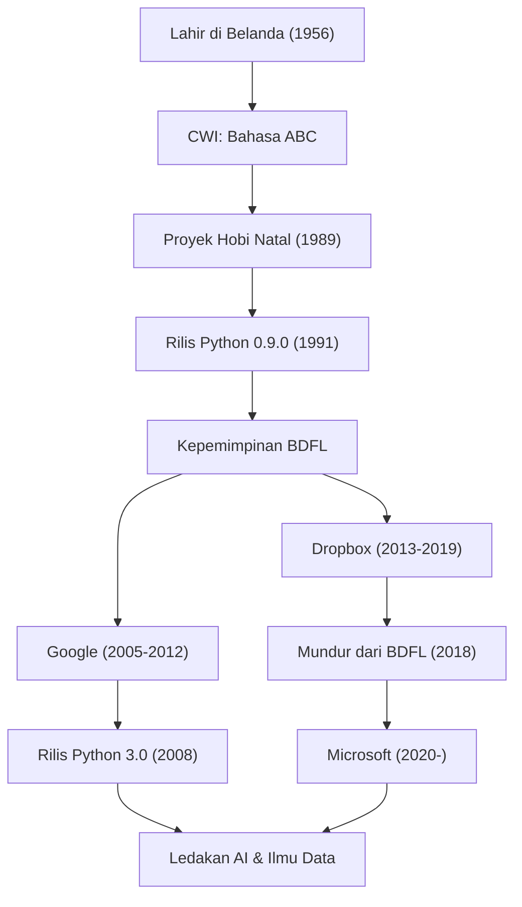

"Python" adalah salah satu bahasa pemrograman paling populer di dunia. Dikenal sebagai penciptanya, Guido van Rossum adalah seorang programmer asal Belanda. Bahasa yang ia ciptakan kini menjadi hal yang sangat diperlukan dalam berbagai bidang seperti AI, ilmu data, dan pengembangan web. Artikel ini akan menggali lebih dalam mengenai perjalanan hidupnya, filosofi yang mendasari desain Python, serta seberapa besar pengaruhnya terhadap teknologi di masa depan.

## Kehidupan Awal dan Kelahiran Python

Guido van Rossum lahir pada tahun 1956 di Haarlem, Belanda. Setelah meraih gelar master di bidang matematika dan ilmu komputer dari Universitas Amsterdam, ia mulai bekerja di Centrum Wiskunde & Informatica (CWI) di Belanda. Di sana, ia terlibat dalam pengembangan bahasa pemrograman yang disebut "ABC". Bahasa ABC sangat mendidik dan mudah digunakan, tetapi memiliki beberapa batasan praktis.

Liburan Natal tahun 1989. Sebagai proyek hobi, Guido mulai mengembangkan bahasa skrip baru yang dapat mengatasi kelemahan bahasa ABC, sambil memberikan akses ke fitur-fitur kuat dari bahasa C dan Unix. Nama bahasa tersebut, "Python", diambil dari serial komedi Inggris favoritnya, "Monty Python's Flying Circus".

Pada tahun 1991, kode pertama Python dirilis. Setelah itu, Python secara bertahap membentuk komunitas dan menyebar ke seluruh dunia sebagai proyek sumber terbuka dari akhir 1990-an hingga 2000-an. Sebagai "Diktator Baik Hati Seumur Hidup" (BDFL: Benevolent Dictator For Life), ia memegang kendali keputusan akhir atas desain Python selama bertahun-tahun dan memimpin komunitas (ia mundur dari posisi BDFL pada tahun 2018). Setelah itu, ia terus berkarya sebagai insinyur garis depan di perusahaan teknologi kelas dunia seperti Google, Dropbox, dan Microsoft.

## Filosofi Pemrograman: "Kode yang Dapat Dibaca oleh Siapa Saja"

Pencapaian terbesar Guido van Rossum, lebih dari sekadar fungsionalitas bahasa Python itu sendiri, adalah menetapkan "filosofi" yang mendasarinya. Filosofi desain Python dirangkum dalam "The Zen of Python" (Zen dari Python) yang disusun oleh Tim Peters, yang mana semangatnya adalah cerminan dari pemikiran Guido sendiri.

Secara khusus, ia menekankan fakta bahwa "kode lebih sering dibaca daripada ditulis (Readability counts)". Di era ketika banyak bahasa pemrograman memprioritaskan efisiensi pemrosesan untuk mesin dan mengurangi jumlah ketikan bagi penulis, Guido bertujuan untuk membuat "bahasa untuk manusia". Penggunaan aturan off-side yang mewakili blok dengan indentasi adalah contoh terbaik dari hal ini. Siapa pun yang menulisnya, strukturnya akan terlihat serupa, sehingga memudahkan untuk memahami kode yang ditulis oleh orang lain. "Keterbacaan" ini pada gilirannya secara dramatis meningkatkan produktivitas pengembangan, dan menciptakan lingkungan yang bersahabat untuk pengembangan perangkat lunak berskala besar maupun bagi pemula dalam pemrograman.

## Dampak pada Generasi Mendatang dan Dunia Teknologi

Python yang diciptakan oleh Guido van Rossum dan filosofi di baliknya telah memberikan dampak yang tak ternilai pada dunia pengembangan perangkat lunak.

Pertama, posisinya sebagai standar de facto di bidang komputasi ilmiah dan ilmu data. Sintaks Python yang mudah dibaca dan intuitif telah diterima secara luas oleh para matematikawan, ahli statistik, dan fisikawan yang bukan pakar ilmu komputer. Pustaka kuat seperti NumPy, SciPy, dan Pandas dikembangkan berdasarkan inisiatif komunitas, yang menjadi fondasi kuat untuk ledakan AI dan pembelajaran mesin saat ini (seperti pesatnya kerangka kerja TensorFlow dan PyTorch). Tidak berlebihan jika dikatakan bahwa tanpa adanya bahasa Python yang "mudah ditulis dan sangat ekspresif", perkembangan kecerdasan buatan saat ini mungkin akan tertunda beberapa tahun.

Kedua, ini menjadi studi kasus dalam manajemen komunitas sumber terbuka. Sebagai BDFL, Guido bersifat otokratis namun selalu mendengarkan komunitas, mengembangkan bahasa sambil menjaga harmoni. Proses pengajuan "PEP (Python Enhancement Proposal)" yang ia perkenalkan, berfungsi sebagai mekanisme untuk mendiskusikan penambahan atau perubahan fitur bahasa di seluruh komunitas dan membuat keputusan secara transparan. Kepemimpinannya memberikan satu jawaban yang ideal untuk pertanyaan tentang bagaimana proyek sumber terbuka yang besar harus berkembang secara berkelanjutan.

Selain itu, kontribusinya pada pendidikan pemrograman tidak boleh dilupakan. Visi "Computer Programming for Everybody (CP4E)" yang bertujuan "menjadikan pemrograman untuk semua orang", sangat berkaitan erat dengan alasan mengapa saat ini Python dipilih sebagai bahasa pemrograman pertama, dari pendidikan di sekolah dasar dan menengah hingga mata kuliah umum di universitas.

Kisah Guido van Rossum adalah keajaiban dalam sejarah teknologi, di mana "hobi liburan" seorang programmer tumbuh menjadi infrastruktur yang mengubah dunia. Budaya kode yang "mudah dibaca, sederhana, dan indah" yang ditinggalkannya akan terus diwariskan kepada para programmer lintas generasi.

## Alur Karier dan Pencapaian

Diagram di bawah ini menunjukkan korelasi antara karier Guido van Rossum dan evolusi Python.

