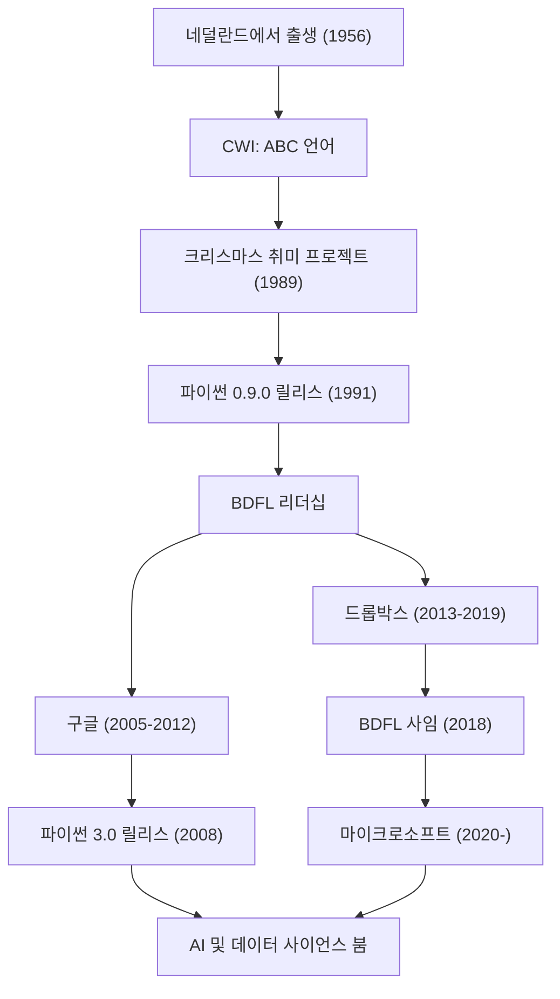

세계에서 가장 인기 있는 프로그래밍 언어 중 하나인 '파이썬(Python)'. 그 창시자로 알려진 인물이 바로 네덜란드 출신의 프로그래머 귀도 반 로섬(Guido van Rossum)입니다. 그가 만들어낸 언어는 현재 AI, 데이터 사이언스, 웹 개발 등 모든 분야에서 없어서는 안 될 존재가 되었습니다. 본 기사에서는 그가 어떤 인생을 걸어왔는지, 어떤 철학을 바탕으로 파이썬을 설계했는지, 그리고 후세의 기술에 얼마나 큰 영향을 미쳤는지 깊이 파헤쳐 봅니다.

## 생애와 파이썬의 탄생

귀도 반 로섬은 1956년 네덜란드의 하를럼에서 태어났습니다. 암스테르담 대학교에서 수학과 컴퓨터 과학 석사 학위를 취득한 후, 네덜란드 국립 수학 정보학 연구소(CWI)에서 일하기 시작합니다. 그곳에서 그는 'ABC'라는 프로그래밍 언어의 개발에 참여했습니다. ABC 언어는 매우 교육적이고 사용하기 쉬운 언어였지만, 몇 가지 실용적인 한계를 안고 있었습니다.

1989년의 크리스마스 휴가. 귀도는 취미 프로젝트로서 ABC 언어의 단점을 극복하면서 C 언어나 유닉스의 강력한 기능에 접근할 수 있는 새로운 스크립트 언어의 개발에 착수했습니다. 그 언어의 이름은 그가 팬이었던 영국의 코미디 프로그램 "몬티 파이선의 비행 서커스(Monty Python's Flying Circus)"의 이름을 따서 '파이썬'이라고 지었습니다.

1991년, 파이썬의 첫 번째 코드가 공개되었습니다. 이후 파이썬은 점차 커뮤니티를 형성했고, 1990년대 후반부터 2000년대에 걸쳐 오픈 소스 프로젝트로서 전 세계로 퍼져나갔습니다. 그는 '자비로운 종신 독재자(BDFL: Benevolent Dictator For Life)'로서 오랜 기간 동안 파이썬 설계에 대한 최종 결정권을 가지고 커뮤니티를 이끌었습니다(2018년에 BDFL에서 사임). 그 후에도 구글(Google), 드롭박스(Dropbox), 그리고 마이크로소프트(Microsoft)와 같은 세계 최고 수준의 기술 기업에 몸담으며, 최전선에서 엔지니어로 계속 활약하고 있습니다.

## 프로그래밍 철학: "누구나 읽을 수 있는 코드"

귀도 반 로섬의 가장 큰 업적은 파이썬이라는 언어의 기능 그 자체보다도, 그 근저에 있는 '철학'을 확립했다는 점입니다. 파이썬의 설계 철학은 팀 피터스가 기안한 '파이썬의 선(The Zen of Python)'에 집약되어 있는데, 그 정신은 귀도의 사상 그 자체입니다.

특히 그가 중시한 것은 "코드는 쓰이는 것보다 읽히는 경우가 더 많다(Readability counts)"라는 사실입니다. 많은 프로그래밍 언어가 기계 입장에서의 처리 효율이나 작성자의 타이핑 양을 줄이는 것을 중시하던 시대에, 귀도는 '인간을 위한 언어'를 목표로 했습니다. 들여쓰기로 블록을 표현하는 오프사이드 룰의 채택은 그 대표적인 예입니다. 누가 작성하든 비슷한 구조가 되고, 다른 사람이 작성한 코드라도 쉽게 이해할 수 있습니다. 이러한 '가독성'이 결과적으로 개발 생산성을 비약적으로 높였고, 대규모 소프트웨어 개발이나 프로그래밍 초보자에게도 친숙한 환경을 만들어 냈습니다.

## 후세와 기술계에 미친 영향

귀도 반 로섬이 만들어낸 파이썬과 그 이면에 있는 철학은 소프트웨어 개발 세계에 헤아릴 수 없는 영향을 미쳤습니다.

첫째로, 과학 기술 계산 및 데이터 사이언스 분야에서 사실상의 표준(데팍토 스탠더드)으로서의 지위입니다. 파이썬의 읽기 쉽고 직관적인 문법은 컴퓨터 과학 전문가가 아닌 수학자, 통계학자, 물리학자들에게도 널리 받아들여졌습니다. NumPy나 SciPy, Pandas와 같은 강력한 라이브러리가 커뮤니티 주도로 개발되었고, 그것이 현재의 AI 및 머신러닝 붐(TensorFlow나 PyTorch 등의 프레임워크 융성)의 강력한 토대가 되었습니다. 만약 파이썬이라는 '작성 장벽이 낮고 표현력이 높은 언어'가 존재하지 않았다면, 현재 인공지능의 발전은 몇 년 늦어졌을지도 모른다고 해도 과언이 아닙니다.

둘째로, 오픈 소스 커뮤니티 운영의 모범 사례가 되었다는 점입니다. 귀도는 BDFL로서, 독재적이면서도 항상 커뮤니티의 목소리를 듣고 조화를 유지하며 언어를 성장시켰습니다. 그가 도입한 'PEP(Python Enhancement Proposal)'라는 제안 프로세스는 언어의 기능 추가나 변경을 커뮤니티 전체에서 논의하고 투명성 있게 결정해 나가기 위한 구조로 기능했습니다. 그의 리더십은 거대한 오픈 소스 프로젝트가 어떻게 지속적으로 발전해 나가야 하는가라는 질문에 대한 하나의 이상적인 해답을 제시했습니다.

게다가 프로그래밍 교육에 대한 공헌도 잊어서는 안 됩니다. "프로그래밍을 만인의 것으로 만든다"는 CP4E(Computer Programming for Everybody) 구상은 현재 초중학교의 교육 현장부터 대학교 교양 과정에 이르기까지 파이썬이 첫 프로그래밍 언어로 선택되는 이유와 깊이 연결되어 있습니다.

귀도 반 로섬의 이야기는 한 프로그래머의 '휴일 취미'가 세상을 바꾸는 인프라로 성장했다는 기술사의 기적입니다. 그가 남긴 '읽기 쉽고, 단순하며, 아름다운' 코드의 문화는 앞으로도 세대를 넘어 프로그래머들에게 계승될 것입니다.

## 업적과 커리어의 흐름

아래 그림은 귀도 반 로섬의 커리어와 파이썬 진화의 상관관계를 보여줍니다.

