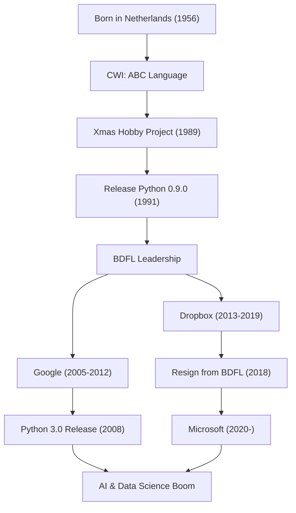

世界で最も人気のあるプログラミング言語の一つである「Python」。その生みの親として知られるのが、オランダ出身のプログラマー、グイド・ヴァン・ロッサム（Guido van Rossum）です。彼が作り上げた言語は、現在AI、データサイエンス、Web開発などあらゆる分野で不可欠な存在となっています。本記事では、彼がどのような人生を歩み、どのような哲学のもとにPythonを設計し、そして後世のテクノロジーにどれほどの影響を与えたのかを深く掘り下げます。

## 生涯とPythonの誕生

グイド・ヴァン・ロッサムは1956年にオランダのハールレムで生まれました。アムステルダム大学で数学と計算機科学の修士号を取得した後、オランダ国立数学情報学研究所（CWI）で働き始めます。そこで彼は「ABC」というプログラミング言語の開発に携わりました。ABC言語は非常に教育的で使いやすい言語でしたが、いくつか実用上の制限を抱えていました。

1989年のクリスマス休暇。グイドは趣味のプロジェクトとして、ABC言語の欠点を克服しつつ、C言語やUnixの強力な機能にアクセスできる新しいスクリプト言語の開発に着手しました。その言語の名前は、彼がファンであったイギリスのコメディ番組『空飛ぶモンティ・パイソン（Monty Python's Flying Circus）』にちなんで「Python」と名付けられました。

1991年、Pythonの最初のコードが公開されました。その後、Pythonは徐々にコミュニティを形成し、1990年代後半から2000年代にかけてオープンソースプロジェクトとして世界中へ広がっていきました。彼は「優しい終身の独裁者（BDFL: Benevolent Dictator For Life）」として、長年にわたりPythonの設計上の最終決定権を持ち続け、コミュニティを導きました（2018年にBDFLを退任）。その後もGoogle、Dropbox、そしてMicrosoftといった世界トップクラスのテクノロジー企業に籍を置き、第一線でエンジニアとして活躍し続けています。

## プログラミング哲学：「誰にでも読めるコード」

グイド・ヴァン・ロッサムの最大の功績は、Pythonという言語の機能そのもの以上に、その根底にある「哲学」を確立したことです。Pythonの設計哲学は、ティム・ピーターズによって起草された「The Zen of Python（Pythonの禅）」に集約されていますが、その精神はグイドの思想そのものです。

特に彼が重視したのは「コードは書かれるよりも読まれることの方が多い（Readability counts）」という事実です。多くのプログラミング言語が、機械にとっての処理効率や、書き手のタイピング量を減らすことを重視していた時代に、グイドは「人間のための言語」を目指しました。インデントによってブロックを表現するオフサイドルールの採用は、その最たる例です。誰が書いても似たような構造になり、他人の書いたコードであっても容易に理解できる。この「読みやすさ」が、結果として開発の生産性を飛躍的に高め、大規模なソフトウェア開発や、プログラミング初心者にも優しい環境を作り出しました。

## 後世とテクノロジー界への影響

グイド・ヴァン・ロッサムが作り上げたPythonと、その背後にある哲学は、ソフトウェア開発の世界に計り知れない影響を与えました。

第一に、科学技術計算やデータサイエンス分野におけるデファクトスタンダードとしての地位です。Pythonの読みやすく直感的な文法は、コンピュータサイエンスの専門家ではない数学者、統計学者、物理学者たちにも広く受け入れられました。NumPyやSciPy、Pandasといった強力なライブラリがコミュニティ主導で開発され、それが現在のAI・機械学習ブーム（TensorFlowやPyTorchなどのフレームワークの隆盛）の強力な土台となっています。もしPythonという「記述のハードルが低く、かつ表現力の高い言語」が存在していなければ、現在の人工知能の発展は数年遅れていたかもしれないと言っても過言ではありません。

第二に、オープンソースコミュニティの運営におけるモデルケースとなったことです。グイドはBDFLとして、独裁的でありながらも常にコミュニティの声を聴き、調和を保ちながら言語を成長させました。彼が導入した「PEP (Python Enhancement Proposal)」という提案プロセスは、言語の機能追加や変更をコミュニティ全体で議論し、透明性をもって決定していくための仕組みとして機能しました。彼のリーダーシップは、巨大なオープンソースプロジェクトがどのように持続的に発展していくべきかという問いに対する一つの理想的な答えを示しました。

さらに、プログラミング教育への貢献も忘れてはなりません。「プログラミングを万人のものにする」というComputer Programming for Everybody（CP4E）の構想は、現在、小中学校の教育現場から大学の教養課程に至るまで、Pythonが最初のプログラミング言語として選ばれる理由と深く結びついています。

グイド・ヴァン・ロッサムの物語は、一人のプログラマーの「休日の趣味」が、世界を変えるインフラへと成長したという技術史における奇跡です。彼が残した「読みやすく、シンプルで、美しい」コードの文化は、これからも世代を超えてプログラマーたちに受け継がれていくことでしょう。

## 功績とキャリアのフロー

以下の図は、グイド・ヴァン・ロッサムのキャリアとPythonの進化の相関を示したものです。

