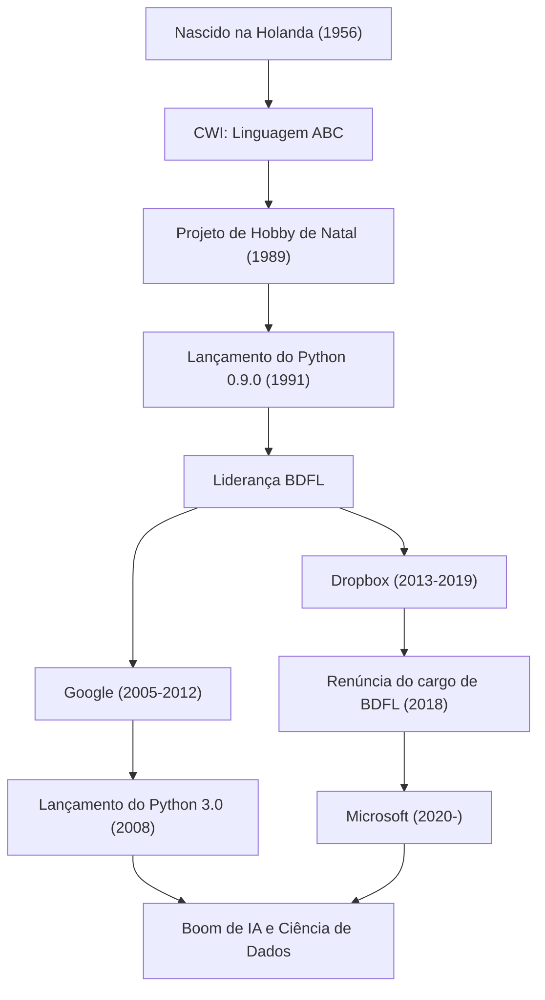

"Python" é uma das linguagens de programação mais populares do mundo. Seu criador, o programador holandês Guido van Rossum, é amplamente conhecido. A linguagem que ele criou tornou-se indispensável em várias áreas, como IA, ciência de dados e desenvolvimento web. Neste artigo, vamos explorar profundamente a vida que ele levou, a filosofia sob a qual ele projetou o Python e o impacto que ele teve na tecnologia das gerações futuras.

## Vida e o Nascimento do Python

Guido van Rossum nasceu em 1956, em Haarlem, na Holanda. Após obter seu mestrado em matemática e ciência da computação pela Universidade de Amsterdã, ele começou a trabalhar no Instituto Nacional de Pesquisa em Matemática e Ciência da Computação da Holanda (CWI). Lá, ele se envolveu no desenvolvimento de uma linguagem de programação chamada "ABC". A linguagem ABC era altamente educacional e fácil de usar, mas tinha várias limitações práticas.

Durante as férias de Natal de 1989, Guido iniciou um projeto de hobby para desenvolver uma nova linguagem de script que pudesse superar as falhas da linguagem ABC, ao mesmo tempo em que fornecia acesso aos recursos poderosos do C e do Unix. A linguagem recebeu o nome de "Python" em homenagem ao programa de comédia britânico do qual ele era fã, "Monty Python's Flying Circus".

Em 1991, o primeiro código do Python foi lançado. Depois disso, o Python gradualmente formou uma comunidade e se espalhou pelo mundo como um projeto de código aberto entre o final da década de 1990 e a década de 2000. Ele guiou a comunidade por muitos anos como o "Ditador Benevolente Vitalício" (BDFL: Benevolent Dictator For Life), mantendo a autoridade de decisão final sobre o design do Python (ele renunciou ao cargo de BDFL em 2018). Desde então, ele continuou a trabalhar ativamente como engenheiro de linha de frente em empresas de tecnologia de classe mundial, como Google, Dropbox e Microsoft.

## Filosofia de Programação: "Código que Qualquer Um Pode Ler"

A maior conquista de Guido van Rossum, talvez mais do que as próprias funcionalidades da linguagem Python, foi o estabelecimento da "filosofia" subjacente. A filosofia de design do Python é resumida no "The Zen of Python", escrito por Tim Peters, mas o espírito reflete o próprio pensamento de Guido.

Ele enfatizou particularmente o fato de que "o código é lido com mais frequência do que escrito" (Readability counts). Em uma época em que muitas linguagens de programação priorizavam a eficiência de processamento para a máquina e a redução da digitação do programador, Guido buscou criar uma "linguagem para humanos". A adoção da regra de off-side, que usa a indentação para definir blocos, é o exemplo mais proeminente disso. Independentemente de quem escreve, a estrutura será semelhante e, mesmo sendo o código de outra pessoa, será fácil de entender. Essa "legibilidade" aumentou drasticamente a produtividade do desenvolvimento e criou um ambiente amigável tanto para o desenvolvimento de software em grande escala quanto para os iniciantes em programação.

## Impacto no Futuro e no Mundo da Tecnologia

O Python criado por Guido van Rossum e a filosofia por trás dele tiveram um impacto imensurável no mundo do desenvolvimento de software.

Em primeiro lugar, consolidou sua posição como padrão de fato nas áreas de computação científica e ciência de dados. A sintaxe legível e intuitiva do Python foi amplamente aceita por matemáticos, estatísticos e físicos que não eram especialistas em ciência da computação. Bibliotecas poderosas como NumPy, SciPy e Pandas foram desenvolvidas pela comunidade e formam uma base sólida para o atual boom de IA e aprendizado de máquina (a ascensão de frameworks como TensorFlow e PyTorch). Não seria exagero dizer que se o Python, uma "linguagem com baixo obstáculo de escrita e alta expressividade", não existisse, o desenvolvimento atual da inteligência artificial poderia ter sido atrasado em vários anos.

Em segundo lugar, tornou-se um modelo para a gestão de comunidades de código aberto. Como BDFL, Guido foi ditatorial, mas sempre ouviu as vozes da comunidade e permitiu que a linguagem crescesse mantendo a harmonia. O processo de proposta que ele introduziu, "PEP (Python Enhancement Proposal)", funcionou como um mecanismo para discutir adições ou mudanças nas funcionalidades da linguagem em toda a comunidade e tomar decisões de forma transparente. Sua liderança forneceu uma resposta ideal à questão de como projetos massivos de código aberto deveriam se desenvolver de forma sustentável.

Além disso, não devemos esquecer sua contribuição para o ensino de programação. A visão do Computer Programming for Everybody (CP4E) de "tornar a programação acessível a todos" está intimamente ligada ao motivo pelo qual o Python é atualmente escolhido como a primeira linguagem de programação, desde o ensino fundamental e médio até os cursos de educação geral nas universidades.

A história de Guido van Rossum é um milagre na história da tecnologia, onde o "hobby de fim de semana" de um único programador cresceu e se tornou uma infraestrutura que muda o mundo. A cultura de código "legível, simples e belo" que ele deixou para trás continuará a ser transmitida aos programadores de geração em geração.

## Fluxo de Conquistas e Carreira

A figura a seguir mostra a correlação entre a carreira de Guido van Rossum e a evolução do Python.

