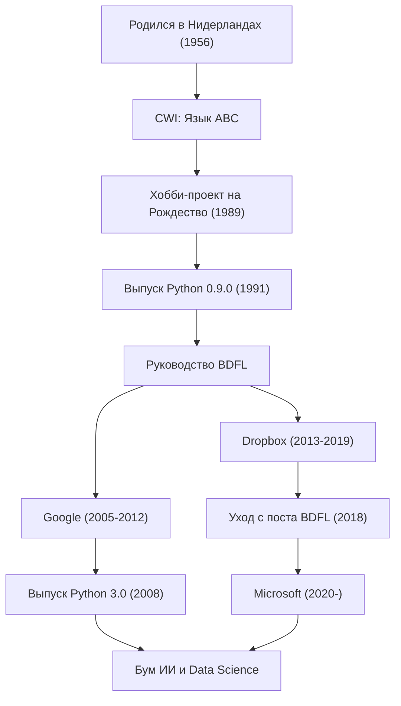

«Python» — один из самых популярных языков программирования в мире. Его создателем является программист из Нидерландов Гвидо ван Россум (Guido van Rossum). Созданный им язык сегодня стал незаменимым инструментом в таких областях, как ИИ, наука о данных, веб-разработка и многих других. В этой статье мы подробно рассмотрим его жизненный путь, философию, лежащую в основе разработки Python, и то, какое влияние он оказал на технологии будущих поколений.

## Жизнь и создание Python

Гвидо ван Россум родился в 1956 году в Харлеме, Нидерланды. Получив степень магистра математики и информатики в Амстердамском университете, он начал работать в Центре математики и информатики (CWI). Там он принимал участие в разработке языка программирования «ABC». Язык ABC был очень удобен в образовательных целях и прост в использовании, но имел ряд практических ограничений.

Во время рождественских каникул 1989 года в качестве хобби Гвидо начал разработку нового скриптового языка, который должен был преодолеть недостатки языка ABC и при этом предоставить доступ к мощным функциям языка C и Unix. Язык получил название «Python» в честь британского комедийного шоу «Летающий цирк Монти Пайтона» (Monty Python's Flying Circus), поклонником которого он был.

В 1991 году был опубликован первый код Python. Впоследствии вокруг Python постепенно сформировалось сообщество, и в конце 1990-х — 2000-х годах он распространился по всему миру как проект с открытым исходным кодом. В качестве «Великодушного пожизненного диктатора» (BDFL: Benevolent Dictator For Life) он на протяжении многих лет сохранял за собой право последнего слова в архитектуре Python и руководил сообществом (ушел с поста BDFL в 2018 году). После этого он продолжил работать на передовой в качестве инженера в таких ведущих мировых технологических компаниях, как Google, Dropbox и Microsoft.

## Философия программирования: «Код, который может прочесть каждый»

Величайшим достижением Гвидо ван Россума является даже не сам функционал языка Python, а создание лежащей в его основе «философии». Философия проектирования Python собрана в «Дзене Python» (The Zen of Python), написанном Тимом Питерсом, но его дух — это отражение идей самого Гвидо.

В частности, он придавал большое значение тому факту, что «код читается гораздо чаще, чем пишется» (Readability counts). В эпоху, когда многие языки программирования фокусировались на эффективности машинной обработки или сокращении объема печати для программиста, Гвидо стремился создать «язык для людей». Использование правила оффсайда, при котором блоки кода выделяются отступами, является ярчайшим тому примером. Независимо от того, кто пишет код, структура получается похожей, и код, написанный другим человеком, легко понять. Эта «читаемость» в результате резко повысила производительность разработки и создала среду, благоприятную как для создания крупномасштабного программного обеспечения, так и для начинающих программистов.

## Влияние на будущие поколения и мир технологий

Созданный Гвидо ван Россумом Python и стоящая за ним философия оказали неизмеримое влияние на мир разработки программного обеспечения.

Во-первых, это статус де-факто стандарта в области научно-технических вычислений и науки о данных. Читаемый и интуитивно понятный синтаксис Python был широко принят математиками, статистиками и физиками, не являющимися специалистами в области информатики. Мощные библиотеки, такие как NumPy, SciPy и Pandas, были разработаны усилиями сообщества, и они стали прочным фундаментом для нынешнего бума искусственного интеллекта и машинного обучения (расцвет таких фреймворков, как TensorFlow и PyTorch). Не будет преувеличением сказать, что если бы не существовало Python — «языка с низким порогом входа для написания и высокой выразительностью», — развитие современного искусственного интеллекта могло бы задержаться на несколько лет.

Во-вторых, он стал образцом управления сообществом открытого исходного кода. Гвидо, будучи BDFL, несмотря на свою «диктатуру», всегда прислушивался к голосу сообщества и развивал язык, сохраняя гармонию. Введенный им процесс предложений «PEP» (Python Enhancement Proposal) служил механизмом для обсуждения добавления функций и изменений в языке всем сообществом и принятия прозрачных решений. Его лидерство показало идеальный ответ на вопрос о том, как должны устойчиво развиваться огромные проекты с открытым исходным кодом.

Кроме того, нельзя забывать и о его вкладе в обучение программированию. Концепция «Computer Programming for Everybody» (CP4E) — «сделать программирование доступным для всех» — тесно связана с причиной, по которой сегодня Python выбирается в качестве первого языка программирования, начиная со школ и заканчивая общеобразовательными курсами в университетах.

История Гвидо ван Россума — это чудо в истории технологий, когда «праздничное хобби» одного программиста превратилось в инфраструктуру, изменившую мир. Оставленная им культура «читаемого, простого и красивого» кода, несомненно, будет передаваться программистами из поколения в поколение.

## Достижения и карьерный путь

На следующем графике показана взаимосвязь между карьерой Гвидо ван Россума и развитием Python.

