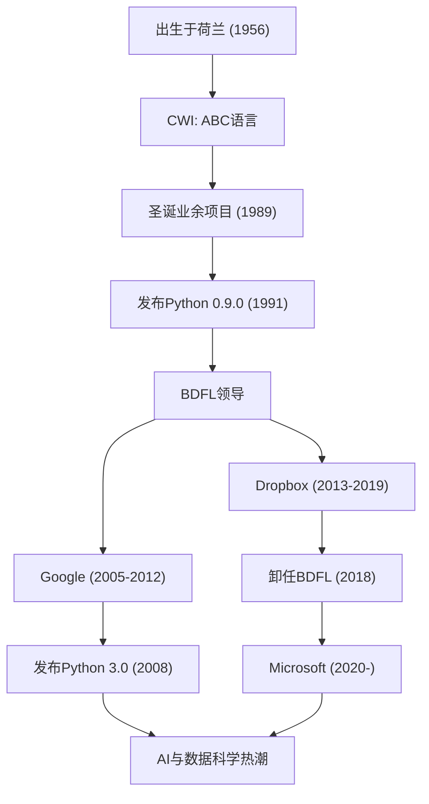

"Python"是世界上最受欢迎的编程语言之一。众所周知，它的创始人是来自荷兰的程序员吉多·范罗苏姆（Guido van Rossum）。他所创造的语言如今在人工智能、数据科学、Web开发等各个领域都已成为不可或缺的存在。本文将深入探讨他度过了怎样的一生，是基于怎样的哲学设计了Python，以及对后世的技术产生了多么深远的影响。

## 生平与Python的诞生

吉多·范罗苏姆于1956年出生于荷兰的哈勒姆。在阿姆斯特丹大学获得数学和计算机科学硕士学位后，他开始在荷兰国家数学和计算机科学研究中心（CWI）工作。在那里，他参与了一种名为"ABC"的编程语言的开发。ABC语言非常具有教育意义且易于使用，但在实际应用中存在一些限制。

1989年的圣诞假期。作为一项业余项目，吉多开始着手开发一种新的脚本语言，旨在克服ABC语言的缺点，同时能够调用C语言和Unix的强大功能。这种语言的名字，取自他非常喜欢的英国喜剧节目《蒙提·派森的飞行马戏团（Monty Python's Flying Circus）》，被命名为"Python"。

1991年，Python的初始代码正式发布。此后，Python逐渐形成了自己的社区，并在20世纪90年代后期到21世纪初，作为开源项目推广到了全世界。作为"仁慈的独裁者（BDFL: Benevolent Dictator For Life）"，他多年来一直掌握着Python设计的最终决定权，引领着整个社区（于2018年卸任BDFL）。之后，他先后加入Google、Dropbox和Microsoft等世界顶级科技公司，继续在第一线作为工程师大显身手。

## 编程哲学：“人人都能读懂的代码”

吉多·范罗苏姆最大的功绩，不仅仅是Python这门语言的功能本身，更在于确立了其根基的“哲学”。Python的设计哲学集中体现在蒂姆·彼得斯（Tim Peters）起草的《Python之禅（The Zen of Python）》中，而其精神实质正是吉多的思想。

他特别强调了一个事实，即“代码被阅读的次数远多于被编写的次数（Readability counts）”。在许多编程语言都注重机器处理效率和减少编写者打字量的时代，吉多致力于创造一种“为人类服务的语言”。采用缩进来表示代码块的越位规则就是最好的例子。无论谁来编写，结构都非常相似，即使是别人写的代码也能轻松理解。这种“易读性”最终极大地提高了开发的生产力，并为大规模软件开发和编程初学者创造了友好的环境。

## 对后世与科技界的影响

吉多·范罗苏姆创造的Python及其背后的哲学，对软件开发世界产生了不可估量的影响。

首先，它确立了在科学计算和数据科学领域的事实标准地位。Python易读且直观的语法，被并非计算机科学专家的数学家、统计学家和物理学家们广泛接受。在社区的主导下，NumPy、SciPy、Pandas等强大的库被开发出来，这成为了当今人工智能与机器学习热潮（如TensorFlow和PyTorch等框架的兴起）的坚实基础。毫不夸张地说，如果没有Python这种“编写门槛低且表现力强的语言”，当前人工智能的发展可能会推迟好几年。

其次，它成为了开源社区运营的典范。作为BDFL，吉多虽然拥有独裁权，但他始终倾听社区的声音，在保持和谐的同时推动语言的发展。他引入的“PEP（Python Enhancement Proposal）”提案流程，作为一种机制，使得整个社区能够共同讨论语言的功能添加和修改，并保持决策的透明度。他的领导才能，为“庞大的开源项目应如何实现可持续发展”这一问题提供了一个理想的答案。

此外，更不能忘记它对编程教育的贡献。“让编程惠及每个人（Computer Programming for Everybody，CP4E）”的构想，与如今从中小学教育现场到大学通识课程，都选择Python作为第一门编程语言的原因息息相关。

吉多·范罗苏姆的故事，是技术史上的一大奇迹——一名程序员的“假日业余爱好”，成长为了改变世界的基础设施。他留下的“易读、简洁且优美”的代码文化，在未来也将跨越世代，在程序员之中代代相传。

## 功绩与职业生涯流程

下图展示了吉多·范罗苏姆的职业生涯与Python演进之间的相关性。

