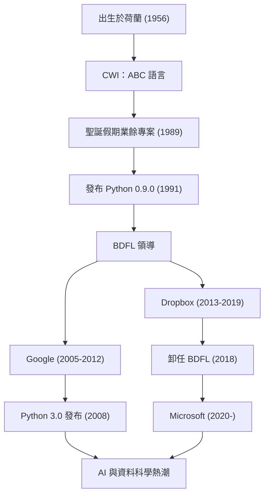

「Python」是世界上最受歡迎的程式語言之一。其創造者是來自荷蘭的程式設計師吉多·范羅蘇姆（Guido van Rossum）。他所創造的語言，如今在AI、資料科學、網頁開發等各個領域中已成為不可或缺的存在。本文將深入探討他的人生歷程、他基於何種哲學設計出Python，以及他對後世科技產生了多麼深遠的影響。

## 生平與Python的誕生

吉多·范羅蘇姆於1956年出生於荷蘭的哈勒姆。在阿姆斯特丹大學取得數學與計算機科學碩士學位後，他開始在荷蘭國家數學和計算機科學研究學會（CWI）工作。在那裡，他參與了一種名為「ABC」的程式語言的開發。ABC語言非常具有教育意義且易於使用，但在實用性上存在一些限制。

1989年的聖誕假期。作為一個業餘專案，吉多開始著手開發一種新的指令碼語言，旨在克服ABC語言的缺點，同時能夠存取C語言和Unix的強大功能。這個語言的名字，取自他所喜愛的英國喜劇節目《蒙提·派森的飛行馬戲團》（Monty Python's Flying Circus），因此被命名為「Python」。

1991年，Python的第一版程式碼發布。隨後，Python逐漸形成了社群，並在1990年代後半至2000年代作為一個開源專案迅速傳遍全球。他作為「仁慈的獨裁者（BDFL: Benevolent Dictator For Life）」，多年來一直掌握著Python設計上的最終決定權，並引領著整個社群（於2018年卸任BDFL）。此後，他先後任職於Google、Dropbox以及Microsoft等世界頂尖的科技公司，持續在第一線作為工程師活躍著。

## 程式設計哲學：「誰都能看懂的程式碼」

吉多·范羅蘇姆最大的功績，比起Python這個語言本身的機能，更在於確立了其根底的「哲學」。Python的設計哲學被濃縮在由提姆·彼得斯（Tim Peters）起草的「The Zen of Python（Python之禪）」中，而這份精神正是吉多思想的體現。

他特別重視的一個事實是「程式碼被閱讀的次數遠多於被編寫的次數（Readability counts）」。在許多程式語言都強調機器的處理效率或是減少編寫者的打字量的時代，吉多的目標是創造一種「為了人類的語言」。透過縮排來表示程式區塊的越位規則（off-side rule）的採用，就是最好的例子。無論是誰寫的程式，都會呈現出相似的結構，即使是別人寫的程式碼也能輕易理解。這種「易讀性」最終大幅提高了開發的生產力，為大規模軟體開發以及程式設計初學者創造了友善的環境。

## 對後世與科技界的影響

吉多·范羅蘇姆所創造的Python，以及其背後的哲學，對軟體開發世界產生了無可估量的影響。

首先是其在科學運算與資料科學領域中作為實質標準（de facto standard）的地位。Python易讀且直觀的語法，廣泛地被非計算機科學專家的數學家、統計學家與物理學家所接受。社群主導開發了NumPy、SciPy、Pandas等強大的函式庫，這成為了現今AI與機器學習熱潮（如TensorFlow與PyTorch等框架的興起）的堅實基礎。可以說，如果沒有Python這種「撰寫門檻低且表現力高的語言」，現今人工智慧的發展可能會推遲好幾年，這點絕不誇張。

其次，它成為了開源社群營運的典範。吉多作為BDFL，雖然擁有獨裁權，但他總是傾聽社群的聲音，在保持和諧的同時讓語言成長。他所導入的「PEP (Python Enhancement Proposal)」提案流程，作為一種機制，讓整個社群能夠共同討論語言功能的增加或變更，並以透明的方式進行決策。他的領導力為「龐大的開源專案應如何持續發展」這個問題提供了一個理想的答案。

此外，其對程式設計教育的貢獻也不容忽視。「讓程式設計成為所有人都能掌握的技能」的Computer Programming for Everybody（CP4E）構想，與現今從中小學教育現場到大學通識課程都選擇Python作為第一門程式語言的原因有著深刻的連結。

吉多·范羅蘇姆的故事，是一個程式設計師的「假日嗜好」成長為改變世界基礎設施的技術史上的奇蹟。他所留下的「易讀、簡單且優美」的程式碼文化，今後也將跨越世代，被程式設計師們持續傳承下去。

## 功績與職涯歷程

下圖展示了吉多·范羅蘇姆的職涯與Python演進之間的關聯。

