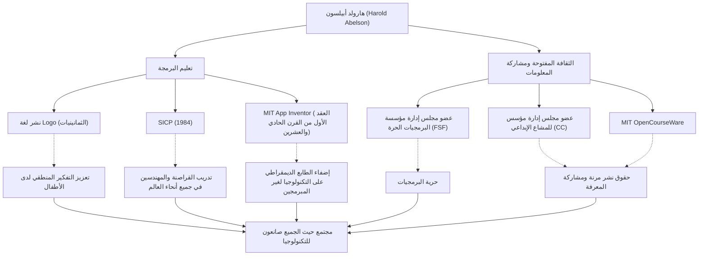

في تاريخ علوم الحاسوب، هناك شخصيات كان لها تأثير على "كيفية التدريس والمشاركة" بقدر تأثيرها على التكنولوجيا نفسها. هارولد أبيلسون، المعروف باسم "هال أبيلسون"، هو أستاذ في معهد ماساتشوستس للتكنولوجيا (MIT) وشخصية مركزية في تعليم البرمجة وحركة البرمجيات الحرة.

يتعمق هذا المقال في حياة وفلسفة الرجل الذي حرر البرمجة من أيدي قلة من الخبراء ليوصلها للجميع، مما أرسى أسس الثقافة المفتوحة اليوم وتأثيره الذي لا يقدر بثمن على الأجيال القادمة.

## البرمجة كـ "أداة للتفكير": لغة Logo ونشاطاته المبكرة

ولد أبيلسون في أواخر الأربعينيات، وحصل على درجة البكالوريوس من جامعة برينستون والدكتوراه في الرياضيات من معهد ماساتشوستس للتكنولوجيا. من أبرز إنجازاته في بداية حياته المهنية مساهمته في نشر لغة البرمجة التعليمية "Logo".

علمت لغة Logo، التي طورها سيمور بابيرت وآخرون، الأطفال متعة البرمجة والتفكير المنطقي من خلال "هندسة السلحفاة". شارك أبيلسون بشكل عميق في تنفيذ Logo لأجهزة Apple II، ومن خلال كتبه، نشر القيمة التعليمية لـ Logo في جميع أنحاء العالم. بالنسبة له، لم تكن البرمجة مجرد وسيلة لإعطاء الأوامر لآلة، بل كانت "أداة للبشر للتعبير عن أفكارهم واستكشافها".

## صرح علوم الحاسوب: ولادة "SICP"

ما عزز سمعة أبيلسون هو الكتاب المدرسي "هيكل وتفسير برامج الحاسوب" (Structure and Interpretation of Computer Programs، المعروف باسم SICP أو كتاب الساحر)، والذي شارك في تأليفه مع جيرالد جاي سوسمان وجولي سوسمان. نُشر هذا الكتاب في عام 1984، واستُخدم لسنوات عديدة في الدورة التمهيدية لمعهد ماساتشوستس للتكنولوجيا (6.001) واعتمدته الجامعات في جميع أنحاء العالم.

لم يعلم SICP بناء الجملة للغة برمجة معينة (استخدم Scheme، وهي لهجة من Lisp)، بل تعمق في مفاهيم الحوسبة العالمية مثل التجريد، والعودية، والنمطية، والتجريد الميتا-لغوي. أصبح هذا النهج "فلسفة التصميم" في هندسة البرمجيات، وتأصل في عدد لا يحصى من القراصنة والمهندسين عبر الأجيال.

## مشاركة المعرفة وقيادة الثقافة المفتوحة

تمتد إنجازات أبيلسون إلى ما هو أبعد من المجال الأكاديمي. كان لديه اعتقاد راسخ بأن "المعرفة والتكنولوجيا يجب أن تكون ملكية مشتركة للبشرية"، وتصرف بشكل استباقي فيما يتعلق بحقوق النشر وحرية المعلومات في العصر الرقمي.

شغل منصب عضو مجلس إدارة مؤسس في مؤسسة البرمجيات الحرة (FSF)، التي أطلقها ريتشارد ستولمان، لدعم حركة تحرير البرمجيات. علاوة على ذلك، إلى جانب لورانس ليسيج وآخرين، كعضو مجلس إدارة مؤسس في "المشاع الإبداعي (Creative Commons)"، سعى جاهداً لإنشاء نظام حقوق نشر مرن ومناسب لعصر الإنترنت. كما لعب دورًا حاسمًا في مشروع "MIT OpenCourseWare"، حيث كان MIT رائدًا في نشر مواد الدورات التدريبية مجانًا للعالم.

## نحو عالم حيث يمكن للجميع أن يكونوا مبدعين: App Inventor

في أواخر العقد الأول من القرن الحادي والعشرين، كباحث زائر في Google، أطلق أبيلسون مشروع "App Inventor"، وهو منصة لتطوير تطبيقات الهواتف الذكية بشكل بديهي. تتيح هذه الأداة، التي أصبحت لاحقًا MIT App Inventor، للمستخدمين إنشاء تطبيقات من خلال عمليات مرئية، تشبه تجميع الكتل.

هذا المشروع الذي خفض حواجز البرمجة بشكل كبير هو تتويج لإيمانه الراسخ بأنه "لا ينبغي فقط لعدد قليل من الأشخاص الذين يمكنهم كتابة التعليمات البرمجية، بل يجب أن يكون الجميع قادرين على إنشاء برامج لحل مشاكلهم الخاصة".

## مسار هارولد أبيلسون وتأثيره (رسم بياني)

إنجازاته المتنوعة ليست مستقلة، بل مرتبطة بالمحور القوي لـ "التعليم" و "المشاركة المفتوحة".

## إرث للأجيال القادمة: إضفاء الطابع الديمقراطي على التكنولوجيا

أمضى هارولد أبيلسون حياته في إثبات أن علوم الحاسوب ليست مجرد "علم الحوسبة"، بل هي "فن التعبير والمشاركة".

SICP، بلورة المعرفة التي تركها وراءه، لا يزال يُقرأ اليوم ككتاب مقدس للمبرمجين. والبذور التي زرعها من خلال المشاع الإبداعي و App Inventor تنبت بقوة في ثقافة المصدر المفتوح اليوم وحركة عدم وجود كود / كود منخفض.

"التكنولوجيا موجودة لجعل الناس أحرارًا". ربما يكون المسار الذي سلكه هال أبيلسون هو الإجابة الأقوى والأكثر دفئًا على سؤال حول كيف ينبغي للتكنولوجيا أن تساهم في المجتمع.
