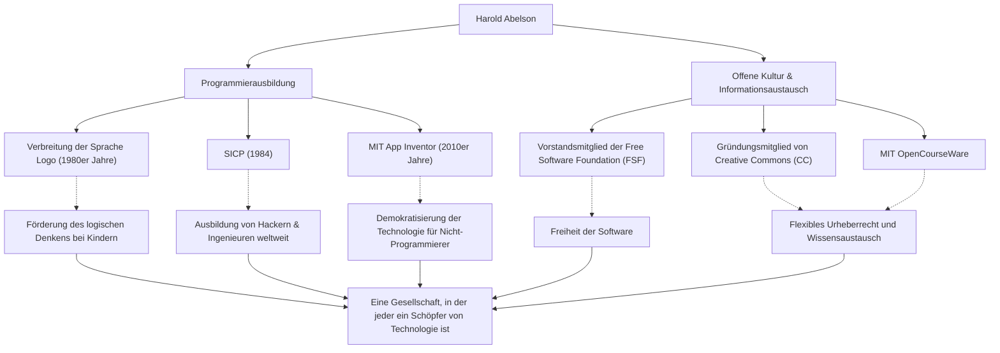

In der Geschichte der Informatik gibt es eine Persönlichkeit, die einen ebenso großen Einfluss darauf hatte, "wie man lehrt und wie man teilt", wie auf die Technologie selbst. Es handelt sich um Harold Abelson, allgemein bekannt als "Hal Abelson", einen Professor am Massachusetts Institute of Technology (MIT) und eine zentrale Figur in der Programmierausbildung und der Freie-Software-Bewegung.

Dieser Artikel befasst sich eingehend mit seinem Leben und seiner Philosophie, die die Programmierung aus den Händen einiger weniger Experten befreite und sie für alle zugänglich machte, und damit den Grundstein für die heutige offene Kultur (Open Culture) legte, sowie mit seinem unermesslichen Einfluss auf künftige Generationen.

## Programmieren als "Werkzeug des Denkens": Die Programmiersprache Logo und frühe Aktivitäten

Abelson, Ende der 1940er Jahre geboren, erwarb einen Bachelor-Abschluss an der Princeton University und promovierte in Mathematik am MIT. Bemerkenswert zu Beginn seiner Karriere ist sein Beitrag zur Verbreitung der pädagogischen Programmiersprache "Logo".

Logo, das von Seymour Papert und anderen entwickelt wurde, lehrte Kindern die Freude am Programmieren und an logischem Denken durch "Turtle-Geometrie". Abelson war maßgeblich an der Implementierung von Logo für den Apple II beteiligt und verbreitete den pädagogischen Wert von Logo durch seine Bücher weltweit. Für ihn war das Programmieren nicht nur ein Mittel, um einer Maschine Befehle zu erteilen, sondern ein "Werkzeug zum Ausdrücken und Erforschen von Gedanken" der Menschen.

## Ein Meilenstein der Informatik: Die Entstehung von 『SICP』

Abelsons Ruf wurde durch das Lehrbuch "Structure and Interpretation of Computer Programs" (SICP) gefestigt, das er zusammen mit Gerald Jay Sussman und Julie Sussman verfasste. Das 1984 veröffentlichte Buch wurde viele Jahre lang im Einführungskurs am MIT (6.001) verwendet und weltweit an Universitäten eingesetzt.

Anstatt die Syntax einer bestimmten Programmiersprache zu lehren (obwohl Scheme, ein Lisp-Dialekt, verwendet wurde), befasste sich SICP tief mit universellen Berechnungskonzepten wie Abstraktion, Rekursion, Modularität und metalinguistischer Abstraktion. Dieser Ansatz ist zu einer "Designphilosophie" im Software-Engineering geworden und hat das Denken unzähliger Hacker und Ingenieure über Generationen hinweg geprägt.

## Wissensaustausch und die Förderung einer offenen Kultur

Abelsons Leistungen gehen über den akademischen Rahmen hinaus. Er war der festen Überzeugung, dass "Wissen und Technologie gemeinsames Eigentum der Menschheit sein sollten", und ergriff im digitalen Zeitalter aktiv Maßnahmen in Bezug auf Urheberrecht und Informationsfreiheit.

Er war Gründungsmitglied der von Richard Stallman ins Leben gerufenen Free Software Foundation (FSF) und unterstützte die Bewegung zur Befreiung von Software. Darüber hinaus engagierte er sich zusammen mit Lawrence Lessig und anderen als Gründungsmitglied von "Creative Commons" für die Schaffung eines flexiblen Urheberrechtssystems, das für das Internetzeitalter geeignet ist. Er spielte auch eine entscheidende Rolle im Projekt "MIT OpenCourseWare", bei dem das MIT weltweit Vorreiter bei der kostenlosen Veröffentlichung von Vorlesungsmaterialien war.

## Auf dem Weg zu einer Welt, in der jeder zum Schöpfer werden kann: App Inventor

Ende der 2000er Jahre startete Abelson als Gastforscher bei Google das Projekt "App Inventor", eine Plattform, die die intuitive Entwicklung von Smartphone-Apps ermöglicht. Dieses Tool, das später als MIT App Inventor weitergeführt wurde, ermöglicht es Benutzern, Apps durch visuelle Operationen wie das Zusammensetzen von Blöcken zu erstellen.

Dieses Projekt, das die Hürden für die Programmierung erheblich senkte, ist die Verwirklichung seines unerschütterlichen Glaubens, dass "nicht nur eine kleine Anzahl von Menschen, die Code schreiben können, sondern jeder in der Lage sein sollte, Software zu erstellen, um seine eigenen Probleme zu lösen".

## Der Weg und der Einfluss von Harold Abelson (Diagramm)

Seine vielfältigen Leistungen stehen nicht unabhängig voneinander, sondern sind durch die starken Achsen "Bildung" und "offener Austausch" miteinander verbunden.

## Ein Erbe für zukünftige Generationen: Die Demokratisierung der Technologie

Sein ganzes Leben lang hat Harold Abelson bewiesen, dass Informatik nicht nur die "Wissenschaft des Rechnens" ist, sondern die "Kunst des Ausdrucks und des Teilens".

Die Kristallisation seines Wissens, SICP, wird auch heute noch als Bibel für Programmierer gelesen. Und die Samen, die er durch Creative Commons und App Inventor gesät hat, blühen nun in der heutigen Open-Source-Kultur und der No-Code/Low-Code-Bewegung auf.

"Technologie ist dazu da, Menschen zu befreien." Der Weg, den Hal Abelson gegangen ist, kann als die stärkste und wärmste Antwort auf die Frage angesehen werden, wie Technologie zur Gesellschaft beitragen sollte.
